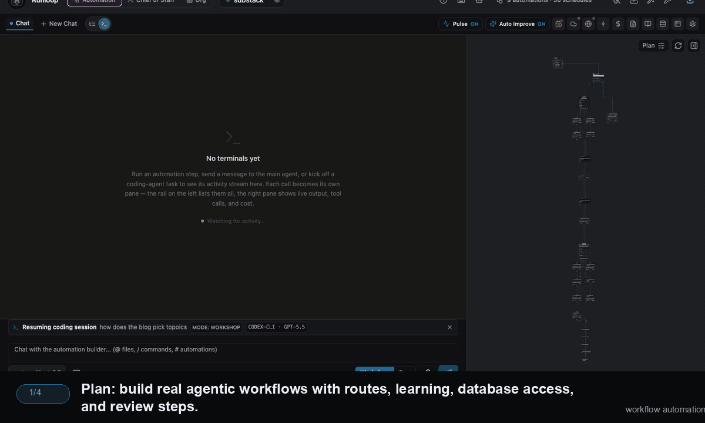
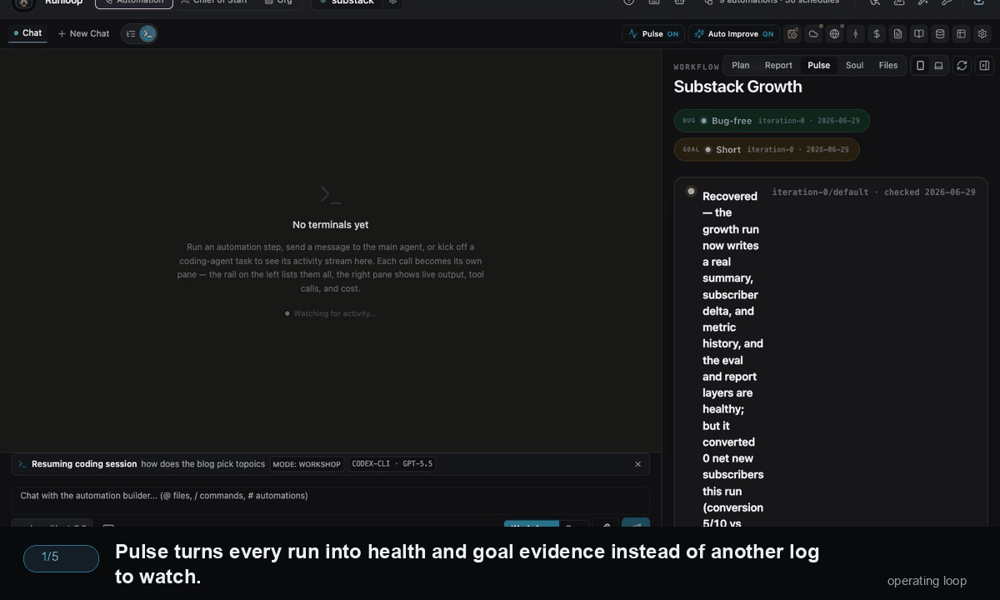
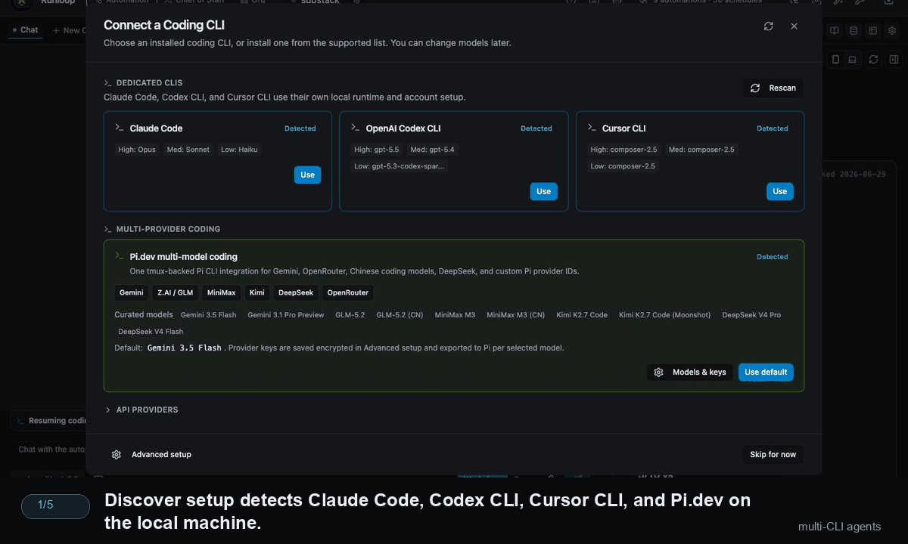
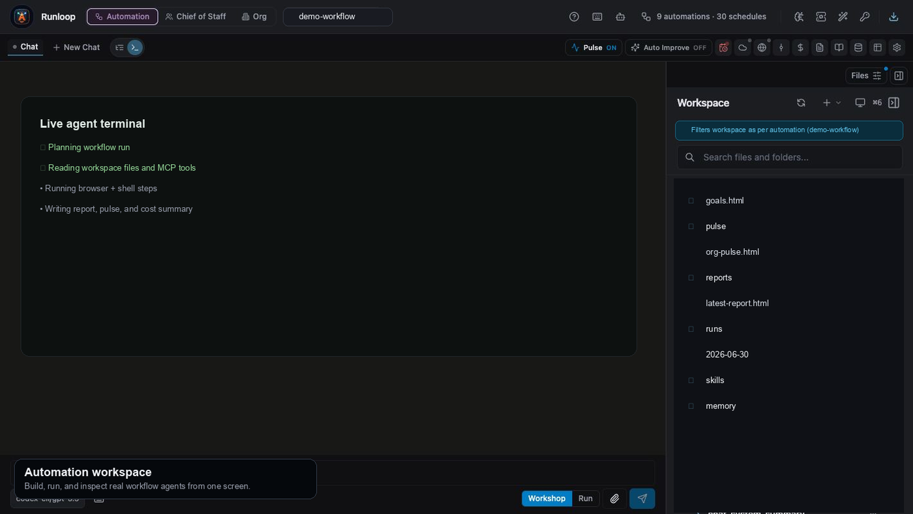
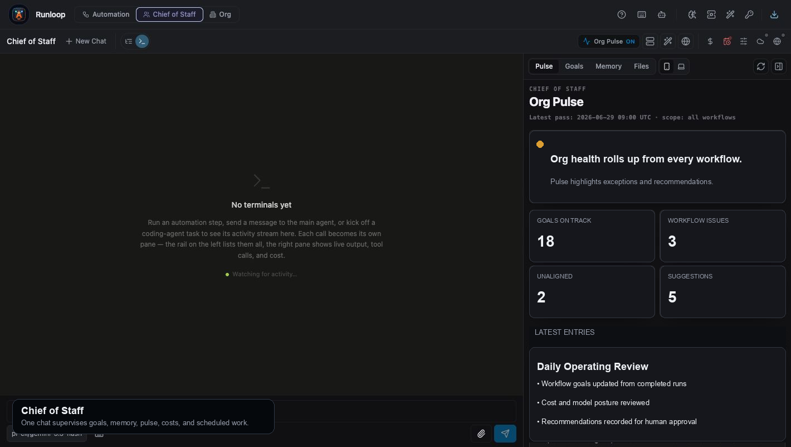
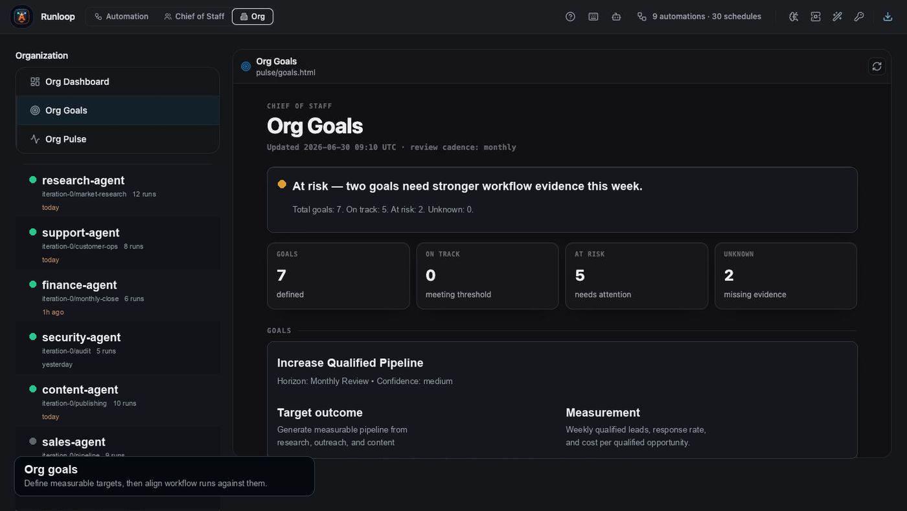
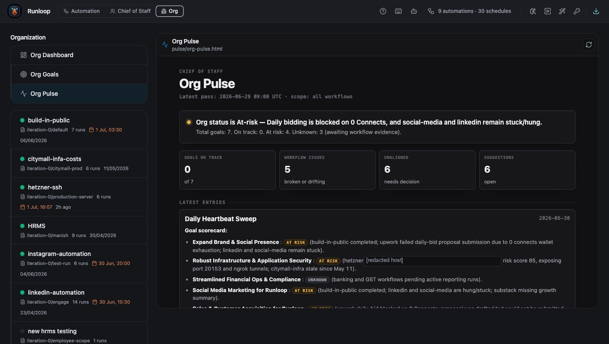

# 🚀 AgentWorks

**AgentWorks** is an AI operations platform for running many autonomous workflows like an organization. Define goals, build workflow agents, run them on schedules, and let Pulse, Auto-improve, Chief of Staff, and the dashboard help you manage by exception instead of watching logs.

[](https://github.com/manishiitg/mcp-agent-builder-go/releases/latest)


[](#license--architecture-foundations)

## The Goal

AgentWorks is built for teams that want to scale from a few manually checked automations to **100+ goal-driven workflow agents**. The product is an operating system for an AI-run organization:

- **Workflows do the work**: reusable agents execute research, coding, reporting, browser tasks, back-office operations, and channel conversations.
- **Pulse keeps each workflow reliable**: after runs, it checks whether the workflow actually worked, records Bug/Goal verdicts, hardens operational issues, reports cost/time, backs up, publishes, and notifies only on meaningful transitions.
- **Auto-improve moves workflows toward goals**: on a schedule, it reads cross-run evidence, refreshes stale reports/learnings/KB/db contracts, adjusts cadence, and applies bigger changes only when evidence is strong and backed up.
- **Chief of Staff / Org Pulse manages the whole org**: it reads workflow evidence against `pulse/goals.html`, audits model/cost posture, harvests durable memory, and writes proposal-only recommendations for the user or builder.
- **The dashboard is the operating view**: it rolls workflow health, goal progress, costs, recommendations, and exceptions into one place so a human manages decisions, not every run.

The high-level loop is documented in [Workflow self-improvement & reporting](docs/workflow/self_improvement_and_reporting.md).

## Product Screenshots

**Workflow automation: plan, run, report, and supervise**



**Operating loop: Pulse, Auto Improve, Chief of Staff, and org goals**



**Multi-CLI coding agents: Claude Code, Codex CLI, Cursor CLI, and Pi.dev**



**Workflow automation workspace**



**Chief of Staff and Org Pulse**



**Goal-driven operations**



**Daily operating pulse**



## 💻 Desktop App (macOS)

A standalone macOS app is available — no Docker, no manual server setup. Each release is published at [Releases](https://github.com/manishiitg/mcp-agent-builder-go/releases/latest).

Rename note: the public product name is moving to **AgentWorks**. During the transition, the GitHub repo and some release assets still use the historical `mcp-agent-builder-go` / `Runloop` names so existing installs and update checks remain compatible.

### Install (one-liner — recommended)

```bash
curl -fsSL https://raw.githubusercontent.com/manishiitg/mcp-agent-builder-go/main/install.sh | bash
```

Downloads the latest dmg, installs the Mac app to `/Applications`, ensures the MCP bridge used by Claude Code/Codex tool access is installed to `~/go/bin`, strips the macOS quarantine flag (no "damaged" warning), and launches the app. If Go is missing, the installer installs Go through Homebrew when available; otherwise it asks you to install Go and rerun the same curl command. Pin a specific version with `RUNLOOP_VERSION=v1.25.6 curl -fsSL … | bash`.

### Install manually

1. Download the macOS dmg from the latest release. During the rename transition, the file may still be named `Runloop-<version>-arm64.dmg`.
2. Open the dmg, drag the app to Applications.

### First-launch error: *"AgentWorks is damaged and can't be opened"*

The current build is **unsigned and not notarized**, so macOS Gatekeeper flags it on download. The app itself is fine — you just need to clear the quarantine flag macOS automatically attaches to downloaded files.

**Recommended — Terminal (works on all macOS versions):**
```bash
xattr -cr /Applications/Runloop.app
```
If your installed app is already named AgentWorks, use:
```bash
xattr -cr /Applications/AgentWorks.app
```
Then double-click the app. If macOS still complains, also strip the dmg you downloaded:
```bash
xattr -cr ~/Downloads/Runloop-*.dmg
```
`sudo` is **not** needed — you own the app since you dragged it into Applications.

**System Settings (sometimes works, depends on macOS version):**
For "damaged" verdicts on Sequoia/Tahoe, macOS often hides the "Open Anyway" button entirely, so this path frequently doesn't appear. If it does:
1. Open **System Settings → Privacy & Security**.
2. Scroll to the Security section. If you see *"AgentWorks was blocked from use…"* with an **Open Anyway** button, click it.
3. Confirm in the dialog. macOS remembers the decision.

If the button isn't there, fall back to the `xattr` command above.

### First-launch UX

On first run the app prompts for two things:
1. **Workspace folder** — pick where your `workspace-docs/` lives (skills, configs, schedules, WhatsApp DB, encrypted provider keys). Defaults to `~/Library/Application Support/runloop-desktop/workspace-docs/`.
2. **AUTH_SECRET** — the secret used to encrypt `provider-api-keys.json`. If you're moving from a previous setup, enter the same secret you used there. Otherwise pick a strong value and remember it (you'll need it on every machine that opens this workspace).

After that, add provider API keys (OpenAI, Gemini, Anthropic, etc.) through the in-app provider auth flow. They are encrypted at rest in `<workspace-docs>/config/provider-api-keys.json`.

### Why no signing?

Code signing + Apple notarization requires an Apple Developer ID ($99/yr) and is on the roadmap. Until then, the manual quarantine step is unavoidable on first install.

---

Run **Claude Code, Codex, Pi, and open models** in one system. Build visual workflows, launch complex orchestrators, schedule recurring jobs, route agent conversations through **Slack, WhatsApp, and the web**, and roll their progress up against org goals.

AgentWorks is built for teams that want more than a chat box:
- Build visual agent workflows and long-running orchestrators
- Mix and match the best coding and reasoning models for each step
- Schedule automations, recurring jobs, and background runs
- Track workflow progress against real goals, not just task completion
- Manage failures, cost, and improvement opportunities by exception
- Keep humans in the loop with approvals, feedback, and escalation paths
- Connect agents to Slack, WhatsApp, browsers, and MCP tools

## Why AgentWorks

- **Goal-driven operations**: Tie workflows to measurable goals, then let Pulse, Auto-improve, and Org Pulse keep the evidence and recommendations current.
- **Multi-model by default**: Use Claude Code, Codex, Pi, OpenAI, Anthropic, Bedrock, Azure, MiniMax, OpenRouter, and open models in the same platform.
- **Visual workflows plus real execution**: Design workflows on a canvas, then run them with tools, browser automation, memory, and evaluation built in.
- **Manage by exception**: The dashboard surfaces broken, off-goal, expensive, or decision-worthy work so operators do not need to inspect every run.
- **Built for operations, not demos**: Add scheduling, observability, validation, approvals, and secure workspace isolation from day one.
- **Protocol-agnostic in practice**: MCP is supported, but AgentWorks is broader than any single protocol, provider, or model vendor.

## What You Can Build

- **Coding workflows** that delegate across Claude Code, Codex, Pi, and open-source coding models
- **Scheduled automations** for research, support, reporting, or back-office operations
- **Human-in-the-loop agents** that pause for approvals, 2FA codes, or operator feedback
- **Slack and WhatsApp agents** that continue conversations outside the dashboard
- **Browser-powered workflows** that log in, click through apps, collect data, and complete tasks

## Flagship Examples

- **[Deep Research Agent](examples/README.md#1-deep-research-agent)**: source collection, evidence review, pricing/benchmark analysis, and report generation.
- **[AI Software Engineer Workflow](examples/README.md#2-ai-software-engineer-workflow)**: planner, coder, reviewer, and tester agents producing a patch plus validation notes.
- **[E-commerce Operations Agent](examples/README.md#3-e-commerce-operations-agent)**: catalog/support review with policy checks, recommended actions, and human approval.

See [examples](examples/README.md) for workflow blueprints, output artifacts, and a README demo GIF storyboard.

See the [public roadmap](ROADMAP.md) for upcoming work on onboarding, memory-aware multi-agent chat, workflow notifications, Agent SDK support, Pi CLI, and goal/dashboard refinements.

## Works With

### Coding and LLM Models

- **Claude Code** via the `@anthropic-ai/claude-code` CLI experimental mode
- **Codex-style agentic models** through OpenAI and Azure AI Foundry
- **Pi CLI** for Gemini and open-model coding workflows
- **Pi CLI** via `@earendil-works/pi-coding-agent` with Pi provider/model IDs
- **Open-source and frontier models** through OpenRouter, Bedrock, Vertex AI, and direct provider integrations

### Channels, Tools, and Connectors

- **Slack**, **WhatsApp**, and custom webhook-based chat surfaces
- **Browser automation** through Vercel Agent-Browser, Playwright, and local CDP bridging
- **MCP servers**, local tools, workspace files, and custom connectors

## Why Teams Choose It

- Replace brittle prompt chains with durable workflows
- Use the right model for the right step instead of standardizing on one vendor
- Bring coding agents, operational automations, and human approvals into one system
- Ship agent workflows that can be monitored, evaluated, improved, and rolled up against org goals over time

## ⚡ Platform Overview

At the core of AgentWorks is the **[workflow system](docs/workflow/README.md)**, a directed step-based workflow runtime managed through the visual workflow builder and supervised by the self-improvement/reporting layer.

Design complex workflows visually, refine them through the interactive builder, run them with step-level configuration, tiered LLM selection, deterministic pre-validation, evaluation runs, scheduling, cost tracking, and persistent run data, then let Pulse, Auto-improve, Org Pulse, and the dashboard keep the system aligned with goals.

### 🧠 Learning, Validation, and Observability
Move beyond static prompts with built-in optimization, validation, and run visibility.

- **[Learning Architecture](docs/workflow/learning_architecture.md):** Workflow learning now centers on a shared global skill plus step-level metadata and saved scripts for scripted steps.
- **[Deterministic Pre-Validation](docs/workflow/pre_validation_guide.md):** A high-speed, code-based validation layer that uses JSON schemas and consistency rules to verify artifacts with zero token cost and absolute precision.
- **[Evaluation & Benchmarking](docs/workflow/evaluation_system.md):** A dedicated testing suite that executes workflows in isolated environments to generate performance, cost, and accuracy metrics—essential for production readiness.
- **[Pulse Log & Observability](docs/workflow/workflow_monitoring.md):** Every workflow keeps one agent-curated HTML log — the **Pulse** — with two live verdicts (**Bug**: did it run correctly; **Goal**: is it hitting its success criteria), a one-line status headline, signal tiles, and a newest-first timeline of findings, decisions, cost/time reports, backups, publishes, and notifications.
- **[Self-Improving Workflows](docs/workflow/auto_improvement_framework.md):** Auto-improve reads the same Pulse evidence across runs, keeps reports/learnings/KB/db contracts fresh, tunes its own cadence, and applies structural replans only when cross-run evidence is strong and backed up, or records proposals when oversight is more cautious.
- **[Chief of Staff, Org Pulse, and Dashboard](docs/workflow/self_improvement_and_reporting.md):** Org Pulse reads workflow evidence against org goals, audits model/cost posture, writes proposal-only recommendations, and feeds a dashboard that lets operators manage by exception across many workflows.
- **[Cost and Log Measurement](docs/workflow/cost_and_log_measurement.md):** Token usage, model cost, and execution logs are tracked across workflow phases, runs, steps, and models.
- **[Persistent Stores](docs/workflow/persistent_stores_design.md):** Workflows can persist structured run data for reports, knowledgebase updates, and follow-up analysis.
- **[Swarm Delegation](docs/multiagent/sub_agent_delegation.md):** Empower your primary agent to dynamically spawn independent sub-agents, parallelizing complex research, coding, or data extraction tasks across a distributed swarm.
- **[Task Orchestration](docs/workflow/todo-task-step-type.md):** Intelligent sub-task routing that manages state, dependencies, and context windows automatically.

### 🛡️ Security and Guardrails
Deploy with deterministic controls designed for strict environments.
- **[FolderGuard](docs/core/folder_guard_system.md):** Runtime read/write validation wraps workspace tools so agents only touch the folders each mode or step is allowed to access.
- **[Multi-User Authentication & Workspace Isolation](docs/core/multi_user_authentication.md):** Per-user workspace isolation, user-scoped paths, and sandboxed shell execution protect users from cross-tenant contamination.
- **[Secrets](docs/core/secrets.md):** Securely inject credentials into agent queries, workflow steps, and delegated agents without exposing them in chat history or logs.
- **[Restricted Configuration Mode](docs/core/env-api-key-defaults.md):** Optionally lock provider/model configuration so the server uses environment-injected API keys (`LLM_CONFIG_LOCKED`) and secrets never reach the browser.
- **[Secure MCP OAuth](docs/core/oauth.md):** Seamless, auto-discovering OAuth 2.0 flows for connecting enterprise MCP servers safely.

### 👁️ Automation, Connectors, and Browser Control
Connect agents to real systems and communication channels.
- **[Vercel Agent-Browser](https://github.com/vercel-labs/agent-browser):** High-level browser automation engine used for complex web interactions, DOM analysis, and visual grounding.
- **[Browser System](docs/core/browser.md):** Covers browser session management, runtime limits, and browser integration patterns across providers.
- **[Bot Connectors](docs/core/bot_connector_system.md):** Expose specialized agent sessions through Slack, WhatsApp, the web simulator, and custom connector surfaces.
- **[Workflow Scheduling](docs/workflow/workflow_scheduling.md):** Run workflows on recurring schedules with history, routing, and run-state tracking.
- **[Native Workspace Mode](docs/core/native_workspace_mode.md):** Run workspace operations directly against local folders when native execution is preferred over containerized workspace mode.

### 🤝 Human-in-the-Loop Operations
Keep operators involved when workflows need approval, intervention, or additional input.

- **[Human Feedback System](docs/workflow/human_feedback_system.md):** Agents can pause execution to request explicit approval, 2FA codes, or strategic guidance via real-time browser notifications or the visual dashboard.
- **[Slack Human Connector](docs/workflow/human_feedback_system.md#slack-configuration):** 
    - **Smart Delayed Notifications**: If a user doesn't respond in the UI within 2 minutes, the orchestrator automatically pings a configured Slack channel.
    - **Threaded Conversations**: Users can reply directly in the Slack thread to provide the required information, which is then fed back to the agent's context in real-time.
    - **Multi-User Collaboration**: Entire teams can monitor agent progress and intervene via Slack without ever opening the dashboard.

---

### 🧩 LLM Configuration and Providers

AgentWorks is provider-agnostic. Users configure published LLMs in the UI, then assign them to chat sessions, workflow phases, and workflow tiers.

- **[LLM Configuration & Resilience](docs/core/llm_configuration_and_resilience.md):** Published LLMs carry provider, model, and model-specific options; provider authentication is stored separately.
- **[Tiered LLM Allocation](docs/workflow/tiered_llm_allocation.md):** Workflow steps can use tiered model selection, with separate phase LLM configuration for planning, builder, evaluation, and debugging-style phase work.
- **[Azure AI Foundry](docs/core/azure_foundry_integration.md):** Azure OpenAI and Responses API routing are supported for newer agentic model deployments.
- **[Environment-Based Defaults](docs/core/env-api-key-defaults.md):** Optional defaults and locked server-side configuration are available for managed deployments.
- Providers include OpenAI-compatible endpoints, Anthropic, Google Gemini/Vertex, AWS Bedrock, Azure AI Foundry, MiniMax, OpenRouter, and local/CLI-backed agent integrations.

#### 🛠️ Local CLI Agents
Bring your existing CLI-based coding agents into the visual orchestrator via the **[MCP Bridge Layer](docs/core/mcp_bridge_layer.md)**:
*   **Claude Code**: Native integration with the `@anthropic-ai/claude-code` CLI through experimental interactive sessions.
*   **Pi CLI**: Multi-provider coding-agent integration, including Gemini models.
*   **State Persistence**: Support for `--resume` functionality, allowing the visual orchestrator to maintain long-running coding sessions across CLI restarts.

---

## 🚀 Quick Start (Local Development)

### 1. Prerequisites

- Go 1.24+
- Node.js 20+ and npm
- Optional local tools depending on what you enable: Claude Code, Pi, Codex-compatible CLIs, browser tooling, AWS/GCP CLIs, etc.

### 2. Clone and Configure

```bash
git clone https://github.com/manishiitg/mcp-agent-builder-go.git
cd mcp-agent-builder-go
cp agent_go/env.example agent_go/.env
```

Edit `agent_go/.env` for local app/runtime settings if needed. LLM providers and API keys are configured from the app UI after startup, not by editing the README examples into `.env`.

Install dependencies:

```bash
cd frontend
npm ci

cd ../agent_go
go mod download
```

### 3. Run Everything Locally

Start the backend, workspace API, frontend, and Electron with one command from `agent_go/`:

```bash
cd agent_go
./run_server_with_logging.sh --with-workspace --with-frontend
```

Default local ports:

| Service | Default URL |
| --- | --- |
| Agent API | `http://localhost:18743` |
| Workspace API | `http://localhost:18744` |
| Frontend | `http://127.0.0.1:51733` |

The runner prefers these ports. If a port is already occupied, it picks the next available port and prints the final URL. Logs are written to `agent_go/logs/`.

### 4. Frontend-Only Development

Use this when the backend and workspace API are already running:

```bash
cd agent_go
./run_server_with_logging.sh --only-frontend
```

This starts Vite plus Electron. It reads `AGENT_PORT` and `WORKSPACE_PORT` from `frontend/public/runtime-config.js` when that file already exists.

### 5. Frontend Build Mode

Use this to run the frontend like a production static build, without Vite hot reload:

```bash
cd agent_go
./run_server_with_logging.sh --only-frontend --build
```

This builds `frontend/`, serves the static output on the frontend port, and launches Electron against that static server.

You can override ports explicitly:

```bash
AGENT_PORT=18743 WORKSPACE_PORT=18744 FRONTEND_PORT=51733 ./run_server_with_logging.sh --only-frontend --build
```

### 6. Stop and Restart Cleanly

When the runner is in the foreground, press `Ctrl+C`. The script stops child processes and prints which ports were released.

If startup says a port is still busy, inspect it:

```bash
lsof -nP -iTCP:51733 -sTCP:LISTEN
lsof -nP -iTCP:18743 -sTCP:LISTEN
lsof -nP -iTCP:18744 -sTCP:LISTEN
```

### 7. Debug Local API Traffic

Backend request logs are written under `agent_go/logs/`. The server logs API start/end lines, including status code and duration, which is useful when the frontend appears stuck or too many requests are firing at once.

Useful checks:

```bash
curl -fsS http://localhost:18743/api/health
curl -fsS http://localhost:18744/api/health
```

### 8. Validation Commands

```bash
# Backend compile check
cd agent_go
go test ./cmd/server -run '^$'

# Frontend type check
cd frontend
./node_modules/.bin/tsc -b
```

---

## ☁️ Production Deployment Topologies

Deploy your agentic infrastructure where it makes sense for your security posture.

### **1. Azure Virtual Machine (Maximum Security Isolation)**
The recommended topology for enterprise deployments. Leverages Azure VMs to utilize deep Linux kernel features (namespaces, `unshare`) for absolute filesystem isolation between agent runs.
```bash
cd deploy/azure/terraform
terraform init && terraform apply
cd .. && ./deploy_vm.sh <VM_IP_ADDRESS> all
```
> **[Read the Azure VM Deployment Blueprint](deploy/azure/README.md)**

### **2. Kubernetes (High-Availability Swarms)**
Designed for massive scale and resilience using standard Helm-like manifests.
```bash
./deploy/k8s/scripts/deploy-k8s.sh --build
```
> **[Read the Kubernetes Deployment Blueprint](deploy/k8s/README.md)**

---

## 🤝 Join the Revolution

We are building the future of deterministic AI orchestration. Contributions are highly encouraged!

```bash
# Setup development guardrails
./scripts/install-git-hooks.sh

# Run the Go orchestration test suite
cd agent_go && go test ./...

# Audit for secrets
./scripts/scan-secrets.sh
```

## Chrome CDP macOS Helper

If you use Local Chrome (CDP) on macOS, install the dedicated launcher from the public GitHub script:

```bash
curl -fsSL 'https://raw.githubusercontent.com/manishiitg/mcp-agent-builder-go/main/scripts/install-chrome-cdp-macOS.sh' | bash
```

The installer downloads `Chrome CDP.app`, installs it into `/Applications`, clears quarantine attributes, applies a local ad-hoc signature when possible, opens the app, and checks that CDP is reachable on port `9222`.

macOS may still ask for approval on first launch. If it blocks the app, open **System Settings → Privacy & Security**, allow `Chrome CDP`, then run:

```bash
open -a 'Chrome CDP'
```

## 📄 License & Architecture Foundations

Licensed under the MIT License.

**Built Upon:**
- **[Model Context Protocol (MCP)](https://modelcontextprotocol.io/):** The universal standard for AI tool integration.
- **[LangChain Go](https://github.com/tmc/langchaingo):** High-performance LLM routing.
- **[React Flow](https://reactflow.dev/):** The industry standard for node-based visual editing.
