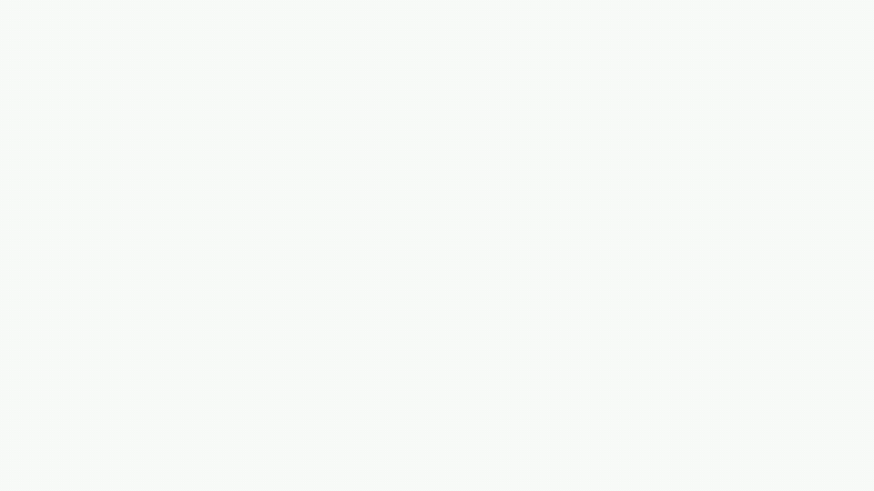

# AgentWorks

**Give an AI agent a goal and a metric. It keeps working until it hits the target.**

AgentWorks is an open-source platform for goal-driven AI agents. You describe an outcome, pick the number that proves it, and set a target. Agents plan the work, run it on a schedule, measure every run, and change their own plan until the metric moves. It runs on the coding-agent CLIs you already use: Claude Code, Codex, Cursor, and Pi.

[](https://github.com/manishiitg/coding-agent-loop/releases/latest)

[](LICENSE)

[Website](https://agentworkshq.com) · [Docs](docs/README.md) · [First workflow](docs/getting-started/first-workflow.md) · [Releases](https://github.com/manishiitg/coding-agent-loop/releases/latest) · [Book a call](https://calendly.com/manishiitg/15min)



<sub>Illustrative example.</sub>

## How it works

| | |
|---|---|
| **Goals** | Every workflow has a goal: the outcome in plain words, a primary metric with a target, supporting metrics, and rules that must stay true. Progress is shown as dated measurements. Missing or stale numbers are flagged, never guessed. [Goal measurement](docs/pulse-goal-measurement.md) |
| **Auto-improve** | After runs, AgentWorks reviews the evidence against the goal. It repairs broken steps, drops approaches that didn't move the metric, does the work nobody was doing, and checks later whether it helped. [Improvement system](docs/pulse-workflow-improvement-system.md) · [Auto-improvement framework](docs/workflow/auto_improvement_framework.md) |
| **Autonomy** | You choose how far it goes, per workflow: *Ask first*, *Run steps*, *Edit workflow*, or *Full*. Anything outward-facing can always require your approval. |
| **Crew** | Always-on teammates, each with its own files, tools, memory, browser, and schedule. Talk to them in the app, Slack, or WhatsApp. [Bot connectors](docs/core/bot_connector_system.md) |
| **Playbooks** | Ready-made agent setups you install into a workflow: 23 today for browser QA, reliability, security, performance, FinOps, and growth analytics. Plain Markdown skill packages, so you can write your own. [Playbooks](playbooks/README.md) |

## Install (macOS, Apple Silicon)

```bash
curl -fsSL https://raw.githubusercontent.com/manishiitg/coding-agent-loop/main/install.sh | bash
```

This downloads the latest release, installs `AgentWorks.app` to `/Applications`, installs the MCP bridge that Claude Code and Codex use for tool access (to `~/go/bin`, installing Go through Homebrew if needed), clears the macOS quarantine flag, and launches the app. Pin a version with `RUNLOOP_VERSION=v1.25.6 curl -fsSL … | bash` (the variable keeps its legacy name).

On first launch, pick a workspace folder and set an `AUTH_SECRET` (used to encrypt provider keys; reuse the same value on every machine that opens this workspace). Then connect a coding-agent CLI or an API provider in **LLM Configuration**.

<details>
<summary>Manual install, and the "AgentWorks is damaged and can't be opened" message</summary>

Download `AgentWorks-<version>-arm64.dmg` from the [latest release](https://github.com/manishiitg/coding-agent-loop/releases/latest) and drag the app to Applications.

The build is not yet signed or notarized, so macOS Gatekeeper flags it after download. The app is fine; clear the quarantine flag:

```bash
xattr -cr /Applications/AgentWorks.app
```

If macOS still complains, also run `xattr -cr ~/Downloads/AgentWorks-*.dmg`. No `sudo` is needed. Releases installed under the old name use `/Applications/Runloop.app`. Signing and notarization are on the roadmap.
</details>

## Works with

- **Coding-agent CLIs:** Claude Code, OpenAI Codex CLI, Cursor CLI, and Pi CLI (Gemini, OpenRouter, and other Pi providers). Use the subscription you already pay for.
- **API providers:** OpenAI, Anthropic, Google Gemini and Vertex AI, AWS Bedrock, Azure AI Foundry, MiniMax, and OpenRouter. Keys are encrypted at rest.
- **Channels:** Slack and WhatsApp for two-way conversations; Gmail for outbound updates.
- **Tools:** any MCP server, workspace files, and a persistent, isolated browser per workflow ([browser docs](docs/core/browser.md)).

Route each part of a workflow to the model that fits it: your strongest model for judgment, a cheaper one for routine steps.

## Control and security

- **Approvals:** agents prepare changes and wait for approve, reject, or defer ([human feedback](docs/workflow/human_feedback_system.md)).
- **Secrets vault:** credentials are encrypted and injected only at run time, never shown in chat or logs ([secrets](docs/core/secrets.md)).
- **Sandboxing:** OS-enforced per agent, Landlock on Linux and sandbox-exec on macOS, limited to the folders and tools each workflow is granted ([FolderGuard](docs/core/folder_guard_system.md)).
- **Run logs and cost:** every step, tool call, and model cost is recorded per run and per workflow ([cost and logs](docs/workflow/cost_and_log_measurement.md)).
- **Accounts:** admin, member, contributor, and read-only roles, with owner or reader access per workflow ([multi-user](docs/core/multi_user_authentication.md)).

## Run from source

Prerequisites: Go 1.26+, Node.js 20+, and whichever coding-agent CLIs you want to use.

The backend builds against two engine libraries, [mcpagent](https://github.com/manishiitg/mcpagent) and [multi-llm-provider-go](https://github.com/manishiitg/llm-provider-mcp), which `agent_go/go.mod` expects to find next to this repo. Clone all three side by side:

```bash
mkdir agentworks && cd agentworks
git clone https://github.com/manishiitg/coding-agent-loop.git
git clone https://github.com/manishiitg/mcpagent.git
git clone https://github.com/manishiitg/llm-provider-mcp.git multi-llm-provider-go

cd coding-agent-loop
(cd frontend && npm ci)
(cd agent_go && go mod download)
./run_agentworks
```

`./run_agentworks` starts the agent API, workspace API, frontend, and Electron shell. No `.env` is needed for a local run; the launcher creates `agent_go/.env` with a persistent `AUTH_SECRET`. Don't copy `agent_go/env.example` for local use, since it is for managed deployments.

| Service | Default URL |
| --- | --- |
| Agent API | `http://localhost:18743` |
| Workspace API | `http://localhost:18744` |
| Frontend | `http://127.0.0.1:51733` |

If a port is busy, the runner picks the next free one and prints it. Logs go to `agent_go/logs/`. Run `./run_agentworks --help` for options such as `--only-frontend` and `--build`.

Checks before a pull request:

```bash
(cd agent_go && go test ./cmd/server -run '^$')   # backend compiles
(cd frontend && ./node_modules/.bin/tsc -b)       # frontend type-checks
./scripts/scan-secrets.sh                         # no secrets committed
```

Install the git hooks once with `./scripts/install-git-hooks.sh`.

## Self-hosting

Run AgentWorks on your Mac, or on your own Linux server with the rootless deployer. See the [deployment overview](deploy/README.md). For a managed or private-cloud deployment with SSO, audit logs, and support, [talk to us](https://calendly.com/manishiitg/15min).

## Contributing

Issues and pull requests are welcome. Start with the [docs index](docs/README.md) and the [workflow system overview](docs/workflow/README.md). Keep changes focused and run the checks above.

## License

[MIT](LICENSE).

Built on the [Model Context Protocol](https://modelcontextprotocol.io/), our open-source engine libraries [mcpagent](https://github.com/manishiitg/mcpagent) and [multi-llm-provider-go](https://github.com/manishiitg/llm-provider-mcp), and [React Flow](https://reactflow.dev/) for the workflow canvas.
