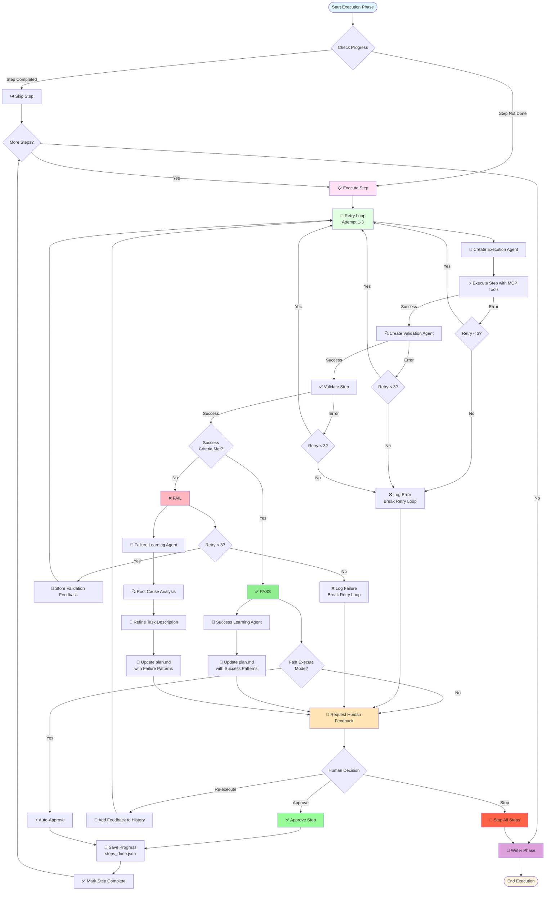
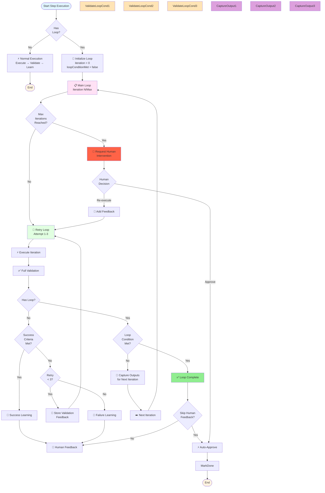

# Human-Controlled Todo Creation Orchestrator

Multi-agent system creating validated todo lists via step-by-step execution, learning, and synthesis.

**Features**: 🎯 Human-in-loop • 🔄 Learning-based • 📊 Validation-driven • 🤖 Multi-agent • 📝 Markdown-based

---

## ⚡ Quick Reference

| Phase | Agent | Output | Human Decision | Manager |
|-------|-------|--------|---------------|---------|
| **0** | Variable Extraction | `variables.json` | Use/Extract new | `VariableManager` ✅ |
| **1** | Planning | `plan.json` | Use/Create/Update (max 20 rev) | - |
| **1.5** | Learning Integration | Enhanced `plan.json` | - | - |
| **2** | Execute → Validate → Learn | Step results | Approve/Re-execute/Stop | - |
| **2.5** | Anonymize Learnings | Anonymized learnings | Confirm replacements | `AnonymizationManager` ✅ |
| **2.6** | Plan Improvement | Feedback report | Review feedback | `PlanImprovementManager` ✅ |
| **3** | Writer → Critique | `todo_final.md` | Final approval | - |

**Retry Limits**: Execution (3), Plan (20), Critique (3)  
**Progress**: Auto-saved in `steps_done.json`  
**Loop Support**: Iterative execution until condition met (max iterations configurable)  
**Independence**: ✅ = Independent manager (no orchestrator dependency), ⚠️ = Uses full orchestrator

---

## 🏗️ Architecture

### Manager-Based Architecture

The orchestrator uses **dedicated managers** for independent workflow phases, enabling complete decoupling and reusability:

| Phase | Manager | Status | Description |
|-------|---------|--------|-------------|
| **Variable Extraction** | `VariableManager` | ✅ Independent | Manages variable extraction and validation independently |
| **Anonymization** | `AnonymizationManager` | ✅ Independent | Manages learnings anonymization independently |
| **Plan Improvement** | `PlanImprovementManager` | ✅ Independent | Manages plan improvement analysis independently |
| **Planning** | - | ⚠️ Orchestrator | Uses full orchestrator (complex dependencies) |
| **Execution** | - | ⚠️ Orchestrator | Main orchestrator method |

**Key Benefits**:
- **Decoupling**: Managers operate independently without creating full orchestrator
- **Reusability**: Managers can be used directly in `workflow_orchestrator.go`
- **Consistency**: All managers follow the same pattern and use `CreateAndSetupStandardAgentWithConfig`
- **LLM Config**: Proper preservation of `FallbackModels`, `CrossProviderFallback`, and `APIKeys`
- **No Dependencies**: Independent phases don't depend on each other's code

**Manager Structure**:
```go
type VariableManager struct {
    *orchestrator.BaseOrchestrator
    presetVariableExtractionLLM *AgentLLMConfig
    sessionID  string
    workflowID string
}

type AnonymizationManager struct {
    *orchestrator.BaseOrchestrator
    presetAnonymizationLLM *AgentLLMConfig
}

type PlanImprovementManager struct {
    *orchestrator.BaseOrchestrator
    presetPlanImprovementLLM *AgentLLMConfig
}
```

**Usage in Workflow Orchestrator**:
```go
// Variable Extraction - Direct manager usage
variableManager := todo_creation_human.NewVariableManager(...)
result, err := variableManager.ExtractVariablesOnly(ctx, objective, workspacePath)

// Anonymization - Direct manager usage
anonymizationManager := todo_creation_human.NewAnonymizationManager(...)
result, err := anonymizationManager.AnonymizeLearningsOnly(ctx, workspacePath)

// Plan Improvement - Direct manager usage
planImprovementManager := todo_creation_human.NewPlanImprovementManager(...)
result, err := planImprovementManager.PlanImprovementOnly(ctx, workspacePath)
```

### Main Workflow

```
┌──────────────────────────────────────────────┐
│  Phase 0: Variables                         │
│  ┌──────────────────┐                       │
│  │ Variable Agent   │ → variables.json      │
│  └────────┬─────────┘                       │
│           │ 👤 Verify                        │
└───────────┼──────────────────────────────────┘
            │
┌───────────▼──────────────────────────────────┐
│  Phase 1: Planning                             │
│  ┌──────────────────┐                         │
│  │ Planning Agent   │ → plan.json             │
│  └────────┬─────────┘                         │
│           │ 👤 3 Options:                      │
│           │   • Use Existing                   │
│           │   • Create New                    │
│           │   • Update Existing                │
│           │                                    │
│           │ 👤 Approve (max 20 rev)            │
│           │                                    │
│  ┌────────▼─────────┐                         │
│  │ Learning Integr.  │ → Enhanced plan.json    │
│  │ (with patterns)   │                         │
│  └────────┬─────────┘                         │
└───────────┼──────────────────────────────────┘
            │
┌───────────▼──────────────────────────────────┐
│  Phase 2: Execution (per step)               │
│  ┌──────────────────┐                       │
│  │ Execute (x3)      │                       │
│  │ → Validate        │                       │
│  │ → Learn           │                       │
│  └────────┬─────────┘                       │
│           │ 👤 Approve/Re-execute/Stop      │
└───────────┼──────────────────────────────────┘
            │
┌───────────▼──────────────────────────────────┐
│  Phase 3: Synthesis                          │
│  ┌──────────────────┐                       │
│  │ Writer + Critique│ → todo_final.md      │
│  └────────┬─────────┘                       │
│           │ 👤 Review                        │
└───────────┴──────────────────────────────────┘
```

### Step Execution Loop - Detailed Flowchart



**Key Details**:
- **Retry Loop**: Max 3 attempts with validation feedback
- **Error Handling**: Proper break on max attempts (prevents infinite loops)
- **Fast Mode**: Auto-approve completed steps
- **Learning**: Success/Failure analysis after validation
- **Progress**: Auto-saved to `steps_done.json` after approval

### Decision Points Flowchart

```mermaid
flowchart TD
    Start([Workflow Start]) --> CheckVars{variables.json<br/>Exists?}
    
    CheckVars -->|Yes| AskUseVars{Use Existing<br/>Variables?}
    CheckVars -->|No| ExtractNew[📝 Extract New Variables]
    
    AskUseVars -->|Yes| UseVars[✅ Use Existing Variables]
    AskUseVars -->|No| DeleteVars[🗑️ Delete variables.json]
    DeleteVars --> ExtractNew
    
    ExtractNew --> VerifyVars[👤 Verify Variables]
    UseVars --> CheckPlan{plan.md<br/>Exists?}
    VerifyVars --> CheckPlan
    
    CheckPlan -->|Yes| PlanOptions[👤 3 Options]
    CheckPlan -->|No| CreatePlan[📋 Create New Plan]
    
    PlanOptions --> Option1[1️⃣ Use Existing]
    PlanOptions --> Option2[2️⃣ Create New]
    PlanOptions --> Option3[3️⃣ Update Existing]
    
    Option1 --> PlanApproval{Plan<br/>Approved?<br/>max 20 rev}
    Option2 --> CleanupAll[🗑️ Delete:<br/>• plan.json<br/>• validation/<br/>• learnings/<br/>• execution/]
    Option3 --> UpdateFeedback[💬 Ask: What to Update?]
    
    CleanupAll --> CreatePlan
    UpdateFeedback --> CreatePlanUpdate[📋 Create Updated Plan<br/>Keep Artifacts]
    
    CreatePlan --> PlanApproval
    CreatePlanUpdate --> PlanApproval
    
    PlanApproval -->|No| RevisePlan[📝 Revise Plan<br/>with Feedback]
    RevisePlan --> CreatePlan
    
    PlanApproval -->|Yes| LearningInt[🧠 Learning Integration<br/>Enhance with Patterns]
    LearningInt --> CheckProgress{Check<br/>Progress}
    
    CheckProgress -->|All Done| WriterPhase[📝 Writer Phase]
    CheckProgress -->|Resume| ResumeOptions[👤 Resume Options]
    CheckProgress -->|Start Fresh| ExecuteStep[⚡ Execute Step]
    
    ResumeOptions --> Resume[▶️ Resume]
    ResumeOptions --> Fresh[🔄 Start Fresh]
    ResumeOptions --> Fast[⚡ Fast Execute]
    
    Resume --> ExecuteStep
    Fresh --> ExecuteStep
    Fast --> ExecuteStep
    
    ExecuteStep --> Validate{Validation<br/>PASS?}
    
    Validate -->|Yes| SuccessLearn[🧠 Success Learning]
    Validate -->|No| FailureLearn[🧠 Failure Learning]
    
    SuccessLearn --> StepApproval{Step<br/>Approved?}
    FailureLearn --> Retry{Retry<br/>< 3?}
    
    Retry -->|Yes| ExecuteStep
    Retry -->|No| StepApproval
    
    StepApproval -->|Approve| MarkDone[✅ Mark Complete<br/>Save Progress]
    StepApproval -->|Re-execute| AddFeedback[💬 Add Feedback]
    StepApproval -->|Stop| EndWorkflow[🛑 Stop Workflow]
    
    AddFeedback --> ExecuteStep
    
    MarkDone --> MoreSteps{More<br/>Steps?}
    MoreSteps -->|Yes| ExecuteStep
    MoreSteps -->|No| WriterPhase
    
    WriterPhase --> Critique{Critique<br/>Pass?<br/>max 3 rev}
    Critique -->|No| ReviseTodo[📝 Revise Todo]
    ReviseTodo --> WriterPhase
    
    Critique -->|Yes| FinalReview[👤 Final Review]
    EndWorkflow --> FinalReview
    
    FinalReview -->|Approve| Complete([✅ Complete])
    FinalReview -->|Revise| WriterPhase
    
    style Start fill:#e1f5ff
    style Complete fill:#90EE90
    style CheckVars fill:#FFE4B5
    style CheckPlan fill:#FFE4B5
    style PlanOptions fill:#DDA0DD
    style Validate fill:#FFE4B5
    style StepApproval fill:#FFE4B5
    style Critique fill:#FFE4B5
    style ExtractNew fill:#ffe1f5
    style CreatePlan fill:#ffe1f5
    style ExecuteStep fill:#ffe1f5
    style WriterPhase fill:#DDA0DD
    style EndWorkflow fill:#FF6347
    style CleanupAll fill:#FFB6C1
```



---

## 🤖 Agents Overview

| # | Agent | Purpose | Key Files | Manager |
|---|-------|---------|-----------|---------|
| 1 | **Variable Extraction** | Extract & verify `{{VARS}}` | `variables.json` | `VariableManager` ✅ |
| 2 | **Planning** | Generate JSON execution plan | `plan.json` | - |
| 3 | **Learning Integration** | Enhance plan with patterns | `plan.json` | - |
| 4 | **Execution** | Execute step (retry x3) | Context outputs | - |
| 5 | **Validation** | Verify success criteria | `validation/*.md` | - |
| 6 | **Success Learning** | Capture what worked | `learnings/*.md` | - |
| 7 | **Failure Learning** | Root cause analysis | `learnings/*.md` | - |
| 8 | **Anonymization** | Replace values with variables | `learnings/*.md`, `learnings/scripts/*.py` | `AnonymizationManager` ✅ |
| 9 | **Plan Improvement** | Analyze execution & provide feedback | `plan_improvement_feedback.md` | `PlanImprovementManager` ✅ |
| 10 | **Writer** | Synthesize final todo | `todo_final.md` | - |
| 11 | **Critique** | Quality validation (x3) | - | - |

---

## 📁 Workspace Structure

```
workspace/
├── todo_creation_human/
│   ├── variables/variables.json          # Phase 0 output
│   ├── planning/plan.json               # Phase 1 output (JSON format)
│   ├── validation/step_X_*.md            # Per-step validation
│   ├── learnings/                        # Success/failure patterns
│   │   ├── success_patterns.md          # What worked
│   │   ├── failure_analysis.md          # What failed
│   │   └── step_X_learning.md           # Per-step learnings
│   ├── execution/step_X_*.md            # Context outputs
│   └── steps_done.json                   # Progress tracking
│
└── todo_final.md                         # Phase 3 output
```

---

## 🔄 Phase Details

### Phase 0: Variable Extraction
**Flow**: Extract → Verify → Use  
**Decision**: Use existing or extract new?  
**Cleanup**: Delete `variables.json` if extracting new

### Phase 1: Planning
**Flow**: Create JSON plan → Human choice → Approve → Learning Integration  
**Agent Features**:
- **MCP Server Access**: Has access to MCP tools for capability awareness (doesn't execute unless needed)
- **Direct JSON Output**: Generates `plan.json` directly (no markdown intermediate)
- **Human Feedback Loop**: Iteratively refines plan based on feedback (max 20 revisions)

**Decisions**:
- **Use Existing**: Continue with current `plan.json`
- **Create New**: Delete old plan + artifacts → Create fresh
- **Update Existing**: Keep artifacts → Create updated plan → Ask what to update  

**Phase 1.5: Learning Integration** (after approval):
- **Enhances Plan**: Integrates success/failure patterns from `learnings/` folder
- **Adds Patterns**: Each step gets `success_patterns` and `failure_patterns` arrays
- **No Human Feedback**: Runs automatically after plan approval

**Iterations**: Up to 20 plan revisions before approval

### Phase 2: Execution (Per Step)
**Flow**: Execute → Validate → Learn → Human feedback  
**Retry Logic**: 
- Max 3 attempts per step
- Uses validation feedback for retries
- Proper break on max attempts (no infinite loops)
**Learning**:
- **PASS** → Success Learning (capture patterns)
- **FAIL** → Failure Learning (root cause + retry guidance)
**Human Options**: Approve / Re-execute / Stop

### Phase 2.5: Anonymize Learnings
**Flow**: Scan learnings → Identify values → Request confirmation → Replace with variables  
**Manager**: `AnonymizationManager` (✅ Independent)  
**Purpose**: Replace actual values in learnings with `{{VARIABLE_NAME}}` placeholders for reusability  
**Process**:
- Scans `learnings/` folder (both `.md` and `.py` files)
- Uses fuzzy matching to find values matching known variables
- **Requires human confirmation** before making any file modifications
- Replaces values in-place with variable placeholders
**Dependencies**: Requires `variables.json` from Phase 0

### Phase 2.6: Plan Improvement
**Flow**: Analyze execution → Review plan → Ask questions → Generate feedback  
**Manager**: `PlanImprovementManager` (✅ Independent)  
**Purpose**: Analyze execution results and provide feedback for improving the plan  
**Process**:
- Reads execution results from `runs/` folder
- Analyzes `plan.json` structure and execution patterns
- **Uses human_feedback tool** to ask clarifying questions
- Generates comprehensive feedback report with improvement suggestions
**Dependencies**: Requires `plan.json` from Phase 1 and execution results from Phase 2

### Phase 2: Loop Execution & Validation (Detailed)

Loop steps enable iterative execution until a condition is met. This section details how execution and validation work together in loop mode.

#### Quick Reference: Loop Behavior

| Configuration | Validation Behavior | Loop Condition Check | Learning | Human Feedback |
|--------------|---------------------|---------------------|----------|----------------|
| `has_loop=false` | Full validation | N/A | Always | After validation |
| `has_loop=true` | Full validation + loop check | ✅ Always | When condition met | Skipped if loop completes |
| Loop max iterations reached | N/A | N/A | N/A | ✅ Required |

#### Loop Architecture Overview

Loop execution uses **nested loop structure**:
- **Outer Loop (Main Loop)**: Controls iterations until loop condition is met (max iterations limit)
- **Inner Loop (Retry Loop)**: Handles execution retries within each iteration (max 3 attempts)



#### Loop Step Configuration

Each step in `plan.json` can be configured for loop execution:

```json
{
  "steps": [
    {
      "title": "Wait for service deployment",
      "description": "Poll deployment status until ready",
      "success_criteria": "Service is healthy and responding",
      "has_loop": true,
      "loop_condition": "Service health check returns 200 OK",
      "max_iterations": 10,
      "loop_description": "Poll health endpoint every 5 seconds"
    }
  ]
}
```

**Key Fields**:
- `has_loop`: `true` if step should loop until condition met
- `loop_condition`: **REQUIRED** when `has_loop=true` - description of when to exit loop
- `max_iterations`: Maximum iterations allowed (default: 10 if not specified)

#### Loop Execution Flow

**All Steps Are Validated**: Every step runs full validation after execution, including both success criteria check and loop condition check (if applicable).

**Loop Step Flow**:
1. Execute iteration with MCP tools
2. Run **full validation** (check success criteria AND loop condition)
3. Validation returns:
   - `is_success_criteria_met`: Overall validation result
   - `loop_condition_met`: Whether loop condition is satisfied
   - `loop_reasoning`: Detailed reasoning for loop condition check
4. If `loop_condition_met=true`: Exit loop, mark step complete
5. If `loop_condition_met=false`: Continue to next iteration (capture outputs)

**Template Variables Passed to Execution Agent**:
- `HasLoop`: `"true"`
- `LoopCondition`: Loop condition description
- `CurrentIteration`: Current iteration number (1-based)
- `MaxIterations`: Maximum iterations allowed
- `PreviousIterationOutput`: Execution conversation from previous iteration (when `iteration > 1`)
- `ValidationFeedback`: Validation response from previous iteration (reasoning, loop_reasoning, feedback)

**Example Validation Response**:
```json
{
  "is_success_criteria_met": false,
  "execution_status": "INCOMPLETE",
  "loop_condition_met": false,
  "loop_reasoning": "Health check returned 503. Service is still deploying. Need to wait and retry.",
  "reasoning": "Service not yet ready. Deployment in progress."
}
```

#### Non-Loop Step Flow

**Flow**:
1. Execute step once
2. Run full validation (check success criteria)
3. Check success criteria
4. Learn and get human approval
5. Mark complete

**No loop iterations** - standard execution flow with validation.

#### Loop Condition Validation

The validation agent receives special instructions when checking loop conditions:

**Validation Agent Prompt (Loop Mode)**:
```
## 🔄 LOOP CONDITION CHECK MODE

This step is in loop mode - you are checking the LOOP CONDITION, not the full success criteria.

Loop Condition: [loop_condition from plan]

Your Task: Evaluate if the LOOP CONDITION is met based on the execution results.

Decision:
- ✅ LOOP CONDITION MET: Loop condition is satisfied - step can exit loop
- ❌ LOOP CONDITION NOT MET: Loop condition is not satisfied - step must continue looping

IMPORTANT: 
- Return loop_condition_met: true if condition is met, false otherwise
- Return loop_reasoning: Detailed explanation of why the loop condition is or is not met
```

#### Data Flow Between Loop Iterations

**Captured Data** (after each iteration):
1. **Execution Output** (`previousIterationExecutionOutput`):
   - Full execution conversation history
   - Tool calls and results
   - Agent reasoning

2. **Validation Output** (`previousIterationValidationOutput`):
   - Validation reasoning
   - Loop reasoning (why condition met/not met)
   - Validation feedback items

**Passed to Next Iteration**:
1. **Template Variables** (for execution agent):
   - `PreviousIterationOutput`: Execution conversation from previous iteration
   - `ValidationFeedback`: Formatted validation response (reasoning, loop_reasoning, feedback)
   - Loop context: `CurrentIteration`, `LoopCondition`, `MaxIterations`

2. **Conversation History** (preserved):
   - Previous steps' feedback (if any)
   - Human feedback (if any)
   - Previous iteration execution and validation outputs (combined)

**Reset Between Iterations**:
- Execution conversation history is reset (except preserved items above)
- Each iteration starts fresh with only relevant context from previous iteration

#### Loop Exit Conditions

A loop exits when **any** of these conditions are met:

1. **Loop Condition Met**: `validationResponse.LoopConditionMet == true`
   - Validation agent confirms loop condition is satisfied
   - Step is marked as completed
   - Human feedback is **skipped** (auto-approve)

2. **Max Iterations Reached**: `loopIterationCount >= maxIterations`
   - Human intervention requested
   - User can approve to exit loop or provide feedback for retry

3. **Human Stop**: User chooses to stop workflow
   - All remaining steps are skipped

#### Loop vs Retry Logic

| Aspect | Retry Loop | Main Loop (Iterations) |
|--------|-----------|------------------------|
| **Purpose** | Fix execution errors within same iteration | Continue until condition met across iterations |
| **Scope** | Single iteration execution | Multiple iterations of step |
| **Trigger** | Execution/validation failure | Loop condition not met |
| **Feedback** | Validation feedback for retry | Previous iteration outputs |
| **Max Attempts** | 3 retries | `max_iterations` (default 10) |
| **Exit Condition** | Success criteria met OR max retries | Loop condition met OR max iterations |

**Important**: Retry loop happens **inside** each main loop iteration. If retry loop fails after 3 attempts, the main loop continues to next iteration (unless max iterations reached).

#### Template Variables for Loop Steps

**Execution Agent Receives**:

```go
templateVars = {
    "HasLoop": "true",                          // Loop mode indicator
    "LoopCondition": "Service health check returns 200 OK",  // Condition to meet
    "CurrentIteration": "3",                    // Current iteration number (1-based)
    "MaxIterations": "10",                      // Maximum iterations allowed
    "PreviousIterationOutput": "## Execution Output:\n...",  // Previous iteration execution
    "ValidationFeedback": "## Validation Feedback:\n**Loop Reasoning**: ...",  // Previous validation
    "StepTitle": "...",
    "StepDescription": "...",
    // ... other standard variables
}
```

**Execution Agent Prompt (Loop Mode)**:
```
## 🔄 LOOP MODE ACTIVE

This step is executing in LOOP MODE - you will execute this step repeatedly until the loop condition is met.

Loop Condition: [loop_condition]
Current Iteration: [current_iteration] / [max_iterations]

Your Task in Loop Mode:
- Execute the step as described below
- Work towards meeting the loop condition: "[loop_condition]"
- The step will continue looping until this condition is met OR max iterations reached
- After each execution, the validation agent will check if the loop condition is met
- Focus on making progress towards the loop condition
```

#### Validation Response Structure (Loop Mode)

```json
{
  "is_success_criteria_met": true/false,
  "execution_status": "COMPLETED|PARTIAL|FAILED|INCOMPLETE",
  "reasoning": "Detailed reasoning for validation decision",
  "feedback": [
    {
      "type": "issue|recommendation",
      "description": "Feedback description",
      "severity": "HIGH|MEDIUM|LOW"
    }
  ],
  "loop_condition_met": true/false,    // REQUIRED for loop steps
  "loop_reasoning": "Detailed explanation of why loop condition is/isn't met"  // REQUIRED for loop steps
}
```

#### Learning in Loop Mode

**Success Learning**:
- Runs when loop condition is met (step completes)
- Captures successful patterns from all iterations
- Updates `plan.json` with success patterns

**Failure Learning**:
- Runs when retry loop fails (within iteration)
- Provides root cause analysis for retry
- Refines task description for next retry attempt
- Does NOT run when loop continues to next iteration

**Fast Mode**:
- Learning agents are **skipped** in fast execute mode
- Only applies to steps marked for fast execution

#### Human Feedback in Loop Mode

**Auto-Skip Human Feedback**:
- When loop condition is met: Human feedback is **skipped** (auto-approve)
- Fast execute mode: Human feedback is **skipped** (auto-approve)

**Human Feedback Required**:
- Max iterations reached: Human intervention requested
- Retry loop exhausted: Standard human feedback flow
- Normal mode: Human approval required after each step completion

#### Complete Loop Flow Example

**Step**: "Wait for database connection"
- `has_loop`: `true`
- `loop_condition`: "Database connection test succeeds"
- `max_iterations`: `10`

**Execution Flow**:
1. **Iteration 1**: Execute connection test → Validate → Loop condition: `false` → Continue
2. **Iteration 2**: Receive previous iteration output → Execute again → Validate → Loop condition: `false` → Continue
3. **Iteration 3**: Receive previous outputs → Execute → Validate → Loop condition: `true` → **Exit Loop**
4. Success Learning → Auto-approve (no human feedback) → Mark complete

**Template Variables (Iteration 2)**:
- `PreviousIterationOutput`: "## Execution Output:\nAttempted connection... Got error: Connection refused"
- `ValidationFeedback`: "## Validation Feedback\n**Loop Reasoning**: Connection test failed. Database not ready. Continue waiting."
- `CurrentIteration`: "2"
- `LoopCondition`: "Database connection test succeeds"

### Phase 3: Synthesis
**Flow**: Writer → Critique (x3) → Human review  
**Output**: `todo_final.md` with success/failure patterns

---

## 🔑 Key Features

### Progress Tracking
- **Auto-save**: `steps_done.json` after each step
- **Resumable**: Continue from last completed step
- **Resume Options**: Resume / Start fresh / Fast execute
- **Fast Mode**: Auto-approve completed steps

### Retry & Error Handling
- **Auto-retry**: 3 attempts with validation feedback
- **Smart break**: Exits retry loop after max attempts
- **Error recovery**: Continues to human feedback on failure

### Human Control Points
1. **Variables**: Use existing or extract new?
2. **Plan**: Use / Create / Update existing?
3. **Plan Approval**: Approve or provide feedback (max 20 rev)
4. **Step Approval**: Approve / Re-execute / Stop
5. **Final Review**: Approve `todo_final.md`

### Learning System
- **Success Patterns**: Tool recommendations, working approaches
- **Failure Patterns**: What to avoid, root causes
- **Plan Updates**: Continuously improved with learnings

### Cleanup
- **Create New Plan**: Deletes `plan.json` + `validation/` + `learnings/` + `execution/`
- **Update Plan**: Preserves artifacts, only updates `plan.json`
- **New Variables**: Deletes `variables.json` before extraction

---

## 📊 Data Flow

```
Objective
  ↓
Variables → variables.json
  ↓
Planning → plan.json (direct JSON generation)
  ↓
Learning Integration → Enhanced plan.json (with patterns)
  ↓
For Each Step:
  Execute → Validate → Learn → Feedback
  ↓
Writer → todo_final.md
```

---

## 🎯 Example

**Objective**: "Extract database URLs from config files"

| Phase | Action | Result |
|-------|--------|--------|
| **0** | Extract variables | `{{CONFIG_PATH}}` |
| **1** | Create plan | 2 steps: Read → Extract |
| **2.1** | Execute step 1 | Read `config/database.json` |
| **2.2** | Validate | ✅ PASS |
| **2.3** | Success Learning | Pattern: "Use `fileserver.read_file`" |
| **3** | Writer | `todo_final.md` with patterns |

---

## 🛠️ Configuration

| Setting | Value | Location |
|---------|-------|----------|
| Retry Limit | 3 attempts | Per step |
| Plan Revisions | 20 max | Phase 1 |
| Critique Revisions | 3 max | Phase 3 |
| Progress File | Auto-saved | `steps_done.json` |

---

## 📚 File Formats

### plan.json
```json
{
  "steps": [
    {
      "title": "Step Title",
      "description": "Comprehensive step description",
      "success_criteria": "How to verify completion",
      "context_dependencies": ["step_1_results.md"],
      "context_output": "step_2_results.md",
      "success_patterns": ["Tool X worked well", "Approach Y was effective"],
      "failure_patterns": ["Avoid tool Z", "Don't use approach W"],
      "has_loop": false,
      "loop_condition": "REQUIRED when has_loop=true - Condition description for loop exit",
      "max_iterations": 10,
      "loop_description": "Human-readable explanation of loop behavior"
    }
  ]
}
```

**Field Details**:
- `success_patterns` and `failure_patterns`: Added by Learning Integration agent after planning approval
- `has_loop`: `true` enables iterative execution until loop condition is met
- `loop_condition`: **REQUIRED** when `has_loop=true` - Must describe when to exit the loop
- `max_iterations`: Maximum loop iterations (default: 10 if not specified)
- **All steps are validated**: Every step runs full validation after execution (success criteria check and loop condition check if applicable)

**Example - Loop Step**:
```json
{
  "title": "Wait for service deployment",
  "description": "Poll deployment status until service is healthy",
  "success_criteria": "Service responds to health checks",
  "has_loop": true,
  "loop_condition": "Service health endpoint returns 200 OK",
  "max_iterations": 10,
  "loop_description": "Poll health endpoint every 5 seconds until ready"
}
```

**Example - Non-Loop Step**:
```json
{
  "title": "Read configuration file",
  "description": "Read and parse config.json",
  "success_criteria": "Config file read and parsed successfully",
  "has_loop": false,
  "loop_condition": "",
  "max_iterations": 10,
  "loop_description": ""
}
```

### steps_done.json
```json
{
  "completed_step_indices": [0, 1],
  "total_steps": 5,
  "last_updated": "2025-01-27T12:00:00Z"
}
```

### Validation Response Events

When validation agents execute with structured output (especially for loop condition checks), the complete validation response is included in event payloads:

**Event Structure**:
```json
{
  "type": "orchestrator_agent_end",
  "timestamp": "2025-01-27T12:00:00Z",
  "data": {
    "agent_type": "todo_planner_validation",
    "agent_name": "validation-agent-step-1",
    "result": "Generated todo_planner_validation structured output",
    "structured_response": {
      "is_success_criteria_met": false,
      "execution_status": "INCOMPLETE",
      "reasoning": "Service not yet ready. Deployment in progress.",
      "loop_condition_met": false,
      "loop_reasoning": "Health check returned 503. Service is still deploying. Need to wait and retry.",
      "feedback": [
        {
          "type": "recommendation",
          "description": "Wait 5 seconds before next health check",
          "severity": "MEDIUM"
        }
      ]
    },
    "success": true,
    "duration": "2.5s"
  }
}
```

**Key Fields in `structured_response`**:
- `loop_condition_met`: **REQUIRED** for loop steps - Whether loop condition is satisfied
- `loop_reasoning`: **REQUIRED** for loop steps - Detailed explanation for loop condition evaluation
- `is_success_criteria_met`: Overall validation result
- `execution_status`: `COMPLETED|PARTIAL|FAILED|INCOMPLETE`
- `reasoning`: General validation reasoning
- `feedback`: Array of feedback items with type, description, and severity

---

## 🔍 Troubleshooting

| Issue | Check | Solution |
|-------|-------|----------|
| Step fails | `validation/step_X_*.md` | Failure learning provides retry guidance |
| Missing context | `plan.json` dependencies | Update context dependencies in plan |
| Wrong tools | `learnings/*.md` | Learning agents enhance plan with correct patterns |
| Infinite loop | Code retry logic | Fixed: proper break/continue |
| Progress lost | `steps_done.json` | Auto-saved after each step |
| Loop never exits | `loop_condition` in plan.json | Ensure loop condition is specific and measurable |
| Loop exits too early | Validation `loop_reasoning` | Check validation events for reasoning |
| No previous iteration data | Loop iteration > 1 | Previous iteration output only available from iteration 2+ |

**Debug Files**:
- `planning/plan.json` - Current plan with success/failure patterns and loop configuration
- `validation/*.md` - Execution history & validation reports (including loop condition checks)
- `learnings/*.md` - Accumulated patterns (read by Learning Integration agent)
- `steps_done.json` - Progress tracking

**Event Debugging**:
- Check `OrchestratorAgentEnd` events for `structured_response` field
- Contains complete validation response including `loop_condition_met` and `loop_reasoning`
- Useful for debugging why loops exit or continue

---

## 📖 Usage

```bash
./orchestrator workflow \
  --objective "Build CI/CD pipeline" \
  --workspace "./workspace"

# Human decisions:
# 1. Variables: Use/Extract new?
# 2. Plan: Use/Create/Update?
# 3. Plan approval: Approve/Revise? (max 20 revisions)
# 4. Learning Integration: Automatic (enhances plan with patterns)
# 5. Each step: Approve/Re-execute/Stop?
# 6. Final todo: Approve?
```

---

**Part of the MCP Agent project**
