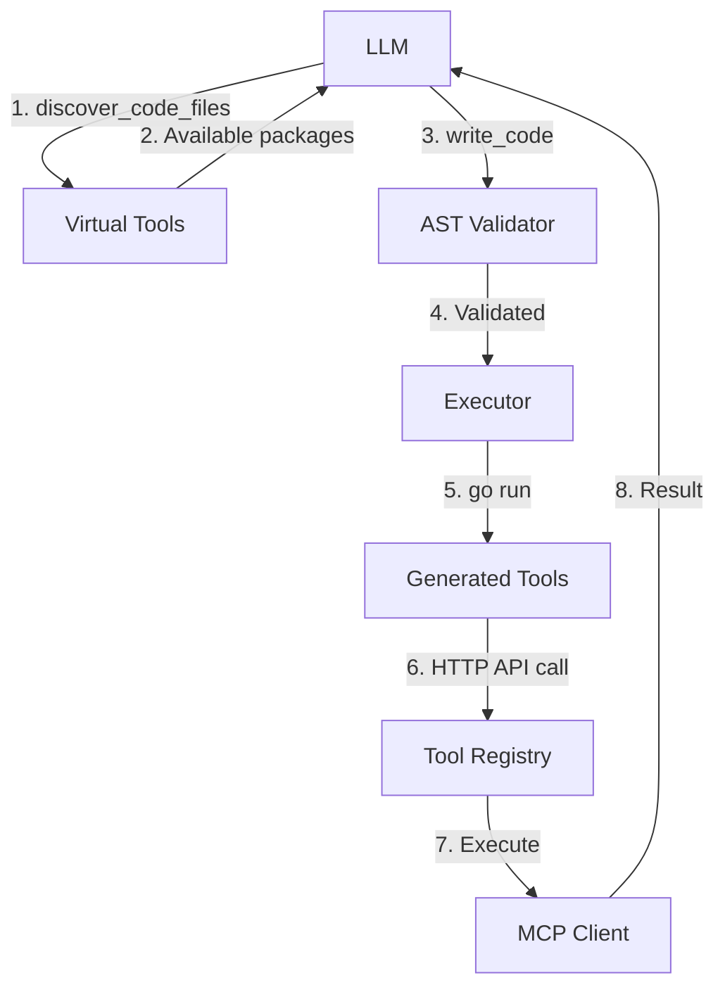

# Code Execution Agent Architecture

## 📋 Overview

The **Code Execution Agent** allows LLMs to write and execute Go code instead of making JSON-based tool calls. The LLM generates Go programs that import and utilize MCP tools as native functions.

**Key Benefits:**
- **Type Safety**: Go compiler enforces correct types
- **Complex Logic**: Native loops, conditionals, data transformations
- **Tool Chaining**: Multiple tool calls in single execution
- **Error Handling**: Programmatic error handling

---

## 📁 Key Files & Locations

| Component | File Path | Key Functions |
|-----------|-----------|---------------|
| **Agent Core** | [`agent_go/pkg/mcpagent/agent.go`](file:///Users/mipl/ai-work/mcp-agent/agent_go/pkg/mcpagent/agent.go) | `NewAgent()`, `WithCodeExecutionMode()`, `SetFolderGuardPaths()` |
| **Virtual Tools** | [`agent_go/pkg/mcpagent/virtual_tools.go`](file:///Users/mipl/ai-work/mcp-agent/agent_go/pkg/mcpagent/virtual_tools.go) | `handleDiscoverCodeFiles()`, `handleWriteCode()` |
| **Code Validation** | [`agent_go/pkg/mcpagent/code_execution_tools.go`](file:///Users/mipl/ai-work/mcp-agent/agent_go/pkg/mcpagent/code_execution_tools.go) | `validateCodeForForbiddenFileIO()`, `validateWorkspaceToolPaths()` |
| **Code Generator** | [`agent_go/pkg/mcpcache/codegen/generator.go`](file:///Users/mipl/ai-work/mcp-agent/agent_go/pkg/mcpcache/codegen/generator.go) | `GenerateServerToolsCode()`, `GenerateFunctionWithParams()` |
| **Schema Parser** | [`agent_go/pkg/mcpcache/codegen/schema_parser.go`](file:///Users/mipl/ai-work/mcp-agent/agent_go/pkg/mcpcache/codegen/schema_parser.go) | `ParseSchema()`, `GenerateStructFromSchema()` |
| **Code Templates** | [`agent_go/pkg/mcpcache/codegen/templates.go`](file:///Users/mipl/ai-work/mcp-agent/agent_go/pkg/mcpcache/codegen/templates.go) | `GenerateStruct()`, `GenerateAPIClient()` |
| **Tool Registry** | [`agent_go/pkg/mcpagent/codeexec/registry.go`](file:///Users/mipl/ai-work/mcp-agent/agent_go/pkg/mcpagent/codeexec/registry.go) | `CallMCPTool()`, `RegisterMCPClient()` |

**Generated Code Locations:**
- `agent_go/generated/<server>_tools/` - Auto-generated Go packages for each MCP server
- `workspace/code_<timestamp>/` - Temporary execution directories

---

## 🔄 System Lifecycle

### 1. Initialization
```go
agent := mcpagent.NewAgent(llmClient, mcpagent.WithCodeExecutionMode(true))
agent.SetFolderGuardPaths([]string{"/app/workspace"}, []string{"/app/workspace"})
```
- Standard tool registration is **disabled**
- Only virtual tools (`discover_code_files`, `write_code`) are registered

### 2. MCP Server Connection → Code Generation
When an MCP server connects, wrapper code is auto-generated:

```
agent_go/generated/google_sheets_tools/
├── create_spreadsheet.go
├── read_spreadsheet.go
└── common.go          # Shared HTTP client
```

### 3. LLM Discovery
LLM calls `discover_code_files` → receives JSON with available packages/functions:
```json
{
  "servers": [{
    "name": "google-sheets",
    "package": "mcp-agent/agent_go/generated/google_sheets_tools",
    "tools": ["CreateSpreadsheet", "ReadSpreadsheet"]
  }],
  "workspace_tools": {
    "package": "mcp-agent/agent_go/generated/workspace_tools",
    "tools": ["ReadWorkspaceFile", "WriteWorkspaceFile"]
  }
}
```

### 4. Code Execution Flow
1. LLM calls `write_code(go_source)`
2. Code validated via AST analysis
3. Temporary workspace created: `workspace/code_<timestamp>/`
4. Code + `go.work` written
5. Executed: `go run main.go` (with timeout)
6. Output captured, workspace cleaned up
7. Result returned to LLM

---

## 🏗️ Architecture Diagram



---

## 🧩 Generated Code Example

**Input:** Google Sheets tool `create_spreadsheet`

**Output:** `agent_go/generated/google_sheets_tools/create_spreadsheet.go`

```go
package google_sheets_tools

type CreateSpreadsheetParams struct {
	Title  string   `json:"title"`
	Sheets []string `json:"sheets,omitempty"`
}

func CreateSpreadsheet(params CreateSpreadsheetParams) (string, error) {
	payload := map[string]interface{}{
		"server": "google-sheets",
		"tool":   "create_spreadsheet",
		"args":   paramsToMap(params),
	}
	return callAPI("/api/mcp/execute", payload)
}
```

**LLM Usage:**
```go
package main

import (
	"fmt"
	"mcp-agent/agent_go/generated/google_sheets_tools"
)

func main() {
	result, err := google_sheets_tools.CreateSpreadsheet(
		google_sheets_tools.CreateSpreadsheetParams{
			Title: "My Spreadsheet",
		},
	)
	if err != nil {
		fmt.Printf("Error: %v\n", err)
		return
	}
	fmt.Println(result)
}
```

---

## 🔒 Security & Validation

### AST-Based Validation

**File:** [`code_execution_tools.go`](file:///Users/mipl/ai-work/mcp-agent/agent_go/pkg/mcpagent/code_execution_tools.go)

| Check | Forbidden | Allowed |
|-------|-----------|---------|
| **Imports** | `io/ioutil`, `os/exec` | `fmt`, `context`, generated packages |
| **OS Functions** | `os.ReadFile`, `os.WriteFile`, `os.Create` | None - use `workspace_tools` |
| **Paths** | Absolute paths, `..` traversal | Relative paths within workspace |

**Example:**
```go
// ❌ BLOCKED
file, _ := os.Open("/etc/passwd")

// ✅ ALLOWED
content, _ := workspace_tools.ReadWorkspaceFile(
    workspace_tools.ReadWorkspaceFileParams{Filepath: "config.json"},
)
```

### Folder Guard
```go
agent.SetFolderGuardPaths(
    []string{"/app/workspace"},  // Read paths
    []string{"/app/workspace"},  // Write paths
)
```

### Execution Isolation
- Fresh temporary directory per execution
- 30-second timeout (configurable)
- Process isolation via `go run`
- Automatic cleanup

---

## ⚙️ Configuration

### Environment Variables

| Variable | Default | Purpose |
|----------|---------|---------|
| `MCP_API_URL` | `http://localhost:8000` | API endpoint for generated code |
| `WORKSPACE_DIR` | `./workspace` | Workspace root directory |
| `CODE_EXECUTION_TIMEOUT` | `30s` | Max execution time |
| `GENERATED_CODE_DIR` | `./agent_go/generated` | Generated packages location |

### Agent Options

```go
agent := mcpagent.NewAgent(
    llmClient,
    mcpagent.WithCodeExecutionMode(true),
    mcpagent.WithTimeout(60 * time.Second),
    mcpagent.WithLogger(logger),
)
```

---

## 🛠️ Common Issues & Solutions

| Issue | Cause | Solution |
|-------|-------|----------|
| `package not found` | Generated code missing | Check `agent_go/generated/` exists, restart agent |
| `forbidden import` | Used `io/ioutil` or `os` | Use `workspace_tools` package instead |
| `path outside boundary` | Absolute path or `..` | Use relative paths within workspace |
| `validation failed` | Blocked OS function | Error message shows correct alternative |

---

## 🔍 For LLMs: Quick Reference

### Workflow
1. Call `discover_code_files` → get available packages
2. Write Go code importing discovered packages
3. Call `write_code(your_go_code)` → execute
4. Handle results or errors

### Code Constraints
✅ **Allowed:**
- Relative paths: `data/file.txt`
- Imports from `generated/*_tools/`
- Standard Go packages: `fmt`, `strings`, `encoding/json`

❌ **Forbidden:**
- Direct `os` file operations
- Absolute paths: `/etc/passwd`
- Directory traversal: `../../../file`
- Imports: `io/ioutil`, `os/exec`

### Example Template
```go
package main

import (
	"fmt"
	"mcp-agent/agent_go/generated/workspace_tools"
)

func main() {
	result, err := workspace_tools.ReadWorkspaceFile(
		workspace_tools.ReadWorkspaceFileParams{
			Filepath: "data/config.json",
		},
	)
	if err != nil {
		fmt.Printf("Error: %v\n", err)
		return
	}
	fmt.Printf("Result: %s\n", result)
}
```

---

## 📚 Advanced Topics

### Schema → Go Type Mapping

| JSON Schema | Go Type | Example |
|-------------|---------|---------|
| `string` | `string` | `Title string` |
| `integer` | `int` | `Count int` |
| `number` | `float64` | `Price float64` |
| `boolean` | `bool` | `Active bool` |
| `array` | `[]T` | `Tags []string` |
| `object` | `map[string]interface{}` | `Data map[string]interface{}` |

### Performance
- Code generation: ~100ms per server
- Code execution: 200-500ms average
  - Validation: 50-100ms
  - `go run`: 100-300ms
  - Cleanup: 10-20ms

**Optimization:** Batch multiple tool calls in one `write_code` execution

---

## 📖 Related Documentation

- [`docs/mcp_cache_system.md`](file:///Users/mipl/ai-work/mcp-agent/docs/mcp_cache_system.md) - MCP server caching
- [`docs/llm_resilience.md`](file:///Users/mipl/ai-work/mcp-agent/docs/llm_resilience.md) - Error handling
- [`workspace/README.md`](file:///Users/mipl/ai-work/mcp-agent/workspace/README.md) - Workspace tools
- [`SECURITY.md`](file:///Users/mipl/ai-work/mcp-agent/SECURITY.md) - Security model
