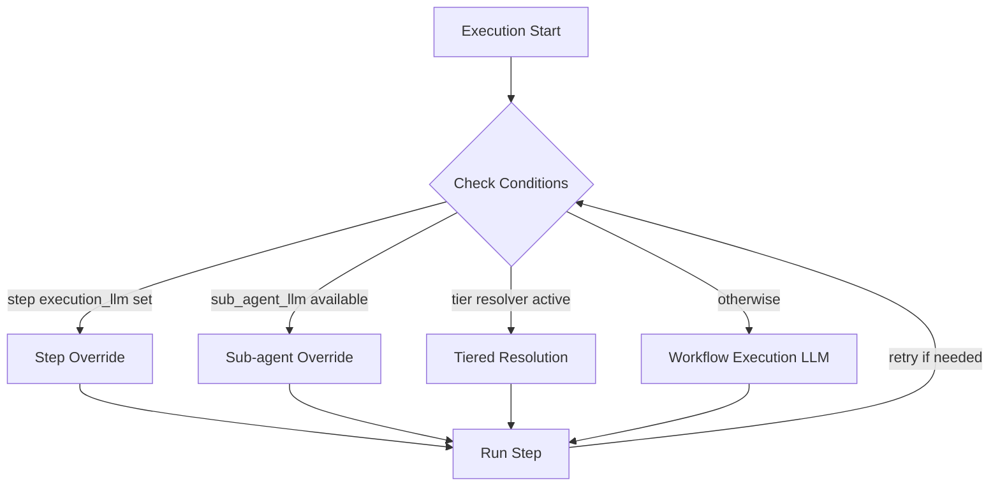

# LLM Configuration & Resilience

This document outlines the system for managing LLM configurations, user-driven fallbacks, and the automated temporary LLM cascading flow for execution resilience.

---

## 1. User-Driven LLM Configuration

**Status**: Implementation Complete (2026-01-05)

### 📋 Overview

The user-controlled LLM configuration system allows the **Primary LLM to be selected from Published LLMs**. Each Published LLM carries its own API key, temperature, and model-specific options. This ensures that the backend requires no API keys at startup and operates using ambient credentials (AWS) for internal operations only.

**Key Principles:**
- **Primary LLM**: Selected from Published LLMs (not configured directly).
- **Self-contained Auth**: Each Published LLM stores its own API key.
- **Backend Defaults**: Backend uses ambient credentials (AWS Bedrock) for internal operations only.
- **Fallback Chain**: Simple ordered fallback array configured by the user.

### 📁 Key Files & Locations

| Component | File | Key Functions |
|-----------|------|---------------|
| **LLM Store** | `frontend/src/stores/useLLMStore.ts` | `savedLLMs`, `refreshAvailableLLMs()`, `getCurrentLLMOption()` |
| **Published LLM Tab** | `frontend/src/components/llm/LibraryTab.tsx` | Publish/delete/select LLMs |
| **Fallbacks Tab** | `frontend/src/components/llm/FallbacksTab.tsx` | Primary selection, fallback chain |
| **LLM Dropdown** | `frontend/src/components/LLMSelectionDropdown.tsx` | Rich metadata display |
| **LLM Types** | `frontend/src/types/llm.ts` | `LLMOption` interface |
| **API Types** | `frontend/src/services/api-types.ts` | `SavedLLM`, `LLMModel`, `AgentLLMConfiguration` |
| **Backend Server** | `agent_go/cmd/server/server.go` | No internal LLM required |

### 🔄 Workflow

```
User configures LLM in Provider Tab (OpenRouter, Bedrock, etc.)
    ↓
Publishes to "Published LLM" list (saves API key, temp, options)
    ↓
Selects Published LLM as Primary (from Fallbacks or Published LLM tab)
    ↓
LLM Dropdown shows all Published LLMs with metadata
    ↓
Agent execution uses Published LLM config (with its stored API key)
```

### 🏗️ Architecture

#### Data Flow

| Step | Frontend | Backend |
|------|----------|---------|
| 1. Configure | Provider tabs (OpenRouter, Bedrock, etc.) | - |
| 2. Publish | `saveLLM()` → `savedLLMs[]` | - |
| 3. Select Primary | `handleLibrarySelect()` → `agentConfig.primary` | - |
| 4. Execute | Sends `LLMConfig` with API key | Uses provided credentials |

#### Types

```typescript
// Published LLM (stored in frontend)
interface SavedLLM extends LLMModel {
  id: string
  name: string
  api_key?: string      // Stored per-LLM
  temperature?: number
  options?: Record<string, unknown>  // reasoning_effort, thinking_level, etc.
}

// Agent configuration sent to backend
interface AgentLLMConfiguration {
  primary: LLMModel     // Selected from savedLLMs
  fallbacks: LLMModel[] // Ordered fallback chain
}
```

### ⚙️ Configuration

#### Backend Defaults (run_server_with_logging.sh)

| Variable | Value | Purpose |
|----------|-------|---------|
| `DEEP_SEARCH_MAIN_LLM_PROVIDER` | `bedrock` | Uses AWS credentials (no API key) |
| `DEEP_SEARCH_MAIN_LLM_MODEL` | `global.anthropic.claude-sonnet-4-5-*` | Default model |
| `AGENT_PROVIDER` | `bedrock` | Internal operations only |

**Note:** Backend no longer creates an `internalLLM` at startup. All agent execution uses Published LLM configs from frontend.

### 🛠️ UI Components

| Component | Purpose | Key Features |
|-----------|---------|--------------|
| **Published LLM Tab** | Manage saved configs | Publish current, set as primary, delete, show API key last 4 digits |
| **Fallbacks Tab** | Configure fallback chain | Change Primary button, add from Published LLM or custom |
| **LLM Dropdown** | Select LLM for execution | Rich metadata (cost, context, temp, reasoning options) |

#### LLM Dropdown Display

```
┌─────────────────────────────────────────┐
│ OPENROUTER                              │
│   My GPT-4o Config                      │
│   gpt-4o                                │
│   📦 128k  💲$2.50/1M  🌡️ 0.7          │
│   Reasoning: medium                     │
├─────────────────────────────────────────┤
│ BEDROCK                                 │
│   Production Claude                     │
│   claude-sonnet-4.5                     │
│   📦 200k  💲$3.00/1M  🌡️ 0.0          │
└─────────────────────────────────────────┘
```

### 🔍 For LLMs: Quick Reference

**Constraints:**
- ✅ Primary LLM must be selected from Published LLMs
- ✅ Each Published LLM stores its own API key
- ✅ Backend uses Bedrock (AWS credentials) for internal ops
- ❌ No hardcoded API keys in backend
- ❌ No `internalLLM` created at startup

**Key Store Actions:**
```typescript
// Publish current config
saveLLM(llm, name, modelName, authMethod)

// Select as primary (from FallbacksTab or LibraryTab)
handleLibrarySelect(savedLLM) → updates agentConfig.primary

// Refresh dropdown options
refreshAvailableLLMs() → builds from savedLLMs with metadata
```

**Auto-refresh triggers:**
- `saveLLM()` → calls `refreshAvailableLLMs()`
- `deleteSavedLLM()` → calls `refreshAvailableLLMs()`
- `loadDefaults()` → calls `refreshAvailableLLMs()`

---

## 2. Execution Model Selection

### 📋 Overview

Execution agents now select models from a fixed priority chain: step override, sub-agent override, tiered resolution, then workflow fallback. Retry state still matters for control flow, but it no longer changes the execution model.

**Key Benefits:**
- **Explicit overrides**: Step `execution_llm` wins whenever it is set
- **Predictable tiering**: Tiered mode resolves only when no higher-priority override exists
- **Stable retries**: Retry handling is separate from model selection

### 📁 Key Files & Locations

| Component | File Path | Key Functions |
|-----------|-----------|---------------|
| **Retry Logic** | [`agent_go/pkg/orchestrator/agents/workflow/step_based_workflow/controller_execution.go`](../../agent_go/pkg/orchestrator/agents/workflow/step_based_workflow/controller_execution.go) | `isRetryAfterValidationFailure` calculation (lines 1221-1228), retry loop (line 1152) |
| **LLM Selection** | [`agent_go/pkg/orchestrator/agents/workflow/step_based_workflow/controller_agent_factory.go`](../../agent_go/pkg/orchestrator/agents/workflow/step_based_workflow/controller_agent_factory.go) | `selectExecutionLLM()` - LLM selection logic (lines 228-270) |
| **Validation Check** | [`agent_go/pkg/orchestrator/agents/workflow/step_based_workflow/controller_execution.go`](../../agent_go/pkg/orchestrator/agents/workflow/step_based_workflow/controller_execution.go) | `isValidationFailure()` function (lines 46-54) |

### 🔄 Flow Sequence



### Attempt Sequence

**File**: [`controller_agent_factory.go`](../../agent_go/pkg/orchestrator/agents/workflow/step_based_workflow/controller_agent_factory.go)

**Priority Order** (checked in this sequence):
1. **Step execution LLM** - Used when `agent_configs.execution_llm` is set for the step.
2. **Sub-agent override** - Used when execution is running inside a sub-agent context that supplies `sub_agent_llm`.
3. **Tiered execution resolution** - Used when tiered mode is active and no step override is present.
4. **Original LLM chain** (preset/workflow execution LLM) - Used as the remaining fallback.

### ⚙️ Failure Criteria

#### For retry purposes

**Only `ExecutionStatus == "FAILED"` counts as failure:**

| Status | Action | Triggers Retry? |
|--------|--------|-----------------|
| `COMPLETED` | Success | ❌ No retry |
| `PARTIAL` | Success | ❌ No retry |
| `INCOMPLETE` | Success | ❌ No retry |
| `FAILED` | Failure | ✅ Triggers next attempt |

#### Validation Status Handling

**File**: [`controller_execution.go:46-54`](../../agent_go/pkg/orchestrator/agents/workflow/step_based_workflow/controller_execution.go#L46)

**Retry Decision**: Uses `IsSuccessCriteriaMet` from validation response
- If `IsSuccessCriteriaMet == true`: Stop retry, step passes
- If `IsSuccessCriteriaMet == false`: Continue retry (regardless of status)

**Retry handling**: Uses `ExecutionStatus == "FAILED"` via `isValidationFailure()`
- Only `ExecutionStatus == "FAILED"` triggers `isRetryAfterValidationFailure`
- `PARTIAL`/`INCOMPLETE`/`COMPLETED` with unmet criteria still retry, but they do not change model selection

**Special Cases**:
- **Decision Step False Result**: Steps routed from decision step with `false` result are treated as validation failure.
- **Loop Iterations**: New loop iterations after failure (`loopIterationCount > 1`) trigger `isRetryAfterValidationFailure`.

### 🔄 Implementation Details

#### Key Logic

**File:** [`controller_execution.go:1221-1228`](../../agent_go/pkg/orchestrator/agents/workflow/step_based_workflow/controller_execution.go#L1221)

```go
// Validation failure check
isRetryAfterValidationFailure := isValidationFailure(previousValidationResponse) &&
    (retryAttempt > 1 || (hasLoop(step) && loopIterationCount > 1))

// Also treat decision step false result as validation failure
isDecisionStepFalse := decisionContext != nil && !decisionContext.DecisionResult
if isDecisionStepFalse {
    isRetryAfterValidationFailure = true
}
```

**File:** [`controller_agent_factory.go`](../../agent_go/pkg/orchestrator/agents/workflow/step_based_workflow/controller_agent_factory.go)

```go
if stepConfig.ExecutionLLM != nil {
    // Use explicit step execution LLM
} else if subAgentLLMFromContext != nil {
    // Use sub-agent override when allowed
} else if tierResolver != nil {
    // Resolve execution tier from context and learning maturity
} else {
    // Use workflow/preset execution LLM fallback
}
```

#### Conditions

**File**: [`controller_agent_factory.go:131-236`](../../agent_go/pkg/orchestrator/agents/workflow/step_based_workflow/controller_agent_factory.go#L131)

| Condition | Purpose | Effect | Notes |
|-----------|---------|--------|-------|
| Step `execution_llm` set | Explicit per-step model choice | Overrides all runtime execution model selection | Applies in both manual and tiered modes |
| `sub_agent_llm` present in context | Use parent-selected model for nested execution | Overrides tiered/preset selection when step config is absent | Only applies to sub-agent executions |
| Tier resolver configured | Use maturity-based execution tier | Selects tiered execution model when no step override is present | Active in tiered mode |
| No step override and no tier resolver result | Fall back to workflow execution LLM | Uses preset/workflow execution config | Final execution fallback |

### 🛠️ Common Issues & Solutions

| Issue | Cause | Solution |
|-------|-------|----------|
| Step model not used | `execution_llm` not set on the step | Set `agent_configs.execution_llm` for that step |
| Tiered model used unexpectedly | Tiered mode is active and the step has no `execution_llm` | Set a step execution LLM or change workflow allocation mode |
| Sub-agent model used unexpectedly | Execution is happening inside a sub-agent context | Check the calling sub-agent configuration and context |
| Always uses preset/workflow model | No step override and no tier resolver match/override | Verify workflow LLM allocation and step config |

### 🔍 For LLMs: Quick Reference

**Constraints:**
- ✅ **Allowed**: Set `execution_llm` on a step to force that execution model.
- ✅ **Allowed**: Let tiered mode select execution models when no step override is present.
- ✅ **Allowed**: Fall back to the workflow execution LLM when no higher-priority override exists.

**Failure Detection:**
- Only `ExecutionStatus == "FAILED"` triggers `isRetryAfterValidationFailure`
- Decision step false result also triggers `isRetryAfterValidationFailure`
- New loop iteration after failure (`loopIterationCount > 1`) triggers `isRetryAfterValidationFailure`
- `PARTIAL`/`INCOMPLETE`/`COMPLETED` with unmet criteria continue retry but do not change model selection

**Priority Order:**
1. Step `execution_llm`
2. `sub_agent_llm`
3. Tiered execution resolution
4. Workflow execution LLM fallback

**Example Flows:**

**Step override present:**
```
Attempt 1: Step execution LLM → FAILED → Continue
Attempt 2: Step execution LLM → SUCCESS → Complete
```

**Tiered execution:**
```
Attempt 1: Tier-selected model → FAILED → Continue
Attempt 2: Tier-selected model → SUCCESS → Complete
```

**Decision Step False:**
```
Decision Step: FALSE → isRetryAfterValidationFailure = true
Attempt 1: Selected execution model → SUCCESS → Complete
```

**Loop Iteration After Failure:**
```
Loop Iteration 1: Selected execution model → FAILED
Loop Iteration 2: Selected execution model → SUCCESS
```

---

## 📖 Related Documentation

- [Workflow Docs](../workflow/README.md) - Overall execution system
- [Controller Execution](../../agent_go/pkg/orchestrator/agents/workflow/step_based_workflow/controller_execution.go) - Retry logic implementation
- [Model Metadata](../../multi-llm-provider-go/llmtypes/model_metadata.go) - Pricing, context, capabilities
- [LLM Store](../../frontend/src/stores/useLLMStore.ts) - State management
