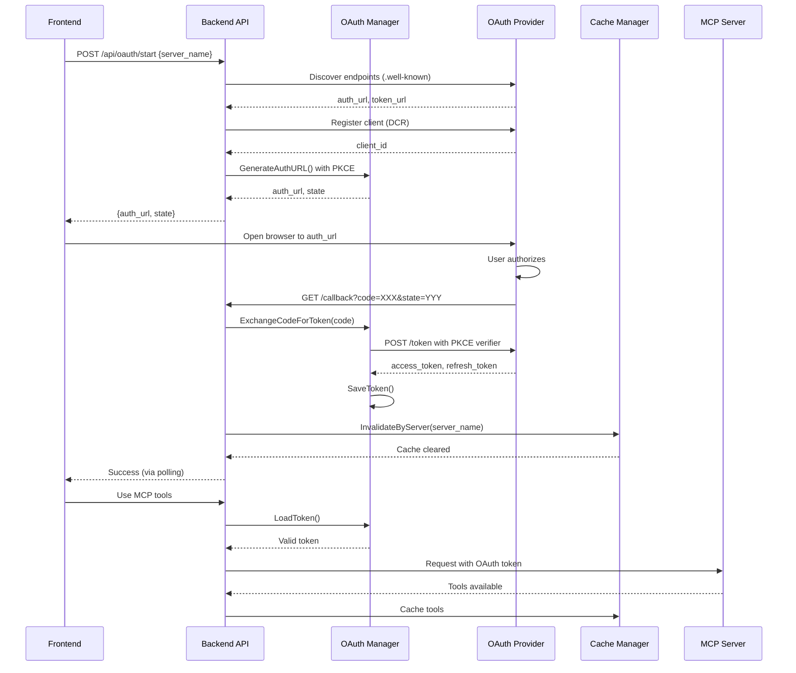

# OAuth Integration Guide

Complete guide for OAuth authentication with MCP servers.

## Table of Contents

1. [Quick Start](#quick-start)
2. [Auto-Detection](#auto-detection)
3. [UI Integration](#ui-integration)
4. [API Reference](#api-reference)
5. [Testing](#testing)
6. [Architecture](#architecture)
7. [Troubleshooting](#troubleshooting)

---

## Quick Start

### Step 1: Add Server (Just URL - OAuth Auto-Detected)

```json
{
  "mcpServers": {
    "Notion": {
      "url": "https://mcp.notion.com/mcp"
    }
  }
}
```

No manual OAuth configuration needed - it's auto-detected from the 401 response.

### Step 2: Start Backend

```bash
cd agent_go
./run_server_with_logging.sh
```

### Step 3: Authenticate

1. Open http://localhost:5173
2. Click **MCP Servers** in sidebar
3. Expand server details
4. Click orange **Login** button next to Notion
5. Complete authentication in browser
6. Badge turns green: **OAuth ✓**

---

## Auto-Detection

OAuth servers advertise themselves via `401 Unauthorized` responses per OAuth 2.0 spec. We auto-detect this automatically.

### How It Works

```
┌──────────┐
│ Frontend │  1. Loads MCP servers
└────┬─────┘
     │
     │ 2. Triggers discovery
     ▼
┌──────────┐
│ Backend  │  3. Tries to connect to each server
└────┬─────┘
     │
     │ 4. GET https://mcp.notion.com/mcp
     ▼
┌──────────┐
│  Notion  │  5. Returns 401 Unauthorized
│   MCP    │     WWW-Authenticate: Bearer realm="..."
└────┬─────┘     Link: <...>; rel="token_endpoint"
     │
     │ 6. OAuth endpoints extracted
     ▼
┌──────────┐
│ Backend  │  7. Sets requires_oauth = true
└────┬─────┘
     │
     │ 8. Returns ToolStatus with OAuth info
     ▼
┌──────────┐
│ Frontend │  9. OAuthStatusBadge appears automatically
└──────────┘
```

### Discovery Methods

1. **RFC 9728** - OAuth Protected Resource Metadata (for Smithery-style servers)
2. **RFC 8414** - OAuth Authorization Server Metadata (`.well-known/oauth-authorization-server`)
3. **401 Response Headers** - `WWW-Authenticate` and `Link` headers

### API Response

The `/api/tools` endpoint returns OAuth info:

```json
{
  "name": "Notion",
  "server": "Notion",
  "status": "error",
  "error": "OAuth authentication required",
  "requires_oauth": true,
  "oauth_endpoints": {
    "auth_url": "https://auth.notion.com/oauth/authorize",
    "token_url": "https://auth.notion.com/oauth/token"
  }
}
```

### Benefits

- **No Manual Configuration** - Just add server URL
- **Works for Any OAuth Server** - Follows OAuth 2.0 spec (RFC 6750)
- **Graceful Fallback** - No badge shown if OAuth not detected

---

## UI Integration

### OAuth Badge States

| State | Appearance | Description |
|-------|------------|-------------|
| Not Authenticated | `[ ! Login ]` (orange) | Click to start OAuth flow |
| Authenticating | `[ ⟳ ... ]` | Flow in progress |
| Authenticated | `[ ✓ OAuth ] [ ↻ ] [ ✕ ]` (green) | Valid token, with refresh and logout buttons |

### Badge Location

In the MCP Servers section (sidebar), next to each OAuth-enabled server:

```
┌─────────────────────────────────────────────────┐
│ Notion                    15 tools  ● [OAuth ✓] │
│   [▶ Show] [Toggle]                              │
└─────────────────────────────────────────────────┘
```

### User Flow

```
User clicks "Login"
      │
      ▼
Browser opens automatically to auth page
      │
      ▼
User completes authentication
      │
      ▼
Returns to app
      │
      ▼
Badge updates to green "OAuth ✓"
      │
      ▼
Tools become available
```

### Using OAuthStatusBadge Component

```tsx
import { OAuthStatusBadge } from '@/components/OAuthStatusBadge';

function MyComponent() {
  return (
    <OAuthStatusBadge
      serverName="Notion"
      requiresOAuth={true}  // Optional - auto-detected if not provided
      onAuthChange={(valid) => {
        console.log('Auth changed:', valid);
        if (valid) refreshTools();
      }}
    />
  );
}
```

---

## API Reference

### Start OAuth Flow

```bash
POST /api/oauth/start
Content-Type: application/json

{"server_name": "Notion"}
```

**Response:**
```json
{
  "server_name": "Notion",
  "auth_url": "",
  "state": "",
  "message": "OAuth flow started - browser will open automatically"
}
```

### Check Token Status

```bash
GET /api/oauth/status?server_name=Notion
```

**Response:**
```json
{
  "server_name": "Notion",
  "valid": true,
  "expires_in": "23h59m30s",
  "token_path": "/Users/you/.config/mcpagent/tokens/notion.json"
}
```

### Logout

```bash
POST /api/oauth/logout
Content-Type: application/json

{"server_name": "Notion"}
```

**Response:**
```json
{
  "status": "success",
  "message": "Successfully logged out from Notion"
}
```

### Using OAuth API in TypeScript

```typescript
import { oauthApi } from '@/services/oauthApi';

// Check status
const status = await oauthApi.getOAuthStatus('Notion');
console.log(status.valid);      // true/false
console.log(status.expires_in); // "23h59m30s"

// Start login
await oauthApi.startOAuthFlow('Notion');

// Logout
await oauthApi.logout('Notion');
```

---

## Testing

### Quick Test with UI

1. Start backend: `./run_server_with_logging.sh`
2. Start frontend: `cd frontend && npm run dev`
3. Open http://localhost:5173
4. Click MCP Servers → Notion → Login
5. Complete auth → Badge turns green

### API Testing with curl

```bash
# Start flow
curl -X POST http://localhost:8000/api/oauth/start \
  -H "Content-Type: application/json" \
  -d '{"server_name": "Notion"}'

# Check status
curl "http://localhost:8000/api/oauth/status?server_name=Notion"

# Logout
curl -X POST http://localhost:8000/api/oauth/logout \
  -H "Content-Type: application/json" \
  -d '{"server_name": "Notion"}'
```

### Verify Auto-Detection in Logs

```bash
# Backend logs will show:
✅ Auto-detected OAuth for Notion: auth=https://auth.notion.com/oauth/authorize, token=https://auth.notion.com/oauth/token
```

---

## Architecture

### Complete OAuth Flow



### Key Files

#### Backend (Go)

| Component | File | Description |
|-----------|------|-------------|
| OAuth Routes | `agent_go/cmd/server/oauth_routes.go` | API endpoints |
| OAuth Manager | `mcpagent/oauth/manager.go` | Token exchange |
| Discovery | `mcpagent/oauth/discovery.go` | Endpoint discovery |
| Token Storage | `mcpagent/oauth/token_store.go` | Token persistence |

#### Frontend (TypeScript/React)

| Component | File | Description |
|-----------|------|-------------|
| OAuth API | `frontend/src/services/oauthApi.ts` | API client |
| OAuth Badge | `frontend/src/components/OAuthStatusBadge.tsx` | Smart badge component |

---

## Token Management

### Storage Location

```
~/.config/mcpagent/tokens/{server}.json
```

### File Permissions

`0600` (owner read/write only)

### Token Contents

```json
{
  "access_token": "...",
  "refresh_token": "...",
  "token_type": "Bearer",
  "expiry": "2024-01-15T12:00:00Z"
}
```

### Features

- **Auto-Refresh** - Tokens refresh automatically when expired using refresh token
- **Config Persistence** - OAuth endpoints saved to `_user.json` after successful auth
- **Zero-Expiry Handling** - Tokens with no expiry treated as indefinitely valid
- **Manual Refresh** - Click ↻ button to force status check

---

## Configuration

### Auto-Detection (Recommended)

```json
{
  "mcpServers": {
    "Notion": {
      "url": "https://mcp.notion.com/mcp"
    }
  }
}
```

### Manual Configuration (Optional)

If auto-detection doesn't work:

```json
{
  "mcpServers": {
    "Notion": {
      "url": "https://mcp.notion.com/mcp",
      "oauth": {
        "auth_url": "https://api.notion.com/v1/oauth/authorize",
        "token_url": "https://api.notion.com/v1/oauth/token",
        "use_pkce": true,
        "token_file": "~/.config/mcpagent/tokens/notion.json"
      }
    }
  }
}
```

### OAuth Config Fields

| Field | Required | Default | Purpose |
|-------|----------|---------|---------|
| `auto_discover` | No | `true` | Auto-discover OAuth endpoints |
| `use_pkce` | No | `true` | Use PKCE for enhanced security |
| `auth_url` | No* | - | Authorization endpoint |
| `token_url` | No* | - | Token endpoint |
| `client_id` | No | - | OAuth client ID (DCR can provide) |
| `redirect_url` | No | `http://localhost:8000/api/oauth/callback` | OAuth callback URL |
| `token_file` | No | Auto-generated | Where to store OAuth tokens |
| `scopes` | No | `[]` | OAuth scopes to request |

*Required if `auto_discover` is false

---

## Troubleshooting

### Badge Doesn't Appear

**Cause:** Server didn't return 401 or headers are missing

**Check:**
- Backend logs for "Auto-detected OAuth" message
- Run: `curl -I https://mcp.notion.com/mcp`

**Solution:** Server might not support OAuth, or add manual config

### "Login" Button Doesn't Work

**Cause:** Backend not running or CORS issue

**Solution:**
```bash
# Check backend is running
lsof -i :8000

# Restart backend
cd agent_go
./run_server_with_logging.sh
```

### Badge Shows Green but Can't Connect

**Cause:** Token expired or invalid

**Solution:**
1. Click "✕" to logout
2. Click "Login" again

### Browser Didn't Open

**Cause:** System doesn't have default browser configured

**Solution:** Check backend logs for auth URL and open manually

### "Failed to discover OAuth endpoints"

**Cause:** Cannot reach MCP server or no WWW-Authenticate header

**Solution:**
- Check internet connection
- Try: `curl -I https://mcp.notion.com/mcp`

### Badge Stuck on "Authenticating..."

**Cause:** User didn't complete auth in browser

**Solution:** Complete the auth flow or click "✕" to cancel and try again

### "Invalid redirect_uri"

**Cause:** Redirect URL not registered with OAuth provider

**Solution:** Ensure server allows `http://localhost:8000/api/oauth/callback`

### Tools Still Not Available After Auth

**Cause:** Waiting for cache invalidation

**Solution:** Automatic - wait 1-2 seconds and retry. Cache invalidates after successful auth.

---

## Key Features Summary

| Feature | Description |
|---------|-------------|
| RFC 9728 Support | OAuth Protected Resource Metadata discovery |
| RFC 8414 Support | Standard OAuth discovery |
| PKCE | Proof Key for Code Exchange for security |
| Auto-Discovery | No manual configuration needed |
| Token Persistence | Tokens saved securely to disk |
| Auto-Refresh | Tokens refresh automatically |
| Config Persistence | OAuth config saved after successful auth |
| Manual Refresh | Button to check status on demand |
| Zero-Expiry Handling | Tokens with no expiry treated as valid |
| Cache Invalidation | Automatic cache clearing after auth |
| DCR Support | Dynamic Client Registration when available |

---

## Key Constraints

- PKCE is recommended (no client secret needed)
- State parameter validates callbacks (CSRF protection)
- Tokens auto-refresh if refresh_token available
- Cache auto-invalidates after OAuth success
- Don't store client secrets in config (use PKCE instead)
- Don't skip state validation
