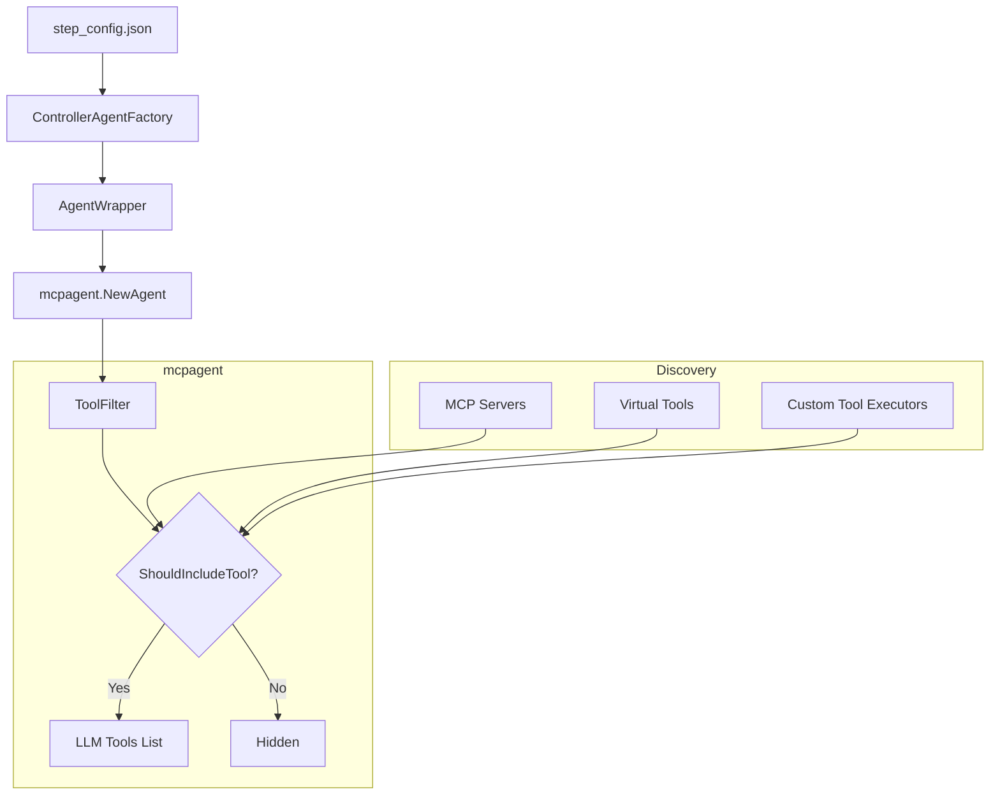
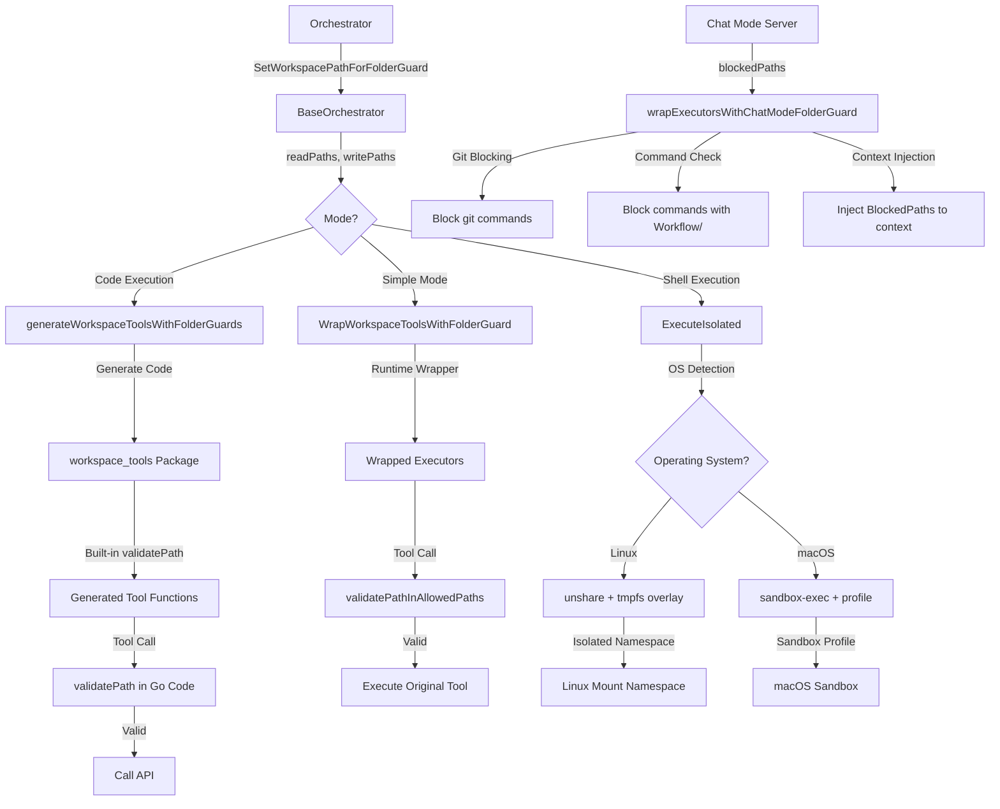

# Execution Configuration & Modes

This document covers the comprehensive system for configuring, controlling, and securing agent execution. It includes tool filtering, specific execution modes (Code Execution, Tool Search), runtime overrides, and the security layer (Folder Guard).

---

## 1. Tool Filtering and Configuration System

### 📋 Overview

The Tool Filtering and Configuration System provides a powerful, multi-layered mechanism to control exactly which tools are available to an agent at any given moment. This system allows for broad control (adding/removing entire servers) down to granular control (enabling specific tools within a server or category).

**Key Benefits:**
- **Server-Level Control**: Add or remove entire MCP servers from the agent's context.
- **Tool-Level Granularity**: Whitelist specific tools from a server while hiding others.
- **Custom Tool Management**: Enable/disable internal virtual tools (e.g., workspace operations, human feedback) with the same granularity.
- **Category-Based Filtering**: Enable entire categories of tools (e.g., "all workspace tools") with wildcard support.
- **Unified Filtering Logic**: Consistent behavior across both external MCP tools and internal custom tools.

### 📁 Key Files & Locations

| Component | File | Key Functions |
|-----------|------|----------------|
| **Core Filter** | [`mcpagent/agent/tool_filter.go`](file:///Users/mipl/ai-work/mcpagent/agent/tool_filter.go) | `NewToolFilter()`, `ShouldIncludeTool()`, `NormalizeServerName()` |
| **Agent Core** | [`mcpagent/agent/agent.go`](file:///Users/mipl/ai-work/mcpagent/agent/agent.go) | `WithSelectedTools()`, `WithSelectedServers()`, `NewAgent()` |
| **Orchestrator Utilities** | [`agent_go/pkg/orchestrator/base_orchestrator_tools.go`](file:///Users/mipl/ai-work/mcp-agent-builder-go/agent_go/pkg/orchestrator/base_orchestrator_tools.go) | `FilterCustomToolsByCategory()`, `ConvertOldFormatToNewFormat()` |
| **Agent Wrapper** | [`agent_go/pkg/agentwrapper/llm_agent.go`](file:///Users/mipl/ai-work/mcp-agent-builder-go/agent_go/pkg/agentwrapper/llm_agent.go) | Pass `SelectedTools` to `mcpagent` options |
| **Workflow Types** | [`agent_go/pkg/orchestrator/agents/workflow/step_based_workflow/planning_agent.go`](file:///Users/mipl/ai-work/mcp-agent-builder-go/agent_go/pkg/orchestrator/agents/workflow/step_based_workflow/planning_agent.go) | `AgentConfigs` struct definition (Source of Truth for JSON fields) |

### 🔄 How It Works

#### Filtering Lifecycle

1.  **Configuration Loading**: The system loads the `step_config.json` for a workflow step, which contains lists like `selected_tools` and `enabled_custom_tools`.
2.  **Filter Initialization**: A `ToolFilter` object is created. It normalizes all entries (e.g., converting hyphens to underscores) and builds efficient lookup maps for wildcards and specific tools.
3.  **MCP Connection**: The system establishes connections to all servers defined in `selected_servers` (or all servers in the base config if not filtered).
4.  **Tool Registration**: During agent initialization, the agent iterates through all discovered tools (both external MCP and internal virtual).
5.  **Enforcement**: For each tool, the agent calls `ShouldIncludeTool(namespace, toolName)`.
    *   If a wildcard like `github:*` is found, all tools from that namespace are included.
    *   If specific tools are listed (e.g., `github:create_issue`), only those tools are included.
    *   System tools (like `workspace_tools` and `human_tools`) are included by default unless a more specific filter is provided.

### 🏗️ Architecture



### 🧩 Code Example

#### Backend Configuration (Go)

```go
// From mcp-agent-builder-go/agent_go/pkg/agentwrapper/llm_agent.go
if len(config.SelectedTools) > 0 {
    // Pass specific tool filters to mcpagent
    agentOptions = append(agentOptions, mcpagent.WithSelectedTools(config.SelectedTools))
}

if len(config.SelectedServers) > 0 {
    // Pass server-level filters
    agentOptions = append(agentOptions, mcpagent.WithSelectedServers(config.SelectedServers))
}
```

#### JSON Configuration (`step_config.json`)

```json
{
  "id": "step-id-1",
  "agent_configs": {
    "selected_servers": ["github"],
    "selected_tools": [
      "github:create_issue",
      "github:list_issues"
    ],
    "enabled_custom_tools": [
      "workspace_basic:*",
      "workspace_advanced:execute_shell_command",
      "human_tools:*"
    ]
  }
}
```

### ⚙️ Configuration Fields

| Field | Type | Default | Description |
|-------|------|---------|-------------|
| `selected_servers` | `string[]` | `[]` | MCP servers to connect to. If empty, connects to all configured servers. |
| `selected_tools` | `string[]` | `[]` | Granular MCP tools. Format: `namespace:tool` or `namespace:*`. |
| `enabled_custom_tools` | `string[]` | `[]` | Granular internal tools. Format: `category:tool` or `category:*`. |

**Internal Category Names:**
- `workspace_tools`: All workspace tools (backward compatible - includes basic + git + advanced)
- `workspace_basic`: Basic file/folder operations (9 tools: list, read, update, diff_patch, regex_search, semantic_search, glob_discover, delete, move)
- `workspace_git`: GitHub sync tools (2 tools: sync_workspace_to_github, get_workspace_github_status)
- `workspace_advanced`: Advanced workspace tools (4 tools: execute_shell_command, read_image, fetch_web_content, read_pdf)
- `human_tools`: Interaction tools (human_feedback)

### 🛠️ Common Issues & Solutions

| Issue | Cause | Solution |
|-------|-------|----------|
| Tool missing in chat | Tool not in `selected_tools` | Check the "Tool selection" panel in UI or `step_config.json` |
| "Server X filtered out" error | `selected_servers` used without the target server | Add the server to `selected_servers` or use wildcard `*` |
| Hyphen/Underscore mismatch | Names like `google-sheets` vs `google_sheets` | The system normalizes these automatically, but it's best to check `NormalizeServerName()` |

### 🔍 For LLMs: Quick Reference

**Constraints:**
- ✅ **Allowed**: Wildcards using `namespace:*`.
- ✅ **Allowed**: Mixing server filters and tool filters.
- ❌ **Forbidden**: Using tool names without a namespace (e.g., `create_issue` instead of `github:create_issue`).

**Normalizing Rule:**
All names are converted to lowercase with underscores (`google-sheets` -> `google_sheets`).

**Pattern Precedence:**
Specific tool filters (`namespace:tool`) take precedence over server-level filters (`selected_servers`). If you specify one tool from a server, all other tools from that server are automatically hidden unless you add a wildcard.

### 📝 Implementation Review

The system implements a robust three-tier configuration model (Servers -> MCP Tools -> Custom Tools) that is consistent across the full stack. The following technical validation was performed:

#### **Frontend Validation (`StepEditPanel.tsx`)**
- **Unified Format**: Successfully handles the `namespace:tool` and `namespace:*` format for both MCP and custom tools.
- **Legacy Support**: Correctly converts old-style `categories` arrays into the unified format.
- **"NO_SERVERS" Support**: Implements the special `"NO_SERVERS"` flag to allow users to explicitly disable external tool access for pure LLM/Virtual tool steps.

#### **Backend Validation (`tool_filter.go` & `controller_agent_factory.go`)**
- **Centralized Enforcement**: `ToolFilter` provides a single source of truth for tool visibility during both initialization and discovery.
- **Normalization**: Robust handling of hyphen/underscore differences (e.g., `google-sheets` vs `google_sheets`) prevents common configuration mismatches.
- **Explicit Protocol Support**: `controller_agent_factory.go` explicitly recognizes the `NO_SERVERS` flag (via `mcpclient.NoServers`), correctly interpreting it as an instruction to bind to zero external servers without error.

---

## 2. Code Execution Mode

### 📋 Overview

Code Execution Mode allows the Execution Agent to generate and run Go code instead of using MCP tools directly. This enables complex operations, batch processing, and reusable code patterns across workflow iterations.

**Key Benefits:**
- **Reusability**: Code works across iterations with different workspace paths
- **Complex operations**: Batch processing and multi-step logic in single execution
- **Pattern capture**: Learning agent captures successful code patterns for reuse

### 📁 Key Files & Locations

| Component | File Path | Key Functions |
|-----------|-----------|---------------|
| **Execution Agent** | [`agent_go/pkg/orchestrator/agents/workflow/todo_creation_human/execution_only_agent.go`](../agent_go/pkg/orchestrator/agents/workflow/todo_creation_human/execution_only_agent.go) | Code execution mode instructions |
| **Learning Agent** | [`agent_go/pkg/orchestrator/agents/workflow/todo_creation_human/learning_agent_code_execution.go`](../agent_go/pkg/orchestrator/agents/workflow/todo_creation_human/learning_agent_code_execution.go) | Captures Go code patterns for reuse |

### 🚨 Critical Rule: WorkspacePath as CLI Argument

**ALWAYS pass WorkspacePath as the first CLI argument (`os.Args[1]`)**

#### Why This Matters

- Workspace paths change between iterations: `workspace/runs/run-1/execution/step-1` → `workspace/runs/run-2/execution/step-1`
- Hardcoded paths in Go code break when reused across iterations
- Passing path via CLI args makes code reusable - only the argument changes

### 🔄 Two-Step Process

#### 1. Tool Call (`write_code`)

**✅ Correct:**
```json
{
  "code": "package main\n...",
  "args": ["{{.WorkspacePath}}", "other_var1", "other_var2"]
}
```
- Pass ONLY base path as first argument
- Additional variables follow

**❌ Wrong:**
```json
// Passing full file paths
{"args": ["{{.WorkspacePath}}/step-1/file.json", ...]}

// Missing workspace path
{"args": ["other_var1"]}
```

#### 2. Go Code Content

**✅ Correct:**
```go
package main
import (
    "os"
    "path/filepath"
    "workspace_tools"
)

func main() {
    // 1. Read base workspace path (ALWAYS first argument)
    basePath := os.Args[1]      // e.g., "Workflow/runs/iteration-11/execution"
    userId := os.Args[2]        // Additional variables
    
    // 2. Use relative paths with filepath.Join()
    // Read context dependency (previous step output)
    inputPath := filepath.Join(basePath, "step-1/credentials.json")
    inputData := workspace_tools.ReadWorkspaceFile(workspace_tools.ReadWorkspaceFileParams{
        Filepath: inputPath,
    })
    
    // Write to current step folder
    outputPath := filepath.Join(basePath, "step-2/analysis.json")
    result := workspace_tools.UpdateWorkspaceFile(workspace_tools.UpdateWorkspaceFileParams{
        Filepath: outputPath,
        Content:  "...",
    })
}
```

**❌ Wrong:**
```go
// Hardcoded path
filepath := "workspace/runs/run-1/execution/step-1"

// Passing full file paths as CLI arguments
// (should use relative paths with filepath.Join)
```

### ⚙️ Path Handling

#### WorkspacePath vs StepExecutionPath

| Path Type | Source | Example | Usage |
|-----------|--------|---------|-------|
| **WorkspacePath** | `os.Args[1]` | `Workflow/runs/iteration-11/execution` | Base execution workspace (root) |
| **StepExecutionPath** | Template variable | `execution/step-8` | Specific step folder (relative to workspace root) |
| **Relative Path** | Context dependencies | `step-1/step_1_output.json` | File paths within workspace |
| **Full Path** | `filepath.Join(basePath, relativePath)` | `Workflow/runs/iteration-11/execution/step-1/credentials.json` | All file operations |

#### Example

```
WorkspacePath (os.Args[1]): "Workflow/runs/iteration-11/execution"
StepExecutionPath: "execution/step-8"
Relative: "step-1/credentials.json"
Full: filepath.Join(basePath, "step-1/credentials.json") 
     → "Workflow/runs/iteration-11/execution/step-1/credentials.json"
```

### ⚙️ Variable Handling

| Aspect | Implementation | Example |
|--------|----------------|---------|
| **Pass** | All variables via `args` parameter | `args=["{{.WorkspacePath}}", "value1", "value2"]` |
| **Access** | Read from `os.Args` | `os.Args[1]` (workspace), `os.Args[2]`, `os.Args[3]`, etc. |
| **NO Hardcoding** | Never hardcode values OR workspace paths | ❌ `path := "fixed/path"` |

### ⚙️ Packages & Operations

| Type | Implementation | Example |
|------|----------------|---------|
| **Packages** | Import generated tool packages | `aws_tools`, `workspace_tools`, `google_sheets_tools` |
| **File Ops** | Always use `workspace_tools` | `workspace_tools.ReadWorkspaceFile()` |
| **Paths** | Always use `os.Args[1]` + `filepath.Join()` | `filepath.Join(os.Args[1], "step-1/file.json")` |

### 📁 File System Access

Path validation is enforced at runtime. Code can only access allowed folders.

| Access Type | Folders | Purpose |
|------------|---------|---------|
| **READ** | `learnings/`, `execution/` (previous steps), `knowledgebase/` | Read context dependencies, learnings, shared data |
| **WRITE** | `{{.StepExecutionPath}}/` (current step), `knowledgebase/` | Write step output, persistent shared files |

**Rules:**
- ✅ **Step folders** (`execution/step-N/`) are **VOLATILE** - deleted on re-execution/restart
- ✅ **Knowledgebase** (`knowledgebase/`) is **PERSISTENT** - survives across runs
- ❌ Cannot write to other steps' folders or outside allowed paths

### 💾 Knowledgebase Folder

Persistent storage shared across all workflow runs and steps.

**Location:** `{workspaceRoot}/knowledgebase/`

**Usage:**
- ✅ Templates, reference data, global configs
- ✅ Files that must survive across execution attempts
- ✅ Shared resources used by multiple steps
- ❌ Step-specific output (use step folder instead)

### 🛠️ Common Mistakes to Avoid

| Mistake | Wrong | Correct |
|---------|-------|---------|
| **Full file paths as args** | `args=["{{.WorkspacePath}}/step-1/file.json"]` | `args=["{{.WorkspacePath}}"]` + `filepath.Join(basePath, "step-1/file.json")` |
| **Hardcoded iteration paths** | `path := "Workflow/runs/iteration-11/execution/step-1/file.json"` | `basePath := os.Args[1]`<br>`path := filepath.Join(basePath, "step-1/file.json")` |
| **Missing workspace path** | `args=["userId"]` | `args=["{{.WorkspacePath}}", "userId"]` |

### 📋 Code Generation Checklist

Before generating Go code:

1. **🚨 WorkspacePath as FIRST CLI argument**: ALWAYS pass ONLY base WorkspacePath as `os.Args[1]` - NEVER pass full file paths
2. **🚨 Use Relative Paths**: ALL file paths in code must use `filepath.Join(basePath, "step-N/file.json")`
3. Check learnings for error patterns to avoid
4. Use correct patterns from successful code examples (but replace hardcoded paths with `filepath.Join()`)
5. Verify Go syntax and imports
6. Parse tool responses correctly

### 🔄 Learning Integration

When learnings contain Go code with hardcoded paths:

1. Extract the code pattern
2. Replace hardcoded paths with `os.Args[1]`
3. Keep the logic and error handling patterns
4. Update variable access to use CLI args

### 🔍 For LLMs: Quick Reference

**Constraints:**
- ✅ **Allowed**: `os.Args[1]` for workspace path
- ✅ **Allowed**: `filepath.Join(basePath, relativePath)` for file paths
- ✅ **Allowed**: Generated tool packages (`workspace_tools`, `aws_tools`, etc.)
- ✅ **Allowed**: Writing to `knowledgebase/` for persistent files
- ❌ **Forbidden**: Hardcoded workspace paths
- ❌ **Forbidden**: Full file paths as CLI arguments
- ❌ **Forbidden**: Direct OS calls (use `workspace_tools`)
- ❌ **Forbidden**: Writing to other steps' folders

**Example Template:**
```go
package main
import (
    "os"
    "path/filepath"
    "workspace_tools"
)

func main() {
    basePath := os.Args[1]  // ALWAYS first argument
    // ... use filepath.Join(basePath, "relative/path") for all files
}
```

### 🔒 Security

#### Environment Isolation

Code execution mode uses environment variable sanitization to prevent secret leakage:

- **Whitelist-only approach**: Only safe environment variables are included
- **No secret inheritance**: DATABASE_URL, API_KEYS, tokens are NOT accessible
- **Explicit additions**: MCP_API_URL and GOWORK added explicitly when needed

**What code CAN access:**
- `PATH`, `HOME`, `USER`, `SHELL` - Safe shell variables
- `LANG`, `LC_ALL` - Locale settings  
- `MCP_API_URL` - For MCP tool calls
- `GOWORK` - For Go workspace (when using generated packages)

**What code CANNOT access:**
- `DATABASE_URL`, `API_KEY`, `SECRET`, `TOKEN`, `PASSWORD` - Any parent secrets

---

## 3. Tool Search Mode

### 📋 Overview

Tool Search Mode allows agents to discover tools on-demand instead of loading all tools upfront. This significantly reduces token usage when working with large MCP tool catalogs by only exposing tools that are relevant to the current task.

**Key Benefits:**
- **Token Efficiency**: Only load tools when needed, saving context tokens
- **Large Catalogs**: Handle hundreds of tools without overwhelming the context window
- **On-Demand Discovery**: Agents use `search_tools` to find relevant tools dynamically
- **Pre-Discovered Tools**: Critical tools can be pre-loaded and always available

### 📁 Key Files & Locations

| Component | File Path | Key Functions |
|-----------|-----------|---------------|
| **Base Orchestrator** | [`agent_go/pkg/orchestrator/base_orchestrator.go`](../agent_go/pkg/orchestrator/base_orchestrator.go) | `useToolSearchMode`, `preDiscoveredTools` fields |
| **Base Orchestrator Getters** | [`agent_go/pkg/orchestrator/base_orchestrator_getters.go`](../agent_go/pkg/orchestrator/base_orchestrator_getters.go) | `GetUseToolSearchMode()`, `GetPreDiscoveredTools()` |
| **Agent Config** | [`agent_go/pkg/orchestrator/agents/interfaces.go`](../agent_go/pkg/orchestrator/agents/interfaces.go) | `UseToolSearchMode`, `PreDiscoveredTools` in config |
| **Step Config** | [`agent_go/pkg/orchestrator/agents/workflow/step_based_workflow/planning_agent.go`](../agent_go/pkg/orchestrator/agents/workflow/step_based_workflow/planning_agent.go) | Step-level overrides in `AgentConfigs` |
| **Controller Factory** | [`agent_go/pkg/orchestrator/agents/workflow/step_based_workflow/controller_agent_factory.go`](../agent_go/pkg/orchestrator/agents/workflow/step_based_workflow/controller_agent_factory.go) | `getToolSearchMode()`, `getPreDiscoveredTools()` |
| **Frontend Modal** | [`frontend/src/components/PresetModal.tsx`](../frontend/src/components/PresetModal.tsx) | UI Toggle and pre-discovery logic |

### 🔄 How It Works

#### Without Tool Search Mode (Default)

By default, all tools from selected MCP servers are loaded into the LLM's context:

```
Agent Context:
├── System Prompt
├── All Tools (50-100+ tools)  ← Can consume many tokens
├── Conversation History
└── User Message
```

#### With Tool Search Mode Enabled

When Tool Search Mode is enabled, the agent starts with only:
1. The `search_tools` virtual tool for discovering other tools
2. The `add_tool` virtual tool for adding discovered tools to the context
3. Any pre-discovered tools specified in configuration

```
Agent Context:
├── System Prompt
├── search_tools (virtual tool)
├── add_tool (virtual tool)
├── Pre-discovered Tools (if any)
├── Conversation History
└── User Message
```

The agent can then use `search_tools` to find relevant tools, and `add_tool` to load them:

```
Agent: "I need to read a file. Let me search for file tools."
→ search_tools("read file workspace")
← Returns: read_workspace_file, read_file, etc.

Agent: I found the tool I need.
→ add_tool(tool_names: ["read_workspace_file"])

Agent: Now I have the file reading tool available.
→ read_workspace_file(filepath: "config.json")
```

### 💻 Frontend Integration

The Frontend Preset Modal now supports Tool Search Mode directly:

1.  **3-Way Toggle**: A segmented control allows selecting one of three exclusive modes:
    - **Simple**: Direct tool access (default).
    - **Code Exec**: Tools accessed via Python/Go code generation.
    - **Tool Search**: Dynamic tool discovery with `search_tools`.

2.  **Pre-Discovered Tools Logic**:
    - When **Tool Search** mode is selected, any tools selected in the "Selected Tools" list are automatically treated as **Pre-Discovered Tools**.
    - This allows you to "lock in" essential tools (like `read_workspace_file`, `human_feedback`) so they are always available, while letting the agent search for specialized tools on demand.
    - The UI automatically handles the mapping: `selected_tools` in UI -> `pre_discovered_tools` in backend request.

### ⚙️ Configuration

#### Preset-Level Configuration

Tool Search Mode can be enabled at the preset level in the database:

```json
{
  "use_tool_search_mode": true,
  "pre_discovered_tools": ["read_workspace_file", "write_workspace_file"]
}
```

#### Step-Level Configuration

Override at the step level in `step_config.json`:

```json
{
  "steps": [
    {
      "id": "step-1",
      "title": "Data Collection",
      "agent_configs": {
        "use_tool_search_mode": true,
        "pre_discovered_tools": ["read_workspace_file", "write_workspace_file"],
        "selected_servers": ["filesystem", "database", "api_server"]
      }
    },
    {
      "id": "step-2",
      "title": "Analysis",
      "agent_configs": {
        "use_tool_search_mode": false
      }
    }
  ]
}
```

#### Configuration Priority

The configuration follows a cascading priority:

1. **Step Config** (highest priority) - If `use_tool_search_mode` is set in step config
2. **Preset/Orchestrator Default** - Falls back to orchestrator-level setting
3. **System Default** - `false` (tool search mode disabled)

### 📈 Optimization Strategy

The Plan Tool Optimization Agent supports a specific strategy for Tool Search Mode:

**Strategy: Convert to Tool Search Mode**
If the optimizer identifies a clear set of tools used successfully in previous runs (via Learnings or Logs), it may recommend converting the step to Tool Search Mode:

1.  **Enable Tool Search Mode**: Set `use_tool_search_mode: true`.
2.  **Lock In Known Tools**: Set `pre_discovered_tools` to the list of successfully used tools.
3.  **Allow Expansion**: Set `selected_tools` to `['server:*']` (all tools from relevant servers) to allow the agent to search for *other* tools if needed, without loading them all into context initially.

This strategy combines the efficiency of a static tool list (known tools are ready) with the flexibility of dynamic search (unknown tools can be found).

### 🛠️ Pre-Discovered Tools

Pre-discovered tools are tools that are always available without needing to search. Use these for:

- **Critical Tools**: Tools the agent needs immediately (e.g., workspace file operations)
- **Frequently Used**: Tools used in almost every interaction
- **Foundation Tools**: Base tools that other operations depend on

#### Example Configuration

```json
{
  "use_tool_search_mode": true,
  "pre_discovered_tools": [
    "read_workspace_file",
    "write_workspace_file",
    "list_workspace_files",
    "human_feedback"
  ]
}
```

#### Tool Name Format

Pre-discovered tools should be specified as tool names (not `server:tool` format):

- **Correct**: `"read_workspace_file"`, `"aws_cli_query"`
- **Incorrect**: `"filesystem:read_workspace_file"`

### ⚠️ Troubleshooting

#### Agent Can't Find Tools

**Symptom**: Agent says it doesn't have access to a tool.

**Solutions**:
1. Add the tool to `pre_discovered_tools`
2. Ensure the tool's server is in `selected_servers`
3. Check that `search_tools` is working correctly

#### High Latency

**Symptom**: Workflow is slower with Tool Search Mode.

**Solutions**:
1. Add frequently-used tools to `pre_discovered_tools`
2. Consider disabling for steps with known tool requirements
3. Evaluate if the token savings justify the latency

#### Tools Not Appearing in Search

**Symptom**: `search_tools` doesn't return expected tools.

**Solutions**:
1. Verify the tool's server is in `selected_servers`
2. Check tool naming and description for searchability
3. Ensure MCP server is connected and healthy

---

## 4. Runtime MCP Configuration Overrides

### 📋 Overview

Runtime MCP overrides allow workflow-specific modifications to MCP server configurations at execution time. This is useful for:

- Setting unique output directories per workflow run
- Adding workflow-specific environment variables
- Appending additional command arguments dynamically

### 🎯 Problem Solved

When running multiple workflows concurrently, they may need isolated resources. For example, Playwright MCP server uses a shared browser profile by default, causing "Browser is already in use" errors when two workflows try to use it simultaneously.

**Error example:**
```
Error: Browser is already in use for /Users/mipl/Library/Caches/ms-playwright/mcp-chrome
```

### 🏗️ Solution Architecture

```
Workflow (has run folder context)
    |
    v
AgentConfig.RuntimeOverrides
    |
    v
NewBaseAgent() -> mcpagent.WithRuntimeOverrides()
    |
    v
NewAgentConnection() / NewAgentConnectionWithSession()
    |
    v
GetCachedOrFreshConnection()
    |
    v
performOriginalConnectionLogic() -> MCPServerConfig.ApplyOverride()
    |
    v
MCP Server spawned with modified args/env
```

### ⚙️ Data Structures

#### RuntimeConfigOverride

```go
// mcpagent/mcpclient/config.go

type RuntimeConfigOverride struct {
    // ArgsReplace replaces specific arg values by flag name
    // e.g., {"--output-dir": "/new/path"} finds "--output-dir" and replaces next arg
    ArgsReplace map[string]string `json:"args_replace,omitempty"`

    // ArgsAppend appends additional args to the command
    ArgsAppend []string `json:"args_append,omitempty"`

    // EnvOverride adds or overrides environment variables
    EnvOverride map[string]string `json:"env_override,omitempty"`
}

// RuntimeOverrides maps server names to their runtime configuration overrides
type RuntimeOverrides map[string]RuntimeConfigOverride
```

#### AgentConfig Field

```go
// agent_go/pkg/orchestrator/agents/interfaces.go

type AgentConfig struct {
    // ... other fields ...

    // Runtime config overrides for MCP servers
    // Allows workflow-specific modifications like output directories per run
    RuntimeOverrides mcpclient.RuntimeOverrides `json:"runtime_overrides,omitempty"`
}
```

### 🧩 Usage Examples

#### Example 1: Set Playwright Output Directory Per Workflow

```go
import "mcpagent/mcpclient"

// In workflow orchestrator or step executor
runFolder := "/path/to/runs/iteration-3/user123/execution"

runtimeOverrides := mcpclient.RuntimeOverrides{
    "playwright": {
        ArgsReplace: map[string]string{
            "--output-dir": filepath.Join(runFolder, "downloads"),
        },
    },
}

// Pass to agent config
agentConfig.RuntimeOverrides = runtimeOverrides
```

#### Example 2: Add Environment Variables

```go
runtimeOverrides := mcpclient.RuntimeOverrides{
    "my-server": {
        EnvOverride: map[string]string{
            "WORKFLOW_ID":   "wf-12345",
            "RUN_FOLDER":    runFolder,
            "DEBUG_ENABLED": "true",
        },
    },
}
```

#### Example 3: Append Additional Args

```go
runtimeOverrides := mcpclient.RuntimeOverrides{
    "playwright": {
        ArgsAppend: []string{
            "--headless",
            "--timeout=60000",
        },
    },
}
```

#### Example 4: Combined Overrides

```go
runtimeOverrides := mcpclient.RuntimeOverrides{
    "playwright": {
        ArgsReplace: map[string]string{
            "--output-dir": "/custom/downloads",
        },
        ArgsAppend: []string{
            "--isolated",
        },
        EnvOverride: map[string]string{
            "PLAYWRIGHT_BROWSERS_PATH": "/custom/browsers",
        },
    },
}
```

### 🔧 How ArgsReplace Works

The `ArgsReplace` map finds flags and replaces their values. It handles two formats:

#### Format 1: Separate flag and value
```
Original: ["--output-dir", "/old/path", "--other-flag"]
ArgsReplace: {"--output-dir": "/new/path"}
Result:   ["--output-dir", "/new/path", "--other-flag"]
```

#### Format 2: Combined flag=value
```
Original: ["--output-dir=/old/path", "--other-flag"]
ArgsReplace: {"--output-dir": "/new/path"}
Result:   ["--output-dir=/new/path", "--other-flag"]
```

---

## 5. Folder Guard System & Execution Security

### 📋 Overview

The folder guard system is a **fine-grained access control mechanism** that restricts agent file operations to specific directories. It provides security boundaries for:
1.  **Simple Mode**: Runtime validation of tool parameters.
2.  **Code Execution Mode**: AST-level validation + runtime path checking in generated Go code.
3.  **Shell Execution**: Environment sanitization and filesystem namespace isolation.

**Key Benefits:**
-   Prevents agents from accessing unauthorized directories.
-   Supports separate read and write permission levels.
-   Automatically enhances tool descriptions with access restrictions.
-   Provides defense-in-depth via environment sanitization and OS-level isolation.
-   **Cross-platform**: Works on both Linux (Docker) and macOS (native).

### 🔄 How It Works

#### 1. Simple Mode (Runtime Validation)
Before tool execution, a wrapper validates all path parameters against allowed lists:
-   **Read Tools**: Access `read_paths` + `write_paths`.
-   **Write Tools**: Access `write_paths` only.
-   **Validation**: Rejects absolute paths outside boundaries and directory traversal patterns (`../`).
-   **Downloads**: The `Downloads/` folder is always accessible (special exception).

#### 2. Code Execution Mode (AST + Generated Validation)
-   **AST Validation**: The parser blocks forbidden Go imports (e.g., `os/exec`) and direct OS file calls (e.g., `os.Open`).
-   **Generated Tools**: Tool functions are generated with embedded `validatePath()` calls that check permissions before making API requests.
-   **Path Embedding**: Folder guard paths are compiled into the generated Go code as variables.

#### 3. Chat Mode Folder Guard (Read-Only Mode)
In chat mode, certain folders (e.g., `Workflow/`) are **read-only**.

**✅ ALLOWED (Read Operations):**
-   `list_workspace_files` - List files in Workflow/
-   `read_workspace_file` - Read files from Workflow/
-   `regex_search_workspace_files` - Search in Workflow/
-   `semantic_search_workspace_files` - Semantic search in Workflow/
-   `glob_discover_workspace_files` - Discover files in Workflow/

**❌ BLOCKED (Write Operations):**
-   `update_workspace_file` - Cannot write to Workflow/
-   `delete_workspace_file` - Cannot delete from Workflow/
-   `move_workspace_file` - Cannot move files in/out of Workflow/
-   `diff_patch_workspace_file` - Cannot patch files in Workflow/
-   `execute_shell_command` - Cannot reference Workflow/ in commands
-   All git commands - Blocked entirely (can modify via `.git/` database)

#### 4. Shell Execution Security
When shell commands are executed, the system applies **three layers of security**:

**A. Deny-List Mode (Chat Mode)**
- **Platform:** All platforms (macOS and Linux)
- When only `BlockedPaths` is configured (no `ReadPaths`/`WritePaths`), the isolator uses deny-list mode (e.g., block `Workflow/`).

**B. Environment Sanitization**
- Child processes replace inherited environment variables with a strict whitelist to prevent secret leakage (e.g., `DATABASE_URL`, `API_KEYS`).

**C. Filesystem Isolation (Linux) - Allow-List Mode**
- **Platform:** Docker containers with `unshare -m` and mount namespaces.
- **Strategy:** Hide workspace with tmpfs overlay, then selectively expose allowed paths via bind mounts.

**D. Filesystem Isolation (macOS) - Allow-List Mode**
- **Platform:** macOS native using `sandbox-exec`.
- **Strategy:** Deny all workspace access by default, then selectively allow specific paths using a sandbox profile.

### 🏗️ Architecture



### ⚙️ Configuration & Constraints

#### Tool Classification
| Tool Type | Allowed Paths | Blocked Paths |
| :--- | :--- | :--- |
| **Read Tools** | `readPaths` + `writePaths` (combined) | `blockedPaths` (denied) |
| **Write Tools** | `writePaths` only | `blockedPaths` (denied) |
| **Shell Tools** | Environment sanitized + Filesystem isolated | Git commands + `blockedPaths` references |
| **Chat Mode Read** | All paths including `Workflow/` | None |
| **Chat Mode Write** | All except `Workflow/` | `Workflow/` folder (read-only) |

#### Security Constraints
✅ **Allowed:**
-   Paths within configured `readPaths` (read-only access).
-   Paths within configured `write_paths` (read+write access).
-   `Downloads/` folder (always accessible for read+write).
-   Relative paths resolved against workspace root.

❌ **Forbidden:**
-   **Read access** to paths outside configured boundaries (returns "file not found").
-   **Write access** to paths outside `writePaths` (returns "permission denied").
-   Directory traversal patterns (`../`).
-   Direct `os` file operations in Code Execution mode.
-   Accessing secrets via `env` or `printenv` in shell.

### 🔐 Security Properties

#### Defense in Depth
The folder guard system provides **multiple layers of security**:

1. **Tool Description Enhancement**: LLM sees clear restrictions in tool descriptions
2. **Runtime Validation**: Paths validated before API calls (Simple mode)
3. **AST Validation**: Code execution mode blocks direct OS calls
4. **Environment Sanitization**: No secrets leaked to subprocesses
5. **OS-Level Isolation**: Kernel-enforced filesystem restrictions

#### Threat Model
**Protected Against:**
- ✅ Unauthorized file reads (credential theft, data exfiltration)
- ✅ Unauthorized file writes (data corruption, code injection)
- ✅ Environment variable leakage (API keys, database passwords)
- ✅ Directory traversal attacks (`../../../etc/passwd`)
- ✅ Agent confusion about allowed paths (clear tool descriptions)

**Not Protected Against:**
- ❌ Code execution vulnerabilities in workspace tools themselves
- ❌ Time-of-check-time-of-use (TOCTOU) races (paths validated once at call time)
- ❌ Resource exhaustion (disk space, CPU, memory)
```