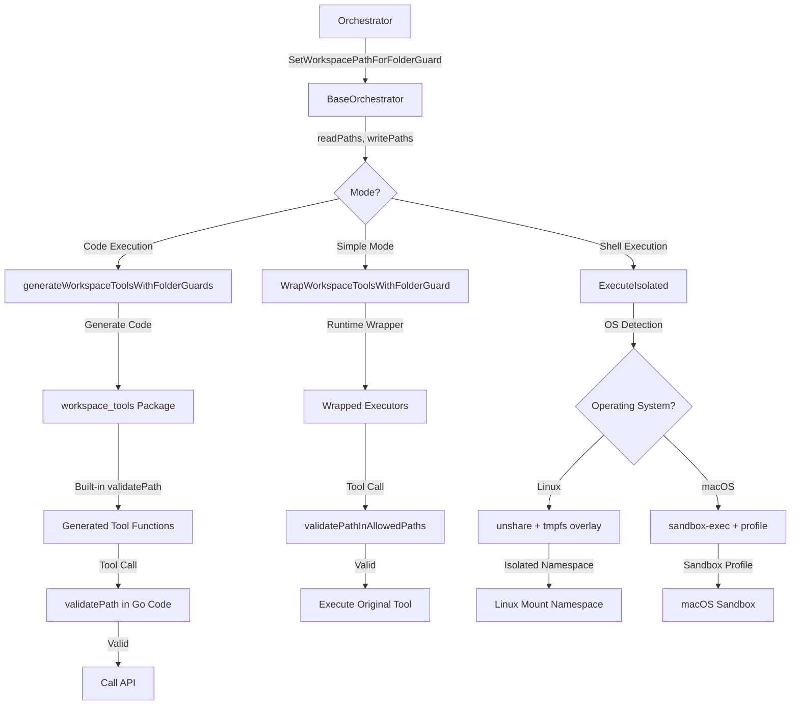

# Folder Guard System & Execution Security

## 📋 Overview

The folder guard system is a **fine-grained access control mechanism** that restricts agent file operations to specific directories. It provides security boundaries for:
1.  **Simple Mode**: Runtime validation of tool parameters.
2.  **Code Execution Mode**: AST-level validation + runtime path checking in generated Go code.
3.  **Shell Execution**: Environment sanitization and filesystem namespace isolation.

**Key Benefits:**
-   Prevents agents from accessing unauthorized directories.
-   Supports separate read and write permission levels.
-   Automatically enhances tool descriptions with access restrictions.
-   Provides defense-in-depth via environment sanitization and OS-level isolation.
-   **Cross-platform**: Works on both Linux (Docker) and macOS (native).

---

## 🔄 How It Works

### 1. Simple Mode (Runtime Validation)
Before tool execution, a wrapper validates all path parameters against allowed lists:
-   **Read Tools**: Access `read_paths` + `write_paths`.
-   **Write Tools**: Access `write_paths` only.
-   **Validation**: Rejects absolute paths outside boundaries and directory traversal patterns (`../`).
-   **Downloads**: The `Downloads/` folder is always accessible (special exception).

### 2. Code Execution Mode (AST + Generated Validation)
-   **AST Validation**: The parser blocks forbidden Go imports (e.g., `os/exec`) and direct OS file calls (e.g., `os.Open`).
-   **Generated Tools**: Tool functions are generated with embedded `validatePath()` calls that check permissions before making API requests.
-   **Path Embedding**: Folder guard paths are compiled into the generated Go code as variables.

### 3. Shell Execution Security
When shell commands are executed, the system applies **three layers of security**:

#### A. Environment Sanitization
Child processes replace inherited environment variables with a strict whitelist to prevent secret leakage (e.g., `DATABASE_URL`, `API_KEYS`).

**Implementation:** `workspace/security/environment.go`
```go
func BuildSafeEnvironment() []string {
    return []string{
        "PATH=/usr/local/sbin:/usr/local/bin:/usr/sbin:/usr/bin:/sbin:/bin",
        "HOME=/tmp",
        "USER=agent",
        "SHELL=/bin/sh",
        "LANG=C.UTF-8",
        "LC_ALL=C.UTF-8",
    }
}
```

#### B. Filesystem Isolation (Linux)
**Platform:** Docker containers with `unshare -m` and mount namespaces

**Strategy:** Hide workspace with tmpfs overlay, then selectively expose allowed paths

**Implementation:** `workspace/security/isolator.go` - `generateMountScript()`

1.  **Preserve Original**: Bind mount workspace to temp location (`/tmp/workspace-original-$$`)
2.  **Hide Workspace**: Mount tmpfs overlay on workspace directory (blocks all access)
3.  **Expose Read Paths**: Bind mount from temp location (read-only, `-o ro`)
4.  **Expose Write Paths**: Bind mount from temp location (read-write)
5.  **Downloads Exception**: Always bind mount Downloads folder

**Security Properties:**
- ✅ **Read Isolation**: Forbidden paths are completely invisible (not just read-protected)
- ✅ **Write Protection**: Read-only paths cannot be modified
- ✅ **Namespace Privacy**: Mounts are private and don't affect host or other processes

#### C. Filesystem Isolation (macOS)
**Platform:** macOS native using `sandbox-exec`

**Strategy:** Deny all workspace access by default, then selectively allow specific paths

**Implementation:** `workspace/security/isolator.go` - `generateSandboxProfile()`

1.  **Default Deny**: `(deny file-read* file-write*)` for entire workspace
2.  **Allow Read Paths**: `(allow file-read*)` for configured read paths
3.  **Allow Write Paths**: `(allow file-read* file-write*)` for configured write paths
4.  **Downloads Exception**: Always allow read+write for Downloads folder

**Security Properties:**
- ✅ **Kernel-Level Enforcement**: macOS Sandbox enforces restrictions at kernel level
- ✅ **Read+Write Isolation**: Both read and write access denied by default
- ✅ **Fine-Grained Control**: Per-path permissions using subpath rules

---

## 🏗️ Architecture



---

## 🧩 Example Usage

### Setting Up Folder Guard
**File:** `controller.go`

```go
// Set folder guard paths for execution agent
baseWorkspacePath := hcpo.GetWorkspacePath()
executionPath := fmt.Sprintf("%s/execution", baseWorkspacePath)
learningsPath := fmt.Sprintf("%s/learnings", baseWorkspacePath)

// Read paths: learnings (read-only)
readPaths := []string{learningsPath}

// Write paths: execution (read + write)
writePaths := []string{executionPath}

// Configure folder guard (applies to simple, code-exec, and shell)
hcpo.SetWorkspacePathForFolderGuard(readPaths, writePaths)
```

### Docker Configuration for Shell Isolation (Linux)
To support `unshare -m` in Docker, the container requires:

**docker-compose.yml:**
```yaml
workspace-api:
  cap_add:
    - SYS_ADMIN  # Required for unshare and mount operations
  security_opt:
    - apparmor:unconfined  # Allow mount operations in namespace
```

### macOS Native Support
No special configuration required! The system automatically uses `sandbox-exec` on macOS:
- ✅ Works natively on macOS (no Docker needed)
- ✅ Automatic OS detection
- ✅ Kernel-level security enforcement

---

## ⚙️ Configuration & Constraints

### Tool Classification
| Tool Type | Allowed Paths |
| :--- | :--- |
| **Read Tools** | `readPaths` + `writePaths` (combined) |
| **Write Tools** | `writePaths` only |
| **Shell Tools** | Environment sanitized + Filesystem isolated |

### Security Constraints
✅ **Allowed:**
-   Paths within configured `readPaths` (read-only access).
-   Paths within configured `write_paths` (read+write access).
-   `Downloads/` folder (always accessible for read+write).
-   Relative paths resolved against workspace root.

❌ **Forbidden:**
-   **Read access** to paths outside configured boundaries (returns "file not found").
-   **Write access** to paths outside `writePaths` (returns "permission denied").
-   Directory traversal patterns (`../`).
-   Direct `os` file operations in Code Execution mode.
-   Accessing secrets via `env` or `printenv` in shell.

### Platform Support
| Platform | Isolation Method | Read Isolation | Write Isolation | Status |
| :--- | :--- | :---: | :---: | :---: |
| **Linux (Docker)** | `unshare -m` + tmpfs | ✅ | ✅ | Fully Tested |
| **macOS (Native)** | `sandbox-exec` | ✅ | ✅ | Fully Tested |
| **Windows** | Not Supported | ❌ | ❌ | Future Work |

---

## 🧪 Testing

### Unit Tests
**Location:** `workspace/security/isolator_test.go`

```bash
cd workspace
go test -v ./security/...
```

**Tests:**
- ✅ `TestIsolatorOSDetection` - OS detection (Linux vs macOS)
- ✅ `TestMacOSSandboxProfile` - Sandbox profile generation
- ✅ `TestEnvironmentIsolation` - Environment sanitization
- ✅ `TestMacOSSandboxIsolation` - macOS sandbox execution
- ✅ `TestLinuxMountIsolation` - Linux mount namespace (Docker only)
- ✅ `TestDownloadsFolderException` - Downloads folder exception

### E2E Integration Tests
**Location:** `agent_go/cmd/testing/shell_security.go`

```bash
cd agent_go
go run main.go test shell-security
```

**Test Suites:**
1. **Environment Isolation** - No secrets leaked
2. **Folder Guard Filesystem Isolation** - Forbidden paths blocked
3. **Downloads Folder Exception** - Always accessible
4. **Additional Security Validations** - Directory traversal, timeouts
5. **Command Parameters** - Args, working directory, shell features

---

## 🛠️ Common Issues & Solutions

| Issue | Cause | Solution |
| :--- | :--- | :--- |
| `path is outside boundaries` | Path not in configured lists | Add path to `readPaths` or `writePaths` in orchestrator. |
| `path rejected` (Code Exec) | Paths set AFTER registry update | Call `SetFolderGuardPaths()` BEFORE `UpdateCodeExecutionRegistry()`. |
| Shell command sees no secrets | Expected behavior (security feature) | Use specific tools or pass data via arguments if needed. |
| `unshare: Operation not permitted` (macOS) | Using Linux-only command on macOS | Automatic - system now uses `sandbox-exec` on macOS. |
| Namespace isolation fails (Docker) | Missing Docker privileges | Ensure `SYS_ADMIN` capability and `apparmor:unconfined` in docker-compose.yml. |
| macOS sandbox blocks system files | Overly restrictive profile | System files (`/usr`, `/bin`, etc.) are allowed by default via `(allow default)`. |

---

## 🔐 Security Properties

### Defense in Depth
The folder guard system provides **multiple layers of security**:

1. **Tool Description Enhancement**: LLM sees clear restrictions in tool descriptions
2. **Runtime Validation**: Paths validated before API calls (Simple mode)
3. **AST Validation**: Code execution mode blocks direct OS calls
4. **Environment Sanitization**: No secrets leaked to subprocesses
5. **OS-Level Isolation**: Kernel-enforced filesystem restrictions

### Threat Model
**Protected Against:**
- ✅ Unauthorized file reads (credential theft, data exfiltration)
- ✅ Unauthorized file writes (data corruption, code injection)
- ✅ Environment variable leakage (API keys, database passwords)
- ✅ Directory traversal attacks (`../../../etc/passwd`)
- ✅ Agent confusion about allowed paths (clear tool descriptions)

**Not Protected Against:**
- ❌ Code execution vulnerabilities in workspace tools themselves
- ❌ Time-of-check-time-of-use (TOCTOU) races (paths validated once at call time)
- ❌ Resource exhaustion (disk space, CPU, memory)

### Audit Trail
Shell executions with folder guard enabled log:
```
[DEBUG] Folder guard enabled for shell execution - Read: [...], Write: [...]
```

Search for this in orchestrator logs to verify folder guard is being applied.

---

## 📖 Implementation Details

### Key Files
| File | Purpose |
| :--- | :--- |
| `workspace/security/isolator.go` | Platform-specific isolation implementations |
| `workspace/security/environment.go` | Environment sanitization (no mcpagent dependency) |
| `workspace/handlers/shell.go` | Shell execution with folder guard integration |
| `agent_go/pkg/orchestrator/base_orchestrator_folder_guard.go` | Orchestrator integration |
| `agent_go/cmd/server/virtual-tools/workspace_tools.go` | Virtual tool wrapper with context injection |

### Context Flow
Folder guard paths flow through the system via Go context:
```go
// Orchestrator injects paths
ctx = context.WithValue(ctx, FolderGuardReadPathsKey, readPaths)
ctx = context.WithValue(ctx, FolderGuardWritePathsKey, writePaths)

// Virtual tools extract paths
readPaths := ctx.Value(FolderGuardReadPathsKey).([]string)
writePaths := ctx.Value(FolderGuardWritePathsKey).([]string)

// Workspace API receives paths in request
requestBody["folder_guard"] = map[string]interface{}{
    "enabled":     true,
    "read_paths":  readPaths,
    "write_paths": writePaths,
}
```

---

## 📖 Related Documentation

-   [Code Execution Mode](./code_execution_mode.md)
-   [Workflow Orchestrator](./workflow_orchestrator.md)
-   [Security Policy](../SECURITY.md) - Repository and secret scanning details
-   [Testing Guide](../agent_go/cmd/testing/) - E2E test suite
