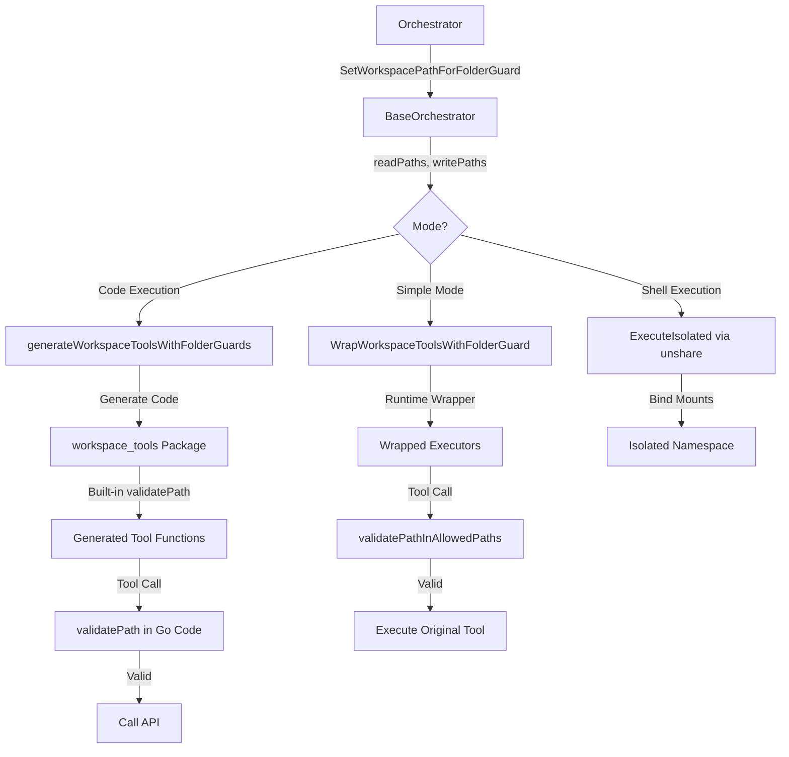

# Folder Guard System & Execution Security

## 📋 Overview

The folder guard system is a **fine-grained access control mechanism** that restricts agent file operations to specific directories. It provides security boundaries for:
1.  **Simple Mode**: Runtime validation of tool parameters.
2.  **Code Execution Mode**: AST-level validation + runtime path checking in generated Go code.
3.  **Shell Execution**: Environment sanitization and filesystem namespace isolation.

**Key Benefits:**
-   Prevents agents from accessing unauthorized directories.
-   Supports separate read and write permission levels.
-   Automatically enhances tool descriptions with access restrictions.
-   Provides defense-in-depth via environment sanitization and kernel-level mount namespaces.

---

## 🔄 How It Works

### 1. Simple Mode (Runtime Validation)
Before tool execution, a wrapper validates all path parameters against allowed lists:
-   **Read Tools**: Access `read_paths` + `write_paths`.
-   **Write Tools**: Access `write_paths` only.
-   **Validation**: Rejects absolute paths outside boundaries and directory traversal patterns (`../`).
-   **Downloads**: The `Downloads/` folder is always accessible (special exception).

### 2. Code Execution Mode (AST + Generated Validation)
-   **AST Validation**: The parser blocks forbidden Go imports (e.g., `os/exec`) and direct OS file calls (e.g., `os.Open`).
-   **Generated Tools**: Tool functions are generated with embedded `validatePath()` calls that check permissions before making API requests.
-   **Path Embedding**: Folder guard paths are compiled into the generated Go code as variables.

### 3. Shell Execution Security
When shell commands are executed, the system applies two additional layers of security:

#### A. Environment Sanitization
Child processes replace inherited environment variables with a strict whitelist to prevent secret leakage (e.g., `DATABASE_URL`, `API_KEYS`).
```go
func buildSafeEnvironment() []string {
    return []string{
        "PATH=/usr/local/sbin:/usr/local/bin:/usr/sbin:/usr/bin:/sbin:/bin",
        "HOME=/tmp",
        "USER=agent",
        "SHELL=/bin/sh",
        "LANG=C.UTF-8",
        "LC_ALL=C.UTF-8",
    }
}
```

#### B. Filesystem Namespace Isolation
For Linux environments, the system uses mount namespaces (`unshare -m`) to isolate the command's view of the filesystem:
1.  **Read-Only Remount**: The workspace root is remounted as read-only.
2.  **Bind Mounts**: Configured `write_paths` and the `Downloads/` folder are selectively bind-mounted as read-write.
3.  **Propagation**: Mounts are private and do not affect the host or other processes.

---

## 🏗️ Architecture



---

## 🧩 Example Usage

### Setting Up Folder Guard
**File:** `controller.go`

```go
// Set folder guard paths for execution agent
baseWorkspacePath := hcpo.GetWorkspacePath()
executionPath := fmt.Sprintf("%s/execution", baseWorkspacePath)
learningsPath := fmt.Sprintf("%s/learnings", baseWorkspacePath)

// Read paths: learnings (read-only)
readPaths := []string{learningsPath}

// Write paths: execution (read + write)
writePaths := []string{executionPath}

// Configure folder guard (applies to simple, code-exec, and shell)
hcpo.SetWorkspacePathForFolderGuard(readPaths, writePaths)
```

### Docker Configuration for Shell Isolation
To support `unshare -m`, the container requires:
-   **Capabilities**: `SYS_ADMIN`
-   **Security Opt**: `apparmor:unconfined`

---

## ⚙️ Configuration & Constraints

### Tool Classification
| Tool Type | Allowed Paths |
| :--- | :--- |
| **Read Tools** | `readPaths` + `writePaths` (combined) |
| **Write Tools** | `writePaths` only |
| **Shell Tools** | Environment sanitized + Namespace isolated |

### Constraints
✅ **Allowed:**
-   Paths within configured `readPaths` (read-only).
-   Paths within configured `write_paths` (read/write).
-   `Downloads/` folder (always accessible).
-   Relative paths resolved against workspace root.

❌ **Forbidden:**
-   Paths outside configured boundaries.
-   Directory traversal patterns (`../`).
-   Direct `os` file operations in Code Execution mode.
-   Accessing secrets via `env` or `printenv` in shell.

---

## 🛠️ Common Issues & Solutions

| Issue | Cause | Solution |
| :--- | :--- | :--- |
| `path is outside boundaries` | Path not in configured lists | Add path to `readPaths` or `writePaths` in orchestrator. |
| `path rejected` (Code Exec) | Paths set AFTER registry update | Call `SetFolderGuardPaths()` BEFORE `UpdateCodeExecutionRegistry()`. |
| Shell command sees no secrets | Expected behavior | Use specific tools or pass secrets explicitly via arguments if required. |
| Namespace isolation fails | Missing Docker privileges | Ensure `SYS_ADMIN` capability is added to the container. |

---

## 📖 Related Documentation

-   [Code Execution Mode](./code_execution_mode.md)
-   [Workflow Orchestrator](./workflow_orchestrator.md)
-   [Security Policy](../SECURITY.md) - Repository and secret scanning details