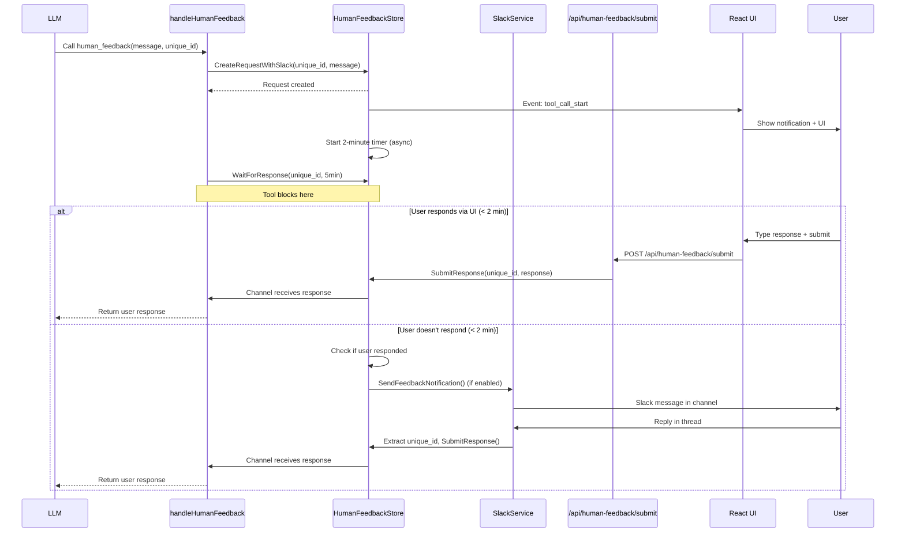

# Human Feedback System

## 📋 Overview

The human feedback system is an interactive virtual tool that pauses LLM execution to request real-time input from users, enabling human-in-the-loop workflows. It provides browser notifications, real-time UI updates, and optional Slack integration for seamless feedback collection. The system supports 2FA/OTP input, confirmations, and clarifying questions through a thread-safe request/response coordination system.

**Key Benefits:**
- Enables human-in-the-loop workflows for critical decisions
- Supports 2FA/OTP input, confirmations, and clarifying questions
- Real-time notifications via browser push notifications
- Optional Slack integration with smart delayed notifications (2-minute delay)
- Thread-safe request/response coordination with timeout handling
- Respond via Slack threads or UI (no UI required for Slack responses)
- Integrates seamlessly with event-driven architecture

---

## 📁 Key Files & Locations

| Component | File | Key Functions |
|-----------|------|---------------|
| **Virtual Tool** | [`human_tools.go`](../agent_go/cmd/server/virtual-tools/human_tools.go) | `CreateHumanTools()`, `handleHumanFeedback()` |
| **Backend Store** | [`human_feedback_store.go`](../agent_go/cmd/server/virtual-tools/human_feedback_store.go) | `CreateRequest()`, `CreateRequestWithSlack()`, `SubmitResponse()`, `WaitForResponse()`, `Cleanup()` |
| **API Endpoint** | [`server.go`](../agent_go/cmd/server/server.go) | `handleSubmitHumanFeedback()` (POST `/api/human-feedback/submit`) |
| **Slack Service** | [`slack_service.go`](../agent_go/cmd/server/services/slack_service.go) | `SendFeedbackNotification()`, `GetUniqueIDFromThread()`, `TestConnection()` |
| **Slack API Routes** | [`slack_feedback_routes.go`](../agent_go/cmd/server/slack_feedback_routes.go) | Configuration and test endpoints |
| **Database Migration** | [`010_add_slack_feedback_config.sql`](../agent_go/pkg/database/migrations/010_add_slack_feedback_config.sql) | Slack config and message mapping tables |
| **Frontend UI** | [`HumanFeedbackToolCallDisplay.tsx`](../frontend/src/components/events/tools/ToolCallSpecialRender/HumanFeedbackToolCallDisplay.tsx) | `HumanFeedbackToolCallDisplay` component |
| **Slack Config UI** | [`SlackFeedbackConfig.tsx`](../frontend/src/components/settings/SlackFeedbackConfig.tsx) | Configuration component |
| **API Service** | [`api.ts`](../frontend/src/services/api.ts) | `submitHumanFeedback()`, `getSlackFeedbackConfig()`, `updateSlackFeedbackConfig()`, `testSlackConnection()` |
| **Event Data Structures** | [`data.go`](../agent_go/pkg/events/data.go) | `BlockingHumanFeedbackEvent`, `RequestHumanFeedbackEvent` |
| **Orchestrator Helpers** | [`base_orchestrator.go`](../agent_go/pkg/orchestrator/base_orchestrator.go) | `RequestHumanFeedback()`, `RequestYesNoFeedback()`, `RequestMultipleChoiceFeedback()` |

---

## 🔄 How It Works

### Core System Lifecycle

1. **Tool Registration**
   - `CreateHumanTools()` defines the `human_feedback` virtual tool
   - Tool requires: `{"message_for_user": string, "unique_id": string (UUID)}`
   - Executor: `handleHumanFeedback()` function

2. **LLM Invokes Tool**
   - LLM calls `human_feedback` with message and unique UUID
   - `handleHumanFeedback()` receives the call

3. **Backend Request Creation**
   - Global `HumanFeedbackStore` singleton creates request entry
   - Store maps `unique_id` → `HumanFeedbackRequest` struct
   - Creates channel (`chan string`) for response coordination
   - If Slack enabled, starts 2-minute delayed notification timer

4. **Frontend Notification**
   - Event system automatically notifies frontend
   - `HumanFeedbackToolCallDisplay` component renders
   - Browser push notification shown (if permissions granted)
   - UI displays message + text input + submit button

5. **Slack Notification (Optional, Delayed)**
   - If Slack enabled and user hasn't responded within 2 minutes
   - System checks if user already responded
   - If no response, sends Slack notification to configured channel
   - Message includes question, context, and unique request ID
   - Maps Slack message timestamp to unique ID for thread replies

6. **User Response**
   - User responds via UI (types response, clicks "Submit Feedback" or Ctrl/Cmd+Enter)
   - OR user replies in Slack thread
   - Frontend sends POST to `/api/human-feedback/submit` (UI path)
   - OR Slack Events API sends webhook to backend (Slack path)
   - Backend verifies Slack webhook signature and extracts unique ID from thread

7. **Backend Coordination**
   - Response written to channel
   - `WaitForResponse()` unblocks with user's response
   - `handleHumanFeedback()` returns response to LLM

8. **LLM Continuation**
   - LLM receives user response as tool output
   - Execution continues in same turn with user input

### Timeout Handling

- Default timeout: **5 minutes** (tool executor)
- Orchestrator helpers: **10 minutes**
- On timeout: Returns error, LLM handles gracefully

### Delayed Notification Logic

The Slack integration uses smart delayed notifications:
1. **Immediate**: Feedback request appears in UI right away
2. **2-Minute Delay**: System waits 2 minutes before sending Slack notification
3. **Response Check**: Before sending, system checks if user already responded
4. **Conditional Send**: Only sends Slack notification if user hasn't responded
5. **Non-Blocking**: All notification logic runs asynchronously

---

## 🏗️ Architecture



---

## 🧩 Example Usage

### LLM Tool Call

```json
{
  "tool_name": "human_feedback",
  "arguments": {
    "message_for_user": "Please enter the 2FA code sent to your email",
    "unique_id": "550e8400-e29b-41d4-a716-446655440000"
  }
}
```

### Backend Tool Handler

**File:** [`human_tools.go`](../agent_go/cmd/server/virtual-tools/human_tools.go)

```go
func handleHumanFeedback(ctx context.Context, args map[string]interface{}) (string, error) {
    messageForUser := args["message_for_user"].(string)
    uniqueID := args["unique_id"].(string)
    
    feedbackStore := GetHumanFeedbackStore()
    
    if err := feedbackStore.CreateRequestWithSlack(ctx, uniqueID, messageForUser, "", nil); err != nil {
        return "", fmt.Errorf("failed to create feedback request: %w", err)
    }
    
    response, err := feedbackStore.WaitForResponse(uniqueID, 5*time.Minute)
    if err != nil {
        return "", fmt.Errorf("failed to get user feedback: %w", err)
    }
    
    return response, nil
}
```

### Orchestrator Helper Functions

**File:** [`base_orchestrator.go`](../agent_go/pkg/orchestrator/base_orchestrator.go)

```go
// Request human feedback with text input
approved, feedback, err := orchestrator.RequestHumanFeedback(
    ctx,
    "approval_123",
    "Please approve this plan",
    "Additional context",
    sessionID,
    workflowID,
)

// Request yes/no feedback
approved, err := orchestrator.RequestYesNoFeedback(
    ctx,
    "yesno_456",
    "Do you want to proceed?",
    "Approve",
    "Reject",
    "",
    sessionID,
    workflowID,
)

// Request multiple choice feedback
choice, err := orchestrator.RequestMultipleChoiceFeedback(
    ctx,
    "choice_789",
    "Select deployment environment",
    []string{"Development", "Staging", "Production"},
    "",
    sessionID,
    workflowID,
)
```

---

## ⚙️ Configuration

### Tool Parameters

| Parameter | Type | Required | Description |
|-----------|------|----------|-------------|
| `message_for_user` | string | Yes | Message displayed to the user requesting feedback |
| `unique_id` | string | Yes | Unique UUID identifying this request |

### Timeout Configuration

| Component | Timeout | Location |
|-----------|---------|----------|
| Tool executor | `5 * time.Minute` | [`human_tools.go`](../agent_go/cmd/server/virtual-tools/human_tools.go) |
| Orchestrator helpers | `10 * time.Minute` | [`base_orchestrator.go`](../agent_go/pkg/orchestrator/base_orchestrator.go) |
| Browser notification | 30 seconds (auto-close) | Frontend component |

### Slack Configuration

| Setting | Type | Description |
|---------|------|-------------|
| `enabled` | boolean | Whether Slack notifications are enabled |
| `bot_token` | string | Slack bot token (starts with `xoxb-`) |
| `app_token` | string | App-level token for Socket Mode (starts with `xapp-`) |
| `channel_id` | string | Target Slack channel ID (starts with `C`) |
| Notification delay | 2 minutes | Fixed delay before sending Slack notification |

**Configuration Storage:**
- Stored in `slack_feedback_config` database table
- Managed via UI: Sidebar → Slack icon
- API endpoints: `GET/POST /api/human-feedback/slack/config`

### Browser Notifications

**Permissions:**
- Requested on component mount
- Shown when `Notification.permission === 'granted'`
- Properties: Title "Human Feedback Required", body from `message_for_user`, `requireInteraction: true`, `silent: false`

---

## 🛠️ Common Issues & Solutions

| Issue | Cause | Solution |
|-------|-------|----------|
| `timeout waiting for feedback` | User didn't respond within timeout period | Increase timeout in `handleHumanFeedback()` or orchestrator helper functions |
| `feedback request already exists` | Duplicate `unique_id` used | Always generate fresh UUID: `fmt.Sprintf("feedback_%d", time.Now().UnixNano())` |
| Browser notification not showing | Permission denied or not granted | Request permission via button in UI or browser settings |
| Response not received | Frontend submit failed | Check browser console for errors; verify `/api/human-feedback/submit` endpoint accessible |
| Tool blocks forever | Backend store channel deadlock | Check that `SubmitResponse()` is called; review channel handling in `WaitForResponse()` |
| Slack connection test fails | Invalid credentials or scopes | Verify bot token (`xoxb-`), app token (`xapp-`), channel ID (`C`), bot has `chat:write` scope, bot is member of channel |
| Slack notifications not sent | User responded quickly | Expected behavior - notifications only sent if no response after 2 minutes |
| Thread replies not captured | Socket Mode misconfigured | Verify Socket Mode enabled, Events API enabled, `message.channels` event subscribed, App-Level Token has `connections:write` scope, bot has `channels:history` scope |

---

## 🔍 For LLMs: Quick Reference

### Constraints

✅ **Allowed:**
- Any user-facing message (questions, requests for OTP/2FA, confirmations)
- UUID generation for `unique_id` parameter
- Waiting synchronously for user response (blocks LLM execution)
- Multiple feedback requests in sequence (different unique_ids)

❌ **Forbidden:**
- Reusing same `unique_id` for multiple requests
- Not providing `unique_id` (required parameter)
- Empty or missing `message_for_user`
- Expecting instant response (users may take time)

### Example Pattern

**Simple feedback request:**
```json
{
  "tool": "human_feedback",
  "arguments": {
    "message_for_user": "Please confirm the database migration plan before I proceed",
    "unique_id": "feedback_1701234567890"
  }
}
```

**2FA/OTP use case:**
```json
{
  "tool": "human_feedback",
  "arguments": {
    "message_for_user": "Enter the 6-digit verification code sent to your email",
    "unique_id": "otp_1701234567891"
  }
}
```

**LLM receives:**
```
User response: "582491"
```

### Integration with Workflow Agents

**Planning agent pattern:**
```go
// 1. human_feedback - ask user for approval
// 2. Receive yes/no response
// 3. If approved: call update_plan_steps / add_plan_steps / delete_plan_steps
```

**Variable extraction agent pattern:**
```go
// 1. human_feedback - "I detected variable {{API_KEY}}. Should I extract it?"
// 2. User responds: "Yes" or "No"
// 3. If yes: call update_variable tool
// 4. If no: don't modify variables
```

---

## 🔌 API Endpoints

### Submit Human Feedback

**POST** `/api/human-feedback/submit`

**Request:**
```json
{
  "unique_id": "550e8400-e29b-41d4-a716-446655440000",
  "response": "User's feedback text"
}
```

**Response:**
```json
{
  "success": true
}
```

### Slack Configuration

**GET** `/api/human-feedback/slack/config`

**Response:**
```json
{
  "enabled": true,
  "channel_id": "C1234567890",
  "bot_token": "xoxb-...1234",
  "app_token": "xapp-...5678"
}
```

**POST** `/api/human-feedback/slack/config`

**Request:**
```json
{
  "enabled": true,
  "bot_token": "xoxb-...",
  "app_token": "xapp-...",
  "channel_id": "C1234567890"
}
```

**POST** `/api/human-feedback/slack/test`

**Response:**
```json
{
  "success": true,
  "message": "Slack connection test successful!"
}
```

---

## 🔒 Security Model

### Thread Safety

**Global Singleton:**
```go
var (
    globalHumanFeedbackStore *HumanFeedbackStore
    humanFeedbackStoreOnce   sync.Once
)
```

**Mutex Protection:**
- `sync.RWMutex` protects concurrent access to request map and waiters
- Write operations (CreateRequest, SubmitResponse) use `Lock()`
- Read operations (WaitForResponse lookup) use `RLock()`

### Socket Mode Security

- WebSocket connection (no public webhook required)
- App-Level Token separate from Bot Token
- Automatic reconnection handling
- Webhook signature verification for thread replies

### Token Storage

- Tokens stored in database (`slack_feedback_config` table)
- Tokens masked in API responses (last 4 characters only)
- **Recommendation:** Encrypt tokens in production environments

---

## 📊 Database Schema

### `slack_feedback_config` Table

| Column | Type | Description |
|--------|------|-------------|
| `id` | TEXT | Primary key (always 'slack_config') |
| `enabled` | BOOLEAN | Whether Slack notifications are enabled |
| `bot_token` | TEXT | Slack bot token (encrypted in production) |
| `app_token` | TEXT | App-level token for Socket Mode |
| `channel_id` | TEXT | Target Slack channel ID |
| `created_at` | DATETIME | Creation timestamp |
| `updated_at` | DATETIME | Last update timestamp |

### `slack_feedback_messages` Table

| Column | Type | Description |
|--------|------|-------------|
| `id` | TEXT | Primary key |
| `unique_id` | TEXT | Maps to `HumanFeedbackRequest.UniqueID` |
| `slack_message_ts` | TEXT | Slack message timestamp |
| `slack_channel_id` | TEXT | Slack channel ID |
| `slack_thread_ts` | TEXT | Thread timestamp |
| `created_at` | DATETIME | Creation timestamp |

### Data Structures

```go
type HumanFeedbackRequest struct {
    UniqueID       string
    MessageForUser string
    UserResponse   string
    IsCompleted    bool
    CreatedAt      time.Time
}

type HumanFeedbackStore struct {
    requests map[string]*HumanFeedbackRequest
    waiters  map[string]chan string
    mu       sync.RWMutex
}
```

---

## 🚀 Slack Setup Instructions

1. **Create Slack App** at https://api.slack.com/apps
2. **Configure Bot Token Scopes**: `chat:write`, `channels:read`, `channels:history`
3. **Enable Socket Mode**: Generate App-Level Token with `connections:write` scope
4. **Enable Events API**: Subscribe to `message.channels` event
5. **Get Channel ID**: Right-click channel → View channel details
6. **Configure in UI**: Sidebar → Slack icon → Enter tokens and channel ID → Test connection → Save

---

## 📖 Related Documentation

- [Workflow Orchestrator](workflow_orchestrator.md) - Uses human feedback for approvals
- [Todo Creation Human Workflow](step_based_workflow.md) - Uses human feedback for plan approval and variable confirmation
- [Virtual Tools]() - Overview of all virtual tools
- [Event System]() - How events coordinate frontend/backend
