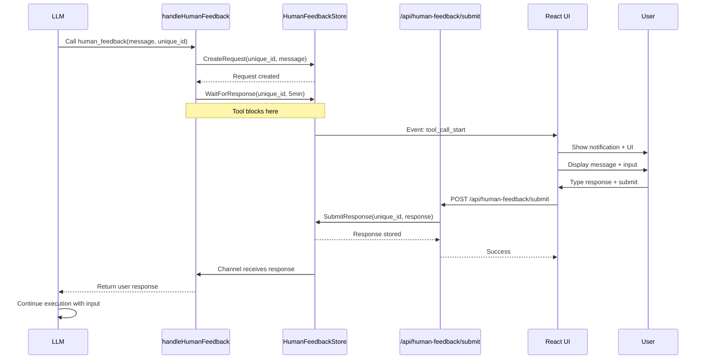

# Human Feedback Tool

## 📋 Overview

The human feedback tool is an **interactive virtual tool** that pauses LLM execution to request real-time input from users. It provides a seamless bridge between autonomous AI agents and human decision-making through browser notifications, real-time UI updates, and a thread-safe request/response system.

**Key Benefits:**
- Enables human-in-the-loop workflows for critical decisions
- Supports 2FA/OTP input, confirmations, and clarifying questions
- Real-time notifications via browser push notifications
- Thread-safe request/response coordination with timeout handling
- Integrates seamlessly with event-driven architecture

---

## 📁 Key Files & Locations

| Component | File | Key Functions |
|-----------|------|---------------|
| **Virtual Tool** | [`human_tools.go`](../agent_go/cmd/server/virtual-tools/human_tools.go) | `CreateHumanTools()`, `handleHumanFeedback()` |
| **Backend Store** | [`human_feedback_store.go`](../agent_go/cmd/server/virtual-tools/human_feedback_store.go) | `CreateRequest()`, `SubmitResponse()`, `WaitForResponse()`, `Cleanup()` |
| **API Endpoint** | [`server.go`](../agent_go/cmd/server/server.go) | `handleSubmitHumanFeedback()` (POST `/api/human-feedback/submit`) |
| **Frontend UI** | [`HumanFeedbackToolCallDisplay.tsx`](../frontend/src/components/events/tools/ToolCallSpecialRender/HumanFeedbackToolCallDisplay.tsx) | `HumanFeedbackToolCallDisplay` component |
| **Event Data Structures** | [`data.go`](../agent_go/pkg/events/data.go) | `BlockingHumanFeedbackEvent`, `RequestHumanFeedbackEvent` |
| **Orchestrator Helpers** | [`base_orchestrator.go`](../agent_go/pkg/orchestrator/base_orchestrator.go) | `RequestHumanFeedback()`, `RequestYesNoFeedback()`, `RequestMultipleChoiceFeedback()` |

---

## 🔄 How It Works

### System Lifecycle

1. **Tool Registration**
   - `CreateHumanTools()` defines the `human_feedback` virtual tool
   - Tool requires: `{"message_for_user": string, "unique_id": string (UUID)}`
   - Executor: `handleHumanFeedback()` function

2. **LLM Invokes Tool**
   - LLM calls `human_feedback` with message and unique UUID
   - `handleHumanFeedback()` receives the call

3. **Backend Request Creation**
   - Global `HumanFeedbackStore` singleton creates request entry
   - Store maps `unique_id` → `HumanFeedbackRequest` struct
   - Creates channel (`chan string`) for response coordination

4. **Frontend Notification**
   - Event system automatically notifies frontend
   - `HumanFeedbackToolCallDisplay` component renders
   - Browser push notification shown (if permissions granted)
   - UI displays message + text input + submit button

5. **User Response**
   - User types response and clicks "Submit Feedback" (or Ctrl/Cmd+Enter)
   - Frontend sends POST to `/api/human-feedback/submit`
   - API calls `feedbackStore.SubmitResponse(uniqueID, response)`

6. **Backend Coordination**
   - Response written to channel
   - `WaitForResponse()` unblocks with user's response
   - `handleHumanFeedback()` returns response to LLM

7. **LLM Continuation**
   - LLM receives user response as tool output
   - Execution continues in same turn with user input

### Timeout Handling

- Default timeout: **5 minutes** (tool executor)
- Orchestrator helpers: **10 minutes**
- On timeout: Returns error, LLM handles gracefully

---

## 🏗️ Architecture



---

## 🧩 Example Usage

### LLM Tool Call

```json
{
  "tool_name": "human_feedback",
  "arguments": {
    "message_for_user": "Please enter the 2FA code sent to your email",
    "unique_id": "550e8400-e29b-41d4-a716-446655440000"
  }
}
```

### Backend Tool Handler

**File:** [`human_tools.go`](../agent_go/cmd/server/virtual-tools/human_tools.go)

```go
func handleHumanFeedback(ctx context.Context, args map[string]interface{}) (string, error) {
    // Extract parameters
    messageForUser := args["message_for_user"].(string)
    uniqueID := args["unique_id"].(string)
    
    // Get global feedback store
    feedbackStore := GetHumanFeedbackStore()
    
    // Create feedback request
    if err := feedbackStore.CreateRequest(uniqueID, messageForUser); err != nil {
        return "", fmt.Errorf("failed to create feedback request: %w", err)
    }
    
    // Wait for user response (blocks execution until user responds or times out)
    response, err := feedbackStore.WaitForResponse(uniqueID, 5*time.Minute)
    if err != nil {
        return "", fmt.Errorf("failed to get user feedback: %w", err)
    }
    
    return response, nil
}
```

### Frontend Submit Handler

**File:** [`HumanFeedbackToolCallDisplay.tsx`](../frontend/src/components/events/tools/ToolCallSpecialRender/HumanFeedbackToolCallDisplay.tsx)

```typescript
const handleSubmit = async () => {
  if (!response.trim()) {
    setError('Please provide a response')
    return
  }

  setIsSubmitting(true)
  setError(null)

  try {
    // Submit response to backend
    const { agentApi } = await import('../../../../services/api')
    await agentApi.submitHumanFeedback(toolParams.unique_id, response.trim())
    setIsSubmitted(true)
  } catch (err) {
    setError(err instanceof Error ? err.message : 'Failed to submit feedback')
  } finally {
    setIsSubmitting(false)
  }
}
```

### Orchestrator Helper Functions

**File:** [`base_orchestrator.go`](../agent_go/pkg/orchestrator/base_orchestrator.go)

```go
// Request human feedback with text input
approved, feedback, err := orchestrator.RequestHumanFeedback(
    ctx,
    "approval_123",
    "Please approve this plan",
    "Additional context",
    sessionID,
    workflowID,
)

// Request yes/no feedback
approved, err := orchestrator.RequestYesNoFeedback(
    ctx,
    "yesno_456",
    "Do you want to proceed?",
    "Approve",    // Yes button label
    "Reject",     // No button label
    "",
    sessionID,
    workflowID,
)

// Request multiple choice feedback
choice, err := orchestrator.RequestMultipleChoiceFeedback(
    ctx,
    "choice_789",
    "Select deployment environment",
    []string{"Development", "Staging", "Production"},
    "",
    sessionID,
    workflowID,
)
```

---

## ⚙️ Configuration

### Tool Parameters

| Parameter | Type | Required | Description |
|-----------|------|----------|-------------|
| `message_for_user` | string | Yes | Message displayed to the user requesting feedback |
| `unique_id` | string | Yes | Unique UUID identifying this request (e.g., "550e8400-e29b-41d4-a716-446655440000") |

### Timeout Configuration

**Backend:**
- Tool executor: `5 * time.Minute` (default, hardcoded)
- Orchestrator helpers: `10 * time.Minute` (default, hardcoded)

**Frontend:**
- Browser notification auto-close: 30 seconds
- No explicit timeout on UI (waits for backend timeout)

### Browser Notifications

**Permissions:**
- Requested on component mount
- Shown when `Notification.permission === 'granted'`
- Notification properties:
  - Title: "Human Feedback Required"
  - Body: `message_for_user`
  - Icon: `/favicon.ico`
  - `requireInteraction: true` (doesn't auto-dismiss)
  - `silent: false` (plays notification sound)

---

## 🛠️ Common Issues & Solutions

| Issue | Cause | Solution |
|-------|-------|----------|
| `timeout waiting for feedback` | User didn't respond within timeout period | Increase timeout in `handleHumanFeedback()` or orchestrator helper functions |
| `feedback request already exists` | Duplicate `unique_id` used | Always generate fresh UUID for each request using `fmt.Sprintf("feedback_%d", time.Now().UnixNano())` |
| Browser notification not showing | Permission denied or not granted | Request permission via button in UI or browser settings |
| Response not received | Frontend submit failed | Check browser console for errors; verify `/api/human-feedback/submit` endpoint accessible |
| Tool blocks forever | Backend store channel deadlock | Check that `SubmitResponse()` is called; review channel handling in `WaitForResponse()` |
| `failed to create feedback request` | Request already active or cleanup issue | Call `Cleanup()` for old requests; ensure unique `unique_id` |

---

## 🔍 For LLMs: Quick Reference

### Constraints

✅ **Allowed:**
- Any user-facing message (questions, requests for OTP/2FA, confirmations)
- UUID generation for `unique_id` parameter
- Waiting synchronously for user response (blocks LLM execution)
- Multiple feedback requests in sequence (different unique_ids)

❌ **Forbidden:**
- Reusing same `unique_id` for multiple requests
- Not providing `unique_id` (required parameter)
- Empty or missing `message_for_user`
- Expecting instant response (users may take time)

### Example Pattern

**Simple feedback request:**
```json
{
  "tool": "human_feedback",
  "arguments": {
    "message_for_user": "Please confirm the database migration plan before I proceed",
    "unique_id": "feedback_1701234567890"
  }
}
```

**LLM receives:**
```
User response: "Approved, proceed with migration"
```

**2FA/OTP use case:**
```json
{
  "tool": "human_feedback",
  "arguments": {
    "message_for_user": "Enter the 6-digit verification code sent to your email",
    "unique_id": "otp_1701234567891"
  }
}
```

**LLM receives:**
```
User response: "582491"
```

### Integration with Workflow Agents

**Planning agent must ask before modifying plan:**
```go
// System prompt emphasizes: ALWAYS use human_feedback before calling plan modification tools
// 1. human_feedback - ask user for approval
// 2. Receive yes/no response
// 3. If approved: call update_plan_steps / add_plan_steps / delete_plan_steps
```

**Variable extraction agent pattern:**
```go
// 1. human_feedback - "I detected variable {{API_KEY}}. Should I extract it?"
// 2. User responds: "Yes" or "No"
// 3. If yes: call update_variable tool
// 4. If no: don't modify variables
```

---

## 📖 Related Documentation

- [Todo Creation Human Workflow](todo_creation_human_workflow.md) - Uses human feedback for plan approval and variable confirmation
- [Virtual Tools]() - Overview of all virtual tools
- [Event System]() - How events coordinate frontend/backend

---

## 🔒 Security Model

### Thread Safety

**Global Singleton:**
```go
var (
    globalHumanFeedbackStore *HumanFeedbackStore
    humanFeedbackStoreOnce   sync.Once
)
```

**Mutex Protection:**
- `sync.RWMutex` protects concurrent access to request map and waiters
- Write operations (CreateRequest, SubmitResponse) use `Lock()`
- Read operations (WaitForResponse lookup) use `RLock()`

### Request Lifecycle

1. **Creation:** `CreateRequest()` checks for duplicates, creates channel
2. **Waiting:** `WaitForResponse()` blocks on channel with timeout
3. **Submission:** `SubmitResponse()` validates request exists, writes to channel
4. **Cleanup:** `Cleanup()` removes old requests (optional, based on age)

### Data Structure

```go
type HumanFeedback Request struct {
    UniqueID       string
    MessageForUser string
    UserResponse   string
    IsCompleted    bool
    CreatedAt      time.Time
}

type HumanFeedbackStore struct {
    requests map[string]*HumanFeedbackRequest  // Request storage
    waiters  map[string]chan string             // Response channels
    mu       sync.RWMutex                       // Thread safety
}
```

---

## 📊 Design Rationale

### Why Virtual Tool Instead of MCP Tool?

**Problem:** Human feedback requires frontend UI integration that MCP servers can't provide.

**Solution:** Virtual tool executed locally with direct access to event system and frontend.

### Why Singleton Store?

**Problem:** Multiple agents/goroutines may request feedback simultaneously.

**Solution:** Global singleton with mutex ensures thread-safe coordination across all requests.

### Why Channel-Based Coordination?

**Problem:** Need to block tool execution until user responds (synchronous from LLM perspective).

**Solution:** Go channels naturally support blocking with timeout via `select` + `context.WithTimeout`.

### Why UUID Requirement?

**Problem:** Multiple feedback requests may be active simultaneously (parallel agents).

**Solution:** Unique IDs prevent conflicts and allow specific request/response matching.

### Why Browser Notifications?

**Problem:** Users may not be actively watching the UI when feedback is requested.

**Solution:** Push notifications alert users immediately, improving response time.

---

## 🎯 Common Workflow Patterns

### Pattern 1: 2FA/OTP Input

```go
// LLM needs 2FA code from user
response, err := agent.CallTool("human_feedback", map[string]interface{}{
    "message_for_user": "Enter the 2FA code from your authenticator app",
    "unique_id":        fmt.Sprintf("2fa_%d", time.Now().UnixNano()),
})
// Returns: "825491"
// LLM proceeds with 2FA code
```

### Pattern 2: Plan Approval (Workflow Orchestrators)

```go
// Planning agent asks for plan approval
approved, feedback, err := orchestrator.RequestHumanFeedback(
    ctx,
    fmt.Sprintf("plan_approval_%d", time.Now().UnixNano()),
    "Please review and approve the generated plan",
    "",
    sessionID,
    workflowID,
)
if approved {
    // User clicked "Approve" button
    proceedToExecution()
} else {
    // User provided revision feedback
    revisePlan(feedback)
}
```

### Pattern 3: Yes/No Decision

```go
// Orchestrator asks simple yes/no question
approved, err := orchestrator.RequestYesNoFeedback(
    ctx,
    fmt.Sprintf("deploy_confirmation_%d", time.Now().UnixNano()),
    "Deploy to production environment?",
    "Deploy",
    "Cancel",
    "",
    sessionID,
    workflowID,
)
```

### Pattern 4: Multiple Choice

```go
// Orchestrator offers multiple options
choice, err := orchestrator.RequestMultipleChoiceFeedback(
    ctx,
    fmt.Sprintf("env_selection_%d", time.Now().UnixNano()),
    "Select target environment",
    []string{"Development", "Staging", "Production"},
    "",
    sessionID,
    workflowID,
)
// Returns: "option0", "option1", or "option2"
```

---

## 🔧 Advanced Features

### Cleanup Mechanism

**File:** [`human_feedback_store.go`](../agent_go/cmd/server/virtual-tools/human_feedback_store.go)

```go
// Remove requests older than maxAge
feedbackStore.Cleanup(24 * time.Hour)
```

**Cleanup logic:**
- Removes completed requests older than threshold
- Closes associated channels
- Prevents memory leaks from abandoned requests

### Keyboard Shortcuts

**Frontend:** Ctrl/Cmd+Enter to submit
```typescript
const handleKeyDown = (e: React.KeyboardEvent<HTMLTextAreaElement>) => {
  if ((e.ctrlKey || e.metaKey) && e.key === 'Enter') {
    e.preventDefault()
    if (!isSubmitting && !isSubmitted && response.trim()) {
      handleSubmit()
    }
  }
}
```

### Event Integration

**Two event types:**

1. **`BlockingHumanFeedbackEvent`** - Orchestrator-level blocking (yes/no, multiple choice)
2. **`tool_call_start` with `human_feedback`** - Tool-level feedback (LLM direct call)

Both trigger frontend UI rendering but via different code paths.

---

## 📝 API Reference

### Virtual Tool Executor

**Function:** `handleHumanFeedback(ctx context.Context, args map[string]interface{}) (string, error)`

**Parameters:**
- `args["message_for_user"]` - Message to display
- `args["unique_id"]` - Unique request identifier

**Returns:**
- User's response as string
- Error if timeout or request creation fails

### HTTP Endpoint

**Route:** `POST /api/human-feedback/submit`

**Request Body:**
```json
{
  "unique_id": "550e8400-e29b-41d4-a716-446655440000",
  "response": "User's feedback text"
}
```

**Response:**
```json
{
  "success": true
}
```

### Store Methods

```go
// Create new feedback request
func (s *HumanFeedbackStore) CreateRequest(uniqueID, message string) error

// Submit user response
func (s *HumanFeedbackStore) SubmitResponse(uniqueID, response string) error

// Wait for response (blocking)
func (s *HumanFeedbackStore) WaitForResponse(uniqueID string, timeout time.Duration) (string, error)

// Cleanup old requests
func (s *HumanFeedbackStore) Cleanup(maxAge time.Duration)
```

---

## 🧪 Testing Considerations

**Backend:**
- Test timeout behavior (user doesn't respond within 5 minutes)
- Test concurrent requests (multiple unique_ids simultaneously)
- Test duplicate `unique_id` rejection
- Test cleanup of old requests

**Frontend:**
- Test notification permission states (granted, denied, default)
- Test submit with empty response (should show error)
- Test keyboard shortcut (Ctrl/Cmd+Enter)
- Test UI state transitions (idle → submitting → submitted)

**Integration:**
- Test full round-trip (LLM → backend → frontend → backend → LLM)
- Test timeout from LLM perspective (receives error message)
- Test event emission and UI rendering
