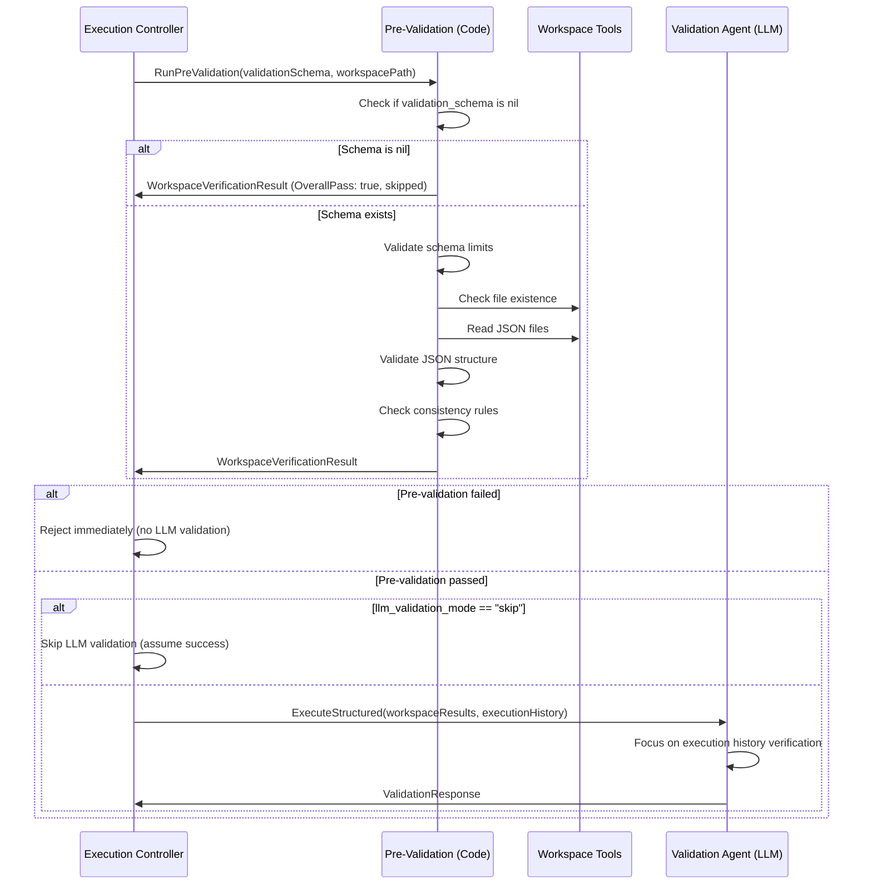

# Learning & Validation Architecture: Explore vs. Exploit

This document outlines the workflow for learning stabilization, model optimization, and validation strategies in the orchestrator.

## 🔄 Core Learning Loop

### 1. Pre-Execution: Step Hash Guard
- **Action:** Calculate SHA256 of step definition (Title, Desc, Criteria, Deps).
- **Logic:** If hash mismatches the stored `StepHash`, the plan has changed.
- **Result:** 
    - Reset all stable run counters (`successful_runs_simple`, `successful_runs_medium`, `successful_runs_complex` → 0)
    - Set `LockLearnings = false` (Unlock) to restart the learning process for the new requirements
    - This ensures a fresh start when step requirements change

### 2. Execution Mode Selection

#### Mode A: UNLOCKED (Learning Phase)
- **Learning Activity:**
    - **Learning Agent:** **RUNS** after execution to extract new patterns.
- **Existing Learnings:** **ALWAYS LOADED** into system prompt if they exist (via `LoadStepLearningHistory()`).
- **Locking Decision (TurnCount-Based):**
    - Based on `TurnCount` (complexity) of successful executions:
        - **Simple (< 100 turns):** Lock after **3** successful runs.
        - **Medium (100-200 turns):** Lock after **5** successful runs.
        - **Complex (> 200 turns):** Lock after **10** successful runs.
    - *Successful run* means validation passed (success criteria met).
    - Locking is automatic after reaching the threshold for the complexity level.

#### Mode B: LOCKED (Optimized Phase)
- **Learning Activity:**
    - **Learning Agent:** **NOT CALLED**. No new patterns are extracted.
- **Existing Learnings:** **STILL LOADED** into system prompt if they exist (via `LoadStepLearningHistory()`).
- **Trigger to Unlock:** If validation fails while locked, the system automatically unlocks to trigger re-learning.
    - **Metadata Update:** `AutoUnlockReason = "validation_failed"`.
    - **Behavior:** Ensures the agent can learn from the failure and refine its approach.

---

## 🛡️ Validation Architecture

The system supports flexible validation strategies to balance reliability and speed/cost. This is controlled by the `llm_validation_mode` setting in the step configuration.

### Validation Modes

1. **Skip (Default)**: Trust pre-validation.
   - **Logic:** Skips LLM validation if code-based pre-validation passes.
   - **Benefit:** Fast validation - pre-validation handles structural checks, no LLM token cost.
   - **Use Case:** Most steps where file existence/structure checks via `validation_schema` are sufficient.

2. **Auto**: Smart validation based on stability.
   - **Logic:** Runs LLM validation for the first **3 successful executions**.
   - **Optimization:** Once a step has 3 successful runs (sum of `successful_runs_simple` + `successful_runs_medium` + `successful_runs_complex`), LLM validation is automatically skipped if pre-validation passes.
   - **Benefit:** Ensures reliability during the learning/unstable phase, then optimizes for speed and cost once the step is proven stable.
   - **Reset:** If the step definition changes (hash mismatch), counters reset to 0, and "Auto" mode will resume validation until 3 successes are reached again.

3. **Always**: Strict validation.
   - **Logic:** Always runs LLM validation, regardless of execution history.
   - **Use Case:** Critical steps where verification is mandatory every time (e.g., deployments, financial transactions).

### Pre-Validation Layer
- **Timing:** Runs immediately after execution and before LLM validation.
- **Scope:** Checks file existence, JSON structure, and schema compliance based on `validation_schema`.
- **Result:** 
  - **Pass:** Proceed to LLM validation check (or skip if mode allows).
  - **Fail:** LLM validation is **BLOCKED**. The step is marked as failed immediately. This prevents wasting LLM tokens on validation when the output structure is fundamentally incorrect.

---

## 📊 TurnCount-Based Auto-Locking System

The system uses a simple, reliable approach: count successful executions and lock based on complexity.

**⚠️ TODO: Turn-based classification limitation:** The current turn-count-based complexity classification has a significant limitation: turn count varies significantly depending on the LLM model used (e.g., Claude vs GPT vs cheaper models) and doesn't reflect actual step complexity. A better complexity metric should consider:
- Actual step requirements (dependencies, validation criteria, data transformations)
- Historical success rates and consistency
- Resource usage patterns
- Step interdependencies and workflow context

### How It Works:

1. **After each successful execution** (validation passed):
   - System records the `TurnCount` (number of LLM turns)
   - Increments successful run counter for that complexity level
   - Checks if threshold reached → auto-locks if yes
   - **Success Learning Cap:** If cumulative successful learnings (`simple + medium + complex`) reach **3**, success learning is skipped to avoid redundancy. The step remains "Unlocked" to allow failure learning, but no further success patterns are extracted.
   - **Cost Optimization:** After reaching 50% of stable runs, learning agents use cheaper tempLLM
     - **Simple:** After **2** runs (of 3) → use tempLLM for learning
     - **Medium:** After **3** runs (of 5) → use tempLLM for learning
     - **Complex:** After **5** runs (of 10) → use tempLLM for learning
   - **tempLLM Success with Skip Flags:**
     - If `tempLLM1` or `tempLLM2` was used AND validation passed
     - AND the corresponding skip flag is enabled (`SkipLearningWhenTempLLM1` or `SkipLearningWhenTempLLM2`)
     - Success learning agent is **SKIPPED** (cost optimization)
     - **BUT** metadata is **STILL UPDATED** with success count and turnCount
     - **Rationale:** tempLLM succeeded using existing learnings → learnings are good enough → skip expensive learning extraction BUT still track the success toward auto-lock threshold

2. **After each failed execution** (validation failed):
   - **Failure Learning Agent:** Runs to analyze the failure and provide a refined task description for the retry attempt.
   - **Failure Learning Cap:** Limited to **2** attempts per single step execution session (across retries) to prevent infinite learning loops.
   - **No Counter Increment:** Successful run counters are **NOT** incremented on failure.
   - **Detection Skipped:** Failure learning skips the "New Learning Detection" check (always assumes new learning) to keep the retry loop active and avoid premature locking during instability.
   - **Safety Lock:** Auto-lock will still trigger if `TotalIterations` reaches 15, preventing infinite retry-learning loops.
   - **tempLLM Skip Logic (Cost Optimization):**
     - If `tempLLM1` or `tempLLM2` was used for execution AND validation failed
     - AND the corresponding skip flag is enabled (`SkipLearningWhenTempLLM1` or `SkipLearningWhenTempLLM2`)
     - Then failure learning is **SKIPPED** entirely
     - The system will retry with the original/main LLM (higher quality model)
     - **Rationale:** tempLLM failures don't need learning - just retry with better model to save costs

3. **Complexity Classification:**
   - **Simple:** `< 100 turns` → Lock after **3** successful runs
   - **Medium:** `100-200 turns` → Lock after **5** successful runs  
   - **Complex:** `> 200 turns` → Lock after **10** successful runs

4. **Locking Behavior:**
   - Once threshold reached, `LockLearnings = true` is set automatically
   - Learning agents stop running (no new extraction)
   - Existing learnings continue to be used

5. **Unlocking & Reset Triggers:**
   - **Plan changes (Step Hash mismatch):**
     - Unlocks learnings (`LockLearnings = false`)
     - Resets all stable run counters to 0
     - Starts fresh learning cycle for new requirements
   - **Validation failure while locked:**
     - Auto-unlocks to trigger re-learning
     - Does NOT reset counters (preserves progress)

### Benefits:
- ✅ **Simple & Reliable:** No complex learning detection logic
- ✅ **Predictable:** Clear thresholds based on execution complexity
- ✅ **Efficient:** Reduces unnecessary learning extraction after patterns stabilize

---

## 🔧 Model Selection

### Execution Agent LLM Selection (Independent of Lock Status)

**Important:** Execution model selection is **NOT** controlled by lock status. It operates independently based on:

#### LLM Selection Priority:
1. **tempLLM1** (if learnings exist AND retryAttempt == 1)
2. **tempLLM2** (if learnings exist AND retryAttempt == 2)
3. **Step Config LLM** (if configured)
4. **Preset Default LLM** (if configured)
5. **Preset LLM** (final fallback - no orchestrator default)

#### LLM Fallback Rules:
- **Only used when:** Step has existing learnings (learnings folder has files)
- **Skipped when:** Learnings folder is empty → uses original LLM
- **Validation Failure Fallback:** If validation failed on a previous attempt, the system can be configured to **fallback to the Original LLM** (High-IQ) for the next retry/iteration, bypassing the `tempLLM` to ensure high quality for the fix.
- **Cascading:** tempLLM1 → tempLLM2 → base LLM (on retry attempts)
- **Independent:** Works the same whether learnings are locked or unlocked

### Learning Agent LLM Selection (Cost Optimization)

**Purpose:** Reduce costs as we approach lock threshold by using cheaper models for learning extraction.

#### Learning Agent LLM Selection Logic:
- **Early Phase (< 50% of stable runs):**
  - Uses **High-IQ Primary LLM** (e.g., Claude 3.5 Sonnet)
  - Ensures high-quality pattern extraction during initial learning

- **Late Phase (≥ 50% of stable runs):**
  - Uses **Cheaper tempLLM** for learning agents
  - Patterns are already established, cheaper model can follow them
  - Thresholds:
    - **Simple:** After **2** successful runs (of 3 total)
    - **Medium:** After **3** successful runs (of 5 total)
    - **Complex:** After **5** successful runs (of 10 total)

#### Benefits:
- ✅ **Cost Reduction:** Cheaper models for learning when patterns are stable
- ✅ **Quality Preserved:** High-IQ model used during critical early learning phase
- ✅ **Automatic:** No manual configuration needed

---

## 📚 Learning Modes: Exact vs General

The learning agent supports two detail levels for pattern extraction, configurable per step via `learning_detail_level` in `step_config.json`.

### EXACT Mode (`learning_detail_level: "exact"`)

**Purpose:** Extract complete, replayable workflow sequences with dependencies and data flow.

**Focus:**
- WORKFLOW-CENTRIC execution sequence
- Dependencies between steps
- Data flow tracing (Step 1 Output → Step 2 Input)

**Output Format:**
```
⭐ OPTIMAL PATH [Runs: X | Success: Y%]
1. server.tool:
   - arguments: {COMPLETE JSON - replace hardcode paths with {{WORKSPACE_PATH}}}
   - prerequisites: [Condition]
   - outputs: [Description]
   - on_error: [Specific recovery]

### 📊 DATA FLOW
Step 1 Output -> Step 2 Input. Trace the flow accurately.
```

**What It Captures:**
- ✅ Complete MCP tool call sequences
- ✅ Full JSON arguments (with variable placeholders)
- ✅ Prerequisites/conditions
- ✅ Output descriptions
- ✅ Error recovery strategies
- ✅ Data flow between steps

**Use Case:** Complex steps requiring precise, replayable workflows with dependencies.

---


### GENERAL Mode (`learning_detail_level: "general"`)

**Purpose:** Extract high-level patterns, tool names, and Python scripts.

**Focus:**
- Tool names and high-level patterns
- Python scripts/recipes
- Brief strategy descriptions

**Output Format:**
```
### ✅ SUCCESS PATTERN
- **Tools**: server.tool [Runs: X | Success: Y%]
- **Approach**: Brief description of the strategy.
```

**What It Captures:**
- ✅ Tool names used successfully
- ✅ High-level approach/strategy
- ✅ Python scripts (saved to scripts folder)
- ✅ Success rates

**Use Case:** Simpler steps where high-level patterns are sufficient.

---


### Comparison Table

| Aspect | EXACT Mode | GENERAL Mode |
|--------|------------|--------------|
| **Detail Level** | Complete, replayable workflow | High-level patterns |
| **Data Flow** | ✅ Traces step-to-step data flow | ❌ No data flow tracking |
| **Arguments** | Complete JSON with all fields | Tool names only |
| **Dependencies** | ✅ Prerequisites & conditions | ❌ Not captured |
| **Error Handling** | ✅ Specific recovery strategies | ❌ Not captured |
| **Use Case** | Complex workflows with dependencies | Simple steps, tool discovery |

### Configuration

- **Default:** `"exact"` (if not specified)
- **Options:** `"exact"`, `"general"`, or `"none"` (disables learning)
- **Location:** `step_config.json` → `AgentConfigs.learning_detail_level`
- **Per-Step:** Each step can have its own learning detail level

---


## 🔀 Learning Content Delivery: Dynamic Exploration vs. Exploitation

The system employs a dynamic strategy for passing learning content to execution agents, balancing **Exploration** (trying new ways) with **Exploitation** (sticking to known patterns). This is controlled by the `KeepLearningFull` logic.

### Phase 1: Exploration (Paths Only)
**Trigger:** Initial runs / unstable patterns (Low successful run count).

**Behavior:**
- **File Paths Only:** Only file paths are passed in the user message.
- **Goal:** Encourage the agent to "experience and learn more." By not having the full pattern immediately in context, the agent is forced to either:
    - Explore alternative approaches (if it thinks it knows better).
    - Read the learning files explicitly (if it needs guidance).
- **Result:** Broader coverage of potential solutions and "smarter" final patterns.

### Phase 2: Exploitation (Full Content)
**Trigger:** Stable patterns (Threshold reached).

**Behavior:**
- **Full Content:** Full learning content is included directly in the system prompt.
- **Goal:** Efficiency and Reliability. The agent has the "answer key" immediately available and is strongly guided to follow the proven path.
- **Result:** Faster execution and higher reliability.

### Switching Thresholds (Dynamic Logic)
The system automatically switches from Exploration (False) to Exploitation (True) based on successful run history:

- **Simple Steps:** Switch after **2** successful runs.
- **Medium Steps:** Switch after **3** successful runs.
- **Complex Steps:** Switch after **5** successful runs.

*Note: If any of these thresholds are met, the step enters Exploitation mode.*

### Feature Flag Overrides (`keep_learning_full`)

You can override this dynamic behavior using the `keep_learning_full` feature flag.

- `keep_learning_full: true` → **Force Exploitation** (Always pass full content).
- `keep_learning_full: false` → **Force Exploration** (Always pass paths only).
- `null` (Default) → **Use Dynamic Logic** (Switch based on thresholds above).

### Configuration Priority

1. **Step Config** (`step_config.json` → `AgentConfigs.keep_learning_full`)
2. **Environment Variable** (`KEEP_LEARNING_FULL=true` or `KEEP_LEARNING_FULL=false`)
3. **Dynamic Logic:** (Based on successful run counts vs thresholds)
4. **Fallback:** `false` (Exploration mode) if no history exists.

### Benefits Comparison

| Aspect | Exploration (Paths) | Exploitation (Full) |
|--------|---------------------|---------------------|
| **Token Usage** | Lower (paths only) | Higher (content in prompt) |
| **Agent Behavior** | Encouraged to try new ways / read on demand | Strictly guided to follow pattern |
| **Learning Quality** | Higher (broader experience) | Stable (optimization) |
| **Phase** | Early / Learning | Late / Optimized |

---


## 🔁 Loop Learning Strategy (Cost Optimization)

Loop steps present a unique challenge: learning after every iteration can be extremely expensive (10 iterations = 10x learning cost). The system implements a smart default strategy to balance learning quality with cost efficiency.

### Smart Default Behavior

**Default Rule:** Run learning for the **first 2 iterations only**, then stop.

**Rationale:**
- **Iteration 1:** Learn the initial pattern and approach
- **Iteration 2:** Capture refinements and edge cases
- **Iteration 3+:** Pattern is established, no need for redundant learning
- **Final (Loop Completes):** Final success learning captures the complete workflow

### Configuration Override

Set `learning_after_loop_iteration: true` in `step_config.json` to force learning on **ALL** iterations (not recommended for cost reasons).

```json
{
  "agent_configs": {
    "learning_after_loop_iteration": true
  }
}
```

### Cost Savings Example

**Scenario:** Loop with 10 iterations

| Strategy | Learning Calls | Cost |
|----------|----------------|------|
| **All Iterations** | 10 (each iteration) + 1 (final) = **11 times** | 💰💰💰 |
| **Smart Default** | 2 (first 2 iterations) + 1 (final) = **3 times** | 💰 |
| **Savings** | **73% cost reduction** 🎉 | |

### Implementation Details

- **Location:** `controller_execution.go:1961-1983`
- **Check:** `if loopIterationCount <= 2 { learningAfterLoopIteration = true }`
- **Override:** Explicit config always takes precedence over smart default
- **Logging:** Clear logs indicate when learning is enabled/skipped per iteration

### Benefits

- ✅ **Cost Efficient:** Massive savings for loops with many iterations
- ✅ **Quality Preserved:** First 2 iterations capture essential patterns
- ✅ **Automatic:** Works out-of-the-box with no configuration
- ✅ **Flexible:** Can be overridden per step if needed

---


## 🛠 Component Roles

| Component | Responsibility | Timing |
| :--- | :--- | :--- |
| **Step Hash Guard** | Detects plan changes. Unlocks and resets stable run counters if definition changed. | Pre-Execution |
| **Learning Loader** | Loads learnings into execution agent. Switch between **Full Content** (Exploitation) and **File Paths** (Exploration) based on run history. | Pre-Execution |
| **Learning Agents** | Extract new patterns. **Only run when Unlocked.** | Post-Execution |
| **TurnCount Tracker** | Tracks successful execution count per complexity level. Triggers auto-lock when threshold reached. | Post-Execution |
| **Execution LLM Selector** | Selects execution LLM based on learnings existence + retry attempts (independent of lock status). | Execution |
| **Learning LLM Selector** | Selects learning agent LLM based on stable run progress. Uses tempLLM after 50% threshold for cost optimization. | Post-Execution |
| **Validation Controller** | Manages pre-validation and LLM validation based on `llm_validation_mode` and success counters. | Execution |

---


## 📂 File Structure
```text
learnings/
  step-id/
    .learning_metadata.json  # Tracks Hash, Successful Run Counters, TurnCount, Complexity
    step_title_learning.md   # Patterns (loaded into system prompt when they exist)
    code/
      step_title_code.go     # Go code patterns
```

### Metadata Fields:
- `step_id`: Step identifier
- `step_hash`: SHA256 of step definition (for change detection)
- `total_iterations`: Total number of learning attempts
- `successful_runs_simple`: Counter for simple steps (< 100 turns)
- `successful_runs_medium`: Counter for medium steps (100-200 turns)
- `successful_runs_complex`: Counter for complex steps (> 200 turns)
- `last_turn_count`: Last recorded TurnCount
- `last_execution_llm`: The LLM used for the last execution (associated with last_turn_count)
- `last_learning_llm`: The LLM used for the last learning cycle
- `auto_locked_at`: Timestamp when auto-lock was triggered
- `auto_lock_reason`: Reason for lock (e.g., "threshold_reached")

---


## 🔑 Key Principles

1. **Lock Status = Learning Extraction Control**
   - Locked: Skip learning agents (no new extraction)
   - Unlocked: Run learning agents (extract new patterns)

2. **Validation Mode = Verification Strategy**
   - **Auto:** Validate until stable (3 runs), then optimize.
   - **Always:** Critical steps need constant verification.
   - **Skip:** Pre-validation (structure check) is enough.

3. **TurnCount-Based Auto-Locking**
   - Locking is based on successful execution count, not learning detection
   - Complexity is determined by `TurnCount` (number of LLM turns in execution)
   - Simple steps (< 100 turns) lock faster (3 runs), complex steps (> 200 turns) need more runs (10 runs)
   - Each successful run (validation passed) increments the counter

4. **Existing Learnings Usage (Explore vs. Exploit)**
   - If learnings exist, they are **always available** to the agent.
   - **Exploration Phase (Early):** Passed as file references in user message. Prompt encourages **innovation and alternative approaches**.
   - **Exploitation Phase (Late):** Passed as full content in system prompt. Prompt encourages **strict adherence** to stable patterns.

5. **Model Selection Strategy**
   - **Execution LLM:** Independent of lock status, based on learnings existence + retry attempts
   - **Learning LLM:** Cost-optimized based on stable run progress
         - Early phase (< 50%): High-IQ model for quality
         - Late phase (≥ 50%): Cheaper tempLLM for cost savings
     
     ---
     
     ## 🚀 Implementation Roadmap (Refactor Plan)
     
     This section tracks the migration from the legacy "No-New-Learning" logic to the "TurnCount-Based" architecture.
     
     ### Phase 1: Foundation - Data Structures & Hashing (DONE)
     - [x] **Metadata Upgrade:** Update `LearningMetadata` struct in `controller_learning_detection.go` to include `StepHash`, `LastTurnCount`, and complexity counters.
     - [x] **Step Hash Helper:** Implement SHA256 hashing for step definitions (Title, Desc, Criteria, Deps).
     - [x] **Hash Guard:** Implement the pre-execution check that resets counters and unlocks learnings if the hash mismatches.
     
### Phase 2: Logic - Complexity-Based Auto-Locking (DONE)
- [x] **TurnCount Capture**: Extract `turnCount` from execution history in `controller_execution.go`.
- [x] **Threshold Logic**: Implement deterministic auto-locking logic (3/5/10) based on complexity classification.
- [x] **Metadata Persistence**: Update the metadata saving logic to increment complexity-specific counters.
- [x] **Integration & Validation**: Integrated TurnCount-based classification across success and failure learning phases.

### Phase 3: Optimization - Smart Model Selection (DONE)
- [x] **Dynamic LLM Switching**: Refactor `selectLearningLLM` to switch to `tempLLM` once a step reaches the 50% stability threshold.
- [x] **Event Logging**: Log cost-optimization model switches for transparency.
     
          ### Phase 4: Integration & Validation (DONE)

          - [x] **Validation Modes:** Implemented `Auto`, `Always`, `Skip` validation strategies.

          - [x] **Cleanup:** Removed legacy `skip_llm_validation_if_pre_validation_passes` boolean and detection logic.

          - [x] **Testing:** Verify "Change Step -> Reset" and "Run X times -> Auto-lock" workflows.

### Phase 5: Cost Optimization Enhancements (DONE)

- [x] **Skip Failure Learning for tempLLM Failures:**
  - Added `usedTempLLM` parameter to `runFailureLearningPhase()`
  - When tempLLM fails validation, skip failure learning entirely
  - System retries with main/preset LLM instead (better quality)
  - Prevents wasting tokens on failure learning when cheaper model fails
  - Files: `controller_learning.go`, `controller_execution.go`, `controller_orchestration.go`

- [x] **Update Metadata on tempLLM Success Skip:**
  - When tempLLM succeeds but learning is skipped (due to flags)
  - Metadata is still updated with success count and turnCount
  - Ensures step progresses toward auto-lock threshold (3 successes)
  - Maintains proper tracking even when skipping expensive learning extraction
  - Files: `controller_execution.go:2099-2124, 1836-1860, 2041-2067`

- [x] **Smart Loop Learning (First 2 Iterations Only):**
  - Default behavior: Run learning only for first 2 loop iterations
  - Iteration 1: Learn initial pattern
  - Iteration 2: Capture refinements
  - Iteration 3+: Skip learning (pattern established)
  - Cost savings: ~73% for loops with 10+ iterations
  - Override: Set `learning_after_loop_iteration: true` in step config to force all iterations
  - Files: `controller_execution.go:1961-1983`

**Impact:**
- 🎯 Major cost reduction for loop-heavy workflows (up to 73% savings)
- 💰 Prevents unnecessary learning on tempLLM failures
- 📊 Maintains metadata accuracy for auto-lock progression

---
---

# Structured Validation Schema

## 📋 Overview

The Structured Validation Schema enables code-based validation of step outputs, moving file existence and content checks from LLM-based validation to deterministic code execution. This improves validation speed, reliability, and allows the validation agent to focus on execution history verification (anti-hallucination checks).

### ✅ Implementation Status

**Core Features Implemented:**
- ✅ Two-layer validation architecture (pre-validation + LLM validation)
- ✅ Pre-validation engine with file existence, JSON structure, and consistency checks
- ✅ Validation schema structure (ValidationSchema, FileValidationRule, JSONValidationCheck, ConsistencyRule)
- ✅ Integration with execution and orchestration controllers
- ✅ Pre-validation blocks LLM validation when it fails
- ✅ Validation schema is **OPTIONAL** (pre-validation skips if schema is nil)
- ✅ **3-mode LLM validation control**: `llm_validation_mode` ("skip" default, "auto", "always")
- ✅ LLM-only schema generation (no code-based auto-generation)
- ✅ Success criteria guidance updated to focus on execution-based validation
- ✅ Frontend TypeScript types updated

**Key Implementation Details:**
- Pre-validation runs before LLM validation and blocks it if structural checks fail
- Validation schema is optional - if nil, pre-validation is skipped (returns OverallPass: true)
- When updating steps via `update_regular_step` tool, `validation_schema` is required
- Success criteria focuses on execution history verification, not file structure
- Pre-validation errors properly block LLM validation (OverallPass: false)
- Validation behavior is controlled by `llm_validation_mode` (Skip/Auto/Always, default: Skip)

**Key Problem**: Current validation relies entirely on LLM to check files and keys, which is:
- **Slow**: LLM must read files and analyze content
- **Inconsistent**: LLM may miss checks or interpret criteria differently
- **Inefficient**: LLM spends time on simple file/key checks instead of complex execution history analysis

**Key Solution**: Add **optional** `validation_schema` field to plan.json that specifies structured validation rules. Implement a **two-layer validation approach**:

1. **Layer 1 (Code)**: Fast structural validation - "Does the output have the right shape?"
2. **Layer 2 (LLM)**: Deep authenticity validation - "Does the execution history prove this is real?"

**Key Benefits:**
- ⚡ **Faster validation**: Code-based structural checks are instant vs LLM token generation
- ✅ **Deterministic**: Same criteria always produces same result for structure checks
- 🎯 **Better focus**: LLM doesn't waste time checking "does key exist?", focuses on execution history analysis
- 🔒 **Anti-gaming**: Evidence-based checks require multiple fields and consistency
- 🔄 **LLM-generated**: Validation schema is generated by LLM when creating/updating steps (no code-based auto-generation)
- 🛡️ **Defense in depth**: Code catches malformed outputs, LLM catches fake/hallucinated outputs

---


## 🎯 Problem Statement

### Current Validation Flow

```
Execution → Validation Agent (LLM)
                ├─ Check files exist (workspace tools)
                ├─ Check keys exist (read JSON, parse)
                └─ Check execution history (manual text parsing)
```

**Issues:**
1. **LLM does everything**: Simple file/key checks consume LLM tokens
2. **Inconsistent**: LLM may miss checks or interpret criteria differently
3. **Slow**: Each validation requires LLM generation time
4. **Execution history under-verified**: LLM focuses on files, less on execution history

### Gaming Vulnerability

Current `success_criteria` is free-form text:
```
"File deployment_results.json contains status field set to 'deployed'"
```

If validation schema allowed specific expected values:
```json
{
  "path": "$.status",
  "expected_value": "deployed"  // ❌ BAD - can be gamed!
}
```

Execution agent could just write:
```json
{
  "status": "deployed"
}
```

Without actually deploying.

---


## 💡 Solution Design

### Two-Layer Validation Architecture

```
┌─────────────────────────────────────────────────────────────────┐
│  LAYER 1: Deterministic Code Checks (< 100ms)                   │
│  ━━━━━━━━━━━━━━━━━━━━━━━━━━━━━━━━━━━━━━━━━━━━━━━━━━━━━━━━━━━━  │
│  Pre-Validation Engine (Code)                                    │
│  ├─ File existence checks                                        │
│  ├─ JSON structure checks (keys exist, correct types)            │
│  ├─ Consistency checks (counts match array lengths)              │
│  ├─ Range validation (realistic values)                          │
│  └─ Evidence validation (multiple fields present)                │
│                                                                   │
│  Result: PASS ✅ → Continue to Layer 2                          │
│          FAIL ❌ → Reject immediately (malformed output)         │
│          ERROR ❌ → Reject immediately (pre-validation failed)   │
└─────────────────────────────────────────────────────────────────┘
                              ↓
┌─────────────────────────────────────────────────────────────────┐
│  LAYER 2: Semantic LLM Validation                                │
│  ━━━━━━━━━━━━━━━━━━━━━━━━━━━━━━━━━━━━━━━━━━━━━━━━━━━━━━━━━━━━  │
│  Validation Agent (LLM)                                           │
│  ├─ Execution history verification                               │
│  │  "Did agent actually read the data sources?"
│  ├─ Tool call analysis                                            │
│  │  "Do tool calls match output values?"                         │
│  ├─ Timeline consistency                                          │
│  │  "Is the sequence of operations logical?"                     │
│  └─ Anti-hallucination checks                                     │
│     "Are there suspicious patterns (fake data, round numbers)?"  │
│                                                                   │
│  Result: PASS ✅ → Step validation successful                    │
│          FAIL ❌ → Reject (fake/hallucinated output)             │
└─────────────────────────────────────────────────────────────────┘

Key Insight: Code validates STRUCTURE, LLM validates AUTHENTICITY
```

### Validation Schema Structure

```go
type ValidationSchema struct {
    Files []FileValidationRule `json:"files,omitempty"`
}

type FileValidationRule struct {
    FileName        string                 `json:"file_name"`                  // e.g., "results.json"
    MustExist       bool                   `json:"must_exist"`                 // File must exist
    JSONChecks      []JSONValidationCheck  `json:"json_checks,omitempty"`       // JSON structure checks
}

type JSONValidationCheck struct {
    Path            string      `json:"path"`             // JSONPath, e.g., "$.status", "$.databases[0].name"
    MustExist       bool        `json:"must_exist"`       // Key/path must exist
    ValueType       string      `json:"value_type,omitempty"`     // "string", "number", "boolean", "array", "object"
    MinLength       *int        `json:"min_length,omitempty"`    // For arrays/strings
    MaxLength       *int        `json:"max_length,omitempty"`    // For arrays/strings
    Pattern         string      `json:"pattern,omitempty"`       // Regex for format validation
    MinValue        *float64    `json:"min_value,omitempty"`     // For numbers
    MaxValue        *float64    `json:"max_value,omitempty"`     // For numbers
    ConsistencyCheck *ConsistencyRule `json:"consistency_check,omitempty"` // Compare with other fields
    // ❌ NO expected_value - too gameable!
}

type ConsistencyRule struct {
    Type            string `json:"type"` // "equals", "greater_than", "less_than", "array_length", "in_array"
    CompareWithPath string `json:"compare_with_path"` // JSONPath to compare with
}

// JSONPath Implementation: github.com/PaesslerAG/jsonpath
// Supported syntax: $.field, $.array[0], $.object.nested, $.array[*].field
// Note: For array length checks, use consistency_check with type "array_length"
```

### Anti-Gaming Principles

**✅ GOOD - Evidence-Based Checks:**
- Structure checks: File exists, keys exist, correct types
- Consistency checks: Counts match array lengths
- Realism checks: Values in valid ranges (dates 1-31, not arbitrary)
- Evidence checks: Arrays have items, objects have keys

**❌ BAD - Gameable Checks:**
- Specific expected values: `"expected_value": "deployed"` ❌
- Status flags only: `"status": "success"` ❌
- Single-field checks: Only checking one field ❌

### Example: Anti-Gaming Validation Schema

```json
{
  "validation_schema": {
    "files": [
      {
        "file_name": "verification.json",
        "must_exist": true,
        "json_checks": [
          {
            "path": "$.tab_names",
            "must_exist": true,
            "value_type": "array",
            "min_length": 3
          },
          {
            "path": "$.row_counts",
            "must_exist": true,
            "value_type": "object"
          },
          {
            "path": "$.sample_dates",
            "must_exist": true,
            "value_type": "array",
            "min_length": 9
          },
          {
            "path": "$.sample_dates[* у",
            "value_type": "number",
            "min_value": 1,
            "max_value": 31
          },
          {
            "path": "$.database_count",
            "must_exist": true,
            "value_type": "number",
            "min_value": 1
          },
          {
            "path": "$.database_count",
            "consistency_check": {
              "type": "array_length",
              "compare_with_path": "$.databases"
            }
          }
        ]
      }
    ]
  }
}
```

This requires:
- ✅ Real data (arrays with items, objects with keys)
- ✅ Consistency (counts match lengths)
- ✅ Realistic values (dates 1-31, not arbitrary)
- ✅ Evidence (multiple fields that must align)

---


## 📁 Key Files & Locations

| Component | File | Key Functions/Types |
|-----------|------|---------------------|
| **Schema Definition** | [`planning_agent.go`](../agent_go/pkg/orchestrator/agents/workflow/todo_creation_human/planning_agent.go) | `ValidationSchema`, `FileValidationRule`, `JSONValidationCheck`, `ConsistencyRule` |
| **Pre-Validation** | [`pre_validation.go`](../agent_go/pkg/orchestrator/agents/workflow/todo_creation_human/pre_validation.go) | `RunPreValidation()`, `validateWithSchema()`, `WorkspaceVerificationResult`, `formatWorkspaceResults()` |
| **Integration** | [`controller_execution.go`](../agent_go/pkg/orchestrator/agents/workflow/todo_creation_human/controller_execution.go) | Pre-validation call before validation agent (lines 1560-1624) |
| **Orchestration Integration** | [`controller_orchestration.go`](../agent_go/pkg/orchestrator/agents/workflow/todo_creation_human/controller_orchestration.go) | Pre-validation for orchestration steps |
| **Validation Agent** | [`validation_agent.go`](../agent_go/pkg/orchestrator/agents/workflow/todo_creation_human/validation_agent.go) | Updated to receive and use pre-validation results |
| **Planning Agent** | [`planning_agent.go`](../agent_go/pkg/orchestrator/agents/workflow/todo_creation_human/planning_agent.go) | Schema generation/parsing from success_criteria |
| **JSONPath Library** | `github.com/PaesslerAG/jsonpath` | JSON path evaluation for validation checks |

---


## 🔄 How It Works

### 1. Plan Structure

**File**: [`planning_agent.go:271`](../agent_go/pkg/orchestrator/agents/workflow/todo_creation_human/planning_agent.go#L271)

Plan.json includes optional `validation_schema` field in `CommonStepFields`:

```go
type CommonStepFields struct {
    // ... other fields ...
    ValidationSchema *ValidationSchema `json:"validation_schema,omitempty"` // NEW
}
```

**Note**: 
- `validation_schema` is **optional** - can be `nil` or omitted
- When `nil`, pre-validation is skipped (returns `OverallPass: true`)
- When updating steps via `update_regular_step` tool, `validation_schema` parameter is **required** (but can be empty `{"files": []}`)

Plan.json example:

```json
{
  "steps": [
    {
      "id": "deploy-application",
      "title": "Deploy Application",
      "success_criteria": "File deployment_results.json contains status field set to 'deployed' AND deployment_id field is present",
      "validation_schema": {
        "files": [
          {
            "file_name": "deployment_results.json",
            "must_exist": true,
            "json_checks": [
              {
                "path": "$.deployment_id",
                "must_exist": true,
                "value_type": "string",
                "min_length": 10
              },
              {
                "path": "$.deployed_at",
                "must_exist": true,
                "value_type": "string",
                "pattern": "^\\d{4}-\\d{2}-\\d{2}T\\d{2}:\\d{2}:\\d{2}"
              }
            ]
          }
        ]
      }
    }
  ]
}
```

### 2. Pre-Validation Flow

**File**: [`controller_execution.go:1560-1624`](../agent_go/pkg/orchestrator/agents/workflow/todo_creation_human/controller_execution.go#L1560)



**Key Points**:
- If `validation_schema` is `nil`, pre-validation is skipped (returns `OverallPass: true`)
- If pre-validation fails (`OverallPass: false`), LLM validation is blocked
- If pre-validation passes and `llm_validation_mode: "skip"`, LLM validation is skipped
- Otherwise, LLM validation runs with pre-validation results

### 3. Validation Agent Integration

**File**: [`controller_execution.go:1590-1624`](../agent_go/pkg/orchestrator/agents/workflow/todo_creation_human/controller_execution.go#L1590)

Validation agent receives pre-validation results:

```go
validationTemplateVars := map[string]string{
    "StepTitle": step.Title,
    "StepSuccessCriteria": step.SuccessCriteria,
    "WorkspacePath": validationWorkspacePath,
    "ExecutionHistory": shared.FormatConversationHistory(executionConversationHistory),
    "WorkspaceVerificationResults": formatWorkspaceResults(workspaceResults), // Pre-validation results
}
```

**LLM Validation Control**:

Validation behavior is determined based on `llm_validation_mode` (default: "skip"). Legacy boolean `skip_llm_validation_if_pre_validation_passes` has been removed.

```go
// Mode logic is handled in the execution loop
// "auto": Runs LLM validation for first 3 successful executions, then skips.
// "always": Always runs LLM validation.
// "skip": Skips LLM validation if pre-validation passes.
```

Validation agent prompt updated to:
1. Show pre-computed workspace verification results
2. Focus on execution history analysis
3. Cross-reference execution history with workspace results
4. Handle skipped pre-validation case (when schema is nil)

---


## 🛠️ Implementation Details

### Phase 1: Schema Definition

1. **Add to CommonStepFields**:
   ```go
   type CommonStepFields struct {
       // ... existing fields ...
       SuccessCriteria             string                `json:"success_criteria"`
       ValidationSchema            *ValidationSchema    `json:"validation_schema,omitempty"` // NEW
       // ... rest of fields ...
   }
   ```

2. **Add to PlanStepInterface**:
   ```go
   type PlanStepInterface interface {
       // ... existing methods ...
       GetValidationSchema() *ValidationSchema // NEW
   }
   ```

### Phase 2: Pre-Validation Function

Create `pre_validation.go`:

```go
type WorkspaceVerificationResult struct {
    OverallPass   bool
    FilesChecked  []FileCheckResult
    Summary       ValidationSummary
}

type ValidationSummary struct {
    TotalChecks   int
    PassedChecks  int
    FailedChecks  int
    Errors        []ValidationError
}

type ValidationError struct {
    File      string
    Path      string
    CheckType string // "must_exist", "value_type", "min_length", etc.
    Expected  string
    Actual    string
    Message   string
}

type FileCheckResult struct {
    FileName    string
    Exists      bool
    IsJSON      bool
    JSONChecks  []JSONCheckResult
}

type JSONCheckResult struct {
    Path        string
    Passed      bool
    CheckType   string
    Expected    interface{}
    Actual      interface{}
    ErrorMsg    string
}

const (
    MaxChecksPerFile  = 100  // Limit checks per file
    MaxFilesPerSchema = 20   // Limit files per schema
    MaxJSONFileSize   = 10 * 1024 * 1024 // 10MB max file size
)

func RunPreValidation(
    ctx context.Context,
    step PlanStepInterface,
    workspacePath string,
    workspaceTools WorkspaceToolExecutors,
) (*WorkspaceVerificationResult, error) {
    // 1. Check if validation_schema exists
    if step.GetValidationSchema() != nil {
        // Validate schema limits
        if err := validateSchemaLimits(step.GetValidationSchema()); err != nil {
            return nil, err
        }
        return validateWithSchema(ctx, step.GetValidationSchema(), workspacePath, workspaceTools)
    }

    // 2. Fallback: Parse success_criteria text
    return validateFromText(ctx, step.GetSuccessCriteria(), workspacePath, workspaceTools)
}

func validateSchemaLimits(schema *ValidationSchema) error {
    if len(schema.Files) > MaxFilesPerSchema {
        return fmt.Errorf("schema exceeds max files (%d)", MaxFilesPerSchema)
    }

    for _, file := range schema.Files {
        if len(file.JSONChecks) > MaxChecksPerFile {
            return fmt.Errorf("file %s exceeds max checks (%d)", file.FileName, MaxChecksPerFile)
        }
    }

    return nil
}

func formatWorkspaceResults(results *WorkspaceVerificationResult) string {
    if results.OverallPass {
        return fmt.Sprintf(`
✅ PRE-VALIDATION PASSED

Files Checked: %d
Checks Passed: %d/%d
All structural checks passed.

Your task: Verify the execution history proves this output is authentic.
Focus on:
1. Did the agent actually read/process the claimed data sources?
2. Do tool calls in execution history match the output values?
3. Is the timeline consistent?
4. Are there any suspicious patterns (e.g., round numbers, fake data)?
`, len(results.FilesChecked), results.Summary.PassedChecks, results.Summary.TotalChecks)
    } else {
        var errDetails strings.Builder
        errDetails.WriteString("❌ PRE-VALIDATION FAILED\n\n")
        errDetails.WriteString(fmt.Sprintf("Checks: %d passed, %d failed\n\n",
            results.Summary.PassedChecks, results.Summary.FailedChecks))

        for _, err := range results.Summary.Errors {
            errDetails.WriteString(fmt.Sprintf("❌ %s [%s]: %s\n",
                err.File, err.Path, err.Message))
            if err.Expected != "" {
                errDetails.WriteString(fmt.Sprintf("   Expected: %s, Actual: %s\n",
                    err.Expected, err.Actual))
            }
        }

        errDetails.WriteString("The execution agent did not produce valid output structure.\n")
        errDetails.WriteString("Validation FAILED - structural issues must be fixed.\n")

        return errDetails.String()
    }
}
```

### Phase 3: Integration

**File**: [`controller_execution.go:1560-1624`](../agent_go/pkg/orchestrator/agents/workflow/todo_creation_human/controller_execution.go#L1560)

```go
// Get validation schema from step
validationSchema := step.GetValidationSchema()

// Run pre-validation (handles nil schema gracefully)
workspaceResults, err := RunPreValidation(ctx, validationSchema, stepExecutionPath, hcpo.BaseOrchestrator)
if err != nil {
    // Pre-validation error blocks LLM validation
    workspaceResults = &WorkspaceVerificationResult{
        OverallPass: false, // Block on errors
        // ... error details ...
    }
} else if validationSchema == nil {
    // Log when pre-validation is skipped
    hcpo.GetLogger().Info("⏭️ Pre-validation skipped (no validation schema provided)")
}

// Format results with guidance for LLM
validationTemplateVars["WorkspaceVerificationResults"] = formatWorkspaceResults(workspaceResults)

// If pre-validation failed, reject immediately without LLM validation
if !workspaceResults.OverallPass {
    validationResponse = &ValidationResponse{
        IsSuccessCriteriaMet: false,
        ExecutionStatus: "FAILED",
        Reasoning: formatWorkspaceResults(workspaceResults),
    }
} else {
    // Check if we should skip LLM validation
    skipLLMValidation := agentConfigs != nil && 
        agentConfigs.SkipLLMValidationIfPreValidationPasses != nil && 
        *agentConfigs.SkipLLMValidationIfPreValidationPasses
    
    if skipLLMValidation {
        // Skip LLM validation and assume success
        validationResponse = &ValidationResponse{...}
    } else {
        // Continue with LLM validation
        // ...
    }
}
```

### Phase 4: Validation Agent Updates

Update `validation_agent.go`:

1. **Add template variable**: `WorkspaceVerificationResults`
2. **Update system prompt**: Show pre-validation results, focus on execution history
3. **Update user message**: Include workspace verification summary

---


## 📊 Success Metrics

- **Validation Speed**: 50-70% faster (code checks vs LLM generation)
- **Consistency**: 100% deterministic (same criteria = same result)
- **Execution History Coverage**: 2-3x more thorough (LLM focuses on anti-hallucination)
- **Gaming Prevention**: Evidence-based checks prevent fake status flags

---


## 🔄 Migration Strategy

### Backward Compatibility

1. ✅ **Existing plans work**: If `validation_schema` is `nil` or missing, pre-validation is skipped (returns `OverallPass: true`)
2. ✅ **No breaking changes**: Plans without validation schema continue to work normally
3. ✅ **Gradual adoption**: Steps can opt-in to structured validation by adding `validation_schema`
4. ⚠️ **Update tool requirement**: When updating steps via `update_regular_step` tool, `validation_schema` is required (but can be empty `{"files": []}`)

### Auto-Generation

Planning agent can parse `success_criteria` text and generate schema:

```
"File deployment_results.json contains status field set to 'deployed' AND deployment_id field is present"
```

→ Generates:

```json
{
  "validation_schema": {
    "files": [
      {
        "file_name": "deployment_results.json",
        "must_exist": true,
        "json_checks": [
          {"path": "$.status", "must_exist": true, "value_type": "string"},
          {"path": "$.deployment_id", "must_exist": true, "value_type": "string", "min_length": 1}
        ]
      }
    ]
  }
}
```

---


## 🚨 Anti-Gaming Rules

### ✅ Allowed Checks

- File existence
- Key/path existence
- Value types (string, number, array, object)
- Array/string lengths (min/max)
- Format patterns (regex)
- Consistency checks (compare fields)

### ❌ Prohibited Checks

- Specific expected values (`"expected_value": "deployed"`)
- Status flags only (`"status": "success"`)
- Single-field checks without evidence

### Validation Rules

1. **Evidence required**: Must check multiple fields or consistency
2. **Realistic ranges**: Values must be in valid ranges (dates 1-31, not arbitrary)
3. **Structure over status**: Check data structure, not summary flags
4. **Consistency checks**: Counts must match array lengths

---


## 📝 Example Use Cases

### Use Case 1: Deployment Verification

**Success Criteria**: "File deployment_results.json contains deployment_id and deployed_at timestamp"

**Validation Schema**:
```json
{
  "files": [{
    "file_name": "deployment_results.json",
    "must_exist": true,
    "json_checks": [
      {"path": "$.deployment_id", "must_exist": true, "value_type": "string", "min_length": 10},
      {"path": "$.deployed_at", "must_exist": true, "value_type": "string", "pattern": "^\\d{4}-\\d{2}-\\d{2}T"}
    ]
  }]
}
```

### Use Case 2: Data Verification

**Success Criteria**: "File verification.json includes tab_names array, row_counts object, and sample_dates array"

**Validation Schema**:
```json
{
  "files": [{
    "file_name": "verification.json",
    "must_exist": true,
    "json_checks": [
      {"path": "$.tab_names", "must_exist": true, "value_type": "array", "min_length": 3},
      {"path": "$.row_counts", "must_exist": true, "value_type": "object"},
      {"path": "$.sample_dates", "must_exist": true, "value_type": "array", "min_length": 9},
      {"path": "$.sample_dates[*]", "value_type": "number", "min_value": 1, "max_value": 31},
      {
        "path": "$.database_count",
        "consistency_check": {"type": "array_length", "compare_with_path": "$.databases"}
      }
    ]
  }]
}
```

---


## 🔮 Future Enhancements

1. **Schema Auto-Generation**: LLM parses `success_criteria` and generates schema
2. **Schema Validation**: Validate schema structure during plan creation
3. **Schema Editor UI**: Visual editor for creating validation schemas
4. **Advanced Checks**: Array element validation, nested object checks
5. **Performance Metrics**: Track validation speed improvements
6. **Security Enhancements**: Regex timeout protection, path traversal prevention, file size limits (see security section below)

---


## 🔒 Security Considerations (Future)

While security is not the primary focus for initial implementation, these considerations should be addressed in future iterations:

### Path Traversal Protection
- Validate file paths are within workspace
- Reject absolute paths and `..` traversal
- Use `filepath.Clean()` and verify results

### Regex DoS Protection
- Add timeout to regex matching (100ms limit)
- Consider whitelisting safe patterns
- Limit regex complexity

### Resource Limits
- **Already implemented**: Max checks per file (100), max files (20), max JSON size (10MB)
- Monitor memory usage for large JSON files
- Add timeout to JSONPath evaluation if needed

### Example Security Implementation (Future)
```go
func validateFilePath(workspacePath string, fileName string) (string, error) {
    if filepath.IsAbs(fileName) {
        return "", fmt.Errorf("absolute paths not allowed")
    }
    if strings.Contains(fileName, "..") {
        return "", fmt.Errorf("path traversal not allowed")
    }
    cleanPath := filepath.Clean(fileName)
    fullPath := filepath.Join(workspacePath, cleanPath)
    if !strings.HasPrefix(fullPath, workspacePath) {
        return "", fmt.Errorf("path outside workspace")
    }
    return fullPath, nil
}
```