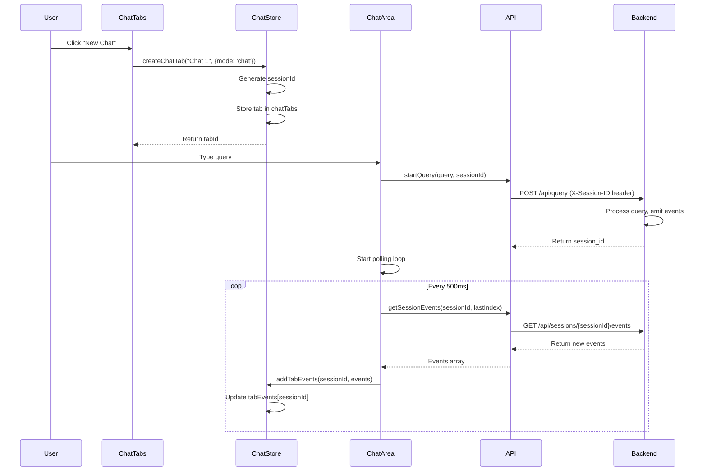
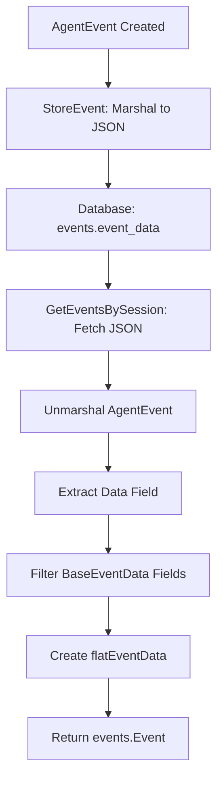

# Multi-Tab Chat Architecture

## 📋 Overview

Multi-tab chat enables parallel chat sessions in both chat and workflow modes. Each tab maintains independent session IDs, event polling, and state management. The system uses a unified `ChatTab` interface that works for both regular chat tabs and workflow phase tabs, with mode-specific metadata to distinguish them.

**Key Benefits:**
- Multiple parallel conversations in chat mode
- Multiple workflow phases running simultaneously
- Independent event polling per tab
- State preservation when switching tabs
- Session-based architecture (not observer-based)

---

## 📁 Key Files & Locations

| Component | File Path | Key Functions/Exports |
|-----------|-----------|---------------------|
| **Chat Tab Store** | [`frontend/src/stores/useChatStore.ts`](file:///Users/mipl/ai-work/mcp-agent-builder-go/frontend/src/stores/useChatStore.ts) | `ChatTab`, `createChatTab()`, `switchTab()`, `closeTab()`, `getTabsByMode()`, `getTabsByPhaseId()` |
| **Chat Tabs UI** | [`frontend/src/components/ChatTabs.tsx`](file:///Users/mipl/ai-work/mcp-agent-builder-go/frontend/src/components/ChatTabs.tsx) | `ChatTabs` component for chat mode |
| **Workflow Chat Tabs UI** | [`frontend/src/components/workflow/WorkflowChatTabs.tsx`](file:///Users/mipl/ai-work/mcp-agent-builder-go/frontend/src/components/workflow/WorkflowChatTabs.tsx) | `WorkflowChatTabs` component for workflow mode |
| **Chat Area** | [`frontend/src/components/ChatArea.tsx`](file:///Users/mipl/ai-work/mcp-agent-builder-go/frontend/src/components/ChatArea.tsx) | Tab-aware chat interface, handles session selection and tab creation |
| **App** | [`frontend/src/App.tsx`](file:///Users/mipl/ai-work/mcp-agent-builder-go/frontend/src/App.tsx) | `handleChatSessionSelect()` - prevents duplicate tabs when selecting sessions |
| **Event Store** | [`agent_go/internal/events/event_store.go`](file:///Users/mipl/ai-work/mcp-agent-builder-go/agent_go/internal/events/event_store.go) | `EventStore`, `GetEvents()`, `AddEvent()`, `InitializeSession()`, `GetSessionStatus()` |
| **Session API** | [`agent_go/cmd/server/polling.go`](file:///Users/mipl/ai-work/mcp-agent-builder-go/agent_go/cmd/server/polling.go) | `handleGetSessionEvents()`, `handleGetSessionStatus()`, `handleGetActiveSessions()`, `flatEventData` |
| **Server** | [`agent_go/cmd/server/server.go`](file:///Users/mipl/ai-work/mcp-agent-builder-go/agent_go/cmd/server/server.go) | `sessionReactivationMux`, `trackActiveSession()`, `convertDBEventToPollingEvent()` |
| **API Service** | [`frontend/src/services/api.ts`](file:///Users/mipl/ai-work/mcp-agent-builder-go/frontend/src/services/api.ts) | `getSessionEvents()`, `getSessionStatus()`, `getActiveSessions()` |

---

## 🔄 System Flow

### Tab Creation Flow

1. **User Action**: User clicks "New Chat", starts a workflow phase, or selects a previous chat session
2. **Duplicate Check**: If selecting existing session, check if tab already exists (prevents duplicates)
3. **Tab Creation**: `createChatTab()` generates unique `tabId` and `sessionId`
4. **Event Mode**: Default event mode set based on agent mode (orchestrator → 'advanced', others → 'basic')
5. **State Storage**: Tab stored in `chatTabs` record with metadata
6. **Session Registration**: Session ID used in API requests (no explicit registration needed)
7. **UI Update**: Tab appears in tab bar, becomes active tab

### Event Polling Flow

1. **Polling Start**: `ChatArea` starts polling when active tab has `sessionId`
2. **Event Request**: Frontend calls `GET /api/sessions/{session_id}/events?since={index}`
3. **Backend Response**: Returns new events since `lastEventIndex` for that session
4. **Event Storage**: Events stored in `tabEvents[sessionId]` array
5. **UI Update**: `EventDisplay` renders events from active tab's session
6. **Index Update**: `lastEventIndex` updated per tab in `tabEventIndices[sessionId]`

### Tab Switching Flow

1. **User Clicks Tab**: `switchTab(tabId)` called
2. **State Update**: `activeTabId` updated, previous tab's `lastViewedEventCount` saved
3. **Polling Switch**: Polling continues but now fetches events for new tab's `sessionId`
4. **Event Display**: `ChatArea` filters events by active tab's `sessionId`
5. **Badge Update**: New event count calculated for inactive tabs

### Tab Closing Flow

1. **User Closes Tab**: `closeTab(tabId)` called
2. **Session Stop**: If tab is streaming, `stopSession(sessionId)` called
3. **Event Cleanup**: Tab's events removed from `tabEvents` and `tabEventIndices`
4. **Tab Removal**: Tab removed from `chatTabs` record
5. **Active Tab Switch**: If closed tab was active, switch to most recent tab

---

## 🏗️ Architecture

```mermaid
graph TD
    A[User Action] --> B{Action Type}
    B -->|New Chat| C[createChatTab]
    B -->|Start Phase| D[createChatTab with workflow metadata]
    B -->|Switch Tab| E[switchTab]
    B -->|Close Tab| F[closeTab]
    
    C --> G[Generate sessionId]
    D --> G
    G --> H[Store Tab in chatTabs]
    H --> I[Set as activeTabId]
    
    I --> J[ChatArea Polls Events]
    J --> K[GET /api/sessions/{sessionId}/events]
    K --> L[Backend EventStore]
    L --> M[Return Events]
    M --> N[Store in tabEvents[sessionId]]
    N --> O[EventDisplay Renders]
    
    E --> P[Update activeTabId]
    P --> Q[Switch Polling Target]
    Q --> J
    
    F --> R{Is Streaming?}
    R -->|Yes| S[stopSession]
    R -->|No| T[Remove Tab]
    S --> T
    T --> U[Cleanup Events]
    U --> V[Switch Active Tab]
```

### Data Flow



---

## 🧩 Code Examples

### Tab Interface

```typescript
// From useChatStore.ts
export interface ChatTab {
  tabId: string  // Unique ID: `chat_${timestamp}` or `phase_${phaseId}_${timestamp}`
  name: string  // Display name (e.g., "Chat 1", "Planning", "Execution")
  sessionId: string | null  // Chat session ID (used for API requests)
  isStreaming: boolean  // Whether this tab's execution is currently running
  isCompleted: boolean  // Whether this tab's execution has completed
  eventMode: 'basic' | 'advanced' | 'tiny' | 'micro'  // Event display mode for this tab
  config: ChatTabConfig  // Tab-specific configuration (servers, LLM, etc.)
  createdAt: number  // Timestamp for ordering
  lastViewedEventCount: number  // Last event count when viewed (for badge)
  metadata?: {
    phaseId?: string  // For workflow mode: phase ID
    phaseName?: string  // For workflow mode: phase name
    mode?: 'chat' | 'workflow'  // Which mode this tab belongs to
    presetQueryId?: string  // For workflow mode: preset query ID
  }
}
```

### Creating a Chat Tab

```typescript
// From useChatStore.ts createChatTab()
const createChatTab = async (
  name: string,
  metadata?: ChatTab['metadata'],
  existingObserverId?: string,
  eventMode?: 'basic' | 'advanced' | 'tiny'
): Promise<string> => {
  const timestamp = Date.now()
  const mode = metadata?.mode || 'chat'
  const tabId = mode === 'workflow' && metadata?.phaseId
    ? `phase_${metadata.phaseId}_${timestamp}`
    : `chat_${timestamp}`
  
  // Generate session ID
  const sessionIdForTab = existingObserverId || crypto.randomUUID()
  
  // Use provided eventMode, or default to 'basic'
  const finalEventMode = eventMode || 'basic'
  
  // Create tab with default config
  const tab: ChatTab = {
    tabId,
    name,
    sessionId: sessionIdForTab,
    isStreaming: false,
    isCompleted: false,
    eventMode: finalEventMode,
    config: getDefaultTabConfig(),
    createdAt: timestamp,
    lastViewedEventCount: 0,
    metadata
  }
  
  // Store in state
  set((state) => ({
    chatTabs: {
      ...state.chatTabs,
      [tabId]: tab
    },
    activeTabId: tabId
  }))
  
  return tabId
}
```

### Preventing Duplicate Tabs

When selecting a previous chat session, the system checks if a tab with that `sessionId` already exists:

```typescript
// From App.tsx handleChatSessionSelect()
const handleChatSessionSelect = useCallback((sessionId: string, sessionTitle?: string) => {
  // Check if a tab with this session ID already exists
  const chatStore = useChatStore.getState()
  const existingTab = Object.values(chatStore.chatTabs).find(
    tab => tab.sessionId === sessionId
  )
  
  if (existingTab) {
    // Tab already exists, just switch to it (no duplicate)
    chatStore.switchTab(existingTab.tabId)
    setChatSessionId(sessionId)
    setChatSessionTitle(sessionTitle || '')
    return
  }
  
  // No existing tab, proceed with normal flow to create new tab
  setChatSessionId(sessionId)
  setChatSessionTitle(sessionTitle || '')
})
```

### Event Mode Defaults Based on Agent Mode

When opening a previous chat session, the event mode is automatically set based on the session's agent mode:

```typescript
// From ChatArea.tsx - when loading completed session
const sessionStatus = await agentApi.getSessionStatus(originalSessionId)

// Determine default event mode based on agent mode
// orchestrator -> advanced (more complex, needs detailed view)
// simple/workflow -> basic (standard view)
const agentMode = sessionStatus.agent_mode?.toLowerCase() || ''
const defaultEventMode: 'basic' | 'advanced' | 'tiny' = 
  agentMode === 'orchestrator' ? 'advanced' : 'basic'

const newTabId = await createChatTab(
  sessionTitle, 
  { mode: 'chat' }, 
  originalSessionId, 
  defaultEventMode
)
```

### Polling Events Per Tab

```typescript
// From ChatArea.tsx
const activeTab = tabId ? getTab(tabId) : getActiveTab()
const sessionId = activeTab?.sessionId

// Poll events for active tab's session
useEffect(() => {
  if (!sessionId || !isPolling) return
  
  const pollEvents = async () => {
    const lastIndex = getTabLastEventIndex(sessionId)
    const response = await agentApi.getSessionEvents(sessionId, lastIndex)
    
    if (response.events.length > 0) {
      addTabEvents(sessionId, response.events)
      setTabLastEventIndex(sessionId, response.last_index)
    }
  }
  
  const interval = setInterval(pollEvents, 500)  // 500ms for streaming responsiveness
  return () => clearInterval(interval)
}, [sessionId, isPolling])
```

### Filtering Events by Tab

```typescript
// From ChatArea.tsx
const activeTab = getActiveTab()
const events = activeTab?.sessionId 
  ? getTabEvents(activeTab.sessionId)
  : []
```

### Workflow Tab Creation

```typescript
// From WorkflowLayout.tsx handleStartPhase()
const handleStartPhase = async (phaseId: string, executionOptions?: ExecutionOptions) => {
  const phase = useWorkflowStore.getState().getPhaseById(phaseId)
  const phaseName = phase?.name || phaseId
  
  // Create workflow tab
  const tabId = await useChatStore.getState().createChatTab(phaseName, {
    mode: 'workflow',
    phaseId,
    phaseName,
    presetQueryId: activePresetId
  })
  
  // Switch to new tab
  useChatStore.getState().switchTab(tabId)
  
  // Submit query with phase context
  const query = `Execute workflow phase: ${phaseId}`
  await chatAreaRef.current?.submitQuery(query, executionOptions)
}
```

---

## ⚙️ Configuration

### Tab Configuration

Each tab maintains its own configuration:

| Field | Type | Default | Purpose |
|-------|------|---------|---------|
| `inputText` | `string` | `''` | Chat input text for this tab |
| `useCodeExecutionMode` | `boolean` | `false` | Code execution mode toggle |
| `selectedServers` | `string[]` | `[]` | MCP servers available in this tab |
| `llmConfig` | `ExtendedLLMConfiguration` | Global LLM config | LLM provider/model for this tab |
| `fileContext` | `FileContextItem[]` | `[]` | Files/folders in context |
| `enableContextSummarization` | `boolean` | `false` | Context summarization setting |

### Backend Configuration

| Setting | Value | Purpose |
|---------|-------|---------|
| Event Storage | `map[string][]Event` (sessionID -> events) | In-memory event storage |
| Polling Endpoint | `GET /api/sessions/{session_id}/events` | Event retrieval endpoint |
| Session Status | `GET /api/sessions/{session_id}/status` | Session status endpoint |
| Active Sessions | `GET /api/sessions/active` | List all active sessions |

---

## 🔍 Key Implementation Details

### Session-Based Architecture

**Important**: The system uses **session-based** architecture, not observer-based. The old observer APIs have been removed.

- **Session ID**: Each tab has a unique `sessionId` used for all API requests
- **Event Storage**: Events stored by `sessionId` in `EventStore.events[sessionId]`
- **Polling**: Frontend polls events per `sessionId`, not per observer ID
- **No Registration**: Sessions don't need explicit registration - they're created on first query

### Unified Tab Interface

Both chat and workflow tabs use the same `ChatTab` interface:
- **Chat Tabs**: `metadata.mode === 'chat'`
- **Workflow Tabs**: `metadata.mode === 'workflow'` with `phaseId` and `phaseName`

### Event Isolation

- Events are isolated by `sessionId` in backend `EventStore`
- Frontend stores events in `tabEvents[sessionId]` per tab
- Each tab maintains independent `lastEventIndex` in `tabEventIndices[sessionId]`
- No cross-contamination between tabs

### Polling Management

- Single polling loop in `ChatArea` polls active tab's session
- Polling stops when no active tab has a session
- Polling interval: 500ms (for streaming responsiveness)
- Each tab tracks its own `lastEventIndex` for incremental polling

### Backend Event Index Handling

The backend properly handles `sinceIndex` filtering for both in-memory and database events:

#### In-Memory Events (EventStore)

```go
// From event_store.go - GetEvents()
// adjustedSinceIndex accounts for baseIndex (events stored in DB before reactivation)
adjustedSinceIndex := opts.SinceIndex
if baseIndex > 0 && opts.SinceIndex >= 0 {
    adjustedSinceIndex = opts.SinceIndex - baseIndex
}

// Filter events first, then apply sinceIndex based on original positions
filteredCountUpToSinceIndex := 0
for i := 0; i <= effectiveSinceIndex && i < len(events); i++ {
    if ShouldShowEventByMode(events[i].Type, opts.EventMode) {
        filteredCountUpToSinceIndex++
    }
}
```

#### Database Events (Completed Sessions)

```go
// From polling.go - handleGetSessionEvents()
// CRITICAL: sinceIndex is the EventIndex from AgentEvent, NOT the array position
// After event mode filtering, array positions don't match EventIndex values
var filteredBySinceIndex []events.Event
maxEventIndex := -1
for _, event := range convertedEvents {
    eventIndex := -1
    if event.Data != nil {
        eventIndex = event.Data.EventIndex
    }
    if eventIndex > maxEventIndex {
        maxEventIndex = eventIndex
    }
    // Only include events with EventIndex > sinceIndex
    if eventIndex > opts.SinceIndex {
        filteredBySinceIndex = append(filteredBySinceIndex, event)
    }
}
```

#### has_more Logic

```go
// has_more from EventStore is used directly:
// - True for sinceIndex=0 when older events exist beyond InitialEventsLimit
// - False for normal polling (sinceIndex > 0) - frontend continues polling anyway
// - For backward pagination: true if more events exist after current offset
hasMore := hasMoreFromStore
if !hasMoreFromStore && opts.Limit > 0 {
    hasMore = len(sessionEvents) >= opts.Limit
}
```

### Tab State Persistence

- **Workflow tabs only**: Only workflow tabs (`metadata.mode === 'workflow'`) are persisted to localStorage
- **Chat tabs**: Chat tabs are NOT persisted - they start fresh on page reload
- **Persistence details**:
  - Tab structure (name, config, eventMode, metadata) persisted for workflow tabs
  - `sessionId` set to `null` on restore (sessions are ephemeral)
  - `activeTabId` only persisted if it points to a workflow tab
- **Tab events**: Stored in memory only (not persisted)
- **On page reload**:
  - Workflow tabs: Restored from localStorage, can reconnect to active sessions
  - Chat tabs: Cleared, new default tab created if needed
  - Events: Must be fetched from backend for restored tabs

### Race Condition Prevention

The system implements several mechanisms to prevent race conditions:

#### 1. Auto-Restore vs Manual Detection Coordination

A global `sessionsBeingRestored` Set prevents duplicate tab creation when auto-restore and manual session detection run simultaneously:

```typescript
// Global Set to track session IDs currently being restored
const sessionsBeingRestored = new Set<string>()

// Before creating a tab, check if session is already being restored
if (sessionsBeingRestored.has(sessionId)) {
  console.log(`Session ${sessionId} is already being restored, skipping`)
  continue
}

// Mark as being restored before async tab creation
sessionsBeingRestored.add(sessionId)

try {
  const newTabId = await createChatTab(...)
  // ... load events and config
} finally {
  // Always remove from Set when done
  sessionsBeingRestored.delete(sessionId)
}
```

#### 2. Stop Session Safety

The `stopStreaming` function only uses `activeTab?.sessionId` - never falls back to global `chatSessionId`:

```typescript
// CRITICAL: Only use active tab's sessionId - never fall back to global
const sessionIdToStop = activeTab?.sessionId
if (!sessionIdToStop) {
  console.warn('[STOP] No session ID available for active tab, cannot stop session')
  return
}
await agentApi.stopSession(sessionIdToStop)
```

This prevents accidentally stopping a different tab's session when multiple tabs are open.

#### 3. Backend Session Reactivation Locking

The backend uses a mutex to ensure atomic baseIndex calculation and EventStore initialization:

```go
// From server.go - session reactivation
api.sessionReactivationMux.Lock()
existingEvents, err := api.chatDB.GetEventsBySession(r.Context(), sessionID, 1000000, 0)
if err == nil {
    baseIndex = len(existingEvents)
}
api.eventStore.InitializeSession(sessionID, baseIndex)
api.sessionReactivationMux.Unlock()
```

This prevents concurrent requests from causing misaligned event indices.

---

## 🛠️ Common Issues & Solutions

| Issue | Cause | Solution |
|-------|-------|----------|
| Tab shows no events | Tab's `sessionId` is null | Ensure `createChatTab()` generates `sessionId` |
| Events appear in wrong tab | Polling uses wrong `sessionId` | Check `activeTab.sessionId` matches API request |
| Tab badge shows wrong count | `lastViewedEventCount` not updated | Call `switchTab()` which updates count automatically |
| Workflow tab not created | Missing `metadata.mode: 'workflow'` | Ensure `createChatTab()` includes workflow metadata |
| Polling stops unexpectedly | No active tab with `sessionId` | Ensure tab has `sessionId` before starting query |
| Tab closes but session continues | `closeTab()` didn't call `stopSession()` | Check `tab.isStreaming` before closing |
| Duplicate tabs created when clicking same chat | No duplicate check before creating tab | Check `handleChatSessionSelect()` in [`App.tsx`](file:///Users/mipl/ai-work/mcp-agent-builder-go/frontend/src/App.tsx) |
| Chat tabs persist on reload | All tabs persisted regardless of mode | Only workflow tabs should persist (see [`useChatStore.ts:1307`](file:///Users/mipl/ai-work/mcp-agent-builder-go/frontend/src/stores/useChatStore.ts#L1307)) |
| Wrong event mode on restored tabs | Event mode not set based on agent mode | Pass `eventMode` parameter to `createChatTab()` based on `sessionStatus.agent_mode` |
| Stop button stops wrong session | `stopSession` falls back to global sessionId | Fixed: `stopSession` only uses `activeTab?.sessionId`, returns early if unavailable |
| Duplicate tabs during auto-restore | Auto-restore and manual detection race | Fixed: `sessionsBeingRestored` Set prevents concurrent tab creation for same session |
| Database events have wrong sinceIndex | sinceIndex applied to filtered array position | Fixed: Backend filters by `EventIndex` from events, not array position |
| Session reactivation has wrong event indices | baseIndex calculation not atomic | Fixed: Backend uses `sessionReactivationMux` mutex for atomic operations |
| has_more always true during polling | Incorrect logic: `hasMore = len(events) > 0` | Fixed: `hasMore` from EventStore is used directly, only true when older events exist |

---

## 🔍 For LLMs: Quick Reference

### Tab Management Actions

```typescript
// Create tab (with optional event mode)
const tabId = await useChatStore.getState().createChatTab(
  name, 
  metadata, 
  existingSessionId, 
  eventMode  // Optional: 'basic' | 'advanced' | 'tiny'
)

// Switch tab
useChatStore.getState().switchTab(tabId)

// Close tab
await useChatStore.getState().closeTab(tabId)

// Get active tab
const activeTab = useChatStore.getState().getActiveTab()

// Get tabs by mode
const chatTabs = useChatStore.getState().getTabsByMode('chat')
const workflowTabs = useChatStore.getState().getTabsByMode('workflow')

// Get tabs by phase
const phaseTabs = useChatStore.getState().getTabsByPhaseId('execution')

// Check if tab exists for session (prevent duplicates)
const existingTab = Object.values(useChatStore.getState().chatTabs)
  .find(tab => tab.sessionId === sessionId)
```

### Event Management

```typescript
// Get events for tab's session
const events = useChatStore.getState().getTabEvents(sessionId)

// Add events to tab
useChatStore.getState().addTabEvents(sessionId, events)

// Get last event index
const lastIndex = useChatStore.getState().getTabLastEventIndex(sessionId)

// Set last event index
useChatStore.getState().setTabLastEventIndex(sessionId, newIndex)
```

### Constraints

✅ **Allowed:**
- Creating multiple tabs with different `sessionId`s
- Switching tabs while polling is active
- Closing tabs that are streaming (automatically stops session)
- Storing events per `sessionId` (not per tab)

❌ **Forbidden:**
- Using observer IDs (system uses session IDs)
- Sharing `sessionId` between tabs (each tab should have unique session)
- Polling without active tab's `sessionId`
- Storing events globally (must use `tabEvents[sessionId]`)
- Falling back to global `chatSessionId` in `stopSession` (could stop wrong session)
- Creating tabs without checking `sessionsBeingRestored` Set first (could create duplicates)
- Using array position for `sinceIndex` filtering on database events (must use `EventIndex`)

### Common Patterns

**Pattern 1: Create and Switch to New Tab**
```typescript
const tabId = await createChatTab("New Chat", { mode: 'chat' })
switchTab(tabId)
```

**Pattern 2: Get Active Tab's Events**
```typescript
const activeTab = getActiveTab()
const events = activeTab?.sessionId ? getTabEvents(activeTab.sessionId) : []
```

**Pattern 3: Create Workflow Phase Tab**
```typescript
const tabId = await createChatTab(phaseName, {
  mode: 'workflow',
  phaseId: 'execution',
  phaseName: 'Execution',
  presetQueryId: presetId
})
```

**Pattern 4: Prevent Duplicate Tabs When Selecting Session**
```typescript
// Check if tab already exists before creating
const existingTab = Object.values(chatStore.chatTabs)
  .find(tab => tab.sessionId === sessionId)

if (existingTab) {
  // Switch to existing tab instead of creating duplicate
  chatStore.switchTab(existingTab.tabId)
} else {
  // Create new tab
  const tabId = await createChatTab(sessionTitle, { mode: 'chat' }, sessionId)
}
```

**Pattern 5: Set Event Mode Based on Agent Mode**
```typescript
// When loading previous chat session
const sessionStatus = await agentApi.getSessionStatus(sessionId)
const agentMode = sessionStatus.agent_mode?.toLowerCase() || ''
const eventMode = agentMode === 'orchestrator' ? 'advanced' : 'tiny'

const tabId = await createChatTab(
  sessionTitle,
  { mode: 'chat' },
  sessionId,
  eventMode
)
```

**Pattern 6: Safe Session Restoration (Race Condition Prevention)**
```typescript
// Check if session is already being restored
if (sessionsBeingRestored.has(sessionId)) {
  console.log(`Session ${sessionId} already being restored, skipping`)
  // Wait and check if tab was created
  await new Promise(resolve => setTimeout(resolve, 1000))
  const existingTab = Object.values(chatStore.chatTabs)
    .find(tab => tab.sessionId === sessionId)
  if (existingTab) {
    switchTab(existingTab.tabId)
    return
  }
}

// Mark as being restored
sessionsBeingRestored.add(sessionId)

try {
  const newTabId = await createChatTab(...)
  // Load events, restore config, etc.
} finally {
  // Always cleanup
  sessionsBeingRestored.delete(sessionId)
}
```

**Pattern 7: Safe Stop Session**
```typescript
// CRITICAL: Only use active tab's sessionId, never fall back to global
const sessionIdToStop = activeTab?.sessionId
if (!sessionIdToStop) {
  console.warn('No session ID available for active tab')
  return
}
await agentApi.stopSession(sessionIdToStop)
```

---

## 📖 Related Documentation

- [Workflow Orchestrator](workflow_orchestrator.md) - Workflow execution architecture
- [Event System](validation_schema_implementation.md) - Event types and validation

---

## Summary

Multi-tab chat uses a unified `ChatTab` interface for both chat and workflow modes. Each tab has a unique `sessionId` used for event polling and API requests. Events are stored per `sessionId` in both backend (`EventStore`) and frontend (`tabEvents`). The system supports parallel conversations with independent state management and event isolation.

**Key Behaviors:**
- **Persistence**: Only workflow tabs persist across page reloads; chat tabs start fresh
- **Duplicate Prevention**: Clicking an existing chat session switches to its tab instead of creating a duplicate
- **Event Mode**: Automatically set based on agent mode (orchestrator → 'advanced', others → 'tiny') when opening previous sessions
- **Session Isolation**: Each tab maintains independent events, polling, and state management
- **Race Condition Prevention**: `sessionsBeingRestored` Set prevents duplicate tabs when auto-restore and manual detection run simultaneously
- **Safe Stop**: `stopSession` only uses `activeTab?.sessionId`, never falls back to global sessionId
- **Atomic Session Reactivation**: Backend uses `sessionReactivationMux` for atomic baseIndex calculation
- **Correct Event Indexing**: Database event filtering uses `EventIndex` from events, not array positions

---
---

# Appendix: Past Chat Restoration & Persistence

## Overview

System for restoring and working with past chat sessions. Handles configuration restoration (LLM settings, workspace settings, MCP servers, agent mode) and ensures polling works when replying to restored sessions. Also covers event storage and retrieval conversion from database format to frontend format.

**Key Features:**
- **Auto-restore active sessions**: Automatically restores active chats when page loads/refreshes
- **Configuration restoration**: Restores LLM settings, workspace settings, MCP servers, agent mode
- **Polling reactivation**: Ensures polling works when replying to restored sessions
- **Type-safe conversion**: Consistent structure between polling API and chat history API
- **Event filtering**: Proper filtering of BaseEventData fields to avoid duplication

**Key Benefits:**
- Type-safe conversion from database to frontend format
- Consistent structure between polling API and chat history API
- Proper filtering of BaseEventData fields to avoid duplication
- Seamless page refresh experience - active chats automatically restored

---

## Key Files & Locations

| Component | File Path | Key Functions |
|-----------|-----------|---------------|
| **Database Storage** | [`agent_go/pkg/database/sqlite.go`](file:///Users/mipl/ai-work/mcp-agent-builder-go/agent_go/pkg/database/sqlite.go) | `StoreEvent()`, `GetEventsBySession()` |
| **Event Conversion** | [`agent_go/cmd/server/server.go`](file:///Users/mipl/ai-work/mcp-agent-builder-go/agent_go/cmd/server/server.go) | `convertDBEventToPollingEvent()`, `flatEventData`, `trackActiveSession()` |
| **Polling API** | [`agent_go/cmd/server/polling.go`](file:///Users/mipl/ai-work/mcp-agent-builder-go/agent_go/cmd/server/polling.go) | `flatEventData` type, DB fallback conversion |
| **Event Models** | [`agent_go/pkg/database/models.go`](file:///Users/mipl/ai-work/mcp-agent-builder-go/agent_go/pkg/database/models.go) | `Event` struct with `EventData json.RawMessage`, `ChatSessionConfig` |
| **Event Types** | [`mcpagent/events/data.go`](file:///Users/mipl/ai-work/mcp-agent-builder-go/mcpagent/events/data.go) | `AgentEvent`, `UserMessageEvent`, `BaseEventData` |
| **Frontend Restore** | [`frontend/src/components/ChatArea.tsx`](file:///Users/mipl/ai-work/mcp-agent-builder-go/frontend/src/components/ChatArea.tsx) | Auto-restore active sessions, config restoration, polling reactivation |
| **Store Management** | [`frontend/src/stores/useChatStore.ts`](file:///Users/mipl/ai-work/mcp-agent-builder-go/frontend/src/stores/useChatStore.ts) | `getActiveSessions()`, `createChatTab()`, `setTabStreaming()` |

---

## How It Works

### Storage Flow

1. **Event Creation**: `AgentEvent` created with typed `EventData` (e.g., `UserMessageEvent`)
2. **Database Storage**: Entire `AgentEvent` marshaled to JSON and stored in `events.event_data`
3. **Batch Insert**: Events buffered and flushed in batches for performance
4. **Session Tracking**: Backend tracks active sessions via `trackActiveSession()` when query starts

### Retrieval Flow

1. **Database Query**: Fetch events as `database.Event` with `EventData json.RawMessage`
2. **Unmarshal AgentEvent**: Parse JSON into helper struct with `Data json.RawMessage`
3. **Extract Event Data**: Unmarshal `Data` field into map, filter out BaseEventData fields
4. **Create flatEventData**: Wrap event-specific fields in custom type that serializes directly
5. **Return events.Event**: Convert to polling API format with `Data: *AgentEvent`

### Auto-Restore Active Sessions Flow

1. **Page Load**: Component mounts, starts active sessions polling
2. **Fetch Active Sessions**: After 500ms delay, fetches active sessions (status: `'running'`)
3. **Filter & Create Tabs**:
   - Filter to running sessions
   - **Important**: In chat mode, filter out workflow sessions (`agent_mode === 'workflow'`) to prevent them from appearing as chat tabs
   - For each remaining session without a tab:
     - Creates tab with session ID
     - Fetches full session details (including config)
     - Restores config (LLM, workspace, MCP servers, etc.)
     - Loads historical events
     - Sets streaming status to `true`
     - Switches to first active session tab
4. **Polling**: Polling automatically starts for active sessions (via `tabsWithActiveSessions` filter)

### Session Reactivation Flow

1. **User Replies**: User submits query on restored session
2. **Backend Reactivation**: 
   - Updates session status from `completed`/`stopped`/`error` → `active`
   - Initializes EventStore for the session
   - Calls `trackActiveSession()` to add to active sessions map
3. **Frontend Updates**:
   - Sets `isStreaming = true` (immediate inclusion in polling)
   - Refreshes active sessions cache
   - Starts polling if not already running
4. **Polling**: Tab is included because `isStreaming = true` OR session is in active sessions list

---

## Architecture (Data Conversion)



---

## Code Examples (Conversion)

### Storage

```go
// From agent_go/pkg/database/sqlite.go:550
eventData, err := json.Marshal(pending.event)
stmt.ExecContext(ctx, pending.sessionID, chatSessionID, 
    pending.event.Type, pending.event.Timestamp, string(eventData))
```

### Retrieval & Conversion

```go
// From agent_go/cmd/server/server.go:2417
func convertDBEventToPollingEvent(dbEvent database.Event, sessionID string) (*events.Event, error) {
    // Unmarshal AgentEvent structure
    type agentEventWithRawData struct {
        Type           unifiedevents.EventType `json:"type"`
        Timestamp      time.Time               `json:"timestamp"`
        Data           json.RawMessage         `json:"data"`
        // ... other fields
    }
    
    var helper agentEventWithRawData
    json.Unmarshal(dbEvent.EventData, &helper)
    
    // Extract event-specific fields (exclude BaseEventData)
    var dataMap map[string]interface{}
    json.Unmarshal(helper.Data, &dataMap)
    
    baseEventDataFields := map[string]bool{
        "timestamp": true, "hierarchy_level": true, "session_id": true,
        "component": true, "trace_id": true, "span_id": true,
        "event_id": true, "parent_id": true, "is_end_event": true,
        "correlation_id": true, "metadata": true,
    }
    
    actualEventData := make(map[string]interface{})
    for k, v := range dataMap {
        if !baseEventDataFields[k] {
            actualEventData[k] = v
        }
    }
    
    // Create AgentEvent with flatEventData
    agentEvent := unifiedevents.AgentEvent{
        Type: helper.Type,
        Timestamp: helper.Timestamp,
        // ... other fields
        Data: &flatEventData{
            eventData: actualEventData,
            eventType: helper.Type,
        },
    }
    
    return &events.Event{
        ID: dbEvent.ID,
        Type: dbEvent.EventType,
        Data: &agentEvent,
    }, nil
}
```

### flatEventData Type

```go
// From agent_go/cmd/server/server.go:2415
type flatEventData struct {
    eventData map[string]interface{}
    eventType unifiedevents.EventType
}

func (f *flatEventData) GetEventType() unifiedevents.EventType {
    return f.eventType
}

func (f *flatEventData) MarshalJSON() ([]byte, error) {
    return json.Marshal(f.eventData)
}
```

---

## Data Structure

### Database Storage Format

```json
{
  "type": "user_message",
  "timestamp": "2026-01-01T23:03:10Z",
  "event_index": 0,
  "data": {
    "timestamp": "2026-01-01T23:03:10Z",
    "hierarchy_level": 0,
    "content": "Hello",
    "turn": 1,
    "role": "user"
  }
}
```

### Frontend Format (event.data.data)

```json
{
  "content": "Hello",
  "turn": 1,
  "role": "user"
}
```

**Key Point:** `event.data.data` contains only event-specific fields, not BaseEventData fields.

---

## Common Issues & Solutions

| Issue | Cause | Solution |
|-------|-------|----------|
| `event.data.data` is undefined | `GenericEventData` adds extra nesting | Use `flatEventData` type instead |
| BaseEventData fields duplicated | Event types embed `BaseEventData` | Filter out BaseEventData fields before wrapping |
| Content not showing in UI | Wrong structure at `event.data.data` | Ensure `flatEventData.MarshalJSON()` returns only event-specific fields |
| Parse errors on retrieval | Invalid JSON in `event_data` | Check database integrity, verify `StoreEvent` marshaling |
| Active sessions not restored on page load | Auto-restore runs before active sessions polling starts | Wait 500ms before fetching active sessions |
| Polling not working for restored sessions | Session not in active sessions list yet | Check `isStreaming` directly from store, refresh active sessions cache |
| Config not restored | Config not saved when session created | Ensure `ChatSessionConfig` includes all fields (LLM, workspace, MCP servers) |

---

## Quick Reference (Constraints)

**Key Constraints:**
- ✅ **Allowed**: Filter BaseEventData fields by name, use `flatEventData` for direct serialization
- ❌ **Forbidden**: Using `GenericEventData` (adds extra nesting), including BaseEventData fields in event data

**BaseEventData Fields to Filter:**
```go
baseEventDataFields := map[string]bool{
    "timestamp": true, "trace_id": true, "span_id": true,
    "event_id": true, "parent_id": true, "is_end_event": true,
    "correlation_id": true, "hierarchy_level": true,
    "session_id": true, "component": true, "metadata": true,
}
```

**Conversion Pattern:**
1. Unmarshal `AgentEvent` with `Data json.RawMessage`
2. Unmarshal `Data` into `map[string]interface{}`
3. Filter out BaseEventData fields
4. Create `flatEventData` with filtered map
5. Wrap in `AgentEvent` → `events.Event`

**Example:**
```go
// Extract event-specific fields
actualEventData := make(map[string]interface{})
for k, v := range dataMap {
    if !baseEventDataFields[k] {
        actualEventData[k] = v
    }
}

// Create flatEventData
data := &flatEventData{
    eventData: actualEventData,
    eventType: helper.Type,
}
```

---

## Auto-Restore Active Sessions Implementation

**Location**: `frontend/src/components/ChatArea.tsx` (lines 980-1120)

**Key Components**:
- `hasRestoredActiveSessionsRef`: Prevents duplicate restoration on React StrictMode double-mount
- `getActiveSessions(true)`: Force refreshes active sessions cache
- `createChatTab()`: Creates tab with existing session ID
- `agentApi.getChatSession()`: Fetches full session details including config
- `setTabConfig()`: Restores LLM, workspace, MCP servers, etc.
- `setTabStreaming(true)`: Marks tab as streaming (enables polling)

**Flow**:
```typescript
// On component mount (chat mode only)
1. Wait 500ms for active sessions polling to initialize
2. Fetch active sessions (force refresh)
3. Filter to status === 'running' sessions
4. For each running session:
   - Check if tab exists → skip if yes
   - Create tab with session ID
   - Fetch session details (config + events)
   - Restore config to tab
   - Load events
   - Set streaming = true
   - Switch to first active session tab
```

**Configuration Restored**:
- LLM settings (provider, model, fallback models, cross-provider fallback)
- MCP servers (selected/enabled servers)
- Code execution mode
- Context summarization
- Workspace file context
- Workspace access setting

### Session Reactivation

When replying to a restored session:

1. **Backend** (`server.go:1022-1042`):
   - Reactivates session status: `completed`/`stopped`/`error` → `active`
   - Initializes EventStore
   - Calls `trackActiveSession()` → adds to active sessions map

2. **Frontend** (`ChatArea.tsx:1868-1924`):
   - Sets `isStreaming = true` → tab included in polling immediately
   - Refreshes active sessions cache (awaited)
   - Starts polling after cache refresh completes

3. **Polling** (`ChatArea.tsx:984-1020`):
   - `tabsWithActiveSessions` filter checks `isStreaming` directly from store
   - Includes tab if streaming OR in active sessions list
   - `pollEvents` function also checks both conditions

---

## Recent Fixes (2026-02)

### 1. Stop Session Safety Fix
**Issue**: `stopSession` fell back to global `chatSessionId` which could stop a different tab's session.

**Solution**: `stopSession` now only uses `activeTab?.sessionId` and returns early if unavailable.

### 2. Database Event sinceIndex Fix
**Issue**: `sinceIndex` was applied to array positions after event mode filtering. After filtering, indices became relative (not absolute), causing wrong events to be returned.

**Solution**: Backend now filters database events based on `EventIndex` from each event's `AgentEvent.EventIndex` field, not array position.

### 3. Session Reactivation Atomicity Fix
**Issue**: `baseIndex` calculation and `InitializeSession()` weren't atomic. Concurrent requests could cause misaligned event indices.

**Solution**: Added `sessionReactivationMux` mutex to wrap the baseIndex calculation and EventStore initialization.

### 4. has_more Logic Fix
**Issue**: `hasMore = len(sessionEvents) > 0` for forward polling was incorrect. It should only be true if MORE events exist after the returned batch.

**Solution**: `hasMore` from EventStore is used directly. For forward polling (sinceIndex > 0), `hasMore` is always false - frontend continues polling anyway until session completes.

### 5. Auto-Restore Race Condition Fix
**Issue**: Auto-restore and manual session detection could both try to create tabs for the same session simultaneously.

**Solution**: Added global `sessionsBeingRestored` Set. Both code paths check and add to this Set before creating tabs, preventing duplicate creation.