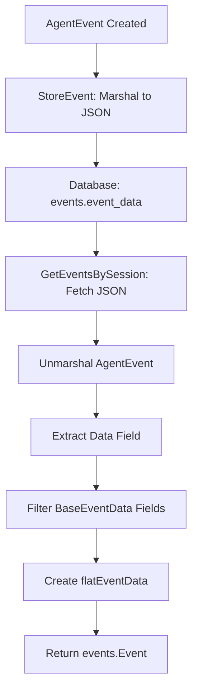

# Past Chat Working

## 📋 Overview

System for restoring and working with past chat sessions. Handles configuration restoration (LLM settings, workspace settings, MCP servers, agent mode) and ensures polling works when replying to restored sessions. Also covers event storage and retrieval conversion from database format to frontend format.

**Key Features:**
- **Auto-restore active sessions**: Automatically restores active chats when page loads/refreshes
- **Configuration restoration**: Restores LLM settings, workspace settings, MCP servers, agent mode
- **Polling reactivation**: Ensures polling works when replying to restored sessions
- **Type-safe conversion**: Consistent structure between polling API and chat history API
- **Event filtering**: Proper filtering of BaseEventData fields to avoid duplication

**Key Benefits:**
- Type-safe conversion from database to frontend format
- Consistent structure between polling API and chat history API
- Proper filtering of BaseEventData fields to avoid duplication
- Seamless page refresh experience - active chats automatically restored

---

## 📁 Key Files & Locations

| Component | File Path | Key Functions |
|-----------|-----------|---------------|
| **Database Storage** | [`agent_go/pkg/database/sqlite.go`](file:///Users/mipl/ai-work/mcp-agent-builder-go/agent_go/pkg/database/sqlite.go) | `StoreEvent()`, `GetEventsBySession()` |
| **Event Conversion** | [`agent_go/cmd/server/server.go`](file:///Users/mipl/ai-work/mcp-agent-builder-go/agent_go/cmd/server/server.go) | `convertDBEventToPollingEvent()`, `flatEventData`, `trackActiveSession()` |
| **Polling API** | [`agent_go/cmd/server/polling.go`](file:///Users/mipl/ai-work/mcp-agent-builder-go/agent_go/cmd/server/polling.go) | `flatEventData` type, DB fallback conversion |
| **Event Models** | [`agent_go/pkg/database/models.go`](file:///Users/mipl/ai-work/mcp-agent-builder-go/agent_go/pkg/database/models.go) | `Event` struct with `EventData json.RawMessage`, `ChatSessionConfig` |
| **Event Types** | [`mcpagent/events/data.go`](file:///Users/mipl/ai-work/mcp-agent-builder-go/mcpagent/events/data.go) | `AgentEvent`, `UserMessageEvent`, `BaseEventData` |
| **Frontend Restore** | [`frontend/src/components/ChatArea.tsx`](file:///Users/mipl/ai-work/mcp-agent-builder-go/frontend/src/components/ChatArea.tsx) | Auto-restore active sessions, config restoration, polling reactivation |
| **Store Management** | [`frontend/src/stores/useChatStore.ts`](file:///Users/mipl/ai-work/mcp-agent-builder-go/frontend/src/stores/useChatStore.ts) | `getActiveSessions()`, `createChatTab()`, `setTabStreaming()` |

---

## 🔄 How It Works

### Storage Flow

1. **Event Creation**: `AgentEvent` created with typed `EventData` (e.g., `UserMessageEvent`)
2. **Database Storage**: Entire `AgentEvent` marshaled to JSON and stored in `events.event_data`
3. **Batch Insert**: Events buffered and flushed in batches for performance
4. **Session Tracking**: Backend tracks active sessions via `trackActiveSession()` when query starts

### Retrieval Flow

1. **Database Query**: Fetch events as `database.Event` with `EventData json.RawMessage`
2. **Unmarshal AgentEvent**: Parse JSON into helper struct with `Data json.RawMessage`
3. **Extract Event Data**: Unmarshal `Data` field into map, filter out BaseEventData fields
4. **Create flatEventData**: Wrap event-specific fields in custom type that serializes directly
5. **Return events.Event**: Convert to polling API format with `Data: *AgentEvent`

### Auto-Restore Active Sessions Flow

1. **Page Load**: Component mounts, starts active sessions polling
2. **Fetch Active Sessions**: After 500ms delay, fetches active sessions (status: `'running'`)
3. **Create Tabs**: For each active session without a tab:
   - Creates tab with session ID
   - Fetches full session details (including config)
   - Restores config (LLM, workspace, MCP servers, etc.)
   - Loads historical events
   - Sets streaming status to `true`
   - Switches to first active session tab
4. **Polling**: Polling automatically starts for active sessions (via `tabsWithActiveSessions` filter)

### Session Reactivation Flow

1. **User Replies**: User submits query on restored session
2. **Backend Reactivation**: 
   - Updates session status from `completed`/`stopped`/`error` → `active`
   - Initializes EventStore for the session
   - Calls `trackActiveSession()` to add to active sessions map
3. **Frontend Updates**:
   - Sets `isStreaming = true` (immediate inclusion in polling)
   - Refreshes active sessions cache
   - Starts polling if not already running
4. **Polling**: Tab is included because `isStreaming = true` OR session is in active sessions list

---

## 🏗️ Architecture



---

## 🧩 Code Examples

### Storage

```go
// From agent_go/pkg/database/sqlite.go:550
eventData, err := json.Marshal(pending.event)
stmt.ExecContext(ctx, pending.sessionID, chatSessionID, 
    pending.event.Type, pending.event.Timestamp, string(eventData))
```

### Retrieval & Conversion

```go
// From agent_go/cmd/server/server.go:2417
func convertDBEventToPollingEvent(dbEvent database.Event, sessionID string) (*events.Event, error) {
    // Unmarshal AgentEvent structure
    type agentEventWithRawData struct {
        Type           unifiedevents.EventType `json:"type"`
        Timestamp      time.Time               `json:"timestamp"`
        Data           json.RawMessage         `json:"data"`
        // ... other fields
    }
    
    var helper agentEventWithRawData
    json.Unmarshal(dbEvent.EventData, &helper)
    
    // Extract event-specific fields (exclude BaseEventData)
    var dataMap map[string]interface{}
    json.Unmarshal(helper.Data, &dataMap)
    
    baseEventDataFields := map[string]bool{
        "timestamp": true, "hierarchy_level": true, "session_id": true,
        "component": true, "trace_id": true, "span_id": true,
        "event_id": true, "parent_id": true, "is_end_event": true,
        "correlation_id": true, "metadata": true,
    }
    
    actualEventData := make(map[string]interface{})
    for k, v := range dataMap {
        if !baseEventDataFields[k] {
            actualEventData[k] = v
        }
    }
    
    // Create AgentEvent with flatEventData
    agentEvent := unifiedevents.AgentEvent{
        Type: helper.Type,
        Timestamp: helper.Timestamp,
        // ... other fields
        Data: &flatEventData{
            eventData: actualEventData,
            eventType: helper.Type,
        },
    }
    
    return &events.Event{
        ID: dbEvent.ID,
        Type: dbEvent.EventType,
        Data: &agentEvent,
    }, nil
}
```

### flatEventData Type

```go
// From agent_go/cmd/server/server.go:2415
type flatEventData struct {
    eventData map[string]interface{}
    eventType unifiedevents.EventType
}

func (f *flatEventData) GetEventType() unifiedevents.EventType {
    return f.eventType
}

func (f *flatEventData) MarshalJSON() ([]byte, error) {
    return json.Marshal(f.eventData)
}
```

---

## ⚙️ Data Structure

### Database Storage Format

```json
{
  "type": "user_message",
  "timestamp": "2026-01-01T23:03:10Z",
  "event_index": 0,
  "data": {
    "timestamp": "2026-01-01T23:03:10Z",
    "hierarchy_level": 0,
    "content": "Hello",
    "turn": 1,
    "role": "user"
  }
}
```

### Frontend Format (event.data.data)

```json
{
  "content": "Hello",
  "turn": 1,
  "role": "user"
}
```

**Key Point:** `event.data.data` contains only event-specific fields, not BaseEventData fields.

---

## 🛠️ Common Issues & Solutions

| Issue | Cause | Solution |
|-------|-------|----------|
| `event.data.data` is undefined | `GenericEventData` adds extra nesting | Use `flatEventData` type instead |
| BaseEventData fields duplicated | Event types embed `BaseEventData` | Filter out BaseEventData fields before wrapping |
| Content not showing in UI | Wrong structure at `event.data.data` | Ensure `flatEventData.MarshalJSON()` returns only event-specific fields |
| Parse errors on retrieval | Invalid JSON in `event_data` | Check database integrity, verify `StoreEvent` marshaling |
| Active sessions not restored on page load | Auto-restore runs before active sessions polling starts | Wait 500ms before fetching active sessions |
| Polling not working for restored sessions | Session not in active sessions list yet | Check `isStreaming` directly from store, refresh active sessions cache |
| Config not restored | Config not saved when session created | Ensure `ChatSessionConfig` includes all fields (LLM, workspace, MCP servers) |

---

## 🔍 For LLMs: Quick Reference

**Key Constraints:**
- ✅ **Allowed**: Filter BaseEventData fields by name, use `flatEventData` for direct serialization
- ❌ **Forbidden**: Using `GenericEventData` (adds extra nesting), including BaseEventData fields in event data

**BaseEventData Fields to Filter:**
```go
baseEventDataFields := map[string]bool{
    "timestamp": true, "trace_id": true, "span_id": true,
    "event_id": true, "parent_id": true, "is_end_event": true,
    "correlation_id": true, "hierarchy_level": true,
    "session_id": true, "component": true, "metadata": true,
}
```

**Conversion Pattern:**
1. Unmarshal `AgentEvent` with `Data json.RawMessage`
2. Unmarshal `Data` into `map[string]interface{}`
3. Filter out BaseEventData fields
4. Create `flatEventData` with filtered map
5. Wrap in `AgentEvent` → `events.Event`

**Example:**
```go
// Extract event-specific fields
actualEventData := make(map[string]interface{})
for k, v := range dataMap {
    if !baseEventDataFields[k] {
        actualEventData[k] = v
    }
}

// Create flatEventData
data := &flatEventData{
    eventData: actualEventData,
    eventType: helper.Type,
}
```

---

## 🎯 Auto-Restore Active Sessions

### Implementation Details

**Location**: `frontend/src/components/ChatArea.tsx` (lines 980-1120)

**Key Components**:
- `hasRestoredActiveSessionsRef`: Prevents duplicate restoration on React StrictMode double-mount
- `getActiveSessions(true)`: Force refreshes active sessions cache
- `createChatTab()`: Creates tab with existing session ID
- `agentApi.getChatSession()`: Fetches full session details including config
- `setTabConfig()`: Restores LLM, workspace, MCP server settings
- `setTabStreaming(true)`: Marks tab as streaming (enables polling)

**Flow**:
```typescript
// On component mount (chat mode only)
1. Wait 500ms for active sessions polling to initialize
2. Fetch active sessions (force refresh)
3. Filter to status === 'running' sessions
4. For each running session:
   - Check if tab exists → skip if yes
   - Create tab with session ID
   - Fetch session details (config + events)
   - Restore config to tab
   - Load events
   - Set streaming = true
   - Switch to first tab
```

**Configuration Restored**:
- LLM settings (provider, model, fallback models, cross-provider fallback)
- MCP servers (selected/enabled servers)
- Code execution mode
- Context summarization
- Workspace file context
- Workspace access setting

### Session Reactivation

When replying to a restored session:

1. **Backend** (`server.go:1022-1042`):
   - Reactivates session status: `completed`/`stopped`/`error` → `active`
   - Initializes EventStore
   - Calls `trackActiveSession()` → adds to active sessions map

2. **Frontend** (`ChatArea.tsx:1868-1924`):
   - Sets `isStreaming = true` → tab included in polling immediately
   - Refreshes active sessions cache (awaited)
   - Starts polling after cache refresh completes

3. **Polling** (`ChatArea.tsx:984-1020`):
   - `tabsWithActiveSessions` filter checks `isStreaming` directly from store
   - Includes tab if streaming OR in active sessions list
   - `pollEvents` function also checks both conditions

## 📖 Related Documentation

- [Frontend API Structure](../docs/frontend_api_structure_data_model.md) - Frontend event expectations
- [Event Type System](../docs/event_type_discriminated_union.md) - Event type definitions
- [Database Schema](../agent_go/pkg/database/schema.sql) - Database structure
