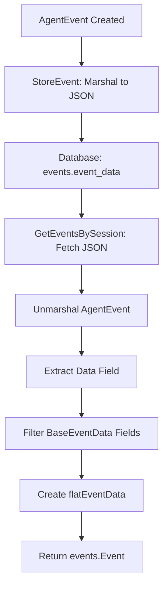

# Past Chat Working

## 📋 Overview

System for restoring and working with past chat sessions. Handles configuration restoration (LLM settings, workspace settings, MCP servers, agent mode) and ensures polling works when replying to restored sessions. Also covers event storage and retrieval conversion from database format to frontend format.

**Key Benefits:**
- Type-safe conversion from database to frontend format
- Consistent structure between polling API and chat history API
- Proper filtering of BaseEventData fields to avoid duplication

---

## 📁 Key Files & Locations

| Component | File Path | Key Functions |
|-----------|-----------|---------------|
| **Database Storage** | [`agent_go/pkg/database/sqlite.go`](file:///Users/mipl/ai-work/mcp-agent-builder-go/agent_go/pkg/database/sqlite.go) | `StoreEvent()`, `GetEventsBySession()` |
| **Event Conversion** | [`agent_go/cmd/server/server.go`](file:///Users/mipl/ai-work/mcp-agent-builder-go/agent_go/cmd/server/server.go) | `convertDBEventToPollingEvent()`, `flatEventData` |
| **Polling API** | [`agent_go/cmd/server/polling.go`](file:///Users/mipl/ai-work/mcp-agent-builder-go/agent_go/cmd/server/polling.go) | `flatEventData` type, DB fallback conversion |
| **Event Models** | [`agent_go/pkg/database/models.go`](file:///Users/mipl/ai-work/mcp-agent-builder-go/agent_go/pkg/database/models.go) | `Event` struct with `EventData json.RawMessage` |
| **Event Types** | [`mcpagent/events/data.go`](file:///Users/mipl/ai-work/mcp-agent-builder-go/mcpagent/events/data.go) | `AgentEvent`, `UserMessageEvent`, `BaseEventData` |

---

## 🔄 How It Works

### Storage Flow

1. **Event Creation**: `AgentEvent` created with typed `EventData` (e.g., `UserMessageEvent`)
2. **Database Storage**: Entire `AgentEvent` marshaled to JSON and stored in `events.event_data`
3. **Batch Insert**: Events buffered and flushed in batches for performance

### Retrieval Flow

1. **Database Query**: Fetch events as `database.Event` with `EventData json.RawMessage`
2. **Unmarshal AgentEvent**: Parse JSON into helper struct with `Data json.RawMessage`
3. **Extract Event Data**: Unmarshal `Data` field into map, filter out BaseEventData fields
4. **Create flatEventData**: Wrap event-specific fields in custom type that serializes directly
5. **Return events.Event**: Convert to polling API format with `Data: *AgentEvent`

---

## 🏗️ Architecture



---

## 🧩 Code Examples

### Storage

```go
// From agent_go/pkg/database/sqlite.go:550
eventData, err := json.Marshal(pending.event)
stmt.ExecContext(ctx, pending.sessionID, chatSessionID, 
    pending.event.Type, pending.event.Timestamp, string(eventData))
```

### Retrieval & Conversion

```go
// From agent_go/cmd/server/server.go:2417
func convertDBEventToPollingEvent(dbEvent database.Event, sessionID string) (*events.Event, error) {
    // Unmarshal AgentEvent structure
    type agentEventWithRawData struct {
        Type           unifiedevents.EventType `json:"type"`
        Timestamp      time.Time               `json:"timestamp"`
        Data           json.RawMessage         `json:"data"`
        // ... other fields
    }
    
    var helper agentEventWithRawData
    json.Unmarshal(dbEvent.EventData, &helper)
    
    // Extract event-specific fields (exclude BaseEventData)
    var dataMap map[string]interface{}
    json.Unmarshal(helper.Data, &dataMap)
    
    baseEventDataFields := map[string]bool{
        "timestamp": true, "hierarchy_level": true, "session_id": true,
        "component": true, "trace_id": true, "span_id": true,
        "event_id": true, "parent_id": true, "is_end_event": true,
        "correlation_id": true, "metadata": true,
    }
    
    actualEventData := make(map[string]interface{})
    for k, v := range dataMap {
        if !baseEventDataFields[k] {
            actualEventData[k] = v
        }
    }
    
    // Create AgentEvent with flatEventData
    agentEvent := unifiedevents.AgentEvent{
        Type: helper.Type,
        Timestamp: helper.Timestamp,
        // ... other fields
        Data: &flatEventData{
            eventData: actualEventData,
            eventType: helper.Type,
        },
    }
    
    return &events.Event{
        ID: dbEvent.ID,
        Type: dbEvent.EventType,
        Data: &agentEvent,
    }, nil
}
```

### flatEventData Type

```go
// From agent_go/cmd/server/server.go:2415
type flatEventData struct {
    eventData map[string]interface{}
    eventType unifiedevents.EventType
}

func (f *flatEventData) GetEventType() unifiedevents.EventType {
    return f.eventType
}

func (f *flatEventData) MarshalJSON() ([]byte, error) {
    return json.Marshal(f.eventData)
}
```

---

## ⚙️ Data Structure

### Database Storage Format

```json
{
  "type": "user_message",
  "timestamp": "2026-01-01T23:03:10Z",
  "event_index": 0,
  "data": {
    "timestamp": "2026-01-01T23:03:10Z",
    "hierarchy_level": 0,
    "content": "Hello",
    "turn": 1,
    "role": "user"
  }
}
```

### Frontend Format (event.data.data)

```json
{
  "content": "Hello",
  "turn": 1,
  "role": "user"
}
```

**Key Point:** `event.data.data` contains only event-specific fields, not BaseEventData fields.

---

## 🛠️ Common Issues & Solutions

| Issue | Cause | Solution |
|-------|-------|----------|
| `event.data.data` is undefined | `GenericEventData` adds extra nesting | Use `flatEventData` type instead |
| BaseEventData fields duplicated | Event types embed `BaseEventData` | Filter out BaseEventData fields before wrapping |
| Content not showing in UI | Wrong structure at `event.data.data` | Ensure `flatEventData.MarshalJSON()` returns only event-specific fields |
| Parse errors on retrieval | Invalid JSON in `event_data` | Check database integrity, verify `StoreEvent` marshaling |

---

## 🔍 For LLMs: Quick Reference

**Key Constraints:**
- ✅ **Allowed**: Filter BaseEventData fields by name, use `flatEventData` for direct serialization
- ❌ **Forbidden**: Using `GenericEventData` (adds extra nesting), including BaseEventData fields in event data

**BaseEventData Fields to Filter:**
```go
baseEventDataFields := map[string]bool{
    "timestamp": true, "trace_id": true, "span_id": true,
    "event_id": true, "parent_id": true, "is_end_event": true,
    "correlation_id": true, "hierarchy_level": true,
    "session_id": true, "component": true, "metadata": true,
}
```

**Conversion Pattern:**
1. Unmarshal `AgentEvent` with `Data json.RawMessage`
2. Unmarshal `Data` into `map[string]interface{}`
3. Filter out BaseEventData fields
4. Create `flatEventData` with filtered map
5. Wrap in `AgentEvent` → `events.Event`

**Example:**
```go
// Extract event-specific fields
actualEventData := make(map[string]interface{})
for k, v := range dataMap {
    if !baseEventDataFields[k] {
        actualEventData[k] = v
    }
}

// Create flatEventData
data := &flatEventData{
    eventData: actualEventData,
    eventType: helper.Type,
}
```

---

## 📖 Related Documentation

- [Frontend API Structure](../docs/frontend_api_structure_data_model.md) - Frontend event expectations
- [Event Type System](../docs/event_type_discriminated_union.md) - Event type definitions
- [Database Schema](../agent_go/pkg/database/schema.sql) - Database structure
