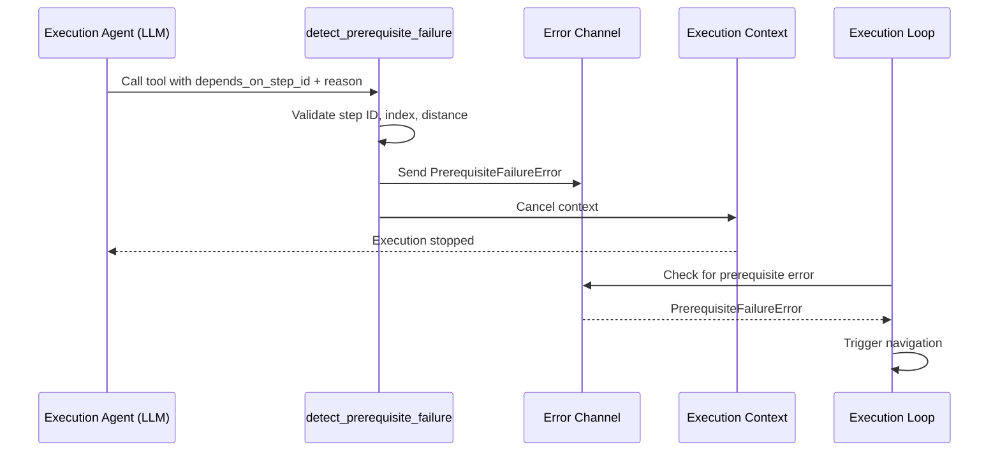

# Prerequisite Failure Detection - Implementation Guide

## 📋 Overview

**Status**: ✅ **COMPLETED**

Prerequisite failure detection allows the execution agent to proactively detect missing prerequisites during step execution and immediately navigate back to the prerequisite step. Users enable prerequisite detection for specific steps and configure **prerequisite rules** - each rule specifies one step dependency and one description of when to detect prerequisite failures.

**Key Design**: The execution agent has access to a special tool `detect_prerequisite_failure` that, when called, immediately stops execution and triggers navigation to the prerequisite step. This is a proactive, tool-based approach rather than post-validation detection.

**Key Benefits:**
- Immediate detection during execution (no need to wait for validation)
- LLM-driven decision making (execution agent decides when prerequisites are missing)
- Single tool handles all prerequisite scenarios via `depends_on_step_id` parameter
- Context cancellation ensures execution stops immediately when tool is called

---

## 📁 Key Files & Locations

| Component | File | Key Functions/Types |
|-----------|------|---------------------|
| **Tool Creation** | [`agent_go/pkg/orchestrator/agents/workflow/todo_creation_human/controller_execution.go`](../agent_go/pkg/orchestrator/agents/workflow/todo_creation_human/controller_execution.go) | `createPrerequisiteDetectionTool()`, `formatPrerequisiteRulesForExecutionAgent()`, `PrerequisiteFailureError` |
| **Tool Registration** | [`agent_go/pkg/orchestrator/agents/workflow/todo_creation_human/controller_agent_factory.go`](../agent_go/pkg/orchestrator/agents/workflow/todo_creation_human/controller_agent_factory.go) | `addPrerequisiteDetectionTool()`, `createExecutionOnlyAgent()` |
| **Execution Loop** | [`agent_go/pkg/orchestrator/agents/workflow/todo_creation_human/controller_execution.go`](../agent_go/pkg/orchestrator/agents/workflow/todo_creation_human/controller_execution.go) | `executeSingleStep()` - channel-based error handling |
| **System Prompt** | [`agent_go/pkg/orchestrator/agents/workflow/todo_creation_human/execution_only_agent.go`](../agent_go/pkg/orchestrator/agents/workflow/todo_creation_human/execution_only_agent.go) | `executionOnlySystemPromptProcessor()` - includes prerequisite rules info |
| **Data Model** | [`agent_go/pkg/orchestrator/agents/workflow/todo_creation_human/controller_execution.go`](../agent_go/pkg/orchestrator/agents/workflow/todo_creation_human/controller_execution.go) | `PrerequisiteInfo`, `PrerequisiteRuleInfo`, `gatherPrerequisiteInfo()` |
| **Frontend Config** | [`frontend/src/components/workflow/canvas/PrerequisiteConfigPanel.tsx`](../frontend/src/components/workflow/canvas/PrerequisiteConfigPanel.tsx) | UI for configuring prerequisite rules |
| **Frontend Visualization** | [`frontend/src/components/workflow/hooks/usePlanToFlow.ts`](../frontend/src/components/workflow/hooks/usePlanToFlow.ts) | `createPrerequisiteEdges()` - creates prerequisite edges in React Flow |

---

## 🔄 How It Works

### 1. Configuration

User enables prerequisite detection and configures rules in the UI:

```json
{
  "steps": [{
    "id": "step-2",
    "agent_configs": {
      "enable_prerequisite_detection": true,
      "prerequisite_rules": [
        {
          "depends_on_step": "step-0",
          "description": "If login session is missing or expired, go back to step 0"
        }
      ]
    }
  }]
}
```

### 2. Tool Registration

During step execution, if prerequisite detection is enabled:

1. **Gather Prerequisite Info**: `gatherPrerequisiteInfo()` collects prerequisite rules and dependency step information
   - Checks if `enable_prerequisite_detection` is enabled in step config
   - Validates prerequisite rules (skips rules with empty `depends_on_step`)
   - Collects dependency step info (step ID, index, title, completion status, context output)
   - Returns `PrerequisiteInfo` with validated rules
2. **Create Cancellable Context**: Execution context is wrapped with `context.WithCancel()` to allow immediate cancellation
3. **Create Error Channel**: Buffered channel (`chan *PrerequisiteFailureError`, buffer size 1) is created to receive errors from tool
4. **Create Agent**: `createExecutionOnlyAgent()` is called with prerequisite info and error channel
5. **Register Tool**: `addPrerequisiteDetectionTool()` registers `detect_prerequisite_failure` tool **after** agent creation:
   - Tool executor validates `depends_on_step_id` against configured rules
   - Tool executor validates step index, navigation distance, and prerequisites
   - On success, tool sends error to channel and cancels execution context
6. **Update System Prompt**: Prerequisite rules are formatted and added to execution agent's system prompt via `formatPrerequisiteRulesForExecutionAgent()`

### 3. Tool Execution Flow



### 4. Immediate Cancellation

When the tool is called:

1. **Validation**: Tool validates:
   - `depends_on_step_id` exists in prerequisite rules
   - Step index exists in plan
   - Target step is before current step
   - Navigation distance ≤ 10 steps

2. **Error Creation**: Creates `PrerequisiteFailureError` with:
   - `DependsOnStepID`: The step ID to navigate to
   - `StepIndex`: 0-based step index
   - `Reason`: User-provided reason

3. **Channel Send**: Sends error to channel (non-blocking)

4. **Context Cancellation**: Calls `cancelFunc()` to immediately stop agent execution

5. **Return**: Returns empty string (execution already stopped)

### 5. Error Handling in Execution Loop

After `Execute()` returns (due to context cancellation):

```go
// Check for prerequisite failure (from tool call via channel)
var prereqErr *PrerequisiteFailureError
select {
case prereqErr = <-prereqErrChan:
    // Prerequisite failure detected - tool called and context was cancelled
default:
    // No prerequisite failure - check for other errors
}
```

If prerequisite error found:
1. Find target step by ID in `allSteps` array (more reliable than using computed index)
2. Validate target step:
   - Step index exists and is valid
   - Target step is before current step
   - Navigation distance ≤ 10 steps
   - Step index is within bounds
3. Clean up progress from target step onward via `cleanupProgressFromStep()`
4. Emit `PrerequisiteNavigationEvent` with from/to step indices and IDs
5. Return navigation error to restart from target step

**Navigation Logic**:
- Uses step ID lookup first (more reliable than index)
- Validates multiple constraints before navigation
- Logs warnings for invalid navigation attempts (doesn't crash)

---

## 🏗️ Architecture

### Tool Registration

**File**: [`controller_agent_factory.go:362-409`](../agent_go/pkg/orchestrator/agents/workflow/todo_creation_human/controller_agent_factory.go#L362)

Tool registration is done via `addPrerequisiteDetectionTool()` method, which is called after agent creation:

```go
func (hcpo *HumanControlledTodoPlannerOrchestrator) addPrerequisiteDetectionTool(
    prerequisiteInfo *PrerequisiteInfo,
    allSteps []PlanStepInterface,  // Note: Uses PlanStepInterface, not TodoStep
    currentStepIndex int,
    cancelFunc context.CancelFunc,
    prereqErrChan chan<- *PrerequisiteFailureError,
    agentName string,
    mcpAgent *mcpagent.Agent,
) error {
    if prerequisiteInfo == nil || len(prerequisiteInfo.PrerequisiteRules) == 0 {
        return nil // No prerequisite detection needed
    }

    toolExecutor := hcpo.createPrerequisiteDetectionTool(
        prerequisiteInfo, allSteps, currentStepIndex, 
        cancelFunc, prereqErrChan)
    
    toolParams := map[string]interface{}{
        "type": "object",
        "properties": map[string]interface{}{
            "depends_on_step_id": map[string]interface{}{
                "type":        "string",
                "description": "Step ID from one of the prerequisite rules to navigate back to (e.g., \"step-0\")",
            },
            "reason": map[string]interface{}{
                "type":        "string",
                "description": "Brief explanation of why the prerequisite failure was detected, matching the condition described in the prerequisite rule",
            },
        },
        "required": []string{"depends_on_step_id", "reason"},
    }
    
    toolDescription := "Detect a prerequisite failure and navigate back to a prerequisite step. Call this tool when you detect that a prerequisite condition (as described in the prerequisite rules) is met during execution. Execution will stop and automatically navigate back to the specified prerequisite step."
    
    // Use "structured_output" category so it's always available even in code execution mode
    return mcpAgent.RegisterCustomTool(
        "detect_prerequisite_failure",
        toolDescription,
        toolParams,
        toolExecutor,
        "structured_output",
    )
}
```

**Key Points**:
- Called **after** agent creation (must be called AFTER the agent is created)
- Uses `[]PlanStepInterface` type (not `[]TodoStep`)
- Tool category is `"structured_output"` to ensure availability in code execution mode

### Tool Executor

**File**: [`controller_execution.go:459-538`](../agent_go/pkg/orchestrator/agents/workflow/todo_creation_human/controller_execution.go#L459)

The tool executor:
1. Extracts and validates parameters (`depends_on_step_id` and `reason` must be non-empty strings)
2. Validates `depends_on_step_id` is in configured prerequisite rules (validates against `validPrerequisiteStepIDs` map)
3. Validates step index exists in plan (looks up step ID in `stepIDToIndex` map)
4. Validates dependency step is before current step (`stepIndex < currentStepIndex`)
5. Validates navigation distance ≤ 10 steps (`navigationDistance = currentStepIndex - stepIndex`)
6. Creates `PrerequisiteFailureError` with step ID, index, and reason
7. Logs prerequisite failure detection
8. Sends error to channel (non-blocking with `select` and `default`)
9. Cancels execution context via `cancelFunc()`
10. Returns empty string (execution already stopped by context cancellation)

**Validation Details**:
- Returns error if `depends_on_step_id` is empty or not in prerequisite rules
- Returns error if step ID not found in plan steps
- Returns error if target step is not before current step
- Returns error if navigation distance exceeds 10 steps
- Logs warning if channel is full or closed (but still cancels execution)

### System Prompt Integration

**File**: [`execution_only_agent.go`](../agent_go/pkg/orchestrator/agents/workflow/todo_creation_human/execution_only_agent.go)

Prerequisite rules are formatted via `formatPrerequisiteRulesForExecutionAgent()` and included in the system prompt template:

```go
{{if .PrerequisiteRulesInfo}}{{.PrerequisiteRulesInfo}}{{end}}
```

The formatted text includes:
- Available prerequisite rules with step IDs and descriptions
- Instructions on when to call `detect_prerequisite_failure`
- How to use the tool (parameters, behavior)

---

## 🧩 Code Examples

### Tool Executor Implementation

```go
func (hcpo *HumanControlledTodoPlannerOrchestrator) createPrerequisiteDetectionTool(
    prerequisiteInfo *PrerequisiteInfo, 
    allSteps []PlanStepInterface,  // Note: Uses PlanStepInterface
    currentStepIndex int, 
    cancelFunc context.CancelFunc, 
    prereqErrChan chan<- *PrerequisiteFailureError,
) func(ctx context.Context, args map[string]interface{}) (string, error) {
    // Create map of step ID to step index for validation
    stepIDToIndex := make(map[string]int)
    for i, s := range allSteps {
        if s.GetID() != "" {
            stepIDToIndex[s.GetID()] = i
        }
    }

    // Create map of valid prerequisite step IDs (from rules)
    validPrerequisiteStepIDs := make(map[string]PrerequisiteRuleInfo)
    for _, rule := range prerequisiteInfo.PrerequisiteRules {
        validPrerequisiteStepIDs[rule.DependsOnStep] = rule
    }
    
    return func(ctx context.Context, args map[string]interface{}) (string, error) {
        // Extract and validate parameters
        dependsOnStepID, ok := args["depends_on_step_id"].(string)
        if !ok || dependsOnStepID == "" {
            return "", fmt.Errorf("depends_on_step_id parameter is required and must be a non-empty string")
        }

        reason, ok := args["reason"].(string)
        if !ok || reason == "" {
            return "", fmt.Errorf("reason parameter is required and must be a non-empty string")
        }
        
        // Validate step ID is in prerequisite rules
        _, isValid := validPrerequisiteStepIDs[dependsOnStepID]
        if !isValid {
            // Return error with valid IDs
            return "", fmt.Errorf("invalid depends_on_step_id: %s. Valid prerequisite step IDs are: %v", dependsOnStepID, validIDs)
        }
        
        // Get step index and validate
        stepIndex, exists := stepIDToIndex[dependsOnStepID]
        if !exists {
            return "", fmt.Errorf("step ID %s not found in plan steps", dependsOnStepID)
        }
        
        // Validate: dependency step must be before current step
        if stepIndex >= currentStepIndex {
            return "", fmt.Errorf("prerequisite step %s (index %d) must be before current step %d", dependsOnStepID, stepIndex, currentStepIndex)
        }
        
        // Check max navigation distance (safety limit: 10 steps)
        navigationDistance := currentStepIndex - stepIndex
        if navigationDistance > 10 {
            return "", fmt.Errorf("navigation distance %d exceeds maximum (10 steps)", navigationDistance)
        }
        
        // Create error
        prereqErr := &PrerequisiteFailureError{
            DependsOnStepID: dependsOnStepID,
            StepIndex:       stepIndex,
            Reason:          reason,
        }
        
        hcpo.GetLogger().Info(fmt.Sprintf("🔄 Prerequisite failure detected via tool call: %s (navigate to step %s, index %d) - stopping execution immediately", reason, dependsOnStepID, stepIndex))
        
        // Send to channel (non-blocking)
        select {
        case prereqErrChan <- prereqErr:
        default:
            // Channel full or closed - log warning but continue
            hcpo.GetLogger().Warn("⚠️ Prerequisite error channel full or closed, but continuing with cancellation")
        }
        
        // Cancel execution immediately
        if cancelFunc != nil {
            cancelFunc()
        }
        
        return "", nil
    }
}
```

### Execution Loop Integration

**File**: [`controller_execution.go:1279-1376`](../agent_go/pkg/orchestrator/agents/workflow/todo_creation_human/controller_execution.go#L1279)

```go
// Create cancellable context
executionCtx, cancelExecution := context.WithCancel(ctx)
defer cancelExecution()

// Create error channel
prereqErrChan := make(chan *PrerequisiteFailureError, 1)

// Create agent with tool registration
// Note: stepIDOverride parameter added for sub-agent support
executionAgent, err := hcpo.createExecutionOnlyAgent(
    executionCtx, "execution_only", stepPath, executionAgentName, 
    step.AgentConfigs, isRetryAfterValidationFailure, retryAttempt, 
    prerequisiteInfoForExecution, allSteps, stepIndex, 
    cancelExecution, prereqErrChan, step.GetID(), // stepIDOverride parameter
)

// Execute agent
executionResult, executionConversationHistory, err := executionAgent.Execute(
    executionCtx, templateVars, []llmtypes.MessageContent{},
)

// Check for prerequisite failure (from tool call via channel)
var prereqErr *PrerequisiteFailureError
select {
case prereqErr = <-prereqErrChan:
    // Prerequisite failure detected - tool called and context was cancelled
    hcpo.GetLogger().Info(fmt.Sprintf("🔄 Prerequisite failure detected via tool call for step %d: %s (target step: %d)", stepIndex+1, prereqErr.Reason, prereqErr.StepIndex+1))
default:
    // No prerequisite failure - check for other errors
    if err != nil {
        // Check if this is a prerequisite failure error (legacy check - should not happen with new implementation)
        var legacyPrereqErr *PrerequisiteFailureError
        if errors.As(err, &legacyPrereqErr) {
            prereqErr = legacyPrereqErr
        }
    }
}

if prereqErr != nil {
    // Find target step by ID (more reliable than using computed index)
    targetStepID := prereqErr.DependsOnStepID
    targetStepIndex := -1
    if targetStepID != "" && allSteps != nil {
        for idx, s := range allSteps {
            if s.GetID() == targetStepID {
                targetStepIndex = idx
                break
            }
        }
    }
    
    // Validate target step (index, distance, branch constraints)
    // ... validation logic ...
    
    // Clean up progress from target step onward
    hcpo.cleanupProgressFromStep(ctx, targetStepIndex, progress)
    
    // Emit PrerequisiteNavigationEvent
    // ... event emission ...
    
    // Return navigation error to restart from target step
    return "", updatedContextFiles, fmt.Errorf("prerequisite failure: %w", prereqErr)
}
```

**Key Changes**:
- `createExecutionOnlyAgent()` now includes `stepIDOverride` parameter
- Error handling includes legacy check for prerequisite errors in `err` (backward compatibility)
- Navigation logic finds step by ID first, then validates index
- Target step validation includes multiple checks (index exists, is before current step, distance ≤ 10)

---

## ⚙️ Configuration

### Step Configuration

| Field | Type | Default | Purpose |
|-------|------|---------|---------|
| `enable_prerequisite_detection` | `boolean` | `false` | Enable prerequisite detection for this step |
| `prerequisite_rules` | `PrerequisiteRule[]` | `[]` | Array of prerequisite rules |

### Prerequisite Rule Structure

| Field | Type | Required | Purpose |
|-------|------|----------|---------|
| `depends_on_step` | `string` | Yes | Step ID this rule depends on (e.g., `"step-0"`) |
| `description` | `string` | Yes | Natural language description of when to detect prerequisite failure |

### Tool Parameters

| Parameter | Type | Required | Purpose |
|-----------|------|----------|---------|
| `depends_on_step_id` | `string` | Yes | Step ID from prerequisite rules to navigate to |
| `reason` | `string` | Yes | Brief explanation of why prerequisite failure was detected |

---

## 🛠️ Common Issues & Solutions

| Issue | Cause | Solution |
|-------|-------|----------|
| Tool not available in execution agent | Prerequisite detection not enabled or no rules configured | Check `enable_prerequisite_detection` and `prerequisite_rules` in step config |
| Execution doesn't stop immediately | Context cancellation not working | Verify `cancelFunc` is passed correctly to tool executor |
| Prerequisite error not detected | Channel not checked after Execute() | Ensure `select` statement checks channel after `Execute()` returns |
| Invalid step ID error | Step ID not in prerequisite rules | Verify `depends_on_step_id` matches a configured rule's `depends_on_step` |
| Navigation distance exceeded | Target step too far back | Maximum 10 steps - check step indices |

---

## 🔍 For LLMs: Quick Reference

### Constraints

✅ **Allowed:**
- Calling `detect_prerequisite_failure` when prerequisite condition is met
- Using any configured `depends_on_step_id` from prerequisite rules
- Providing clear reason for prerequisite failure

❌ **Forbidden:**
- Calling tool with step IDs not in prerequisite rules
- Calling tool for execution failures (not prerequisite failures)
- Navigating more than 10 steps back

### Tool Usage Pattern

```go
// When prerequisite condition is detected:
detect_prerequisite_failure({
    "depends_on_step_id": "step-0",  // Must match a configured rule
    "reason": "Login session expired" // Brief explanation
})
```

### System Prompt Format

The execution agent receives prerequisite rules in this format:

```
## 🔄 Prerequisite Detection

**Prerequisite detection is enabled for this step.** If you detect that a prerequisite condition described below is met during execution, you can call the `detect_prerequisite_failure` tool to navigate back to the prerequisite step.

### Available Prerequisite Rules:

**Rule 1:**
- **Step ID**: `step-0` (Step 1: Login to Website)
- **Condition**: If login session is missing or expired, go back to step 0

### How to Use:
1. Call `detect_prerequisite_failure` with:
   - `depends_on_step_id`: The step ID from the matching rule
   - `reason`: A brief explanation
2. Execution will stop and automatically navigate back
```

---

## 📊 Data Model

### PrerequisiteFailureError

```go
type PrerequisiteFailureError struct {
    DependsOnStepID string // Step ID to navigate back to
    StepIndex       int    // 0-based step index (computed from step ID)
    Reason          string // Reason for prerequisite failure
}
```

### PrerequisiteInfo

```go
type PrerequisiteInfo struct {
    CurrentStepID               string                 `json:"current_step_id"`
    CurrentStepIndex            int                    `json:"current_step_index"`
    EnablePrerequisiteDetection bool                   `json:"enable_prerequisite_detection"`
    PrerequisiteRules           []PrerequisiteRuleInfo `json:"prerequisite_rules"`
}

type PrerequisiteRuleInfo struct {
    DependsOnStep      string             `json:"depends_on_step"`
    Description        string             `json:"description"`
    DependencyStepInfo DependencyStepInfo `json:"dependency_step_info"`
}
```

---

## 🎯 Safety Limits

| Limit | Value | Purpose |
|-------|-------|---------|
| **Max Navigation Distance** | 10 steps | Prevents excessive backtracking |
| **Channel Buffer Size** | 1 | Single error per execution |
| **Validation** | Multiple checks | Step ID, index, distance, branch constraints |

---

## ✅ Implementation Status

1. ✅ **Data Model**: `PrerequisiteRule`, `PrerequisiteInfo`, `PrerequisiteFailureError`
2. ✅ **Tool Creation**: `createPrerequisiteDetectionTool()` with context cancellation
3. ✅ **Tool Registration**: Registered in `createExecutionOnlyAgent()` with `structured_output` category
4. ✅ **System Prompt**: `formatPrerequisiteRulesForExecutionAgent()` adds rules to execution agent prompt
5. ✅ **Execution Loop**: Channel-based error detection in `executeSingleStep()`
6. ✅ **Navigation Logic**: Progress cleanup and event emission
7. ✅ **Frontend UI**: `PrerequisiteConfigPanel` for rule configuration
8. ✅ **Frontend Visualization**: Prerequisite edges in React Flow

---

## 📖 Related Documentation

- [Workflow Execution Guide](../workflow_execution.md) - Overall workflow execution flow
- [Agent Factory Guide](../agent_factory.md) - Agent creation and tool registration
- [Event System](../events.md) - Event types and handling
