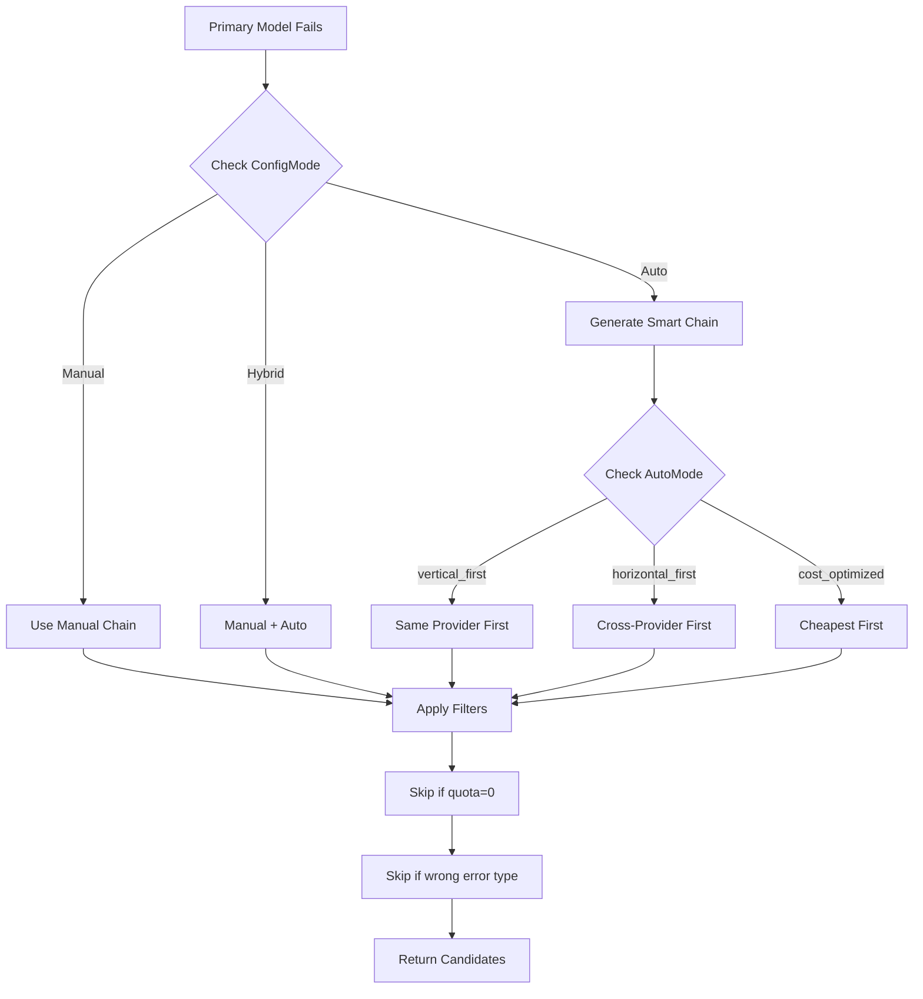

# Tiered Fallback System Refactoring

**Status**: Proposed Design
**Created**: 2026-01-04
**Target**: multi-llm-provider-go, mcpagent, mcp-agent-builder-go

---

## 📋 Overview

Current LLM fallback system uses fixed environment-based configuration with limited cross-provider options (e.g., Bedrock → OpenAI only). This refactoring introduces a two-dimensional tiered fallback strategy: vertical (within provider by tier) and horizontal (cross-provider by same tier).

**Key Benefits:**
- User-defined manual chains via UI (drag-and-drop)
- Intelligent auto-generation (cost/performance optimized)
- Tier-aware fallback (Premium → Standard → Economy)
- Cross-provider awareness (rate limit → switch provider)

---

## 📁 Key Files & Locations

| Component | File | Key Types/Functions |
|-----------|------|---------------------|
| **Model Registry** | `multi-llm-provider-go/model_tiers.go` | `ModelCapability`, `ModelTier`, `GetModelsByProvider()` |
| **Fallback Strategy** | `multi-llm-provider-go/fallback_strategy.go` | `FallbackStrategy`, `ManualFallbackModel`, `FallbackMode` |
| **Fallback Generator** | `multi-llm-provider-go/fallback_generator.go` | `GenerateFallbackChain()`, `FallbackCandidate` |
| **Agent Integration** | `mcpagent/agent/agent.go` | `Agent.FallbackStrategy`, `WithFallbackStrategy()` |
| **LLM Generation** | `mcpagent/agent/llm_generation.go` | `prepareFallbackModels()`, `handleErrorWithFallback()` |
| **Orchestrator Config** | `mcp-agent-builder-go/agent_go/pkg/orchestrator/base_orchestrator_types.go` | `LLMConfig`, `FallbackStrategyConfig` |
| **LLM Creation** | `mcp-agent-builder-go/agent_go/pkg/orchestrator/llm/base_llm.go` | `CreateLLMInstance()`, `convertFallbackStrategyFromConfig()` |

---

## 🔄 Current System Problems

| Problem | Location | Impact |
|---------|----------|--------|
| **Fixed env-based fallback** | `multi-llm-provider-go/providers.go:920-1020` | All users get same global fallback |
| **Limited cross-provider** | `GetCrossProviderFallbackModels()` | Bedrock → OpenAI only (hardcoded) |
| **No per-user config** | Environment variables | Cannot customize per workflow/user |
| **No intelligence** | Switch statement logic | No cost/latency/capability awareness |
| **No UI control** | N/A | Users cannot define custom chains |

---

## 🏗️ Proposed Architecture

### Three Configuration Modes

| Mode | Description | Use Case |
|------|-------------|----------|
| **Manual** | User defines exact order via UI | Explicit control, compliance requirements |
| **Auto** | System generates intelligent chain | Quick setup, trust system optimization |
| **Hybrid** | Manual first, then auto backups | Best of both (control + safety net) |

### Fallback Strategies (Auto Mode)

| Strategy | Behavior | Example |
|----------|----------|---------|
| `vertical_first` | Same provider, tier downgrade first | Opus → Sonnet → Haiku → GPT-5 |
| `horizontal_first` | Same tier, cross-provider first | Opus → GPT-5 → Gemini-exp → Sonnet |
| `cost_optimized` | Always pick cheapest | Sort by cost ascending |
| `performance_optimized` | Always pick fastest | Sort by latency ascending |

### System Flow



---

## 💻 Core Implementation

### 1. Model Capability Registry

**File**: `multi-llm-provider-go/model_tiers.go`

```go
type ModelTier string

const (
    TierPremium  ModelTier = "premium"  // Opus, GPT-5, Gemini-exp
    TierStandard ModelTier = "standard" // Sonnet, GPT-4, Gemini-2.0
    TierEconomy  ModelTier = "economy"  // Haiku, GPT-3.5, Gemini-1.5
)

type ModelCapability struct {
    Tier             ModelTier
    Provider         Provider
    ModelID          string
    InputCost        float64 // Per 1M tokens
    OutputCost       float64
    ContextWindow    int
    SupportsTools    bool
    SupportsStreaming bool
    AvailableRegions []string
}

var ModelRegistry = map[string]ModelCapability{
    "claude-opus-4.5": {
        Tier: TierPremium, Provider: ProviderAnthropic,
        InputCost: 15.0, OutputCost: 75.0,
        ContextWindow: 200000, SupportsTools: true,
    },
    // ... more models
}

func GetModelsByProvider(provider Provider) []ModelCapability
func GetModelsByTier(tier ModelTier) []ModelCapability
func GetModelCapability(modelID string) (ModelCapability, bool)
```

### 2. Fallback Strategy

**File**: `multi-llm-provider-go/fallback_strategy.go`

```go
type FallbackStrategy struct {
    ConfigMode FallbackConfigMode // "manual", "auto", "hybrid"

    // Manual configuration
    ManualChain []ManualFallbackModel

    // Auto configuration
    AutoMode              FallbackMode
    AllowTierDowngrade    bool
    AllowCrossProvider    bool
    MaxCostMultiplier     float64
    PreferredProviders    []Provider
    RequireTools          bool
    RequireRegion         string
}

type ManualFallbackModel struct {
    Provider      string
    ModelID       string
    Priority      int
    OnlyForErrors []string // ["rate_limit", "quota_exceeded"]
    SkipIfNoQuota bool
}

func NewManualFallbackStrategy(chain []ManualFallbackModel) *FallbackStrategy
func NewAutoFallbackStrategy(mode FallbackMode) *FallbackStrategy
func NewHybridFallbackStrategy(manual []ManualFallbackModel, autoMode FallbackMode) *FallbackStrategy
```

### 3. Fallback Generator

**File**: `multi-llm-provider-go/fallback_generator.go`

```go
type FallbackCandidate struct {
    Model      ModelCapability
    Priority   int
    Reason     string
    CostRatio  float64
}

type ErrorContext struct {
    ErrorType      string // "rate_limit", "quota_exceeded"
    Provider       Provider
    QuotaRemaining int
}

func GenerateFallbackChain(
    primaryModelID string,
    strategy *FallbackStrategy,
    errorContext *ErrorContext,
) ([]FallbackCandidate, error)

func generateManualFallbacks(...) ([]FallbackCandidate, error)
func generateVerticalFirstFallbacks(...) []FallbackCandidate
func generateHorizontalFirstFallbacks(...) []FallbackCandidate
func applyFilters(...) []FallbackCandidate
```

### 4. Agent Integration

**File**: `mcpagent/agent/agent.go`

```go
type Agent struct {
    // ... existing fields
    FallbackStrategy *llmproviders.FallbackStrategy // NEW
}

func WithFallbackStrategy(strategy *llmproviders.FallbackStrategy) AgentOption {
    return func(a *Agent) {
        a.FallbackStrategy = strategy
    }
}
```

**File**: `mcpagent/agent/llm_generation.go`

```go
func (a *Agent) prepareFallbackModels() (llm.Provider, []llmproviders.FallbackCandidate, error) {
    strategy := a.FallbackStrategy
    if strategy == nil {
        strategy = llmproviders.NewAutoFallbackStrategy(llmproviders.FallbackModeVerticalFirst)
    }

    errorCtx := &llmproviders.ErrorContext{Provider: a.provider}
    return llmproviders.GenerateFallbackChain(a.ModelID, strategy, errorCtx)
}
```

---

## 🧩 Usage Examples

### Manual Chain (UI-Driven)

```go
manualChain := []llmproviders.ManualFallbackModel{
    {Provider: "anthropic", ModelID: "claude-opus-4.5", Priority: 1},
    {Provider: "anthropic", ModelID: "claude-sonnet-4.5", Priority: 2},
    {Provider: "openai", ModelID: "gpt-4", Priority: 3,
     OnlyForErrors: []string{"rate_limit"}},
}

agent, _ := mcpagent.NewAgent(ctx, llm, configPath,
    mcpagent.WithFallbackStrategy(
        llmproviders.NewManualFallbackStrategy(manualChain),
    ),
)
```

### Auto Horizontal-First (Rate Limits)

```go
strategy := &llmproviders.FallbackStrategy{
    ConfigMode: llmproviders.FallbackConfigAuto,
    AutoMode: llmproviders.FallbackModeHorizontalFirst,
    PreferredProviders: []llmproviders.Provider{
        llmproviders.ProviderOpenAI,
        llmproviders.ProviderVertex,
    },
}

agent, _ := mcpagent.NewAgent(ctx, llm, configPath,
    mcpagent.WithFallbackStrategy(strategy),
)
```

### Cost-Optimized

```go
strategy := &llmproviders.FallbackStrategy{
    ConfigMode: llmproviders.FallbackConfigAuto,
    AutoMode: llmproviders.FallbackModeCostOptimized,
    MaxCostMultiplier: 0.5, // Never exceed 50% cost of primary
}

agent, _ := mcpagent.NewAgent(ctx, llm, configPath,
    mcpagent.WithFallbackStrategy(strategy),
)
```

---

## ⚙️ Configuration

### Frontend JSON (UI to Backend)

```json
{
  "provider": "anthropic",
  "model_id": "claude-opus-4.5",
  "fallback_strategy": {
    "config_mode": "manual",
    "manual_chain": [
      {
        "provider": "anthropic",
        "model_id": "claude-sonnet-4.5",
        "priority": 1,
        "label": "Cost Backup"
      },
      {
        "provider": "openai",
        "model_id": "gpt-4",
        "priority": 2,
        "only_for_errors": ["rate_limit"]
      }
    ]
  }
}
```

### Orchestrator Config Types

**File**: `mcp-agent-builder-go/agent_go/pkg/orchestrator/base_orchestrator_types.go`

```go
type LLMConfig struct {
    Provider         string                   `json:"provider"`
    ModelID          string                   `json:"model_id"`
    FallbackStrategy *FallbackStrategyConfig  `json:"fallback_strategy,omitempty"`
    APIKeys          *APIKeys                 `json:"api_keys,omitempty"`
}

type FallbackStrategyConfig struct {
    ConfigMode  string                `json:"config_mode"` // "manual"|"auto"|"hybrid"
    ManualChain []ManualFallbackModel `json:"manual_chain,omitempty"`
    AutoConfig  *AutoFallbackConfig   `json:"auto_config,omitempty"`
}
```

---

## 📅 Implementation Plan

| Phase | Duration | Tasks | Files |
|-------|----------|-------|-------|
| **1. Model Registry** | Week 1 | Create tiers, populate registry, add helpers | `model_tiers.go` |
| **2. Fallback Strategy** | Week 2 | Implement strategy types, generators, filters | `fallback_strategy.go`, `fallback_generator.go` |
| **3. Agent Integration** | Week 3 | Update Agent struct, modify llm_generation.go | `agent.go`, `llm_generation.go` |
| **4. Orchestrator** | Week 4 | Add config types, conversion logic | `base_orchestrator_types.go`, `base_llm.go` |
| **5. Migration** | Week 5 | Deprecation warnings, migration guide | All files |

---

## 🛠️ Migration Guide

### Old System → New System

| Old Approach | New Approach |
|--------------|--------------|
| `BEDROCK_FALLBACK_MODELS=model1,model2` | Use `NewAutoFallbackStrategy(FallbackModeVerticalFirst)` |
| `WithCrossProviderFallback(...)` | Use `WithFallbackStrategy(...)` |
| Hardcoded cross-provider | Configure `PreferredProviders` in strategy |

**Example Migration**:

```go
// Before
agent, _ := mcpagent.NewAgent(ctx, llm, configPath,
    mcpagent.WithCrossProviderFallback(&mcpagent.CrossProviderFallback{
        Provider: "openai",
        Models: []string{"gpt-4"},
    }),
)

// After
strategy := llmproviders.NewHybridFallbackStrategy(
    []llmproviders.ManualFallbackModel{
        {Provider: "openai", ModelID: "gpt-4", Priority: 1},
    },
    llmproviders.FallbackModeVerticalFirst,
)

agent, _ := mcpagent.NewAgent(ctx, llm, configPath,
    mcpagent.WithFallbackStrategy(strategy),
)
```

---

## 🔍 For LLMs: Quick Reference

### Constraints

✅ **Allowed:**
- Manual chain with any model order
- Auto-generation with cost/feature filters
- Hybrid mode (manual + auto)
- Error-specific fallbacks (`OnlyForErrors`)
- Quota-aware skipping (`SkipIfNoQuota`)

❌ **Forbidden:**
- Empty manual chain (must have ≥1 model)
- Invalid model IDs (not in registry)
- Negative priorities
- Cost multiplier < 0

### Fallback Decision Logic

```
1. Check ConfigMode (manual/auto/hybrid)
2. Generate candidates:
   - Manual: Use ManualChain (sorted by priority)
   - Auto: Use AutoMode strategy (vertical/horizontal/cost/perf)
   - Hybrid: Manual first, then auto
3. Apply filters:
   - OnlyForErrors check
   - SkipIfNoQuota check
   - MaxCostMultiplier check
   - RequireTools/Region/Streaming checks
4. Sort by priority (lower = higher priority)
5. Return ordered candidates
```

### Example Template Code

```go
// Vertical-first (same provider tier downgrade)
strategy := llmproviders.NewAutoFallbackStrategy(
    llmproviders.FallbackModeVerticalFirst,
)

// Horizontal-first (cross-provider same tier)
strategy := &llmproviders.FallbackStrategy{
    ConfigMode: llmproviders.FallbackConfigAuto,
    AutoMode: llmproviders.FallbackModeHorizontalFirst,
    AllowCrossProvider: true,
}

// Manual with error-specific fallback
manualChain := []llmproviders.ManualFallbackModel{
    {
        Provider: "anthropic", ModelID: "claude-sonnet-4.5",
        Priority: 1,
    },
    {
        Provider: "openai", ModelID: "gpt-4",
        Priority: 2,
        OnlyForErrors: []string{"rate_limit", "quota_exceeded"},
    },
}
strategy := llmproviders.NewManualFallbackStrategy(manualChain)
```

---

## 📖 Related Documentation

- **MCP Agent Architecture** - `mcp-agent-builder-go/docs/architecture.md`
- **LLM Provider Guide** - `multi-llm-provider-go/README.md`
- **Agent Options Reference** - `mcpagent/docs/agent-options.md`
- **Orchestrator Configuration** - `mcp-agent-builder-go/docs/orchestrator-config.md`

---

## 📊 Cost Comparison (Fallback Example)

**Scenario**: Primary `claude-opus-4.5` fails, 1M input tokens

| Fallback Model | Provider | Tier | Cost | Cost Ratio | Mode |
|----------------|----------|------|------|------------|------|
| claude-sonnet-4.5 | Anthropic | Standard | $3.00 | 0.2x | Vertical |
| claude-haiku-4.5 | Anthropic | Economy | $0.25 | 0.017x | Vertical |
| gpt-5 | OpenAI | Premium | $15.00 | 1.0x | Horizontal |
| gpt-4 | OpenAI | Standard | $5.00 | 0.33x | Horizontal |
| gemini-2.0-flash | Vertex | Standard | $2.50 | 0.17x | Horizontal |
| gemini-1.5-flash | Vertex | Economy | $0.075 | 0.005x | Cost-Opt |

**With `MaxCostMultiplier = 0.5`**: Only models ≤ $7.50 allowed (excludes gpt-5)

---

**End of Document**
