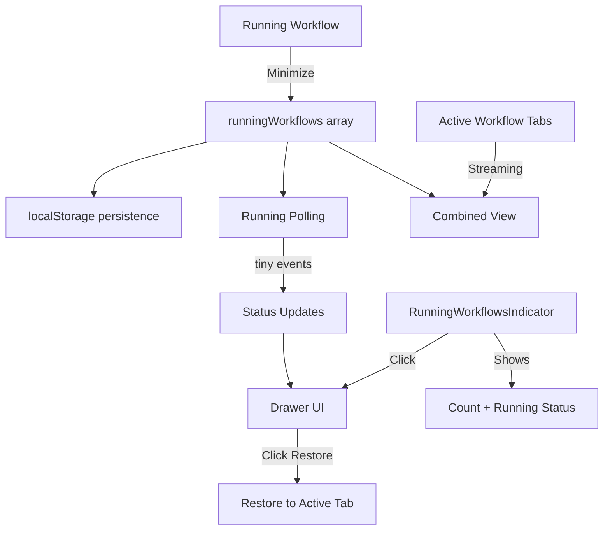

# Running Workflows (Multiple Workflow Frontend)

## Overview

Running workflows allow users to minimize active workflows, work on other tasks (chat, different workflows), and restore them later. The system provides a unified view of both **tracked workflows** (minimized) and **active workflow tabs** (streaming).

**Key Benefits:**
- Continue working while workflows execute in background
- Track progress of multiple workflows simultaneously
- View current step, agent name, and execution stats
- Restore workflows with preserved session state
- Persistent across page refreshes (localStorage)

---

## Key Files & Locations

| Component | File Path | Key Functions/Exports |
|-----------|-----------|---------------------|
| **Workflow Store** | `frontend/src/stores/useWorkflowStore.ts` | `RunningWorkflow`, `minimizeWorkflow()`, `restoreWorkflow()`, `pollRunningWorkflows()`, `useRunningWorkflows()` |
| **Indicator** | `frontend/src/components/workflow/RunningWorkflowsIndicator.tsx` | Floating badge showing running workflow count (tracked + active tabs) |
| **Drawer** | `frontend/src/components/workflow/RunningWorkflowsDrawer.tsx` | Right-side drawer listing all running workflows |
| **Layout Integration** | `frontend/src/components/workflow/WorkflowLayout.tsx` | `handleRestoreWorkflow()` |
| **Chat Tabs** | `frontend/src/components/workflow/WorkflowChatTabs.tsx` | `handleMinimizeWorkflow()` |
| **Store Exports** | `frontend/src/stores/index.ts` | `useRunningWorkflows`, `useShowRunningDrawer` |

---

## System Flow

### Minimize Flow

1. **User clicks minimize** in workflow chat header
2. **Capture workflow context**: presetId, phaseId, sessionId, runFolder, progress
3. **Close workflow tabs** without stopping backend session (`closeTab(tabId, false, true)`)
4. **Save to runningWorkflows** array with `status: 'running'`
5. **Start running polling** if not already running

### Restore Flow

1. **User clicks workflow** in drawer
2. **Switch to workflow's preset** if different from current
3. **Set run folder** context
4. **Find or create tab** connected to session
5. **Switch to tab** and show chat area

### Running Polling Flow

1. **Polling starts** when workflow minimized (every 3 seconds)
2. **Check session status** from API response (`session_status` field)
3. **Fetch events** using `tiny` mode (minimal event data)
4. **Update status** based on session status and completion events
5. **Update progress** based on `step_progress_updated` events
6. **Extract current step** title from `step_execution_start` events

---

## Architecture



---

## Data Model

```typescript
interface RunningWorkflow {
  id: string                    // Unique ID
  presetId: string              // For preset switching on restore
  presetName: string            // Display name
  workspacePath: string         // Workspace context
  sessionId: string             // Backend session ID (for reconnection)
  runFolder: string             // Run folder context
  phaseId: string               // Which phase (planning, execution, etc.)
  phaseName: string             // Display name
  status: 'running' | 'completed' | 'failed' | 'paused'
  progress?: StepProgress       // Current step progress
  currentStepTitle?: string     // Title of currently executing step
  minimizedAt: number           // Timestamp
  lastUpdated: number           // Last status check
}

// Unified view item (tracked + active tabs)
interface WorkflowItem {
  id: string
  presetId: string
  presetName: string
  phaseName?: string
  sessionId?: string
  status: 'running' | 'completed' | 'failed' | 'paused'
  progress?: {
    completed_step_indices?: number[]
    total_steps: number
  }
  currentStepTitle?: string
  currentAgentName?: string     // From orchestrator metadata
  orchestratorPhase?: string    // From orchestrator metadata
  agentTurns?: number           // From agent_end events
  contextTokens?: number        // From agent_end events
  timestamp: number
  source: 'tracked' | 'active-tab'
}
```

---

## Key Actions

| Action | Store Function | Behavior |
|--------|----------------|----------|
| **Minimize** | `minimizeWorkflow()` | Saves context, closes tabs, starts polling |
| **Restore** | `restoreWorkflow()` | Returns workflow from running list, creates/switches tab |
| **Remove** | `removeRunningWorkflow()` | Removes from list (does NOT stop backend) |
| **Poll** | `pollRunningWorkflows()` | Fetches tiny events, updates status/progress |
| **Refresh** | `refreshRunningWorkflowStatuses()` | Checks stored events for completion |
| **Validate** | `validateRunningWorkflows()` | Validates session IDs still exist |

---

## UI Components

### RunningWorkflowsIndicator

Floating button in bottom-right of workflow area:
- Shows total count badge (tracked + active streaming tabs)
- Pulsing green dot when any workflow is running
- Primary border when workflows are running
- Click opens drawer

### RunningWorkflowsDrawer

Right-side drawer overlay:
- **Combined view**: Lists both tracked workflows AND active streaming tabs
- Shows status badge (running/completed/failed/paused)
- **Current step title** prominently displayed when running
- **Current agent name** with emoji (e.g., "Deep Search", "Todo Planner")
- **Agent stats**: turns count and context tokens when available
- Progress bar with step count and remaining steps
- Click to restore/switch to workflow
- Refresh button to update statuses

---

## Event Data Extraction

The drawer extracts information from stored events using typed utilities:

```typescript
import { getTypedEventData } from '../../generated/event-types'

// Step progress (completed steps, total steps)
const progressData = getTypedEventData(event, 'step_progress_updated')

// Current step title
const stepStartData = getTypedEventData(event, 'step_execution_start')

// Agent name from agent_start events
const agentStartData = getTypedEventData(event, 'agent_start')

// Agent stats from agent_end events
const agentEndData = getTypedEventData(event, 'agent_end')
```

Orchestrator metadata is also extracted from event data:
- `orchestrator_agent_name`: Currently executing agent type
- `orchestrator_phase`: Current orchestrator phase (planning/execution)

---

## Status Detection

### Primary Source of Truth
The `session_status` field from the API response is the primary source of truth for workflow status:
- `running` / `active` - Workflow is still executing
- `completed` - Workflow finished successfully
- `stopped` - Workflow was paused/stopped
- `error` - Workflow encountered a fatal error

### Completion Events (Secondary)
Only these events indicate true workflow completion:
- `workflow_end` - Workflow completed successfully
- `unified_completion` - Unified completion signal

**NOT completion events:**
- `conversation_end` - Each agent has its own conversation; this fires when an agent finishes, not the workflow
- `agent_end` - Workflows have multiple agent calls; this is not workflow completion

### Error Events
- `orchestrator_error` - Orchestrator-level failure
- `workflow_error` - Workflow-level failure

**NOT treated as workflow failure:**
- `agent_error` - Individual agent errors are handled by the orchestrator which may retry or continue
- `conversation_error` - Orchestrator handles conversation errors and may retry

---

## Common Issues & Solutions

| Issue | Cause | Solution |
|-------|-------|----------|
| Playwright "Browser is already in use" error | Multiple workflows share same browser profile at `/Users/mipl/Library/Caches/ms-playwright/mcp-chrome` | Add `--isolated` flag to Playwright MCP config in `agent_go/configs/mcp_servers_clean.json` |
| Drawer overlaps sidebar | Using fixed positioning | Use absolute positioning within workflow area |
| Polling error "sinceIndex required" | `lastEventIndex` returns -1 | Use `Math.max(0, lastIndex)` |
| Session lost on restore | Tab created without sessionId | Pass `sessionId` to `createChatTab()` |
| Stop button visible after minimize | Tabs not closed | Call `closeTab()` for all workflow tabs |
| Workflow incorrectly marked as failed | `agent_error` in error types | Remove `agent_error` from error detection |
| Workflow incorrectly marked as completed | `conversation_end` in completion types | Only use `workflow_end` and `unified_completion` |
| Step name not showing | Wrong event data nesting | Use `getTypedEventData()` from generated schema |
| Indicator always shows 0 | Only counting tracked workflows | Count both tracked workflows AND active streaming tabs |

---

## Quick Reference

```typescript
// Minimize current workflow
useWorkflowStore.getState().minimizeWorkflow(
  presetId, presetName, workspacePath,
  sessionId, runFolder, phaseId, phaseName, progress
)

// Restore from running list
const workflow = useWorkflowStore.getState().restoreWorkflow(runningWorkflowId)

// Get running workflow count
const { running, total } = useWorkflowStore.getState().getRunningWorkflowCount()

// Use hooks in components
const runningWorkflows = useRunningWorkflows()
const showDrawer = useShowRunningDrawer()

// Toggle drawer
useWorkflowStore.getState().setShowRunningDrawer(true)

// Refresh statuses
useWorkflowStore.getState().refreshRunningWorkflowStatuses()
```

---

## Storage

Running workflows are persisted to localStorage under the key `RUNNING_WORKFLOWS_KEY`:

```typescript
const RUNNING_WORKFLOWS_KEY = 'mcp_agent_builder_running_workflows'
```

Persistence includes:
- All workflow metadata (presetId, sessionId, etc.)
- Current status and progress
- Timestamp information

---

## Related Documentation

- [Multi-Tab Chat Architecture](multi_tab_chat_architecture.md) - Tab and session management
- [Workflow Orchestrator](workflow_orchestrator.md) - Workflow execution architecture
- [React Flow Workflow Canvas](react_flow_workflow_canvas.md) - Canvas visualization
