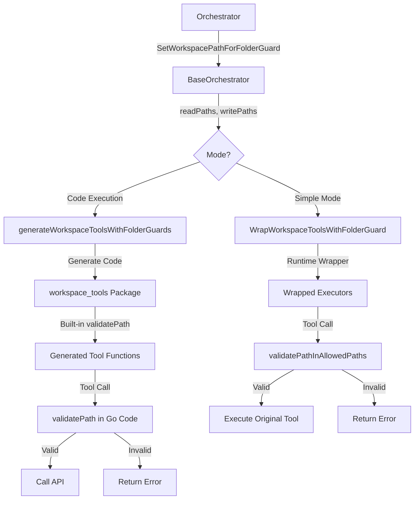

# Security Architecture & Implementation

## 🛡️ Security Overview

This project employs a **Defense in Depth** strategy, securing the application at multiple layers:
1.  **Repository Security**: Preventing secrets from entering the codebase (Static Analysis).
2.  **Runtime Access Control**: Restricting file access via the Folder Guard system.
3.  **Execution Isolation**: Securing shell and code execution via environment sanitization and namespace isolation.

---

## 1. Repository Security & Compliance

We use multiple layers of protection to ensure that sensitive information and secrets are not accidentally committed.

### Automated Secret Scanning
-   **Pre-commit hooks**: Every commit is automatically scanned for secrets using gitleaks.
-   **GitHub Actions**: Continuous secret scanning on every push and pull request.
-   **Daily scans**: Automated daily scans to catch any missed secrets.
-   **Custom rules**: Tailored detection rules for AWS, OpenAI, GitHub, and other services.

### Protected Files
-   **Environment files**: All `.env` files are gitignored and excluded from scanning.
-   **Configuration files**: Sensitive config files are properly excluded.
-   **Log files**: Log files containing potential secrets are ignored.

### Security Scanning Tools
-   **Gitleaks**: Configured via `.gitleaks.toml` to detect secrets in all commits.
-   **GitHub Actions Security**: Includes dependency scanning and CodeQL static analysis.
-   **Scripts**:
    -   Installation: `./scripts/install-git-hooks.sh`
    -   Manual scan: `./scripts/scan-secrets.sh`

### Reporting Vulnerabilities
If you discover a security vulnerability, please report it via the methods outlined in `SECURITY.md` (email or private report), rather than a public issue.

---

## 2. Folder Guard System

The **Folder Guard** is a fine-grained access control mechanism that restricts agent file operations to specific directories. It serves as the primary access control layer for both Simple and Code Execution modes.

### Key Benefits
-   **Prevents Unauthorized Access**: Agents cannot read/write outside configured paths.
-   **Granular Permissions**: Separate `read_paths` (read-only) and `write_paths` (read+write).
-   **Tool Enhancement**: Automatically injects access restrictions into LLM tool descriptions.
-   **Dual Validation**:
    -   **Runtime**: Validates paths before tool execution (Simple Mode).
    -   **AST-Level**: Validates paths in generated code before compilation (Code Execution Mode).

### Architecture



### Configuration & Usage

**Configuration (Go):**
```go
// Execution agent: read from learnings, write to execution
learningsPath := fmt.Sprintf("%s/learnings", workspacePath)
executionPath := fmt.Sprintf("%s/execution", workspacePath)

orchestrator.SetWorkspacePathForFolderGuard(
    []string{learningsPath},  // Read-only
    []string{executionPath},  // Read + write
)
```

**Tool Classification:**
-   **Read Tools** (`read_workspace_file`, `list_workspace_files`, etc.): Access `readPaths` + `writePaths`.
-   **Write Tools** (`write_workspace_file`, `delete_workspace_file`, etc.): Access `writePaths` only.
-   **Downloads Exception**: The `Downloads/` folder is always accessible.

**Validation Logic:**
1.  **Absolute paths**: Validated against allowed lists.
2.  **Relative paths**: Resolved against workspace root, then validated.
3.  **Directory Traversal**: `../` patterns are rejected.

---

## 3. Shell & Code Execution Security

This layer focuses on safely executing dynamic code (Shell commands and Go code) generated by LLMs.

### Critical Security Issues Addressed

#### Issue 1: Environment Variable Leakage
**Problem:** Child processes (`exec.Command`) inherit all parent environment variables by default, exposing secrets like `DATABASE_URL` or `API_KEYS` to the LLM via commands like `env` or `printenv`.

**Solution: Whitelist-Only Environment Sanitization**
We replace the inherited environment with a strict whitelist of safe variables before execution.

```go
// workspace/handlers/shell.go
func buildSafeEnvironment() []string {
    return []string{
        "PATH=/usr/local/sbin:/usr/local/bin:/usr/sbin:/usr/bin:/sbin:/bin",
        "HOME=/tmp",
        "USER=agent",
        "SHELL=/bin/sh",
        "LANG=C.UTF-8",
        "LC_ALL=C.UTF-8",
        // NO SECRETS included
    }
}
```

#### Issue 2: Filesystem Isolation
**Problem:** Standard `working_directory` validation sets the CWD but doesn't prevent access to other files via absolute paths (e.g., `cat /app/secrets.txt`).

**Solution: Bind Mount Isolation (Namespace)**
We use Linux mount namespaces (`unshare -m`) to create a temporary, isolated filesystem view for the executed command.

**Mechanism:**
1.  **Remount Root**: The workspace root is remounted as **read-only**.
2.  **Bind Mount Write Paths**: Configured `write_paths` are bind-mounted as **read-write** on top.
3.  **Downloads**: The `Downloads/` folder is always mounted read-write.
4.  **Isolation**: The process runs in a private mount namespace, so these mounts do not affect the host or other agents.

**Code Reference (`workspace/security/isolator.go`):**
```go
// Generates a script to enforce isolation using unshare and mount
cmd := exec.CommandContext(ctx, "unshare", "-m", "--propagation", "private", "sh", scriptPath)
```

### Implementation Details

#### Request Model Update
The `ExecuteShellRequest` includes `FolderGuardConfig` to pass permissions from the orchestrator to the workspace API.

```go
type ExecuteShellRequest struct {
    // ... standard fields
    FolderGuard *FolderGuardConfig `json:"folder_guard,omitempty"`
}
```

#### Docker Requirements
To support namespace isolation (`unshare -m`), the Docker container requires:
-   `CAP_SYS_ADMIN` capability.
-   `apparmor:unconfined` (or appropriate profile).

*Note: This capability is used strictly for creating private namespaces within the container, preventing host escape while isolating the process.*

### Testing & Verification

A comprehensive test suite (`agent_go/cmd/testing/shell_security.go`) verifies:
1.  **Environment Isolation**: Confirms secrets are not visible in `env`.
2.  **Filesystem Restrictions**: Confirms `write` to read-only paths fails.
3.  **Downloads Access**: Confirms `Downloads/` is always accessible.

---

## 📊 Summary of Protection Layers

| Layer | Threat Mitigated | Mechanism |
|-------|------------------|-----------|
| **Repo Security** | Leaked secrets in git | Gitleaks, Pre-commit hooks |
| **Folder Guard** | Unauthorized file access | Path validation (Runtime/AST) |
| **Env Sanitization** | Leaked secrets in runtime | Whitelist-only `cmd.Env` |
| **Shell Isolation** | Filesystem escapes | Linux Mount Namespaces (`unshare`) |

---

## 🔗 Related Documentation

-   [Workflow Orchestrator](workflow_orchestrator.md)
-   [Code Execution Mode](code_execution_mode.md)