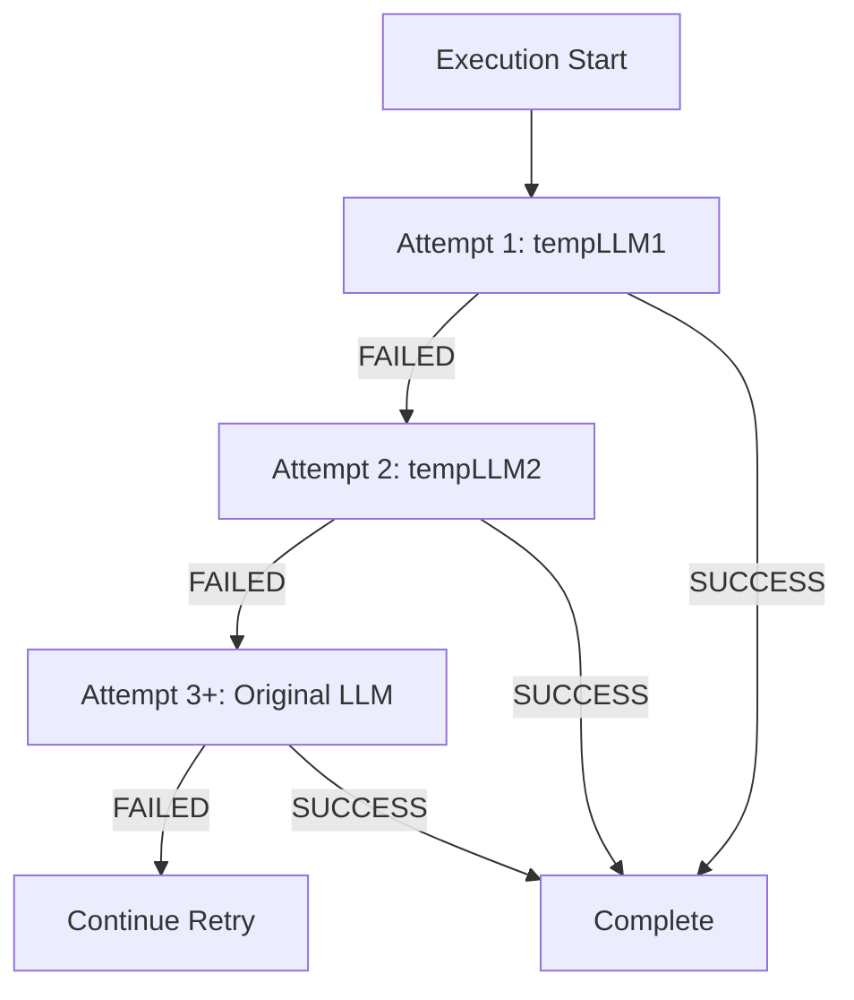

# Temporary LLM Cascading Flow

## 📋 Overview

The Temporary LLM Cascading Flow provides automatic fallback to alternative LLM models when execution fails, using a cascading sequence: tempLLM1 → tempLLM2 → original LLM. This enables recovery from model-specific failures while maintaining execution quality.

**Key Benefits:**
- **Automatic recovery**: Retries with different models on failure
- **Learning-based**: Uses learnings folder to determine available temp LLMs
- **Configurable fallback**: Supports skipping tempLLM1 while keeping tempLLM2

---

## 📁 Key Files & Locations

| Component | File Path | Key Functions |
|-----------|-----------|---------------|
| **Retry Logic** | [`agent_go/pkg/orchestrator/agents/workflow/todo_creation_human/controller_execution.go`](file:///Users/mipl/ai-work/mcp-agent-builder-go/agent_go/pkg/orchestrator/agents/workflow/todo_creation_human/controller_execution.go) | `isRetryAfterValidationFailure()`, retry loop (line 746) |
| **LLM Selection** | [`agent_go/pkg/orchestrator/agents/workflow/todo_creation_human/controller_agent_factory.go`](file:///Users/mipl/ai-work/mcp-agent-builder-go/agent_go/pkg/orchestrator/agents/workflow/todo_creation_human/controller_agent_factory.go) | LLM selection logic (lines 152-197) |
| **Validation Check** | [`agent_go/pkg/orchestrator/agents/workflow/todo_creation_human/controller_execution.go`](file:///Users/mipl/ai-work/mcp-agent-builder-go/agent_go/pkg/orchestrator/agents/workflow/todo_creation_human/controller_execution.go) | `isValidationFailure()` (line 746) |

---

## 🔄 Flow Sequence



### Attempt Sequence

1. **Attempt 1**: tempLLM1 (if available, learnings folder not empty)
2. **Attempt 2**: tempLLM2 (if available, learnings folder not empty, NOT blocked by `shouldSkipTempOverride`)
3. **Attempt 3+**: Original LLM chain (step LLM → preset LLM → orchestrator default)

---

## ⚙️ Failure Criteria

### For tempLLM Purposes

**Only `ExecutionStatus == "FAILED"` counts as failure:**

| Status | Action | Triggers Retry? |
|--------|--------|-----------------|
| `COMPLETED` | Success | ❌ No retry |
| `PARTIAL` | Success | ❌ No retry |
| `INCOMPLETE` | Success | ❌ No retry |
| `FAILED` | Failure | ✅ Triggers next attempt |

### Validation Status Handling

**Retry Decision**: Uses `IsSuccessCriteriaMet` (line 1477)
- If `IsSuccessCriteriaMet == true`: Stop retry, step passes
- If `IsSuccessCriteriaMet == false`: Continue retry (regardless of status)

**tempLLM Fallback**: Uses `ExecutionStatus == "FAILED"` (line 746)
- Only FAILED triggers tempLLM fallback logic
- PARTIAL/INCOMPLETE with unmet criteria still retry but don't trigger tempLLM fallback

---

## 🔄 Implementation Details

### Key Logic

**File:** [`controller_execution.go`](file:///Users/mipl/ai-work/mcp-agent-builder-go/agent_go/pkg/orchestrator/agents/workflow/todo_creation_human/controller_execution.go)

```go
// Line 746: Validation failure check
isRetryAfterValidationFailure := isValidationFailure(validationResult)
// Only checks ExecutionStatus == "FAILED"

// Retry attempt logic
if retryAttempt == 1 {
    // Use tempLLM1 (if available, learnings folder not empty)
} else if retryAttempt == 2 {
    // Use tempLLM2 (if available, learnings folder not empty, NOT blocked by shouldSkipTempOverride)
} else {
    // Use original LLM chain
}
```

**File:** [`controller_agent_factory.go`](file:///Users/mipl/ai-work/mcp-agent-builder-go/agent_go/pkg/orchestrator/agents/workflow/todo_creation_human/controller_agent_factory.go)

```go
// Lines 152-197: LLM selection logic
// Attempt 1: tempLLM1
// Attempt 2: tempLLM2
// Attempt 3+: Original LLM chain
```

### Conditions

| Condition | Purpose | Blocks |
|-----------|---------|--------|
| `learningsFolderEmpty == false` | Required for tempLLM usage | All tempLLMs if true |
| `shouldSkipTempOverride` | Skip tempLLM1 after failure | Only tempLLM1 |
| `fallbackToOriginalLLMOnFailure` | Skip tempLLM1 when enabled | Only tempLLM1 (tempLLM2 still used) |

---

## 🛠️ Common Issues & Solutions

| Issue | Cause | Solution |
|-------|-------|----------|
| tempLLM not used | Learnings folder is empty | Ensure learnings exist before execution |
| tempLLM1 skipped | `shouldSkipTempOverride` is true | Check fallback configuration |
| tempLLM2 not used | Blocked by `shouldSkipTempOverride` | Verify `shouldSkipTempOverride` only blocks tempLLM1 |
| Always uses original LLM | No learnings available | Generate learnings first or check folder path |

---

## 🔍 For LLMs: Quick Reference

**Constraints:**
- ✅ **Allowed**: Retry with tempLLM1 on attempt 1
- ✅ **Allowed**: Retry with tempLLM2 on attempt 2
- ✅ **Allowed**: Fall back to original LLM on attempt 3+
- ❌ **Forbidden**: Using tempLLM when learnings folder is empty
- ❌ **Forbidden**: Using tempLLM2 when blocked by `shouldSkipTempOverride` (only blocks tempLLM1)

**Failure Detection:**
- Only `ExecutionStatus == "FAILED"` triggers tempLLM fallback
- `PARTIAL`/`INCOMPLETE` with unmet criteria continue retry but don't trigger tempLLM fallback

**Example Flow:**
```
Attempt 1: tempLLM1 → FAILED → Continue
Attempt 2: tempLLM2 → FAILED → Continue  
Attempt 3: Original LLM → SUCCESS → Complete
```

---

## 📖 Related Documentation

- [Workflow Orchestrator](workflow_orchestrator.md) - Overall execution system
- [Controller Execution](../agent_go/pkg/orchestrator/agents/workflow/todo_creation_human/controller_execution.go) - Retry logic implementation
