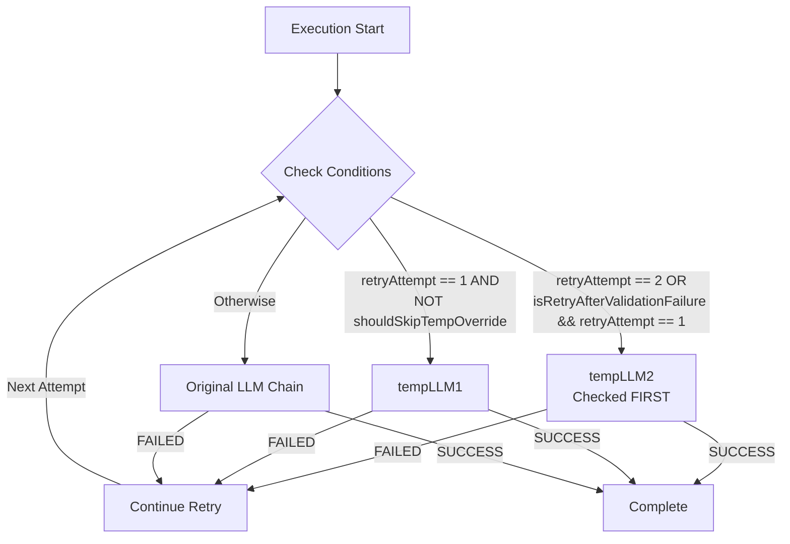

# Temporary LLM Cascading Flow

## 📋 Overview

The Temporary LLM Cascading Flow provides automatic fallback to alternative LLM models when execution fails, using a cascading sequence: tempLLM1 → tempLLM2 → original LLM. This enables recovery from model-specific failures while maintaining execution quality.

**Key Benefits:**
- **Automatic recovery**: Retries with different models on failure
- **Learning-based**: Uses learnings folder to determine available temp LLMs
- **Configurable fallback**: Supports skipping tempLLM1 while keeping tempLLM2

---

## 📁 Key Files & Locations

| Component | File Path | Key Functions |
|-----------|-----------|---------------|
| **Retry Logic** | [`agent_go/pkg/orchestrator/agents/workflow/todo_creation_human/controller_execution.go`](../agent_go/pkg/orchestrator/agents/workflow/todo_creation_human/controller_execution.go) | `isRetryAfterValidationFailure` calculation (lines 1221-1228), retry loop (line 1152) |
| **LLM Selection** | [`agent_go/pkg/orchestrator/agents/workflow/todo_creation_human/controller_agent_factory.go`](../agent_go/pkg/orchestrator/agents/workflow/todo_creation_human/controller_agent_factory.go) | `selectExecutionLLM()` - LLM selection logic (lines 228-270) |
| **Validation Check** | [`agent_go/pkg/orchestrator/agents/workflow/todo_creation_human/controller_execution.go`](../agent_go/pkg/orchestrator/agents/workflow/todo_creation_human/controller_execution.go) | `isValidationFailure()` function (lines 46-54) |

---

## 🔄 Flow Sequence



**Note**: tempLLM2 is checked FIRST (before tempLLM1) when conditions match. This ensures tempLLM2 is used even if tempLLM1 was blocked by `shouldSkipTempOverride`.

### Attempt Sequence

**File**: [`controller_agent_factory.go:228-270`](../agent_go/pkg/orchestrator/agents/workflow/todo_creation_human/controller_agent_factory.go#L228)

**Priority Order** (checked in this sequence):
1. **tempLLM2** (checked FIRST) - Used when:
   - `retryAttempt == 2` (normal retry), OR
   - `isRetryAfterValidationFailure && retryAttempt == 1` (new loop iteration after failure)
   - Learnings folder not empty
   - NOT blocked by `shouldSkipTempOverride` (tempLLM2 bypasses this check)
2. **tempLLM1** - Used when:
   - `retryAttempt == 1` (first attempt)
   - Learnings folder not empty
   - NOT blocked by `shouldSkipTempOverride`
3. **Original LLM chain** (step LLM → preset LLM → orchestrator default) - Used when:
   - No tempLLM available, OR
   - Learnings folder empty, OR
   - Blocked by `shouldSkipTempOverride` (for tempLLM1 only), OR
   - Step config has `disable_temp_llm: true`

---

## ⚙️ Failure Criteria

### For tempLLM Purposes

**Only `ExecutionStatus == "FAILED"` counts as failure:**

| Status | Action | Triggers Retry? |
|--------|--------|-----------------|
| `COMPLETED` | Success | ❌ No retry |
| `PARTIAL` | Success | ❌ No retry |
| `INCOMPLETE` | Success | ❌ No retry |
| `FAILED` | Failure | ✅ Triggers next attempt |

### Validation Status Handling

**File**: [`controller_execution.go:46-54`](../agent_go/pkg/orchestrator/agents/workflow/todo_creation_human/controller_execution.go#L46)

**Retry Decision**: Uses `IsSuccessCriteriaMet` from validation response
- If `IsSuccessCriteriaMet == true`: Stop retry, step passes
- If `IsSuccessCriteriaMet == false`: Continue retry (regardless of status)

**tempLLM Fallback**: Uses `ExecutionStatus == "FAILED"` via `isValidationFailure()`
- Only `ExecutionStatus == "FAILED"` triggers `isRetryAfterValidationFailure`
- `PARTIAL`/`INCOMPLETE`/`COMPLETED` with unmet criteria still retry but don't trigger tempLLM fallback

**Special Cases**:
- **Decision Step False Result**: Steps routed from decision step with `false` result are treated as validation failure (skip tempLLM)
- **Loop Iterations**: New loop iterations after failure (`loopIterationCount > 1`) trigger `isRetryAfterValidationFailure`

---

## 🔄 Implementation Details

### Key Logic

**File:** [`controller_execution.go:1221-1228`](../agent_go/pkg/orchestrator/agents/workflow/todo_creation_human/controller_execution.go#L1221)

```go
// Validation failure check
isRetryAfterValidationFailure := isValidationFailure(previousValidationResponse) &&
    (retryAttempt > 1 || (hasLoop(step) && loopIterationCount > 1))

// Also treat decision step false result as validation failure (skip tempLLM)
isDecisionStepFalse := decisionContext != nil && !decisionContext.DecisionResult
if isDecisionStepFalse {
    isRetryAfterValidationFailure = true
}
```

**File:** [`controller_agent_factory.go:131-236`](../agent_go/pkg/orchestrator/agents/workflow/todo_creation_human/controller_agent_factory.go#L131)

```go
// Calculate shouldSkipTempOverride (only blocks tempLLM1, not tempLLM2)
shouldSkipTempOverride := isRetryAfterValidationFailure && hcpo.fallbackToOriginalLLMOnFailure

// Check step config disable flag
disableTempLLM := stepConfig != nil && stepConfig.DisableTempLLM != nil && *stepConfig.DisableTempLLM

// Check tempLLM2 FIRST (priority order)
shouldUseTempLLM2 := !learningsFolderEmpty && hasTempLLM2 && 
    (retryAttempt == 2 || (isRetryAfterValidationFailure && retryAttempt == 1))
if shouldUseTempLLM2 {
    // Use tempLLM2 (NOT blocked by shouldSkipTempOverride)
}

// Then check tempLLM1
else if !shouldSkipTempOverride && !learningsFolderEmpty && retryAttempt == 1 && hasTempLLM1 {
    // Use tempLLM1 (blocked by shouldSkipTempOverride)
}

// Finally fall back to original LLM chain
else {
    // Use step LLM → preset LLM → orchestrator default
}
```

### Conditions

**File**: [`controller_agent_factory.go:131-236`](../agent_go/pkg/orchestrator/agents/workflow/todo_creation_human/controller_agent_factory.go#L131)

| Condition | Purpose | Blocks | Notes |
|-----------|---------|--------|-------|
| `learningsFolderEmpty == false` | Required for tempLLM usage | All tempLLMs if true | Emits `temp_llm_skipped` event when skipped |
| `shouldSkipTempOverride` | Skip tempLLM1 after validation failure | Only tempLLM1 | Calculated as: `isRetryAfterValidationFailure && fallbackToOriginalLLMOnFailure` |
| `fallbackToOriginalLLMOnFailure` | Skip tempLLM1 when enabled | Only tempLLM1 | tempLLM2 still used (part of cascading fallback) |
| `disableTempLLM` (step config) | Step-level override to disable tempLLM | All tempLLMs | From `step_config.json`: `agent_configs.disable_temp_llm: true` |
| `isRetryAfterValidationFailure` | Indicates previous attempt failed | tempLLM1 (if fallback enabled) | Triggered by: validation failure OR decision step false OR new loop iteration after failure |
| `retryAttempt == 2` | Second retry attempt | None | Always uses tempLLM2 if available (checked first) |
| `isRetryAfterValidationFailure && retryAttempt == 1` | New loop iteration after failure | None | Uses tempLLM2 if available (checked first) |

---

## 🛠️ Common Issues & Solutions

| Issue | Cause | Solution |
|-------|-------|----------|
| tempLLM not used | Learnings folder is empty | Ensure learnings exist before execution (check `learnings/step-{N}/` folder) |
| tempLLM1 skipped | `shouldSkipTempOverride` is true | Check `fallback_to_original_llm_on_failure` configuration in execution options |
| tempLLM2 not used | Not on attempt 2 or new loop iteration | Verify retry attempt number and loop iteration count |
| Always uses original LLM | No learnings available OR `disable_temp_llm: true` | Generate learnings first or check step config for `disable_temp_llm` flag |
| tempLLM skipped after decision step false | Decision step false result triggers `isRetryAfterValidationFailure` | This is expected behavior - decision step false is treated as validation failure |
| tempLLM skipped on loop iteration | New loop iteration after failure triggers `isRetryAfterValidationFailure` | This is expected behavior - uses tempLLM2 if available, otherwise original LLM |

---

## 🔍 For LLMs: Quick Reference

**Constraints:**
- ✅ **Allowed**: Retry with tempLLM1 on attempt 1 (if learnings exist and not blocked)
- ✅ **Allowed**: Retry with tempLLM2 on attempt 2 OR new loop iteration after failure
- ✅ **Allowed**: Fall back to original LLM when tempLLMs unavailable or blocked
- ❌ **Forbidden**: Using tempLLM when learnings folder is empty (emits `temp_llm_skipped` event)
- ❌ **Forbidden**: Using tempLLM when `disable_temp_llm: true` in step config
- ✅ **Note**: tempLLM2 is NOT blocked by `shouldSkipTempOverride` (only tempLLM1 is blocked)

**Failure Detection:**
- Only `ExecutionStatus == "FAILED"` triggers `isRetryAfterValidationFailure`
- Decision step false result also triggers `isRetryAfterValidationFailure`
- New loop iteration after failure (`loopIterationCount > 1`) triggers `isRetryAfterValidationFailure`
- `PARTIAL`/`INCOMPLETE`/`COMPLETED` with unmet criteria continue retry but don't trigger tempLLM fallback

**Priority Order:**
1. Check tempLLM2 FIRST (attempt 2 or new loop iteration)
2. Check tempLLM1 (attempt 1, not blocked)
3. Fall back to original LLM chain

**Example Flows:**

**Normal Retry:**
```
Attempt 1: tempLLM1 → FAILED → Continue
Attempt 2: tempLLM2 → FAILED → Continue  
Attempt 3: Original LLM → SUCCESS → Complete
```

**With Fallback Enabled:**
```
Attempt 1: tempLLM1 → FAILED → Continue (fallback enabled)
Attempt 2: tempLLM2 → FAILED → Continue (tempLLM2 still used)
Attempt 3: Original LLM → SUCCESS → Complete
```

**Decision Step False:**
```
Decision Step: FALSE → isRetryAfterValidationFailure = true
Attempt 1: Original LLM (tempLLM skipped) → SUCCESS → Complete
```

**Loop Iteration After Failure:**
```
Loop Iteration 1: tempLLM1 → FAILED
Loop Iteration 2: tempLLM2 (isRetryAfterValidationFailure && retryAttempt == 1) → SUCCESS
```

---

## 📖 Related Documentation

- [Workflow Orchestrator](workflow_orchestrator.md) - Overall execution system
- [Controller Execution](../agent_go/pkg/orchestrator/agents/workflow/todo_creation_human/controller_execution.go) - Retry logic implementation
