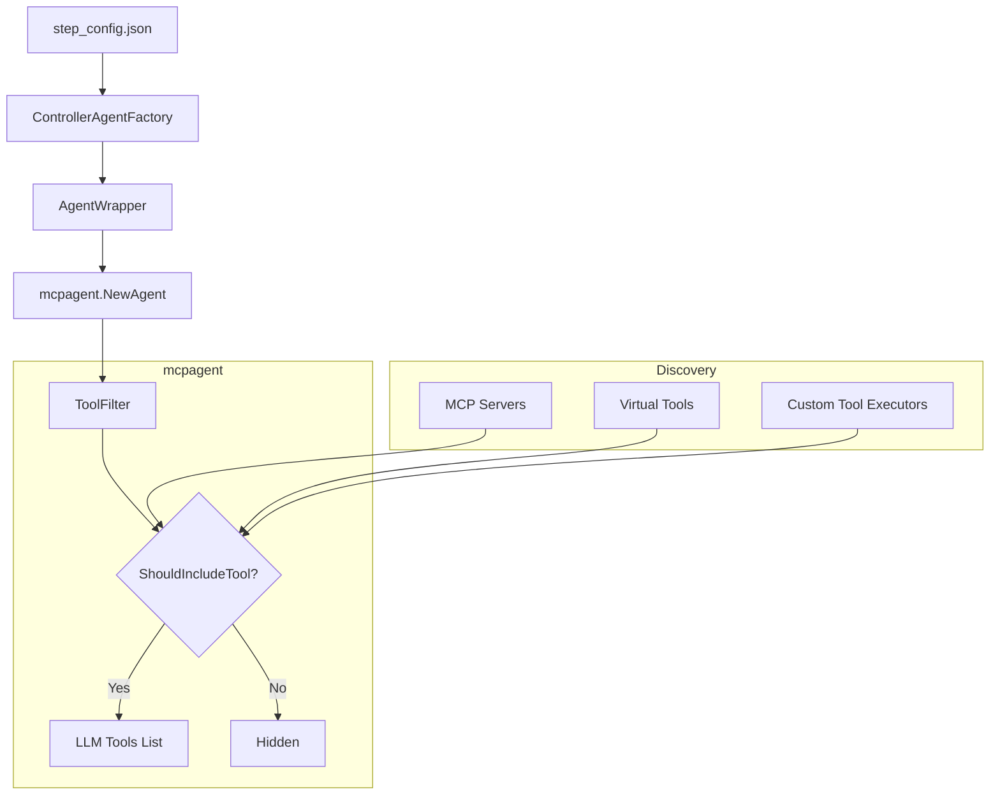

# Tool Filtering and Configuration System

## 📋 Overview

The Tool Filtering and Configuration System provides a powerful, multi-layered mechanism to control exactly which tools are available to an agent at any given moment. This system allows for broad control (adding/removing entire servers) down to granular control (enabling specific tools within a server or category).

**Key Benefits:**
- **Server-Level Control**: Add or remove entire MCP servers from the agent's context.
- **Tool-Level Granularity**: Whitelist specific tools from a server while hiding others.
- **Custom Tool Management**: Enable/disable internal virtual tools (e.g., workspace operations, human feedback) with the same granularity.
- **Category-Based Filtering**: Enable entire categories of tools (e.g., "all workspace tools") with wildcard support.
- **Unified Filtering Logic**: Consistent behavior across both external MCP tools and internal custom tools.

---

## 📁 Key Files & Locations

| Component | File | Key Functions |
|-----------|------|----------------|
| **Core Filter** | [`mcpagent/agent/tool_filter.go`](file:///Users/mipl/ai-work/mcpagent/agent/tool_filter.go) | `NewToolFilter()`, `ShouldIncludeTool()`, `NormalizeServerName()` |
| **Agent Core** | [`mcpagent/agent/agent.go`](file:///Users/mipl/ai-work/mcpagent/agent/agent.go) | `WithSelectedTools()`, `WithSelectedServers()`, `NewAgent()` |
| **Orchestrator Utilities** | [`agent_go/pkg/orchestrator/base_orchestrator_tools.go`](file:///Users/mipl/ai-work/mcp-agent-builder-go/agent_go/pkg/orchestrator/base_orchestrator_tools.go) | `FilterCustomToolsByCategory()`, `ConvertOldFormatToNewFormat()` |
| **Agent Wrapper** | [`agent_go/pkg/agentwrapper/llm_agent.go`](file:///Users/mipl/ai-work/mcp-agent-builder-go/agent_go/pkg/agentwrapper/llm_agent.go) | Pass `SelectedTools` to `mcpagent` options |
| **Workflow Types** | [`agent_go/pkg/orchestrator/agents/workflow/step_based_workflow/planning_agent.go`](file:///Users/mipl/ai-work/mcp-agent-builder-go/agent_go/pkg/orchestrator/agents/workflow/step_based_workflow/planning_agent.go) | `AgentConfigs` struct definition (Source of Truth for JSON fields) |

---

## 🔄 How It Works

### Filtering Lifecycle

1.  **Configuration Loading**: The system loads the `step_config.json` for a workflow step, which contains lists like `selected_tools` and `enabled_custom_tools`.
2.  **Filter Initialization**: A `ToolFilter` object is created. It normalizes all entries (e.g., converting hyphens to underscores) and builds efficient lookup maps for wildcards and specific tools.
3.  **MCP Connection**: The system establishes connections to all servers defined in `selected_servers` (or all servers in the base config if not filtered).
4.  **Tool Registration**: During agent initialization, the agent iterates through all discovered tools (both external MCP and internal virtual).
5.  **Enforcement**: For each tool, the agent calls `ShouldIncludeTool(namespace, toolName)`.
    *   If a wildcard like `github:*` is found, all tools from that namespace are included.
    *   If specific tools are listed (e.g., `github:create_issue`), only those tools are included.
    *   System tools (like `workspace_tools` and `human_tools`) are included by default unless a more specific filter is provided.

---

## 🏗️ Architecture



---

## 🧩 Code Example

### Backend Configuration (Go)

```go
// From mcp-agent-builder-go/agent_go/pkg/agentwrapper/llm_agent.go
if len(config.SelectedTools) > 0 {
    // Pass specific tool filters to mcpagent
    agentOptions = append(agentOptions, mcpagent.WithSelectedTools(config.SelectedTools))
}

if len(config.SelectedServers) > 0 {
    // Pass server-level filters
    agentOptions = append(agentOptions, mcpagent.WithSelectedServers(config.SelectedServers))
}
```

### JSON Configuration (`step_config.json`)

```json
{
  "id": "step-id-1",
  "agent_configs": {
    "selected_servers": ["github"],
    "selected_tools": [
      "github:create_issue",
      "github:list_issues"
    ],
    "enabled_custom_tools": [
      "workspace_tools:read_workspace_file",
      "human_tools:*"
    ]
  }
}
```

---

## ⚙️ Configuration Fields

| Field | Type | Default | Description |
|-------|------|---------|-------------|
| `selected_servers` | `string[]` | `[]` | MCP servers to connect to. If empty, connects to all configured servers. |
| `selected_tools` | `string[]` | `[]` | Granular MCP tools. Format: `namespace:tool` or `namespace:*`. |
| `enabled_custom_tools` | `string[]` | `[]` | Granular internal tools. Format: `category:tool` or `category:*`. |

**Internal Category Names:**
- `workspace_tools`: File operations (read, write, list, etc.)
- `human_tools`: Interaction tools (human_feedback)

---

## 🛠️ Common Issues & Solutions

| Issue | Cause | Solution |
|-------|-------|----------|
| Tool missing in chat | Tool not in `selected_tools` | Check the "Tool selection" panel in UI or `step_config.json` |
| "Server X filtered out" error | `selected_servers` used without the target server | Add the server to `selected_servers` or use wildcard `*` |
| Hyphen/Underscore mismatch | Names like `google-sheets` vs `google_sheets` | The system normalizes these automatically, but it's best to check `NormalizeServerName()` |

---

## 🔍 For LLMs: Quick Reference

**Constraints:**
- ✅ **Allowed**: Wildcards using `namespace:*`.
- ✅ **Allowed**: Mixing server filters and tool filters.
- ❌ **Forbidden**: Using tool names without a namespace (e.g., `create_issue` instead of `github:create_issue`).

**Normalizing Rule:**
All names are converted to lowercase with underscores (`google-sheets` -> `google_sheets`).

**Pattern Precedence:**
Specific tool filters (`namespace:tool`) take precedence over server-level filters (`selected_servers`). If you specify one tool from a server, all other tools from that server are automatically hidden unless you add a wildcard.

---

## 📖 Related Documentation

- [Workflow Orchestrator](file:///Users/mipl/ai-work/mcp-agent-builder-go/docs/workflow_orchestrator.md) - Overall system architecture.
*   **`human_tools`**: Maps to `CreateHumanToolExecutors()`

This abstraction allows the configuration system to treat internal Go functions exactly like external MCP tools.

---

## 📝 Implementation Review

The system implements a robust three-tier configuration model (Servers -> MCP Tools -> Custom Tools) that is consistent across the full stack. The following technical validation was performed:

### **Frontend Validation (`StepEditPanel.tsx`)**
- **Unified Format**: Successfully handles the `namespace:tool` and `namespace:*` format for both MCP and custom tools.
- **Legacy Support**: Correctly converts old-style `categories` arrays into the unified format.
- **"NO_SERVERS" Support**: Implements the special `"NO_SERVERS"` flag to allow users to explicitly disable external tool access for pure LLM/Virtual tool steps.

### **Backend Validation (`tool_filter.go` & `controller_agent_factory.go`)**
- **Centralized Enforcement**: `ToolFilter` provides a single source of truth for tool visibility during both initialization and discovery.
- **Normalization**: Robust handling of hyphen/underscore differences (e.g., `google-sheets` vs `google_sheets`) prevents common configuration mismatches.
- **Explicit Protocol Support**: `controller_agent_factory.go` explicitly recognizes the `NO_SERVERS` flag (via `mcpclient.NoServers`), correctly interpreting it as an instruction to bind to zero external servers without error.

### **Conclusion**
The implementation is **high-quality and consistent**. The "NO_SERVERS" magic string is a first-class citizen in the protocol, and the unified naming convention ensures seamless integration between external MCP servers and internal virtual tools.