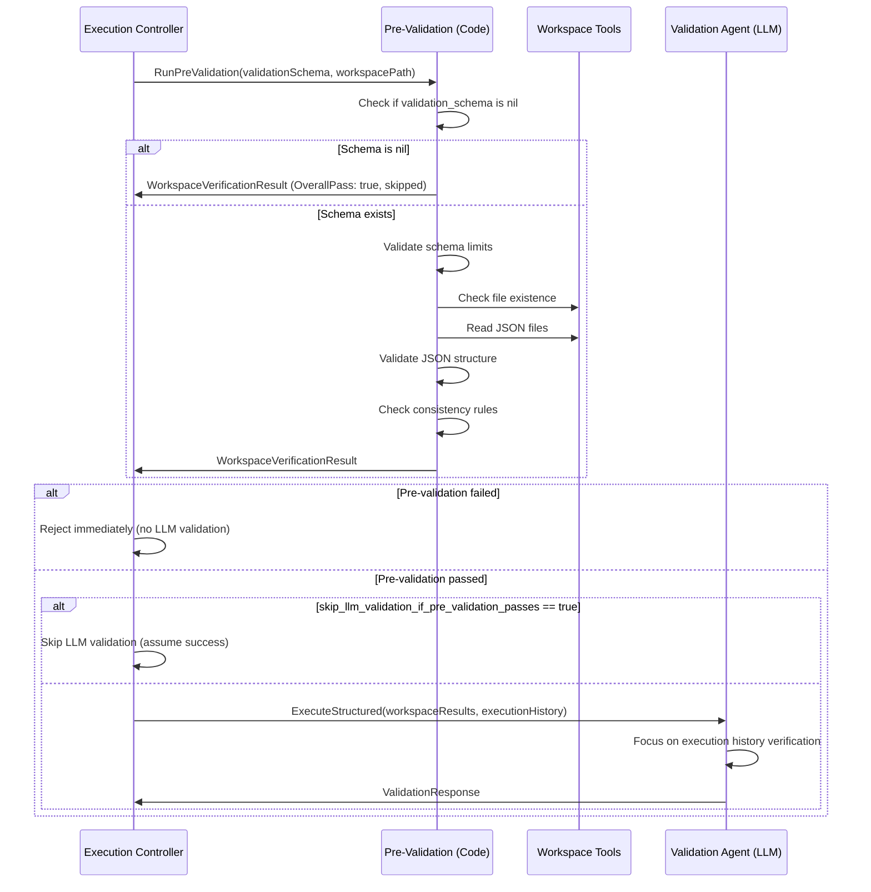

# Structured Validation Schema - Implementation Guide

## 📋 Overview

**Status**: ✅ **IMPLEMENTED**

The Structured Validation Schema enables code-based validation of step outputs, moving file existence and content checks from LLM-based validation to deterministic code execution. This improves validation speed, reliability, and allows the validation agent to focus on execution history verification (anti-hallucination checks).

### ✅ Implementation Status

**Core Features Implemented:**
- ✅ Two-layer validation architecture (pre-validation + LLM validation)
- ✅ Pre-validation engine with file existence, JSON structure, and consistency checks
- ✅ Validation schema structure (ValidationSchema, FileValidationRule, JSONValidationCheck, ConsistencyRule)
- ✅ Integration with execution and orchestration controllers
- ✅ Pre-validation blocks LLM validation when it fails
- ✅ Validation schema is **OPTIONAL** (pre-validation skips if schema is nil)
- ✅ `skip_llm_validation_if_pre_validation_passes` feature - can skip LLM validation when pre-validation passes
- ✅ LLM-only schema generation (no code-based auto-generation)
- ✅ Success criteria guidance updated to focus on execution-based validation
- ✅ Frontend TypeScript types updated

**Key Implementation Details:**
- Pre-validation runs before LLM validation and blocks it if structural checks fail
- Validation schema is optional - if nil, pre-validation is skipped (returns OverallPass: true)
- When updating steps via `update_regular_step` tool, `validation_schema` is required
- Success criteria focuses on execution history verification, not file structure
- Pre-validation errors properly block LLM validation (OverallPass: false)
- If `skip_llm_validation_if_pre_validation_passes: true` and pre-validation passes, LLM validation is skipped

**Key Problem**: Current validation relies entirely on LLM to check files and keys, which is:
- **Slow**: LLM must read files and analyze content
- **Inconsistent**: LLM may miss checks or interpret criteria differently
- **Inefficient**: LLM spends time on simple file/key checks instead of complex execution history analysis

**Key Solution**: Add **optional** `validation_schema` field to plan.json that specifies structured validation rules. Implement a **two-layer validation approach**:

1. **Layer 1 (Code)**: Fast structural validation - "Does the output have the right shape?"
2. **Layer 2 (LLM)**: Deep authenticity validation - "Does the execution history prove this is real?"

**Key Benefits:**
- ⚡ **Faster validation**: Code-based structural checks are instant vs LLM token generation
- ✅ **Deterministic**: Same criteria always produces same result for structure checks
- 🎯 **Better focus**: LLM doesn't waste time checking "does key exist?", focuses on execution history analysis
- 🔒 **Anti-gaming**: Evidence-based checks require multiple fields and consistency
- 🔄 **LLM-generated**: Validation schema is generated by LLM when creating/updating steps (no code-based auto-generation)
- 🛡️ **Defense in depth**: Code catches malformed outputs, LLM catches fake/hallucinated outputs

---

## 🎯 Problem Statement

### Current Validation Flow

```
Execution → Validation Agent (LLM)
                ├─ Check files exist (workspace tools)
                ├─ Check keys exist (read JSON, parse)
                └─ Check execution history (manual text parsing)
```

**Issues:**
1. **LLM does everything**: Simple file/key checks consume LLM tokens
2. **Inconsistent**: LLM may miss checks or interpret criteria differently
3. **Slow**: Each validation requires LLM generation time
4. **Execution history under-verified**: LLM focuses on files, less on execution history

### Gaming Vulnerability

Current `success_criteria` is free-form text:
```
"File deployment_results.json contains status field set to 'deployed'"
```

If validation schema allowed specific expected values:
```json
{
  "path": "$.status",
  "expected_value": "deployed"  // ❌ BAD - can be gamed!
}
```

Execution agent could just write:
```json
{
  "status": "deployed"
}
```

Without actually deploying.

---

## 💡 Solution Design

### Two-Layer Validation Architecture

```
┌─────────────────────────────────────────────────────────────────┐
│  LAYER 1: Deterministic Code Checks (< 100ms)                   │
│  ━━━━━━━━━━━━━━━━━━━━━━━━━━━━━━━━━━━━━━━━━━━━━━━━━━━━━━━━━━━━  │
│  Pre-Validation Engine (Code)                                    │
│  ├─ File existence checks                                        │
│  ├─ JSON structure checks (keys exist, correct types)            │
│  ├─ Consistency checks (counts match array lengths)              │
│  ├─ Range validation (realistic values)                          │
│  └─ Evidence validation (multiple fields present)                │
│                                                                   │
│  Result: PASS ✅ → Continue to Layer 2                          │
│          FAIL ❌ → Reject immediately (malformed output)         │
│          ERROR ❌ → Reject immediately (pre-validation failed)   │
└─────────────────────────────────────────────────────────────────┘
                              ↓
┌─────────────────────────────────────────────────────────────────┐
│  LAYER 2: Semantic LLM Validation                                │
│  ━━━━━━━━━━━━━━━━━━━━━━━━━━━━━━━━━━━━━━━━━━━━━━━━━━━━━━━━━━━━  │
│  Validation Agent (LLM)                                           │
│  ├─ Execution history verification                               │
│  │  "Did agent actually read the data sources?"                  │
│  ├─ Tool call analysis                                            │
│  │  "Do tool calls match output values?"                         │
│  ├─ Timeline consistency                                          │
│  │  "Is the sequence of operations logical?"                     │
│  └─ Anti-hallucination checks                                     │
│     "Are there suspicious patterns (fake data, round numbers)?"  │
│                                                                   │
│  Result: PASS ✅ → Step validation successful                    │
│          FAIL ❌ → Reject (fake/hallucinated output)             │
└─────────────────────────────────────────────────────────────────┘

Key Insight: Code validates STRUCTURE, LLM validates AUTHENTICITY
```

### Validation Schema Structure

```go
type ValidationSchema struct {
    Files []FileValidationRule `json:"files,omitempty"`
}

type FileValidationRule struct {
    FileName        string                 `json:"file_name"`                  // e.g., "results.json"
    MustExist       bool                   `json:"must_exist"`                 // File must exist
    JSONChecks      []JSONValidationCheck  `json:"json_checks,omitempty"`       // JSON structure checks
}

type JSONValidationCheck struct {
    Path            string      `json:"path"`             // JSONPath, e.g., "$.status", "$.databases[0].name"
    MustExist       bool        `json:"must_exist"`       // Key/path must exist
    ValueType       string      `json:"value_type,omitempty"`     // "string", "number", "boolean", "array", "object"
    MinLength       *int        `json:"min_length,omitempty"`    // For arrays/strings
    MaxLength       *int        `json:"max_length,omitempty"`    // For arrays/strings
    Pattern         string      `json:"pattern,omitempty"`       // Regex for format validation
    MinValue        *float64    `json:"min_value,omitempty"`     // For numbers
    MaxValue        *float64    `json:"max_value,omitempty"`     // For numbers
    ConsistencyCheck *ConsistencyRule `json:"consistency_check,omitempty"` // Compare with other fields
    // ❌ NO expected_value - too gameable!
}

type ConsistencyRule struct {
    Type            string `json:"type"` // "equals", "greater_than", "less_than", "array_length", "in_array"
    CompareWithPath string `json:"compare_with_path"` // JSONPath to compare with
}

// JSONPath Implementation: github.com/PaesslerAG/jsonpath
// Supported syntax: $.field, $.array[0], $.object.nested, $.array[*].field
// Note: For array length checks, use consistency_check with type "array_length"
```

### Anti-Gaming Principles

**✅ GOOD - Evidence-Based Checks:**
- Structure checks: File exists, keys exist, correct types
- Consistency checks: Counts match array lengths
- Realism checks: Values in valid ranges (dates 1-31, not arbitrary)
- Evidence checks: Arrays have items, objects have keys

**❌ BAD - Gameable Checks:**
- Specific expected values: `"expected_value": "deployed"` ❌
- Status flags only: `"status": "success"` ❌
- Single-field checks: Only checking one field ❌

### Example: Anti-Gaming Validation Schema

```json
{
  "validation_schema": {
    "files": [
      {
        "file_name": "verification.json",
        "must_exist": true,
        "json_checks": [
          {
            "path": "$.tab_names",
            "must_exist": true,
            "value_type": "array",
            "min_length": 3
          },
          {
            "path": "$.row_counts",
            "must_exist": true,
            "value_type": "object"
          },
          {
            "path": "$.sample_dates",
            "must_exist": true,
            "value_type": "array",
            "min_length": 9
          },
          {
            "path": "$.sample_dates[*]",
            "value_type": "number",
            "min_value": 1,
            "max_value": 31
          },
          {
            "path": "$.database_count",
            "must_exist": true,
            "value_type": "number",
            "min_value": 1
          },
          {
            "path": "$.database_count",
            "consistency_check": {
              "type": "array_length",
              "compare_with_path": "$.databases"
            }
          }
        ]
      }
    ]
  }
}
```

This requires:
- ✅ Real data (arrays with items, objects with keys)
- ✅ Consistency (counts match lengths)
- ✅ Realistic values (dates 1-31, not arbitrary)
- ✅ Evidence (multiple fields that must align)

---

## 📁 Key Files & Locations

| Component | File | Key Functions/Types |
|-----------|------|---------------------|
| **Schema Definition** | [`planning_agent.go`](../agent_go/pkg/orchestrator/agents/workflow/todo_creation_human/planning_agent.go) | `ValidationSchema`, `FileValidationRule`, `JSONValidationCheck`, `ConsistencyRule` |
| **Pre-Validation** | [`pre_validation.go`](../agent_go/pkg/orchestrator/agents/workflow/todo_creation_human/pre_validation.go) | `RunPreValidation()`, `validateWithSchema()`, `WorkspaceVerificationResult`, `formatWorkspaceResults()` |
| **Integration** | [`controller_execution.go`](../agent_go/pkg/orchestrator/agents/workflow/todo_creation_human/controller_execution.go) | Pre-validation call before validation agent (lines 1560-1624) |
| **Orchestration Integration** | [`controller_orchestration.go`](../agent_go/pkg/orchestrator/agents/workflow/todo_creation_human/controller_orchestration.go) | Pre-validation for orchestration steps |
| **Validation Agent** | [`validation_agent.go`](../agent_go/pkg/orchestrator/agents/workflow/todo_creation_human/validation_agent.go) | Updated to receive and use pre-validation results |
| **Planning Agent** | [`planning_agent.go`](../agent_go/pkg/orchestrator/agents/workflow/todo_creation_human/planning_agent.go) | Schema generation/parsing from success_criteria |
| **JSONPath Library** | `github.com/PaesslerAG/jsonpath` | JSON path evaluation for validation checks |

---

## 🔄 How It Works

### 1. Plan Structure

**File**: [`planning_agent.go:271`](../agent_go/pkg/orchestrator/agents/workflow/todo_creation_human/planning_agent.go#L271)

Plan.json includes optional `validation_schema` field in `CommonStepFields`:

```go
type CommonStepFields struct {
    // ... other fields ...
    ValidationSchema *ValidationSchema `json:"validation_schema,omitempty"` // Optional
}
```

**Note**: 
- `validation_schema` is **optional** - can be `nil` or omitted
- When `nil`, pre-validation is skipped (returns `OverallPass: true`)
- When updating steps via `update_regular_step` tool, `validation_schema` parameter is **required** (but can be empty `{"files": []}`)

Plan.json example:

```json
{
  "steps": [
    {
      "id": "deploy-application",
      "title": "Deploy Application",
      "success_criteria": "File deployment_results.json contains status field set to 'deployed' AND deployment_id field is present",
      "validation_schema": {
        "files": [
          {
            "file_name": "deployment_results.json",
            "must_exist": true,
            "json_checks": [
              {
                "path": "$.deployment_id",
                "must_exist": true,
                "value_type": "string",
                "min_length": 10
              },
              {
                "path": "$.deployed_at",
                "must_exist": true,
                "value_type": "string",
                "pattern": "^\\d{4}-\\d{2}-\\d{2}T\\d{2}:\\d{2}:\\d{2}"
              }
            ]
          }
        ]
      }
    }
  ]
}
```

### 2. Pre-Validation Flow

**File**: [`controller_execution.go:1560-1624`](../agent_go/pkg/orchestrator/agents/workflow/todo_creation_human/controller_execution.go#L1560)



**Key Points**:
- If `validation_schema` is `nil`, pre-validation is skipped (returns `OverallPass: true`)
- If pre-validation fails (`OverallPass: false`), LLM validation is blocked
- If pre-validation passes and `skip_llm_validation_if_pre_validation_passes: true`, LLM validation is skipped
- Otherwise, LLM validation runs with pre-validation results

### 3. Validation Agent Integration

**File**: [`controller_execution.go:1590-1624`](../agent_go/pkg/orchestrator/agents/workflow/todo_creation_human/controller_execution.go#L1590)

Validation agent receives pre-validation results:

```go
validationTemplateVars := map[string]string{
    "StepTitle": step.Title,
    "StepSuccessCriteria": step.SuccessCriteria,
    "WorkspacePath": validationWorkspacePath,
    "ExecutionHistory": shared.FormatConversationHistory(executionConversationHistory),
    "WorkspaceVerificationResults": formatWorkspaceResults(workspaceResults), // Pre-validation results
}
```

**Skip LLM Validation Feature**:

If `skip_llm_validation_if_pre_validation_passes: true` in step config and pre-validation passes, LLM validation is skipped:

```go
skipLLMValidation := agentConfigs != nil && 
    agentConfigs.SkipLLMValidationIfPreValidationPasses != nil && 
    *agentConfigs.SkipLLMValidationIfPreValidationPasses

if skipLLMValidation && workspaceResults.OverallPass {
    // Skip LLM validation and assume success
    validationResponse = &ValidationResponse{
        IsSuccessCriteriaMet: true,
        ExecutionStatus: "COMPLETED",
        Reasoning: "Pre-validation passed - LLM validation skipped",
    }
}
```

Validation agent prompt updated to:
1. Show pre-computed workspace verification results
2. Focus on execution history analysis
3. Cross-reference execution history with workspace results
4. Handle skipped pre-validation case (when schema is nil)

---

## 🛠️ Implementation Details

### Phase 1: Schema Definition

1. **Add to CommonStepFields**:
   ```go
   type CommonStepFields struct {
       // ... existing fields ...
       SuccessCriteria             string                `json:"success_criteria"`
       ValidationSchema            *ValidationSchema    `json:"validation_schema,omitempty"` // NEW
       // ... rest of fields ...
   }
   ```

2. **Add to PlanStepInterface**:
   ```go
   type PlanStepInterface interface {
       // ... existing methods ...
       GetValidationSchema() *ValidationSchema // NEW
   }
   ```

### Phase 2: Pre-Validation Function

Create `pre_validation.go`:

```go
type WorkspaceVerificationResult struct {
    OverallPass   bool
    FilesChecked  []FileCheckResult
    Summary       ValidationSummary
}

type ValidationSummary struct {
    TotalChecks   int
    PassedChecks  int
    FailedChecks  int
    Errors        []ValidationError
}

type ValidationError struct {
    File      string
    Path      string
    CheckType string // "must_exist", "value_type", "min_length", etc.
    Expected  string
    Actual    string
    Message   string
}

type FileCheckResult struct {
    FileName    string
    Exists      bool
    IsJSON      bool
    JSONChecks  []JSONCheckResult
}

type JSONCheckResult struct {
    Path        string
    Passed      bool
    CheckType   string
    Expected    interface{}
    Actual      interface{}
    ErrorMsg    string
}

const (
    MaxChecksPerFile  = 100  // Limit checks per file
    MaxFilesPerSchema = 20   // Limit files per schema
    MaxJSONFileSize   = 10 * 1024 * 1024 // 10MB max file size
)

func RunPreValidation(
    ctx context.Context,
    step PlanStepInterface,
    workspacePath string,
    workspaceTools WorkspaceToolExecutors,
) (*WorkspaceVerificationResult, error) {
    // 1. Check if validation_schema exists
    if step.GetValidationSchema() != nil {
        // Validate schema limits
        if err := validateSchemaLimits(step.GetValidationSchema()); err != nil {
            return nil, err
        }
        return validateWithSchema(ctx, step.GetValidationSchema(), workspacePath, workspaceTools)
    }

    // 2. Fallback: Parse success_criteria text
    return validateFromText(ctx, step.GetSuccessCriteria(), workspacePath, workspaceTools)
}

func validateSchemaLimits(schema *ValidationSchema) error {
    if len(schema.Files) > MaxFilesPerSchema {
        return fmt.Errorf("schema exceeds max files (%d)", MaxFilesPerSchema)
    }

    for _, file := range schema.Files {
        if len(file.JSONChecks) > MaxChecksPerFile {
            return fmt.Errorf("file %s exceeds max checks (%d)", file.FileName, MaxChecksPerFile)
        }
    }

    return nil
}

func formatWorkspaceResults(results *WorkspaceVerificationResult) string {
    if results.OverallPass {
        return fmt.Sprintf(`
✅ PRE-VALIDATION PASSED

Files Checked: %d
Checks Passed: %d/%d
All structural checks passed.

Your task: Verify the execution history proves this output is authentic.
Focus on:
1. Did the agent actually read/process the claimed data sources?
2. Do tool calls in execution history match the output values?
3. Is the timeline consistent?
4. Are there any suspicious patterns (e.g., round numbers, fake data)?
`, len(results.FilesChecked), results.Summary.PassedChecks, results.Summary.TotalChecks)
    } else {
        var errDetails strings.Builder
        errDetails.WriteString("❌ PRE-VALIDATION FAILED\n\n")
        errDetails.WriteString(fmt.Sprintf("Checks: %d passed, %d failed\n\n",
            results.Summary.PassedChecks, results.Summary.FailedChecks))

        for _, err := range results.Summary.Errors {
            errDetails.WriteString(fmt.Sprintf("❌ %s [%s]: %s\n",
                err.File, err.Path, err.Message))
            if err.Expected != "" {
                errDetails.WriteString(fmt.Sprintf("   Expected: %s, Actual: %s\n",
                    err.Expected, err.Actual))
            }
        }

        errDetails.WriteString("\nThe execution agent did not produce valid output structure.\n")
        errDetails.WriteString("Validation FAILED - structural issues must be fixed.\n")

        return errDetails.String()
    }
}
```

### Phase 3: Integration

**File**: [`controller_execution.go:1560-1624`](../agent_go/pkg/orchestrator/agents/workflow/todo_creation_human/controller_execution.go#L1560)

```go
// Get validation schema from step
validationSchema := step.GetValidationSchema()

// Run pre-validation (handles nil schema gracefully)
workspaceResults, err := RunPreValidation(ctx, validationSchema, stepExecutionPath, hcpo.BaseOrchestrator)
if err != nil {
    // Pre-validation error blocks LLM validation
    workspaceResults = &WorkspaceVerificationResult{
        OverallPass: false, // Block on errors
        // ... error details ...
    }
} else if validationSchema == nil {
    // Log when pre-validation is skipped
    hcpo.GetLogger().Info("⏭️ Pre-validation skipped (no validation schema provided)")
}

// Format results with guidance for LLM
validationTemplateVars["WorkspaceVerificationResults"] = formatWorkspaceResults(workspaceResults)

// If pre-validation failed, reject immediately without LLM validation
if !workspaceResults.OverallPass {
    validationResponse = &ValidationResponse{
        IsSuccessCriteriaMet: false,
        ExecutionStatus: "FAILED",
        Reasoning: formatWorkspaceResults(workspaceResults),
    }
} else {
    // Check if we should skip LLM validation
    skipLLMValidation := agentConfigs != nil && 
        agentConfigs.SkipLLMValidationIfPreValidationPasses != nil && 
        *agentConfigs.SkipLLMValidationIfPreValidationPasses
    
    if skipLLMValidation {
        // Skip LLM validation and assume success
        validationResponse = &ValidationResponse{...}
    } else {
        // Continue with LLM validation
        // ...
    }
}
```

### Phase 4: Validation Agent Updates

Update `validation_agent.go`:

1. **Add template variable**: `WorkspaceVerificationResults`
2. **Update system prompt**: Show pre-validation results, focus on execution history
3. **Update user message**: Include workspace verification summary

---

## 📊 Success Metrics

- **Validation Speed**: 50-70% faster (code checks vs LLM generation)
- **Consistency**: 100% deterministic (same criteria = same result)
- **Execution History Coverage**: 2-3x more thorough (LLM focuses on anti-hallucination)
- **Gaming Prevention**: Evidence-based checks prevent fake status flags

---

## 🔄 Migration Strategy

### Backward Compatibility

1. ✅ **Existing plans work**: If `validation_schema` is `nil` or missing, pre-validation is skipped (returns `OverallPass: true`)
2. ✅ **No breaking changes**: Plans without validation schema continue to work normally
3. ✅ **Gradual adoption**: Steps can opt-in to structured validation by adding `validation_schema`
4. ⚠️ **Update tool requirement**: When updating steps via `update_regular_step` tool, `validation_schema` is required (but can be empty `{"files": []}`)

### Auto-Generation

Planning agent can parse `success_criteria` text and generate schema:

```
"File deployment_results.json contains status field set to 'deployed' AND deployment_id field is present"
```

→ Generates:

```json
{
  "validation_schema": {
    "files": [
      {
        "file_name": "deployment_results.json",
        "must_exist": true,
        "json_checks": [
          {"path": "$.status", "must_exist": true, "value_type": "string"},
          {"path": "$.deployment_id", "must_exist": true, "value_type": "string", "min_length": 1}
        ]
      }
    ]
  }
}
```

---

## 🚨 Anti-Gaming Rules

### ✅ Allowed Checks

- File existence
- Key/path existence
- Value types (string, number, array, object)
- Array/string lengths (min/max)
- Number ranges (min/max)
- Format patterns (regex)
- Consistency checks (compare fields)

### ❌ Prohibited Checks

- Specific expected values (`"expected_value": "deployed"`)
- Status flags only (`"status": "success"`)
- Single-field checks without evidence

### Validation Rules

1. **Evidence required**: Must check multiple fields or consistency
2. **Realistic ranges**: Values must be in valid ranges (dates 1-31, not arbitrary)
3. **Structure over status**: Check data structure, not summary flags
4. **Consistency checks**: Counts must match array lengths

---

## 📝 Example Use Cases

### Use Case 1: Deployment Verification

**Success Criteria**: "File deployment_results.json contains deployment_id and deployed_at timestamp"

**Validation Schema**:
```json
{
  "files": [{
    "file_name": "deployment_results.json",
    "must_exist": true,
    "json_checks": [
      {"path": "$.deployment_id", "must_exist": true, "value_type": "string", "min_length": 10},
      {"path": "$.deployed_at", "must_exist": true, "value_type": "string", "pattern": "^\\d{4}-\\d{2}-\\d{2}T"}
    ]
  }]
}
```

### Use Case 2: Data Verification

**Success Criteria**: "File verification.json includes tab_names array, row_counts object, and sample_dates array"

**Validation Schema**:
```json
{
  "files": [{
    "file_name": "verification.json",
    "must_exist": true,
    "json_checks": [
      {"path": "$.tab_names", "must_exist": true, "value_type": "array", "min_length": 3},
      {"path": "$.row_counts", "must_exist": true, "value_type": "object"},
      {"path": "$.sample_dates", "must_exist": true, "value_type": "array", "min_length": 9},
      {"path": "$.sample_dates[*]", "value_type": "number", "min_value": 1, "max_value": 31},
      {
        "path": "$.database_count",
        "consistency_check": {"type": "array_length", "compare_with_path": "$.databases"}
      }
    ]
  }]
}
```

---

## 🔮 Future Enhancements

1. **Schema Auto-Generation**: LLM parses `success_criteria` and generates schema
2. **Schema Validation**: Validate schema structure during plan creation
3. **Schema Editor UI**: Visual editor for creating validation schemas
4. **Advanced Checks**: Array element validation, nested object checks
5. **Performance Metrics**: Track validation speed improvements
6. **Security Enhancements**: Regex timeout protection, path traversal prevention, file size limits (see security section below)

---

## 🔒 Security Considerations (Future)

While security is not the primary focus for initial implementation, these considerations should be addressed in future iterations:

### Path Traversal Protection
- Validate file paths are within workspace
- Reject absolute paths and `..` traversal
- Use `filepath.Clean()` and verify results

### Regex DoS Protection
- Add timeout to regex matching (100ms limit)
- Consider whitelisting safe patterns
- Limit regex complexity

### Resource Limits
- **Already implemented**: Max checks per file (100), max files (20), max JSON size (10MB)
- Monitor memory usage for large JSON files
- Add timeout to JSONPath evaluation if needed

### Example Security Implementation (Future)
```go
func validateFilePath(workspacePath string, fileName string) (string, error) {
    if filepath.IsAbs(fileName) {
        return "", fmt.Errorf("absolute paths not allowed")
    }
    if strings.Contains(fileName, "..") {
        return "", fmt.Errorf("path traversal not allowed")
    }
    cleanPath := filepath.Clean(fileName)
    fullPath := filepath.Join(workspacePath, cleanPath)
    if !strings.HasPrefix(fullPath, workspacePath) {
        return "", fmt.Errorf("path outside workspace")
    }
    return fullPath, nil
}
```

---

## 📚 Related Documentation

- [Workflow Orchestrator](./workflow_orchestrator.md) - Overall system architecture
- [Validation Agent](./workflow_orchestrator.md#4-validation-agent) - Current validation implementation
- [Success Criteria Format](./workflow_orchestrator.md#-success-criteria-format) - Current success criteria rules
- [JSONPath Library Documentation](https://github.com/PaesslerAG/jsonpath) - Syntax and usage


# Product Requirements Document: Structured Validation Schema

**Version**: 1.0  
**Date**: 2025-01-27  
**Status**: 🚧 **PLANNED**  
**Owner**: Engineering Team

---

## 📋 Executive Summary

This PRD defines requirements for implementing a structured validation schema system that enables code-based validation of step outputs in the workflow orchestrator. The system moves deterministic file and content checks from LLM-based validation to code execution, improving speed, reliability, and allowing validation agents to focus on execution history verification.

**Business Value**:
- ⚡ **50-70% faster validation** (code checks vs LLM generation)
- ✅ **100% deterministic** validation results
- 🎯 **Better anti-hallucination** checks (LLM focuses on execution history)
- 🔒 **Anti-gaming** protection through evidence-based validation

---

## 🎯 Problem Statement

### Current State

**Validation Flow**:
```
Execution → Validation Agent (LLM)
                ├─ Check files exist (workspace tools)
                ├─ Check keys exist (read JSON, parse)
                └─ Check execution history (manual text parsing)
```

**Pain Points**:
1. **Slow**: LLM-based file/key checks consume significant token generation time
2. **Inconsistent**: LLM may miss checks or interpret criteria differently across runs
3. **Inefficient**: LLM spends time on simple file/key checks instead of complex execution history analysis
4. **Under-verified**: Execution history verification is less thorough because LLM focuses on files

### User Impact

- **Developers**: Wait longer for validation results
- **System**: Higher LLM costs for simple deterministic checks
- **Reliability**: Inconsistent validation results across runs
- **Security**: Less thorough execution history verification (hallucination detection)

---

## 💡 Solution Overview

### Proposed Architecture

```
Execution → Pre-Validation (Code) → Validation Agent (LLM)
                ├─ File existence checks
                ├─ JSON structure checks
                ├─ Consistency checks
                └─ Evidence validation
                                    └─ Execution history verification
                                    └─ Anti-hallucination checks
```

### Key Components

1. **Validation Schema**: Structured JSON schema in plan.json
2. **Pre-Validation Engine**: Code-based validation function
3. **Validation Agent Integration**: Updated to use pre-validation results
4. **Backward Compatibility**: Fallback to LLM validation if schema missing

---

## 📐 Requirements

### Functional Requirements

#### FR1: Validation Schema Structure

**Requirement**: Plan.json must support optional `validation_schema` field with structured validation rules.

**Acceptance Criteria**:
- [x] `validation_schema` field is optional (backward compatible) ✅
- [ ] Schema supports file existence checks
- [ ] Schema supports JSON path-based key checks
- [ ] Schema supports value type validation
- [ ] Schema supports consistency checks (field comparisons)
- [ ] Schema supports format validation (regex patterns)
- [ ] Schema supports array/string length validation
- [ ] Schema supports number range validation

**Schema Structure**:
```json
{
  "validation_schema": {
    "files": [
      {
        "file_name": "results.json",
        "must_exist": true,
        "json_checks": [
          {
            "path": "$.status",
            "must_exist": true,
            "value_type": "string"
          }
        ]
      }
    ]
  }
}
```

#### FR2: Pre-Validation Function

**Requirement**: Code-based pre-validation function must validate workspace state against schema.

**Acceptance Criteria**:
- [ ] Function checks file existence
- [ ] Function reads and parses JSON files
- [ ] Function validates JSON structure (keys, types, lengths)
- [ ] Function validates consistency rules
- [ ] Function returns structured `WorkspaceVerificationResult`
- [ ] Function handles missing files gracefully
- [ ] Function handles malformed JSON gracefully
- [ ] Function logs validation details for debugging

**Output Structure**:
```go
type WorkspaceVerificationResult struct {
    FilesChecked     []FileCheckResult
    AllFilesExist    bool
    AllKeysPresent   bool
    AllValuesMatch   bool
    OverallPass      bool
    Details          string
}
```

#### FR3: Integration with Validation Agent

**Requirement**: Validation agent must receive and use pre-validation results.

**Acceptance Criteria**:
- [ ] Pre-validation runs before validation agent
- [ ] Pre-validation results passed to validation agent as template variable
- [ ] Validation agent system prompt updated to show pre-validation results
- [ ] Validation agent focuses on execution history verification
- [ ] Validation agent cross-references execution history with workspace results

#### FR4: Backward Compatibility

**Requirement**: System must work with existing plans that don't have validation schema.

**Acceptance Criteria**:
- [x] Plans without `validation_schema` fallback to LLM-based validation ✅
- [x] Existing plans continue to work without modification ✅
- [x] No breaking changes to plan.json structure ✅
- [x] Pre-validation skips gracefully when schema is nil ✅

#### FR5: Anti-Gaming Protection

**Requirement**: Validation schema must prevent gaming through evidence-based checks.

**Acceptance Criteria**:
- [ ] Schema does NOT support specific expected values (gameable)
- [ ] Schema requires evidence (multiple fields, consistency checks)
- [ ] Schema validates realistic value ranges
- [ ] Schema validates structure over status flags
- [ ] Schema documentation includes anti-gaming guidelines

**Prohibited**:
- ❌ `"expected_value": "deployed"` (can be hardcoded)
- ❌ Status flags only (can be faked)

**Required**:
- ✅ Multiple field checks
- ✅ Consistency checks (counts match lengths)
- ✅ Realistic ranges (dates 1-31, not arbitrary)
- ✅ Structure validation (arrays have items, objects have keys)

### Non-Functional Requirements

#### NFR1: Performance

**Requirement**: Pre-validation must be significantly faster than LLM-based checks.

**Acceptance Criteria**:
- [ ] Pre-validation completes in < 100ms for typical schemas
- [ ] Overall validation time reduced (target: 50-70%, to be measured)
- [ ] No significant impact on execution time
- [ ] Schema complexity limits enforced (100 checks/file, 20 files max, 10MB JSON max)

#### NFR2: Reliability

**Requirement**: Pre-validation must be deterministic and consistent.

**Acceptance Criteria**:
- [ ] Same schema + same workspace state = same result (100% deterministic)
- [ ] No false positives or false negatives
- [ ] Error handling for edge cases (missing files, malformed JSON)

#### NFR3: Maintainability

**Requirement**: Code must be maintainable and extensible.

**Acceptance Criteria**:
- [ ] Clear separation of concerns (schema parsing, validation, integration)
- [ ] Comprehensive unit tests (> 80% coverage)
- [ ] Documentation for schema structure and usage
- [ ] Easy to add new validation check types

#### NFR4: Usability

**Requirement**: Schema should be easy to create and understand.

**Acceptance Criteria**:
- [ ] Schema structure is intuitive
- [ ] Documentation includes examples
- [ ] Planning agent can auto-generate schema from success_criteria
- [ ] Clear error messages for invalid schemas

---

## 🎨 Design Specifications

### Data Model

#### ValidationSchema

```go
type ValidationSchema struct {
    Files []FileValidationRule `json:"files,omitempty"`
}
```

#### FileValidationRule

```go
type FileValidationRule struct {
    FileName        string                 `json:"file_name"`
    MustExist       bool                   `json:"must_exist"`
    JSONChecks      []JSONValidationCheck  `json:"json_checks,omitempty"`
}
```

#### JSONValidationCheck

```go
type JSONValidationCheck struct {
    Path            string      `json:"path"`             // JSONPath
    MustExist       bool        `json:"must_exist"`
    ValueType       string      `json:"value_type,omitempty"`     // "string", "number", "boolean", "array", "object"
    MinLength       *int        `json:"min_length,omitempty"`
    MaxLength       *int        `json:"max_length,omitempty"`
    Pattern         string      `json:"pattern,omitempty"`         // Regex
    MinValue        *float64    `json:"min_value,omitempty"`
    MaxValue        *float64    `json:"max_value,omitempty"`
    ConsistencyCheck *ConsistencyRule `json:"consistency_check,omitempty"`
}
```

#### ConsistencyRule

```go
type ConsistencyRule struct {
    Type            string `json:"type"` // "equals", "greater_than", "less_than", "array_length", "in_array"
    CompareWithPath string `json:"compare_with_path"` // JSONPath to compare with
}

// Examples:
// 1. Check database_count equals array length
{
  "path": "$.database_count",
  "consistency_check": {
    "type": "array_length",
    "compare_with_path": "$.databases"
  }
}

// 2. Check two numeric fields match
{
  "path": "$.total_count",
  "consistency_check": {
    "type": "equals",
    "compare_with_path": "$.processed_count"
  }
}
```

### API Specifications

#### RunPreValidation

**File**: [`pre_validation.go:74`](../agent_go/pkg/orchestrator/agents/workflow/todo_creation_human/pre_validation.go#L74)

```go
func RunPreValidation(
    ctx context.Context,
    validationSchema *ValidationSchema, // Can be nil (pre-validation skipped)
    workspacePath string,
    baseOrchestrator *orchestrator.BaseOrchestrator,
) (*WorkspaceVerificationResult, error)
```

**Parameters**:
- `ctx`: Context for cancellation
- `validationSchema`: Validation schema (can be `nil` - pre-validation skipped)
- `workspacePath`: Workspace root path (step execution folder)
- `baseOrchestrator`: Base orchestrator for workspace file operations

**Returns**:
- `*WorkspaceVerificationResult`: Pre-validation results
  - If `validationSchema` is `nil`: Returns `OverallPass: true` (skipped)
  - If schema is empty (`{"files": []}`): Returns `OverallPass: true` (skipped)
  - Otherwise: Returns actual validation results
- `error`: Validation error if schema limits exceeded or validation fails

**Behavior**:
- If `validationSchema == nil`: Returns skipped result (`OverallPass: true`, no checks)
- If `len(validationSchema.Files) == 0`: Returns skipped result (`OverallPass: true`, no checks)
- Otherwise: Validates schema limits, then performs validation

---

## 🧪 Test Plan

### Unit Tests

1. **Schema Parsing**
   - Valid schema parsing
   - Invalid schema error handling
   - Missing schema fallback

2. **File Validation**
   - File existence checks
   - Missing file handling
   - Multiple file validation

3. **JSON Validation**
   - Key existence checks
   - Value type validation
   - Array/string length validation
   - Number range validation
   - Format pattern validation
   - Consistency checks

4. **Error Handling**
   - Malformed JSON handling
   - Missing files handling
   - Invalid JSONPath handling

### Integration Tests

1. **End-to-End Validation**
   - Pre-validation → Validation agent flow
   - Workspace results passed to validation agent
   - Validation agent uses pre-validation results

2. **Backward Compatibility**
   - Plans without schema work correctly
   - Fallback to LLM validation

3. **Performance**
   - Validation speed improvements
   - No regression in execution time

### Test Cases

#### TC1: File Existence Check
- **Input**: Schema with `must_exist: true`
- **Expected**: Returns `AllFilesExist: true` if file exists

#### TC2: JSON Key Check
- **Input**: Schema with `path: "$.status", must_exist: true`
- **Expected**: Returns `AllKeysPresent: true` if key exists

#### TC3: Consistency Check
- **Input**: Schema with `database_count` equals `databases.length`
- **Expected**: Returns `AllValuesMatch: true` if counts match

#### TC4: Missing Schema (Optional)
- **Input**: Step without `validation_schema` (nil)
- **Expected**: Pre-validation is skipped (returns `OverallPass: true`), LLM validation proceeds normally

---

## 📅 Implementation Progress

### ✅ Completed (Current Implementation)

1. **Core Pre-Validation Engine** ✅
   - File existence checks
   - JSON structure validation (JSONPath-based)
   - Consistency checks (array length matching, field comparisons)
   - Range validation (min/max values, lengths)
   - Error handling and reporting

2. **Integration with Execution Flow** ✅
   - Pre-validation runs before LLM validation
   - Pre-validation failures block LLM validation (OverallPass: false)
   - Pre-validation errors properly handled and block LLM validation
   - Results passed to validation agent via template variables

3. **Validation Schema Structure** ✅
   - ValidationSchema, FileValidationRule, JSONValidationCheck, ConsistencyRule structs
   - JSONPath support (github.com/PaesslerAG/jsonpath)
   - Type-safe Go structs and TypeScript interfaces

4. **Planning Agent Integration** ✅
   - Validation schema is **OPTIONAL** for all step types (can be `nil`)
   - When updating steps via `update_regular_step` tool, `validation_schema` is **REQUIRED**
   - LLM-only schema generation (no code-based auto-generation)
   - Tool schemas validate regex patterns and JSONPath syntax before updating

5. **Success Criteria Guidance** ✅
   - Updated to focus on execution-based validation
   - Emphasizes execution history verification, not file structure
   - Pre-validation handles structural checks automatically

6. **Error Handling** ✅
   - Pre-validation errors set OverallPass: false
   - Proper error messages and validation feedback
   - Blocks LLM validation when pre-validation fails or errors

### 🔄 Future Enhancements (Not Yet Implemented)

1. **Advanced Validation Rules**
   - Pattern matching with regex
   - Custom validation functions
   - Cross-file validation

2. **Performance Optimizations**
   - Caching validation results
   - Parallel file checks
   - Incremental validation

3. **Enhanced Reporting**
   - Detailed validation reports
   - Visual validation dashboards
   - Historical validation trends

## 📅 Original Implementation Plan (Historical)

### Phase 1: Schema Definition (Week 1)

- [ ] Add `ValidationSchema` types to `CommonStepFields`
- [ ] Add `GetValidationSchema()` to `PlanStepInterface`
- [ ] Update JSON marshaling/unmarshaling
- [ ] Add schema validation logic

### Phase 2: Pre-Validation Engine (Week 2)

- [ ] Create `pre_validation.go` file
- [ ] Implement `RunPreValidation()` function
- [ ] Implement file existence checks
- [ ] Implement JSON structure validation
- [ ] Implement consistency checks
- [ ] Add error handling

### Phase 3: Integration (Week 3)

- [ ] Update `controller_execution.go` to call pre-validation
- [ ] Update `controller_orchestration.go` to call pre-validation
- [ ] Pass pre-validation results to validation agent
- [ ] Update validation agent template variables

### Phase 4: Validation Agent Updates (Week 4)

- [ ] Update validation agent system prompt
- [ ] Update validation agent user message
- [ ] Focus on execution history verification
- [ ] Cross-reference execution history with workspace results

### Phase 5: Testing (Week 5)

- [ ] Unit tests for pre-validation
- [ ] Integration tests
- [ ] Performance benchmarks
- [ ] Documentation updates

---

## 🚨 Risks & Mitigation

### Risk 1: Schema Complexity

**Risk**: Users may create overly complex schemas that are hard to validate.

**Mitigation**:
- Provide clear documentation and examples
- Auto-generation from success_criteria
- Schema validation during plan creation

### Risk 2: Gaming Through Schema

**Risk**: Users may create gameable schemas with specific expected values.

**Mitigation**:
- Prohibit `expected_value` in schema structure
- Documentation emphasizes evidence-based checks
- Code review for schema examples

### Risk 3: Backward Compatibility

**Risk**: Changes may break existing plans.

**Mitigation**:
- Schema is optional (backward compatible)
- Fallback to LLM validation if schema missing
- Comprehensive testing with existing plans

### Risk 4: Performance Regression

**Risk**: Pre-validation may add overhead.

**Mitigation**:
- Code-based checks are fast (< 100ms)
- Benchmark before/after
- Optimize JSON parsing if needed

---

## 📊 Success Metrics

### Performance Metrics

- **Validation Speed**: 50-70% faster (target: < 2s for typical validation)
- **Code Check Time**: < 100ms for typical schemas
- **LLM Token Reduction**: 30-50% fewer tokens for validation

### Quality Metrics

- **Determinism**: 100% (same schema + state = same result)
- **Accuracy**: 0% false positives, 0% false negatives
- **Execution History Coverage**: 2-3x more thorough verification

### Adoption Metrics

- **Schema Adoption**: % of plans using validation schema
- **Auto-Generation Rate**: % of schemas auto-generated from success_criteria
- **User Satisfaction**: Feedback on validation speed and reliability

---

## 📚 References

- [Validation Schema Implementation Guide](./validation_schema_implementation.md)
- [Workflow Orchestrator Documentation](./workflow_orchestrator.md)
- [Success Criteria Format](./workflow_orchestrator.md#-success-criteria-format)

---

## ✅ Approval

**Engineering Lead**: _________________  
**Product Manager**: _________________  
**Date**: _________________

