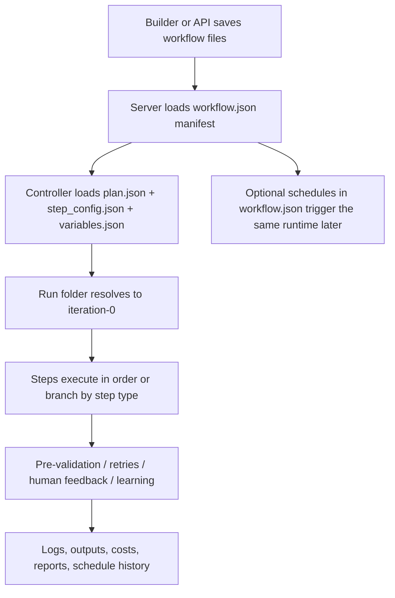

# How Workflows Work

This is the short mental model for AgentForge workflows.

A workflow is not just a prompt. It is a workspace-backed system that combines:

- a manifest that defines workflow-wide capabilities and schedules
- a plan that defines the step graph
- per-step execution config
- optional variable groups for batch or environment-specific runs
- a run-folder model that keeps the latest execution in `iteration-0`
- an execution controller that runs steps, validates outputs, pauses for humans when needed, and records logs/costs/artifacts

If you understand those pieces, the rest of the workflow system becomes much easier to reason about.

## The Core Files

Each workflow lives in its own workspace, typically under `Workflow/<name>/`.

The important files are:

| File | Purpose |
|------|---------|
| `workflow.json` | Workflow manifest. Source of truth for workflow identity, capabilities, execution defaults, ownership, and schedules. |
| `planning/plan.json` | The actual workflow graph: step order, branching, routing, orchestration steps, and step descriptions. |
| `planning/step_config.json` | Per-step execution config: models, tools, servers, validation behavior, learning behavior, and execution mode. |
| `planning/workflow_layout.json` | Canvas/UI layout for the visual builder. |
| `variables/variables.json` | Variable definitions and group values used for per-group execution. |
| `evaluation/evaluation_plan.json` | Optional evaluation/benchmark plan for testing the workflow. |

The most important separation is this:

- `workflow.json` answers "what can this workflow do at a workflow-wide level?"
- `plan.json` answers "what steps does the workflow take?"
- `step_config.json` answers "how should each step execute?"

## The High-Level Lifecycle

From the system’s point of view, a workflow run looks like this:

## 1. Authoring: The Builder Writes Files, Not Hidden DB State

The current architecture is manifest-backed and file-backed.

That means:

- workflow discovery scans workspaces for `workflow.json`
- workflow metadata comes from `workflow.json`
- schedules also live in `workflow.json`
- the step graph still lives in `planning/plan.json`

This matters because the workflow is portable and inspectable. If you open the workspace, you can see the workflow definition directly instead of reverse-engineering it from database rows.

## 2. Execution Bootstrap: The Manifest Sets The Global Defaults

When a workflow starts, the server reads `workflow.json` first.

That manifest provides the workflow-wide defaults for things like:

- selected MCP servers
- selected tools
- selected skills
- browser mode
- code-execution mode
- phase LLM and tiered LLM allocation
- execution defaults such as max turns or parallel tool behavior
- schedules and ownership

Then the workflow controller loads `planning/plan.json` and `planning/step_config.json`.

That gives the runtime two layers of configuration:

- workflow-wide defaults from the manifest
- per-step overrides from `step_config.json`

So the manifest decides the baseline, and each step can refine it.

## 3. Variables And Groups: One Workflow, Multiple Run Contexts

`variables/variables.json` lets the same workflow run against different groups such as:

- environments like `staging` and `production`
- customers or accounts
- different input bundles

At runtime, the controller resolves the selected group and injects those values into the step execution context. When groups are enabled, the real run unit is usually group-scoped, for example:

- `runs/iteration-0/production`
- `runs/iteration-0/staging`

This is why the scheduler and workshop tools ask for group selection explicitly. The workflow definition is shared, but execution artifacts are often per-group.

## 4. Run Folders: `iteration-0` Is Always The Latest Active Run

The current run model is intentionally simple:

- `iteration-0` is the active run
- older runs are archived as `iteration-1`, `iteration-2`, and so on

For a normal full run:

1. The controller resolves execution to `iteration-0`.
2. If `iteration-0` already exists, it is rotated to the next archive slot.
3. A fresh `iteration-0` is created.
4. Execution runs there.

This keeps the latest run predictable for:

- the builder
- the scheduler
- shell working directories
- report generation
- log inspection

When groups are involved, the real output folder is usually nested under the iteration:

- `runs/iteration-0/<group>/...`

## 5. Step Execution: The Controller Runs The Plan, Not Just A Flat Prompt

The runtime is driven by the step-based workflow orchestrator.

Its job is to:

- load the approved plan
- resolve variables and group context
- apply step config to each step
- execute steps in order
- branch when the plan uses conditional or routing logic
- run nested orchestration for advanced step types like `todo_task`

In practice, that means a workflow can contain more than simple linear steps. It can include:

- standard execution steps
- conditional or routing steps
- human-input steps
- orchestration steps that delegate work
- `todo_task` steps that manage sub-agents and route-specific execution

The execution controller is where the plan becomes a real runtime.

## 6. Validation, Human Feedback, And Learning Happen Inside The Run

A step is not considered "done" just because an LLM answered.

The important runtime behaviors are:

- **Pre-validation**: if a step has a validation schema, the system runs deterministic file/output checks after execution.
- **Retry with feedback**: if pre-validation fails, the controller can retry the step with concrete validation feedback.
- **Human feedback**: a workflow can pause and request approval, clarification, or OTP/2FA input through the `human_feedback` tool, UI, and optional Slack escalation.
- **Learning**: successful runs can update the shared workflow learning state, especially the global workflow skill under `learnings/_global/SKILL.md`.

That combination is what makes workflows more durable than a single prompt chain. The runtime can stop, verify, ask, retry, and improve.

## 7. Workshop Mode And Scheduled Mode Use The Same Underlying Workflow

There are two common ways to run workflows:

- **Interactive workshop/builder mode**: an agent edits and runs the workflow through tools like `run_full_workflow`.
- **Scheduled mode**: cron definitions stored in `workflow.json` trigger the workflow automatically.

The important point is that scheduling does not use a separate workflow format.

Schedules are manifest-backed and still run the same workflow files:

- the scheduler reads `workflow.json`
- it resolves enabled schedules
- it launches execution against `iteration-0`
- it records run history in `schedule-runs.json`

So scheduled runs are not a different product surface. They are another entry point into the same workflow runtime.

## 8. Observability: Every Run Leaves Artifacts

After or during execution, the system exposes several operational views:

- execution logs for a selected run folder
- cost aggregation
- evaluation reports
- learnings
- final outputs
- scheduled-run history

Those surfaces are backed by files written during execution, especially under `runs/<iteration...>/`, `evaluation/`, and schedule history files.

That is why the workflow system feels inspectable: each run produces concrete artifacts, not just transient chat messages.

## Practical Mental Model

If you want the shortest correct summary, use this:

1. A workflow is a workspace with a manifest plus planning files.
2. The manifest defines global capabilities and schedules.
3. The plan defines the step graph.
4. Step config defines how each step executes.
5. Variables select which group/context the run uses.
6. Execution always centers on `iteration-0`, with older runs archived.
7. The controller executes steps, validates outputs, handles human pauses, and records artifacts.
8. Scheduling and workshop mode are just different ways to invoke the same underlying runtime.

## Related Docs

- [workflow_manifest_architecture.md](/Users/mipl/ai-work/mcp-agent-builder-go/docs/workflow/workflow_manifest_architecture.md)
- [iteration_run_folder_architecture.md](/Users/mipl/ai-work/mcp-agent-builder-go/docs/workflow/iteration_run_folder_architecture.md)
- [workflow_scheduling.md](/Users/mipl/ai-work/mcp-agent-builder-go/docs/workflow/workflow_scheduling.md)
- [step_config_format_specification.md](/Users/mipl/ai-work/mcp-agent-builder-go/docs/workflow/step_config_format_specification.md)
- [human_feedback_system.md](/Users/mipl/ai-work/mcp-agent-builder-go/docs/workflow/human_feedback_system.md)
- [workflow_monitoring.md](/Users/mipl/ai-work/mcp-agent-builder-go/docs/workflow/workflow_monitoring.md)
