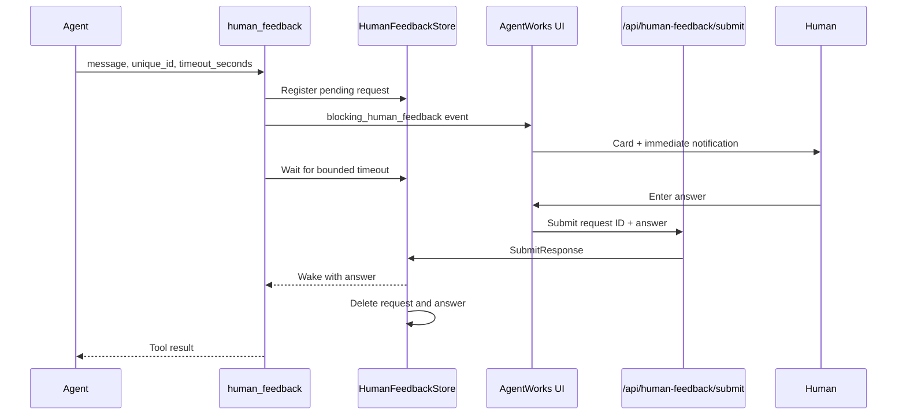

# Human Feedback System

## Purpose

`human_feedback` is a short-lived, blocking tool for input that only a human can provide. Typical uses are:

- OTP or 2FA codes
- CAPTCHA completion
- Explicit approval before an irreversible action
- A private value or subjective decision that another agent must not infer

It is not a general agent-to-agent question mechanism and it is not intended for questions that may remain unanswered for hours or days. Long-lived workflow/report questions use the persistent report/Pulse human-input records instead.

The workflow waits, but the AgentWorks/Electron application does not block. The user receives an interactive card and submits the response directly to the backend. The Workflow Builder is not an intermediary and has no answer-submission tool.

## Runtime flow

1. The agent calls `human_feedback` with a unique request ID, a human-facing message, and an appropriate timeout.
2. The backend registers the pending request before publishing any UI event. This prevents a fast UI answer from racing request creation.
3. A `blocking_human_feedback` event renders an interactive card in AgentWorks.
4. Browser/Electron and configured connector notifications are triggered immediately because these requests are short-lived.
5. The user answers the card, or a supported interactive connector submits the correlated answer.
6. `POST /api/human-feedback/submit` writes the response to `HumanFeedbackStore`, which wakes only the waiting workflow call.
7. The tool returns the response to the calling agent, and the store deletes the pending request and answer.
8. If the timeout expires first, the request is deleted and the tool returns an expiry error.



There is deliberately no Builder/chat hop in this sequence. A saved Builder session cannot answer, delay, rewrite, or retain the response.

## Tool contract

```json
{
  "tool": "human_feedback",
  "arguments": {
    "message_for_user": "Enter the six-digit code sent to your phone.",
    "unique_id": "login-otp-1712345678",
    "timeout_seconds": 120
  }
}
```

| Parameter | Type | Required | Behavior |
|---|---|---:|---|
| `unique_id` | string | Yes | Must uniquely identify this pending request. |
| `message_for_user` | string | Yes | Short instruction shown to the human. |
| `options` | string[] | No | Renders direct choice buttons rather than free text. |
| `timeout_seconds` | integer | No | Agent-selected wait, bounded to 30–1800 seconds; default 300 seconds. |

The agent should use an expiry supplied by the external service when available and otherwise choose the shortest realistic timeout.

## Direct submission and UI behavior

The frontend submits through `agentApi.submitHumanFeedback()` to:

```text
POST /api/human-feedback/submit
{
  "unique_id": "login-otp-1712345678",
  "response": "..."
}
```

The API requires a currently pending request. A late response after expiry is rejected rather than being applied to another workflow turn.

Potentially private response text is not included in server or browser console logs, OS notification previews, or the frontend's `localStorage`. The frontend persists only a short-lived boolean marker so a completed historical event does not reopen after a page refresh.

## Workflow `human_input` steps

Configured `human_input` plan steps use the same direct request store, UI card, endpoint, and connector path. Text, yes/no, and multiple-choice steps no longer forward questions into the Workflow Builder. These configured steps currently retain their existing ten-minute wait; the agent-selected `timeout_seconds` field applies to explicit `human_feedback` tool calls.

## Notification behavior

- The AgentWorks response card is the primary interaction surface.
- Browser/Electron notifications appear as soon as the card is available when notification permission is granted.
- Notification previews use generic text and do not expose the question or answer.
- The Electron dock badge stays active while the displayed request is pending.
- Configured interactive connectors are notified immediately for these short-lived requests.
- Workflow Slack Incoming Webhooks are not used here. They are one-way `notify_user` destinations and cannot submit the correlated answer this blocking flow requires.
- The older `ScheduleNotification` helper still supports a two-minute reminder for legacy/non-urgent callers; direct human-input paths use `ScheduleNotificationAfter(..., 0)`.

An app-wide durable Electron notification inbox is a separate capability. This flow uses the current event renderer, native notification, badge, and connector infrastructure.

## Key implementation files

| Component | File |
|---|---|
| Tool definition and handler | `agent_go/cmd/server/virtual-tools/human_tools.go` |
| Pending request coordination | `agent_go/cmd/server/virtual-tools/human_feedback_store.go` |
| Direct orchestrator helpers | `agent_go/pkg/orchestrator/base_orchestrator_feedback.go` |
| Submit endpoint | `agent_go/cmd/server/server.go` |
| Interactive event card | `frontend/src/components/events/BlockingHumanFeedbackDisplay.tsx` |
| Frontend API client | `frontend/src/services/api.ts` |
| Notification/submission dedup | `frontend/src/utils/notificationDedup.ts` |

## Operational rules

- Generate a fresh `unique_id` for every request.
- Do not ask an agent-answerable clarification through `human_feedback`.
- Do not use this tool for asynchronous questions that may be answered days later.
- Do not put OTPs or private values in the question; the sensitive value belongs only in the response.
- Handle timeout errors explicitly. Never assume approval when a request expires.
- Never reintroduce a chat/Builder relay for these answers.
