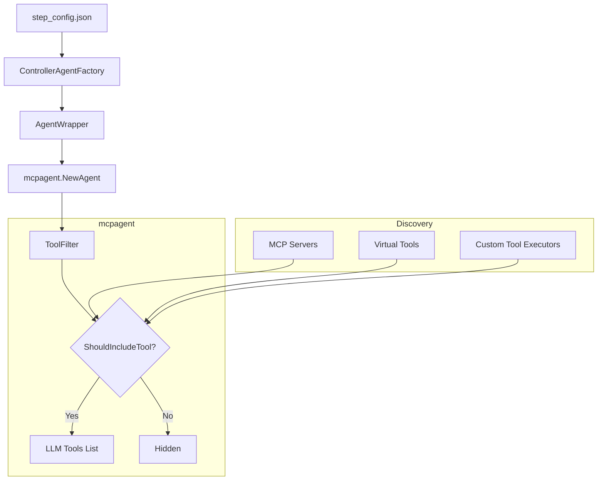

# Tool Filtering System

## 1. Tool Filtering and Configuration System

### 📋 Overview

The Tool Filtering and Configuration System provides a powerful, multi-layered mechanism to control exactly which tools are available to an agent at any given moment. This system allows for broad control (adding/removing entire servers) down to granular control (enabling specific tools within a server or category).

**Key Benefits:**
- **Server-Level Control**: Add or remove entire MCP servers from the agent's context.
- **Tool-Level Granularity**: Whitelist specific tools from a server while hiding others.
- **Custom Tool Management**: Enable/disable internal virtual tools (e.g., workspace operations, human feedback) with the same granularity.
- **Category-Based Filtering**: Enable entire categories of tools (e.g., "all workspace tools") with wildcard support.
- **Unified Filtering Logic**: Consistent behavior across both external MCP tools and internal custom tools.

### 📁 Key Files & Locations

| Component | File | Key Functions |
|-----------|------|----------------|
| **Core Filter** | [`mcpagent/agent/tool_filter.go`](https://github.com/manishiitg/mcpagent/blob/main/agent/tool_filter.go) | `NewToolFilter()`, `ShouldIncludeTool()`, `NormalizeServerName()` |
| **Agent Core** | [`mcpagent/agent/agent.go`](https://github.com/manishiitg/mcpagent/blob/main/agent/agent.go) | `WithSelectedTools()`, `WithSelectedServers()`, `NewAgent()` |
| **Orchestrator Utilities** | [`agent_go/pkg/orchestrator/base_orchestrator_tools.go`](../../agent_go/pkg/orchestrator/base_orchestrator_tools.go) | `FilterCustomToolsByCategory()` |
| **Agent Wrapper** | [`agent_go/pkg/agentwrapper/llm_agent.go`](../../agent_go/pkg/agentwrapper/llm_agent.go) | Pass `SelectedTools` to `mcpagent` options |
| **Workflow Types** | [`agent_go/pkg/orchestrator/agents/workflow/step_based_workflow/planning_agent.go`](../../agent_go/pkg/orchestrator/agents/workflow/step_based_workflow/planning_agent.go) | `AgentConfigs` struct definition (Source of Truth for JSON fields) |

### 🔄 How It Works

#### Filtering Lifecycle

1.  **Configuration Loading**: The system loads the `step_config.json` for a workflow step, which contains lists like `selected_tools` and `enabled_custom_tools`.
2.  **Filter Initialization**: A `ToolFilter` object is created. It normalizes all entries (e.g., converting hyphens to underscores) and builds efficient lookup maps for wildcards and specific tools.
3.  **MCP Connection**: The system establishes connections to all servers defined in `selected_servers` (or all servers in the base config if not filtered).
4.  **Tool Registration**: During agent initialization, the agent iterates through all discovered tools (both external MCP and internal virtual).
5.  **Enforcement**: For each tool, the agent calls `ShouldIncludeTool(namespace, toolName)`.
    *   If a wildcard like `github:*` is found, all tools from that namespace are included.
    *   If specific tools are listed (e.g., `github:create_issue`), only those tools are included.
    *   System tools (like `workspace_tools` and `human_tools`) are included by default unless a more specific filter is provided.

### 🏗️ Architecture



### 🧩 Code Example

#### Backend Configuration (Go)

```go
// From coding-agent-loop/agent_go/pkg/agentwrapper/llm_agent.go
if len(config.SelectedTools) > 0 {
    // Pass specific tool filters to mcpagent
    agentOptions = append(agentOptions, mcpagent.WithSelectedTools(config.SelectedTools))
}

if len(config.SelectedServers) > 0 {
    // Pass server-level filters
    agentOptions = append(agentOptions, mcpagent.WithSelectedServers(config.SelectedServers))
}
```

#### JSON Configuration (`step_config.json`)

```json
{
  "id": "step-id-1",
  "agent_configs": {
    "selected_servers": ["github"],
    "selected_tools": [
      "github:create_issue",
      "github:list_issues"
    ],
    "enabled_custom_tools": [
      "workspace_advanced:*",
      "workspace_advanced:execute_shell_command",
      "human_tools:*"
    ]
  }
}
```

### ⚙️ Configuration Fields

| Field | Type | Default | Description |
|-------|------|---------|-------------|
| `selected_servers` | `string[]` | `[]` | MCP servers to connect to. If empty, connects to all configured servers. |
| `selected_tools` | `string[]` | `[]` | Granular MCP tools. Format: `namespace:tool` or `namespace:*`. |
| `enabled_custom_tools` | `string[]` | `[]` | Granular internal tools. Format: `category:tool` or `category:*`. |

**Internal Category Names:**
- `workspace_tools`: Backward-compatible alias for the current workspace registry.
- `workspace_advanced`: Current workspace tools (`execute_shell_command`, `diff_patch_workspace_file`, `read_image`, `generate_text_llm`, `search_web_llm`, plus the media generators `image_gen` / `image_edit` / `generate_video` / `text_to_speech` / `speech_to_text` / `generate_music`)
- Legacy basic file tools such as `list_workspace_files`, `read_workspace_file`, `update_workspace_file`, `delete_workspace_file`, and `move_workspace_file` are not part of the current workflow-builder registry. Use shell and diff tools instead.
- `human_tools`: `human_feedback` (blocking ask-the-user), `notify_user` (non-blocking outbound push to Slack/WhatsApp/Gmail), `submit_human_answer` (resolves a launched workflow's human_input step)
- `workspace_browser`: `agent_browser`

### 🛠️ Common Issues & Solutions

| Issue | Cause | Solution |
|-------|-------|----------|
| Tool missing in chat | Tool not in `selected_tools` | Check the "Tool selection" panel in UI or `step_config.json` |
| "Server X filtered out" error | `selected_servers` used without the target server | Add the server to `selected_servers` or use wildcard `*` |
| Hyphen/Underscore mismatch | Names like `google-sheets` vs `google_sheets` | The system normalizes these automatically, but it's best to check `NormalizeServerName()` |

### 🔍 For LLMs: Quick Reference

**Constraints:**
- ✅ **Allowed**: Wildcards using `namespace:*`.
- ✅ **Allowed**: Mixing server filters and tool filters.
- ❌ **Forbidden**: Using tool names without a namespace (e.g., `create_issue` instead of `github:create_issue`).

**Normalizing Rule:**
All names are converted to lowercase with underscores (`google-sheets` -> `google_sheets`).

**Pattern Precedence:**
Specific tool filters (`namespace:tool`) take precedence over server-level filters (`selected_servers`). If you specify one tool from a server, all other tools from that server are automatically hidden unless you add a wildcard.

### 📝 Implementation Review

The system implements a robust three-tier configuration model (Servers -> MCP Tools -> Custom Tools) that is consistent across the full stack. The following technical validation was performed:

#### **Frontend Validation (`StepEditPanel.tsx`)**
- **Unified Format**: Successfully handles the `namespace:tool` and `namespace:*` format for both MCP and custom tools.
- **Legacy Support**: Correctly converts old-style `categories` arrays into the unified format.
- **"NO_SERVERS" Support**: Implements the special `"NO_SERVERS"` flag to allow users to explicitly disable external tool access for pure LLM/Virtual tool steps.

#### **Backend Validation (`tool_filter.go` & `controller_agent_factory.go`)**
- **Centralized Enforcement**: `ToolFilter` provides a single source of truth for tool visibility during both initialization and discovery.
- **Normalization**: Robust handling of hyphen/underscore differences (e.g., `google-sheets` vs `google_sheets`) prevents common configuration mismatches.
- **Explicit Protocol Support**: `controller_agent_factory.go` explicitly recognizes the `NO_SERVERS` flag (via `mcpclient.NoServers`), correctly interpreting it as an instruction to bind to zero external servers without error.

---

## 2. The two filtering layers (don't confuse them)

Tool availability is decided by **two independent gates**. Section 1 above is only the first. A tool must pass **both** to be usable.

| Layer | Scope | Where | Keyed on |
|-------|-------|-------|----------|
| **1. Static config filter** | Which tools are *registered* on the agent | `enabled_custom_tools` / `selected_tools` → `FilterCustomToolsByCategory` / `ToolFilter` | step/workflow config |
| **2. Dynamic workshop-mode allow-list** | Which *registered* tools the agent may use *this turn* | `GetToolsForWorkshopMode(mode)` → `Agent.SetToolAllowList` | current workshop mode (`workshop` / `run`) |

A tool can be **registered** (layer 1) yet still **blocked** (layer 2). This has happened in production twice:

- `notify_user` was registered via `human_tools:*`, but `GetToolsForWorkshopMode` did not list it, so every workflow-phase agent (including the post-run monitor) was denied it.
- Pulse state tools (`get_pulse_module_state`, `record_pulse_worklist`, `mark_pulse_module_result`) were registered in the workflow tool pool, but not allow-listed for workshop mode, so Pulse/module turns could be instructed to call them and then report that they were not callable.

- **Layer 2 source of truth:** `GetToolsForWorkshopMode` in [`interactive_workshop_manager.go`](../../agent_go/pkg/orchestrator/agents/workflow/step_based_workflow/interactive_workshop_manager.go). The `system` slice is "always available regardless of mode"; the `switch mode` adds the rest. To make a tool available to the builder/monitor, add its name here.
- **Regression guard:** `TestToolSetInvariants` in [`toolset_invariant_test.go`](../../agent_go/cmd/server/toolset_invariant_test.go) checks that workshop/run allow-listed tools have a real registration path: workflow pool, workshop custom registration, guidance/status registration, or mcpagent virtual/session tools. When adding a new tool to `GetToolsForWorkshopMode`, update the registration path or the explicit known-registration map in that test.

## 3. How CLI agents see tools — the mcpbridge gate

CLI providers (`claude-code`, `codex-cli`, `cursor-cli`, `pi-cli`; legacy `agy-cli`) do **not** receive tools as native tool-calling functions. They run in code-execution mode and reach every tool through the **api-bridge** (`mcp__api-bridge__*`), discovered at use-time via `get_api_spec`. So "do you have tool X?" asked of a CLI agent is unreliable — bridged tools aren't in its native list; it only sees them through `get_api_spec`.

Crucially, the **layer-2 allow-list is the single gate for the bridge too**, enforced in two spots in `mcpagent` — both reading the same `sessionToolAllowLists[sessionID]` map (populated by `SetToolAllowList` → `codeexec.SetSessionToolAllowList`):

1. **Discovery** — `agent/code_execution_tools.go` (`Respect toolAllowList … only include allowed custom tools in the index`): a blocked tool never appears in `get_api_spec`.
2. **Execution** — `agent/codeexec/registry.go` `CallCustomToolWithSession`: a blocked tool's HTTP call returns `tool "<name>" is not available in the current workshop mode`.

**Consequence:** adding a tool to `GetToolsForWorkshopMode` is sufficient for CLI agents — it makes the tool both *visible* in `get_api_spec` and *callable* via the bridge. No separate bridge registration is needed (registration already happened in layer 1 via `UpdateCodeExecutionRegistry`).

### Debugging checklist — "the agent says it doesn't have tool X"

1. Is X **registered**? (in the `human_tools`/`workspace_*` pool and `enabled_custom_tools`/`PreparePhaseAgentTools`) — layer 1.
2. Is X in **`GetToolsForWorkshopMode`** for the current mode? — layer 2. *(Most common cause.)*
3. For CLI agents, don't trust the agent's self-report — have it call `get_api_spec` (visibility) or invoke the tool (execution). The error `not available in the current workshop mode` means layer 2 is blocking it.
4. If X is a scheduled Pulse/workshop tool, add or update a `TestToolSetInvariants` assertion so the registered-tool pool and workshop allow-list cannot drift again.

---
