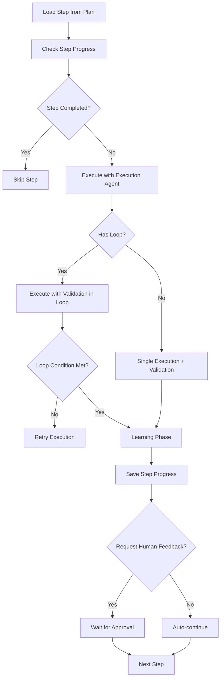

# Workflow Orchestrator System

## 📋 Overview

The Workflow Orchestrator is a multi-phase execution system that transforms high-level objectives into executable plans with automated execution, validation, and learning capabilities. It manages complex workflows through distinct phases: variable extraction, planning, execution, validation, learning, and post-execution optimization.

**Key Benefits:**
- **Phase isolation:** Each phase (variable extraction, planning, execution, etc.) runs independently and can be triggered separately
- **Human-in-the-loop control:** Supports human feedback and approval at critical decision points
- **Learning capture:** Automatically captures execution patterns and learnings for reusability
- **Multi-agent orchestration:** Coordinates specialized agents (planning, execution, validation, learning) with independent LLM configurations
- **Flexible execution modes:** Supports fast execution, skip human input, and resume from checkpoint

---

## 📁 Key Files & Locations

| Component | File | Key Types/Functions |
|-----------|------|---------------------|
| **Orchestrator Core** | [`workflow_orchestrator.go`](file:///Users/mipl/ai-work/mcp-agent/agent_go/pkg/orchestrator/types/workflow_orchestrator.go) | `WorkflowOrchestrator`, `NewWorkflowOrchestrator()`, `Execute()`, `GetWorkflowConstants()` |
| **Controller** | [`controller.go`](file:///Users/mipl/ai-work/mcp-agent/agent_go/pkg/orchestrator/agents/workflow/todo_creation_human/controller.go) | `HumanControlledTodoPlannerOrchestrator`, `CreateTodoList()`, `executeSingleStep()` |
| **Planning Agent** | [`planning_agent.go`](file:///Users/mipl/ai-work/mcp-agent/agent_go/pkg/orchestrator/agents/workflow/todo_creation_human/planning_agent.go) | `HumanControlledTodoPlannerPlanningAgent`, `PlanningResponse`, `PlanStep` |
| **Execution Agent** | [`execution_agent.go`](file:///Users/mipl/ai-work/mcp-agent/agent_go/pkg/orchestrator/agents/workflow/todo_creation_human/execution_agent.go) | `HumanControlledTodoPlannerExecutionAgent`, `Execute()` |
| **Execution-Only Agent** | [`execution_only_agent.go`](file:///Users/mipl/ai-work/mcp-agent/agent_go/pkg/orchestrator/agents/workflow/todo_creation_human/execution_only_agent.go) | `HumanControlledTodoPlannerExecutionOnlyAgent` - Uses pre-discovered learning context |
| **Validation Agent** | [`validation_agent.go`](file:///Users/mipl/ai-work/mcp-agent/agent_go/pkg/orchestrator/agents/workflow/todo_creation_human/validation_agent.go) | `HumanControlledTodoPlannerValidationAgent`, `ValidationResponse`, `ExecuteStructured()` |
| **Learning Agent** | [`learning_agent.go`](file:///Users/mipl/ai-work/mcp-agent/agent_go/pkg/orchestrator/agents/workflow/todo_creation_human/learning_agent.go) | `HumanControlledTodoPlannerLearningAgent`, `Execute()` |
| **Code Execution Learning** | [`learning_agent_code_execution.go`](file:///Users/mipl/ai-work/mcp-agent/agent_go/pkg/orchestrator/agents/workflow/todo_creation_human/learning_agent_code_execution.go) | `HumanControlledTodoPlannerCodeExecutionLearningAgent` - Captures Go code patterns |
| **Learning Reading Agent** | [`learning_reading_agent.go`](file:///Users/mipl/ai-work/mcp-agent/agent_go/pkg/orchestrator/agents/workflow/todo_creation_human/learning_reading_agent.go) | `HumanControlledTodoPlannerLearningReadingAgent` - Reads existing learning files |
| **Variable Management** | [`variable_management.go`](file:///Users/mipl/ai-work/mcp-agent/agent_go/pkg/orchestrator/agents/workflow/todo_creation_human/variable_management.go) | `VariableManager`, `ExtractVariablesOnly()`, `VariablesManifest` |
| **Anonymization** | [`anonymization_agent.go`](file:///Users/mipl/ai-work/mcp-agent/agent_go/pkg/orchestrator/agents/workflow/todo_creation_human/anonymization_agent.go) | `AnonymizationManager`, `AnonymizeLearningsOnly()` |
| **Plan Improvement** | [`plan_improvement_agent.go`](file:///Users/mipl/ai-work/mcp-agent/agent_go/pkg/orchestrator/agents/workflow/todo_creation_human/plan_improvement_agent.go) | `PlanImprovementManager`, `PlanImprovementOnly()` |

---

## 🔄 Workflow Phases & Lifecycle

The workflow orchestrator operates through 7 distinct phases, each isolated and independently executable:

### 1. Variable Extraction Phase
**Status:** `variable-extraction`  
**Entry Point:** [`runVariableExtraction()`](file:///Users/mipl/ai-work/mcp-agent/agent_go/pkg/orchestrator/types/workflow_orchestrator.go#L413-L433)

Extracts dynamic values from the objective and creates `variables/variables.json` with templated placeholders.

```go
// Example variables.json output
{
  "variables": [
    {
      "name": "API_BASE_URL",
      "value": "https://api.example.com",
      "description": "Base URL for API endpoints"
    }
  ],
  "objective": "Deploy application to {{API_BASE_URL}}"
}
```

### 2. Planning Phase
**Status:** `planning`  
**Entry Point:** [`runPlanningOnly()`](file:///Users/mipl/ai-work/mcp-agent/agent_go/pkg/orchestrator/types/workflow_orchestrator.go#L435-L478)

Creates structured execution plan and saves to `planning/plan.json`. Supports iterative refinement through human conversation.

**Plan Structure:**
```go
type PlanStep struct {
    ID                       string   // Stable step ID
    Title                    string
    Description              string
    SuccessCriteria          string
    ContextDependencies      []string // Dependencies on previous step outputs
    ContextOutput            string   // What this step produces
    LearningFilesToReference []string // Learning files to read for context
    HasLoop                  bool     // Loop support for retry logic
    LoopCondition            string
    MaxIterations            int
    HasCondition             bool     // Conditional branching
    ConditionQuestion        string
    IfTrueSteps              []PlanStep
    IfFalseSteps             []PlanStep
    AgentConfigs             *AgentConfigs // Per-step LLM config
}
```

### 3. Execution Phase
**Status:** `pre-verification`  
**Entry Point:** [`runPlanning()`](file:///Users/mipl/ai-work/mcp-agent/agent_go/pkg/orchestrator/types/workflow_orchestrator.go#L566-L572)

Executes the approved plan step-by-step. Requires both `variables.json` and `plan.json` to exist.

**Execution Modes:**
- **Normal:** Full execution with human feedback after each step
- **Fast Execute:** Skips learning and human feedback for rapid execution
- **Skip Human Input:** Runs learning but auto-approves steps

**Step Execution Flow:**


### 4. Anonymize Learnings Phase
**Status:** `anonymize-learnings`  
**Entry Point:** [`runAnonymization()`](file:///Users/mipl/ai-work/mcp-agent/agent_go/pkg/orchestrator/types/workflow_orchestrator.go#L480-L498)

Scans `learnings/` folder to find actual values matching known variables and replaces them with `{{VARIABLE_NAME}}` placeholders for reusability.

### 5. Plan Improvement Phase
**Status:** `plan-improvement`  
**Entry Point:** [`runPlanImprovement()`](file:///Users/mipl/ai-work/mcp-agent/agent_go/pkg/orchestrator/types/workflow_orchestrator.go#L500-L520)

Analyzes execution results, `plan.json`, learnings folder, and validation reports to provide feedback for improving the plan.

### 6. Plan-Learnings Alignment Phase
**Status:** `plan-learnings-alignment`  
**Entry Point:** [`runPlanLearningsAlignment()`](file:///Users/mipl/ai-work/mcp-agent/agent_go/pkg/orchestrator/types/workflow_orchestrator.go#L522-L542)

Checks alignment between `plan.json` and learnings folder. Identifies:
- Orphaned learning files (for deleted steps)
- Missing learnings (for new steps)
- Mismatches between plan and learnings

### 7. Plan Tool Optimization Phase
**Status:** `plan-tool-optimization`  
**Entry Point:** [`runPlanToolOptimization()`](file:///Users/mipl/ai-work/mcp-agent/agent_go/pkg/orchestrator/types/workflow_orchestrator.go#L544-L564)

Analyzes `plan.json` and learnings to optimize tool selections in `step_config.json`. Updates configuration to include only actually used tools.

---

## 🏗️ Architecture

### Component Interaction

```mermaid
graph TB
    API[API Request] --> WO[WorkflowOrchestrator]
    WO --> Router{Route by Phase}
    Router -->|variable-extraction| VM[VariableManager]
    Router -->|planning| PA[Planning Agent]
    Router -->|execution| HCTP[HumanControlledTodoPlannerOrchestrator]
    Router -->|anonymize-learnings| AM[AnonymizationManager]
    Router -->|plan-improvement| PIM[PlanImprovementManager]
    Router -->|plan-tool-optimization| TOM[ToolOptimizationManager]
    
    HCTP --> SS[executeSingleStep]
    SS --> EA[Execution Agent]
    SS --> VA[Validation Agent]
    SS --> LA[Learning Agent]
    
    VM --> VF[variables/variables.json]
    PA --> PF[planning/plan.json]
    LA --> LF[learnings/*.md]
    
    HCTP --> SP[runs/{folder}/steps_done.json]
```

### Agent Specialization

Each agent has a specific responsibility with independent LLM configuration:

| Agent | Purpose | LLM Config Source | Output |
|-------|---------|-------------------|--------|
| **Planning Agent** | Creates structured execution plan | `presetPlanningLLM` or step `AgentConfigs.PlanningLLM` | `planning/plan.json` |
| **Execution Agent** | Executes step using MCP tools | `presetExecutionLLM` or step `AgentConfigs.ExecutionLLM` | Step execution result |
| **Validation Agent** | Validates success criteria | `presetValidationLLM` or step `AgentConfigs.ValidationLLM` | `ValidationResponse` struct |
| **Learning Agent** | Captures patterns and learnings | `presetLearningLLM` or step `AgentConfigs.LearningLLM` | `learnings/step-N.md` |
| **Variable Extraction** | Extracts dynamic values | `presetVariableExtractionLLM` | `variables/variables.json` |
| **Anonymization** | Anonymizes learnings | `presetAnonymizationLLM` | Updated learning files |
| **Plan Improvement** | Provides plan feedback | `presetPlanImprovementLLM` | Improvement suggestions |

### Specialized Agent Variants

Three specialized agent variants exist for specific execution scenarios:

**1. Execution-Only Agent**  
**File:** [`execution_only_agent.go`](file:///Users/mipl/ai-work/mcp-agent/agent_go/pkg/orchestrator/agents/workflow/todo_creation_human/execution_only_agent.go)

Used when learning files are **pre-discovered** by the Learning Reading Agent. Receives learning history as input rather than discovering it during execution. This optimizes performance by separating learning discovery from execution.

**2. Code Execution Learning Agent**  
**File:** [`learning_agent_code_execution.go`](file:///Users/mipl/ai-work/mcp-agent/agent_go/pkg/orchestrator/agents/workflow/todo_creation_human/learning_agent_code_execution.go)

Specialized learning agent for **code execution mode**. Captures Go code patterns and improves future code generation by analyzing:
- Generated Go code structure
- Package imports and dependencies
- Error handling patterns
- Code execution results

**3. Learning Reading Agent**  
**File:** [`learning_reading_agent.go`](file:///Users/mipl/ai-work/mcp-agent/agent_go/pkg/orchestrator/agents/workflow/todo_creation_human/learning_reading_agent.go)

Pre-reads learning files and code patterns from the `learnings/` directory. Passes discovered learning history to Execution-Only Agent. This enables:
- Faster execution by pre-loading context
- Separation of concerns (discovery vs execution)
- Reusable learning discovery logic

---

## 💡 Step Execution Details

Each step goes through a multi-agent pipeline in [`executeSingleStep()`](file:///Users/mipl/ai-work/mcp-agent/agent_go/pkg/orchestrator/agents/workflow/todo_creation_human/controller.go):

### 1. Execution Agent
**File:** [`execution_agent.go`](file:///Users/mipl/ai-work/mcp-agent/agent_go/pkg/orchestrator/agents/workflow/todo_creation_human/execution_agent.go)

Executes the step using MCP tools with context from:
- Step description and success criteria
- Context dependencies (outputs from previous steps)
- Learning files to reference
- Variable names and values

### 2. Validation Agent  
**File:** [`validation_agent.go`](file:///Users/mipl/ai-work/mcp-agent/agent_go/pkg/orchestrator/agents/workflow/todo_creation_human/validation_agent.go)

Returns structured validation response:
```go
type ValidationResponse struct {
    IsSuccessCriteriaMet bool
    Reasoning            string
    Feedback             []ValidationFeedback
    LoopConditionMet     bool   // For loop steps
    LoopReasoning        string
}
```

### 3. Learning Agent
**File:** [`learning_agent.go`](file:///Users/mipl/ai-work/mcp-agent/agent_go/pkg/orchestrator/agents/workflow/todo_creation_human/learning_agent.go)

Creates learning file at `learnings/step-{N}.md` with:
- **What worked:** Successful patterns
- **What failed:** Failed attempts and errors
- **Key insights:** Important discoveries
- **Code snippets:** Reusable code samples
- **Dependencies:** Required packages/tools

---

## ⚙️ Configuration

### Preset LLM Configuration

The orchestrator supports preset-level defaults that cascade to step-level configs:

```go
type WorkflowOrchestrator struct {
    presetExecutionLLM          *AgentLLMConfig
    presetValidationLLM         *AgentLLMConfig
    presetLearningLLM           *AgentLLMConfig
    presetPlanningLLM           *AgentLLMConfig
    presetVariableExtractionLLM *AgentLLMConfig
    presetAnonymizationLLM      *AgentLLMConfig
    presetPlanImprovementLLM    *AgentLLMConfig
}
```

**Resolution Order:** Step `AgentConfigs` → Preset defaults → Orchestrator defaults

### Per-Step Agent Configuration

Each step in `plan.json` can override agent settings:

```json
{
  "id": "step-1",
  "title": "Configure API",
  "agent_configs": {
    "execution_llm": {
      "provider": "openai",
      "model_id": "gpt-4"
    },
    "validation_llm": {
      "provider": "anthropic",
      "model_id": "claude-3-opus"
    },
    "max_execution_turns": 20,
    "max_validation_turns": 5,
    "enable_large_output_virtual_tools": true,
    "use_code_execution_mode": false
  }
}
```

### Workspace Structure

```
workspace/
├── variables/
│   └── variables.json          # Extracted variables
├── planning/
│   └── plan.json               # Approved execution plan
├── runs/
│   ├── iteration-same/         # Default run folder
│   │   ├── steps_done.json     # Step completion progress
│   │   ├── context/            # Step context outputs
│   │   └── step-{N}-execution.md
│   ├── iteration-1/            # Additional run folders
│   └── iteration-2/
└── learnings/
    ├── step-1.md               # Per-step learnings
    └── step-2-script.py        # Learning scripts
```

---

## 🔁 Progress Tracking & Resume

### Step Progress Format

**File:** `runs/{folder}/steps_done.json`

```json
{
  "completed_step_indices": [0, 1, 2],
  "total_steps": 5,
  "last_updated": "2025-01-15T10:30:00Z",
  "branch_steps": {
    "3": {
      "branch_executed": "if_true",
      "completed_steps": ["step-3-if-true-0", "step-3-if-true-1"]
    }
  }
}
```

### Resume Behavior

When `steps_done.json` exists:
1. **Matching plan:** Resumes from first incomplete step
2. **Plan changed:** Prompts user to keep/delete old progress
3. **All steps done:** Offers fast re-execute or skip
4. **Conditional steps:** Tracks branch execution progress separately

---

## 🛠️ Common Workflows

### Workflow: Variable Extraction → Planning → Execution

```bash
# Step 1: Extract variables
POST /api/workflow/execute
{
  "objective": "Deploy app to https://api.example.com",
  "workspace_path": "/path/to/workspace",
  "workflow_status": "variable-extraction"
}

# Step 2: Create plan
POST /api/workflow/execute
{
  "objective": "Deploy app to {{API_BASE_URL}}",
  "workspace_path": "/path/to/workspace",
  "workflow_status": "planning"
}

# Step 3: Execute plan
POST /api/workflow/execute
{
  "objective": "Deploy app to {{API_BASE_URL}}",
  "workspace_path": "/path/to/workspace",
  "workflow_status": "pre-verification"
}
```

### Workflow: Fast Execute Mode

When starting fresh execution, select "Fast Execute all steps" option:
- Skips learning agent
- Skips human feedback requests
- Executes all steps sequentially
- Useful for testing or batch processing

### Workflow: Plan Optimization

After execution completes:

```bash
# Anonymize learnings
POST /api/workflow/execute
{
  "workspace_path": "/path/to/workspace",
  "workflow_status": "anonymize-learnings"
}

# Optimize tool configuration
POST /api/workflow/execute
{
  "workspace_path": "/path/to/workspace",
  "workflow_status": "plan-tool-optimization"
}
```

---

## 🔍 For LLMs: Quick Reference

**Phase Isolation:**
- Each phase is triggered independently via `workflowStatus` parameter
- Phases NEVER automatically trigger other phases
- Required files must exist before execution phase (variables.json, plan.json)

**Step Execution Constraints:**
- ✅ **Allowed:** Access to MCP tools, workspace files, previous step context, learning files
- ❌ **Forbidden:** Direct OS calls (use code execution mode if needed), modifying plan.json during execution

**Loop Step Pattern:**
```json
{
  "has_loop": true,
  "loop_condition": "API returns 200 status code",
  "max_iterations": 10,
  "success_criteria": "Successfully configured and verified API connection"
}
```

**Conditional Step Pattern:**
```json
{
  "has_condition": true,
  "condition_question": "Does the configuration file exist?",
  "condition_context": "Check if config.yaml exists in workspace",
  "if_true_steps": [...],
  "if_false_steps": [...]
}
```

**Variable Template Syntax:**
- Use `{{VARIABLE_NAME}}` in objectives, descriptions, and code
- Runtime values loaded from `variables/values.json`
- Anonymization replaces actual values with templates

---

## 📖 Related Documentation

- [`human_feedback_tool.md`](file:///Users/mipl/ai-work/mcp-agent/docs/human_feedback_tool.md) - Human feedback interaction system
- [`large_output_handling.md`](file:///Users/mipl/ai-work/mcp-agent/docs/large_output_handling.md) - Large output virtual tools
- [`code_execution_agent.md`](file:///Users/mipl/ai-work/mcp-agent/docs/code_execution_agent.md) - Code execution mode for steps
