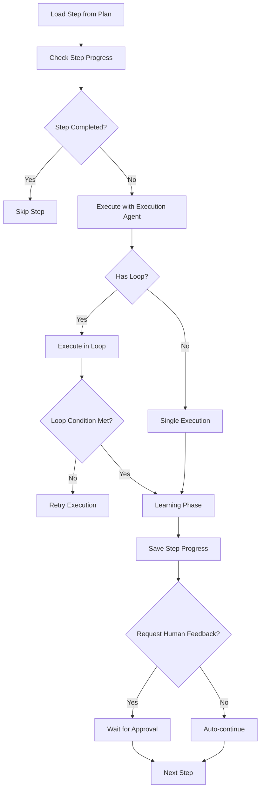
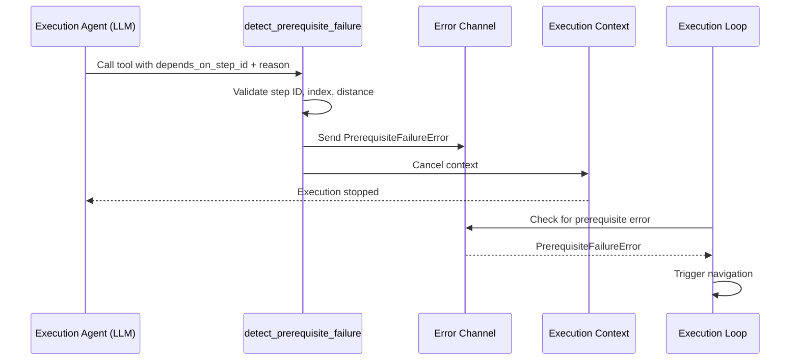

# Workflow Orchestrator System

## 📋 Overview

The Workflow Orchestrator (implemented as the **Human-Controlled Todo Creation Orchestrator**) is a multi-phase execution system that transforms high-level objectives into executable plans with automated execution, pre-validation, and learning capabilities. It manages complex workflows through distinct phases: variable extraction, planning, execution, pre-validation (code-based), learning, and post-execution optimization.

> **Note**: LLM-based validation (the validation agent) has been **disabled**. Only code-based pre-validation (file checks, JSON schema validation) runs when a `validation_schema` is defined on a step. Steps are auto-approved after execution.

**Key Benefits:**
- Phase isolation: Each phase runs independently and can be triggered separately
- Human-in-the-loop control: Supports human feedback and approval at critical decision points
- Learning capture: Automatically captures execution patterns for reusability
- Multi-agent orchestration: Coordinates specialized agents with independent LLM configurations
- Flexible execution modes: Supports fast execution, skip human input, and resume from checkpoint
- Manager-based architecture: Dedicated managers for independent workflow phases enable decoupling and reusability

---

## 📁 Key Files & Locations

| Component | File | Key Types/Functions |
|-----------|------|---------------------|
| **Orchestrator Core** | [`workflow_orchestrator.go`](../agent_go/pkg/orchestrator/types/workflow_orchestrator.go) | `WorkflowOrchestrator`, `NewWorkflowOrchestrator()`, `Execute()`, `GetWorkflowConstants()` |
| **Controller** | [`controller.go`](../agent_go/pkg/orchestrator/agents/workflow/step_based_workflow/controller.go) | `HumanControlledTodoPlannerOrchestrator`, `CreateTodoList()`, `executeSingleStep()` |
| **Execution Manager** | [`execution_manager.go`](../agent_go/pkg/orchestrator/agents/workflow/step_based_workflow/execution_manager.go) | `ExecutionManager`, `CleanupForFreshStart()`, `CleanupForSingleStep()`, `PrepareExecution()` |
| **Execution Types** | [`execution_types.go`](../agent_go/pkg/orchestrator/agents/workflow/step_based_workflow/execution_types.go) | `ExecutionMode`, `CleanupScope`, `ExecutionSetup` |
| **Planning Agent** | [`planning_agent.go`](../agent_go/pkg/orchestrator/agents/workflow/step_based_workflow/planning_agent.go) | `HumanControlledTodoPlannerPlanningAgent`, `PlanningResponse`, `PlanStep` |
| **Execution Agent** | [`execution_agent.go`](../agent_go/pkg/orchestrator/agents/workflow/step_based_workflow/execution_agent.go) | `HumanControlledTodoPlannerExecutionAgent`, `Execute()` |
| **Execution-Only Agent** | [`execution_only_agent.go`](../agent_go/pkg/orchestrator/agents/workflow/step_based_workflow/execution_only_agent.go) | `HumanControlledTodoPlannerExecutionOnlyAgent` |
| **Validation Agent** | [`validation_agent.go`](../agent_go/pkg/orchestrator/agents/workflow/step_based_workflow/validation_agent.go) | `HumanControlledTodoPlannerValidationAgent`, `ValidationResponse`, `ExecuteStructured()` — **DISABLED** (code retained but never called; all steps auto-approved) |
| **Learning Agent** | [`learning_agent.go`](../agent_go/pkg/orchestrator/agents/workflow/step_based_workflow/learning_agent.go) | `HumanControlledTodoPlannerLearningAgent`, `Execute()` |
| **Code Execution Learning** | [`learning_agent_code_execution.go`](../agent_go/pkg/orchestrator/agents/workflow/step_based_workflow/learning_agent_code_execution.go) | `HumanControlledTodoPlannerCodeExecutionLearningAgent` |
| **Variable Management** | [`variable_management.go`](../agent_go/pkg/orchestrator/agents/workflow/step_based_workflow/variable_management.go) | `VariableManager`, `ExtractVariablesOnly()`, `VariablesManifest` |
| **Anonymization** | [`anonymization_agent.go`](../agent_go/pkg/orchestrator/agents/workflow/step_based_workflow/anonymization_agent.go) | `AnonymizationManager`, `AnonymizeLearningsOnly()` |
| **Plan Improvement** | [`plan_opt_improvement_agent.go`](../agent_go/pkg/orchestrator/agents/workflow/step_based_workflow/plan_opt_improvement_agent.go) | `PlanImprovementManager`, `PlanImprovementOnly()` |
| **Evaluation Debugger** | [`evaluation_debugger_manager.go`](../agent_go/pkg/orchestrator/agents/workflow/step_based_workflow/evaluation_debugger_manager.go) | `EvaluationDebuggerManager`, `EvaluationDebuggerOnly()` |
| **Code Exec Debugging** | [`code_exec_debugging_agent.go`](../agent_go/pkg/orchestrator/agents/workflow/step_based_workflow/code_exec_debugging_agent.go) | `CodeExecDebuggingManager`, `CodeExecDebuggingOnly()` |
| **Execution Debugger** | [`execution_debugger_agent.go`](../agent_go/pkg/orchestrator/agents/workflow/step_based_workflow/execution_debugger_agent.go) | `ExecutionDebuggerManager`, `ExecutionDebuggerOnly()` |
| **Conditional Agent** | [`conditional_agent.go`](../agent_go/pkg/orchestrator/agents/workflow/step_based_workflow/conditional_agent.go) | `ConditionalLLM`, `ConditionalResponse` |
| **Agent Factory** | [`controller_agent_factory.go`](../agent_go/pkg/orchestrator/agents/workflow/step_based_workflow/controller_agent_factory.go) | `createExecutionOnlyAgent()`, `createConditionalAgent()` |

---

## 🔄 How It Works

### Workflow Phases

The orchestrator operates through distinct phases, each isolated and independently executable:

| Phase | Status | Entry Point | Output | Human Decision |
|-------|--------|-------------|--------|----------------|
| **Planning** | `planning` | `runPlanningOnly()` | `plan.json` | Use/Create/Update (max 20 rev) |
| **Execution** | `execution` | `runPlanning()` | Step results | Approve/Re-execute/Stop |
| **Evaluation Designer** | `evaluation-designer` | `runEvaluationDesignerOnly()` | `evaluation_plan.json` | Review evaluation guide |
| **Evaluation Execution** | `evaluation-execution` | `runEvaluationExecutionOnly()` | Scores & Reports | - |
| **Evaluation Debugger** | `evaluation-debugger` | `runEvaluationDebugger()` | Updated evaluation plan | Review suggestions |
| **Plan Improvement** | `plan-improvement` | `runPlanImprovement()` | Updated `plan.json` | Review feedback |
| **Plan Tool Optimization** | `plan-tool-optimization` | `runPlanToolOptimization()` | Optimized `step_config.json` | - |
| **Learning Anonymization** | `learning-anonymization` | `runLearningAnonymization()` | Anonymized learnings | Confirm replacements |
| **Plan-Learnings Alignment** | `plan-learnings-alignment` | `runPlanLearningsAlignment()` | Alignment report | - |
| **Learning Consolidation** | `learning-consolidation` | `runLearningConsolidation()` | Consolidated learnings | - |
| **Code Exec Debugging** | `code-exec-debugging` | `runCodeExecDebugging()` | Plan fixes for code steps | Review fixes |
| **Execution Debugger** | `execution-debugger` | `runExecutionDebugger()` | Read-only analysis | Conversational Q&A |

### Execution Flow

1. **Planning**: Creates structured execution plan, saves to `planning/plan.json`, supports iterative refinement (max 20 revisions)
2. **Execution**: Executes plan step-by-step (Execute → Validate → Learn → Human feedback per step)
3. **Evaluation Designer**: Creates structured evaluation guides to assess execution results against success criteria
4. **Evaluation Execution**: Runs evaluation steps against execution outputs to generate scores (0-10) and detailed feedback
5. **Evaluation Debugger**: Analyzes evaluation results and plan to provide feedback for improving the evaluation plan based on scores
6. **Plan Improvement**: Analyzes execution results and provides feedback for plan improvement, can modify `plan.json`
7. **Plan Tool Optimization**: Optimizes tool selections in `step_config.json` based on learnings and actual tool usage
8. **Learning Anonymization**: Scans `learnings/` folder, replaces actual values with `{{VARIABLE_NAME}}` placeholders
9. **Plan-Learnings Alignment**: Checks alignment between `plan.json` and learnings folder structure
10. **Learning Consolidation**: Consolidates redundant learning files, merges similar patterns
11. **Code Exec Debugging**: Analyzes execution logs for code execution steps — identifies incorrect API calls, missing auth headers, workspace tool misuse
12. **Execution Debugger**: Read-only analysis agent for answering questions about execution results, logs, and plan state (no file modifications)

### Step Execution Flow



### Execution Modes

| Mode | Learning | Human Feedback | Use Case |
|------|----------|----------------|----------|
| **Normal** | ✅ | ✅ | Full execution with learning and human feedback |
| **Fast Execute** | ❌ | ❌ | Rapid execution, skips learning and feedback |
| **Skip Human Input** | ✅ | ❌ | Runs learning but auto-approves steps |

### Batch Execution

When multiple variable groups are enabled, workflow executes sequentially for each group:

| Structure | Single Group | Multiple Groups |
|-----------|-------------|-----------------|
| **Folder** | `runs/iteration-X/` | `runs/iteration-X/group-Y/` |
| **Progress** | `steps_done.json` in iteration folder | `steps_done.json` per group folder |

---

## 🏗️ Architecture

### Component Interaction

```mermaid
graph TB
    API[API Request] --> WO[WorkflowOrchestrator]
    WO --> Router{Route by Phase}
    Router -->|variable-extraction| VM[VariableManager]
    Router -->|planning| PA[Planning Agent]
    Router -->|execution| HCTP[HumanControlledTodoPlannerOrchestrator]
    Router -->|anonymize-learnings| AM[AnonymizationManager]
    Router -->|plan-improvement| PIM[PlanImprovementManager]
    
    HCTP --> SS[executeSingleStep]
    SS --> EA[Execution Agent]
    SS --> PV[Pre-Validation]
    SS --> LA[Learning Agent]
    
    VM --> VF[variables/variables.json]
    PA --> PF[planning/plan.json]
    LA --> LF[learnings/*.md]
    HCTP --> SP[runs/{folder}/steps_done.json]
```

### Manager-Based Architecture

| Phase | Manager | Status | Description |
|-------|---------|--------|-------------|
| **Variable Extraction** | `VariableManager` | ✅ Independent | Manages variable extraction independently |
| **Evaluation Designer** | `EvaluationManager` | ✅ Independent | Manages evaluation planning independently |
| **Anonymization** | `AnonymizationManager` | ✅ Independent | Manages learnings anonymization independently |
| **Plan Improvement** | `PlanImprovementManager` | ✅ Independent | Manages plan improvement analysis independently |
| **Execution Lifecycle** | `ExecutionManager` | ✅ Internal | Manages cleanup, progress init, folder operations |
| **Planning** | - | ⚠️ Orchestrator | Uses full orchestrator (complex dependencies) |
| **Execution** | - | ⚠️ Orchestrator | Main orchestrator method |

**Key Benefits:**
- Decoupling: Managers operate independently without creating full orchestrator
- Reusability: Managers can be used directly in `workflow_orchestrator.go`
- Consistency: All managers follow same pattern using `CreateAndSetupStandardAgentWithConfig`

### ExecutionManager Pattern

**File:** [`execution_manager.go`](../agent_go/pkg/orchestrator/agents/workflow/step_based_workflow/execution_manager.go)

```go
// Controller CREATES ExecutionManager on-demand
func (hcpo *HumanControlledTodoPlannerOrchestrator) GetExecutionManager() *ExecutionManager {
    return NewExecutionManager(hcpo)
}

// ExecutionManager HOLDS reference to Controller
type ExecutionManager struct {
    orchestrator *HumanControlledTodoPlannerOrchestrator
}

// ExecutionManager CALLS Controller's low-level methods
func (em *ExecutionManager) CleanupForFreshStart(...) error {
    orch := em.orchestrator
    orch.deleteStepProgress(ctx, runFolder)
    orch.CleanupDirectory(ctx, executionDir, "...")
    orch.initializeFreshProgress(ctx, totalSteps)
}
```

### Execution Modes & Cleanup Scopes

| Mode | Deletes Progress | Deletes Folders | Inits Progress |
|------|------------------|-----------------|----------------|
| `CleanupForFreshStart` | ✅ | All `execution/` | ✅ Fresh |
| `CleanupForSingleStep` | Step N+ | `step-N/` only | Update |
| `CleanupForResumeFromStep` | Step N+ | `step-N/` through end | Update |
| `CleanupForFastExecuteProgressOnly` | ✅ | ❌ | ✅ Fresh |
| `CleanupForFastExecuteRange` | Range | Range folders | Update |

---

## 🤖 Agents Overview

| Agent | Purpose | Input | Output | Tools | LLM Config |
|-------|---------|-------|--------|-------|------------|
| **Variable Extraction** | Extracts variables from objective | Objective (raw text) | `variables.json`, templated objective | `update_variable`, `update_objective`, `human_feedback` | `phase_llm` |
| **Planning** | Creates execution plan | Objective (templated), existing plan | `plan.json` with structured steps | `update_regular_step`, `add_plan_step`, `delete_plan_steps`, `update_todo_task_route`, `human_feedback` | `phase_llm` |
| **Evaluation Designer** | Creates evaluation plan | Objective, execution results (runs/) | `evaluation_plan.json` | `add_evaluation_step`, `update_evaluation_step`, `delete_evaluation_step`, `human_feedback` | `phase_llm` |
| **Execution** | Executes plan steps | Step details, context, variables | Execution result, conversation history | Full MCP Tool Access | `execution_llm` |
| **Execution-Only** | Executes with pre-discovered learnings | Step details + learning history | Execution result | Full MCP Tool Access | `execution_llm` |
| **Validation** | ~~Validates step execution~~ **DISABLED** — all steps auto-approved. Pre-validation (code-based) still runs if `validation_schema` is defined. | — | — | — | — |
| **Learning** | Captures execution patterns | Execution history | Learning files in `learnings/` | Pattern Extraction | `learning_llm` |
| **Code Execution Learning** | Captures code patterns (Python) | Execution history (code execution mode) | Python code patterns, API call patterns | Code Pattern Extraction | `learning_llm` |
| **Conditional** | Evaluates branching decisions | Condition question, step output | `ConditionalResponse` (Boolean, Reasoning) | Tool-Based Verification | `execution_llm` |
| **Anonymization** | Replaces values with placeholders | Workspace path, variables JSON | Anonymized learning files | Fuzzy Matching | `phase_llm` |
| **Plan Improvement** | Analyzes execution for plan feedback | Workspace path, plan JSON, run path | Updated `plan.json` | `update_regular_step`, `update_todo_task_route`, `human_feedback` | `phase_llm` |
| **Plan Tool Optimization** | Optimizes tool selections | Workspace path, plan JSON | Optimized `step_config.json` | Tool Analysis | `phase_llm` |
| **Learning Consolidation** | Consolidates learning files | Workspace path | Consolidated learnings | File Consolidation | `phase_llm` |
| **Plan Learnings Alignment** | Aligns plan with learnings | Workspace path, plan JSON | Alignment report | Alignment Analysis | `phase_llm` |
| **Evaluation Debugger** | Analyzes evaluation results and plan | Workspace path, eval plan, eval report, run path | Updated `evaluation_plan.json` | `update_evaluation_step`, `add_evaluation_step`, `human_feedback` | `phase_llm` |
| **Code Exec Debugging** | Debugs code execution step failures | Workspace path, plan JSON, run path | Updated `plan.json` (code step fixes) | `update_regular_step`, `human_feedback` | `phase_llm` |
| **Execution Debugger** | Read-only Q&A about execution results | Workspace path, plan JSON, run path | Conversational analysis (no file changes) | Read-only workspace access, `human_feedback` | `phase_llm` |
| **TodoTask Orchestrator** | Manages todo lists and delegates to sub-agents | Step details, todo list, predefined routes | Todo management, sub-agent results | Todo tools, Sub-agent tools | `execution_llm` |

---

## 📋 TodoTask Orchestrator

The TodoTask Orchestrator is a specialized step type that manages complex work through a todo-list paradigm. It breaks down objectives into trackable tasks and delegates work to predefined or generic sub-agents using a **tool-based calling architecture**.

### Key Files

| Component | File | Description |
|-----------|------|-------------|
| **Controller** | [`controller_todo_task.go`](../agent_go/pkg/orchestrator/agents/workflow/step_based_workflow/controller_todo_task.go) | Main execution loop, sub-agent dispatch |
| **Agent** | [`todo_task_orchestrator_agent.go`](../agent_go/pkg/orchestrator/agents/workflow/step_based_workflow/todo_task_orchestrator_agent.go) | Orchestrator agent with prompts |
| **Sub-Agent Tools** | [`sub_agent_tools.go`](../agent_go/cmd/server/virtual-tools/sub_agent_tools.go) | Tool definitions for sub-agent calling |
| **Todo Tools** | [`todo_tools.go`](../agent_go/cmd/server/virtual-tools/todo_tools.go) | Todo management tools |
| **Agent Factory** | [`controller_agent_factory.go`](../agent_go/pkg/orchestrator/agents/workflow/step_based_workflow/controller_agent_factory.go) | Agent creation with context injection |

### Architecture: Tool-Based Sub-Agent Calling

The TodoTask Orchestrator uses **tool-based sub-agent calling** where the orchestrator agent calls tools directly to delegate work:

```
┌─────────────────────────────────────────────────────────────┐
│              TodoTaskOrchestratorAgent                       │
│                                                              │
│  Tools available:                                            │
│  ├── Todo tools: create_todo, update_todo, complete_todo,   │
│  │                list_todos, get_todo                       │
│  ├── Sub-agent tools:                                        │
│  │   ├── call_sub_agent(route_id, todo_id, instructions)    │
│  │   ├── call_generic_agent(todo_id, instructions)          │
│  │   └── mark_step_complete(reason)                         │
│  └── Workspace tools (filtered by step config)               │
│                                                              │
│  Flow:                                                       │
│  1. Agent creates todos using todo tools                    │
│  2. Agent calls call_sub_agent() → executes synchronously   │
│  3. Sub-agent result returns as tool output                 │
│  4. Agent updates todos and calls mark_step_complete()      │
└─────────────────────────────────────────────────────────────┘
```

### Sub-Agent Tools

| Tool | Parameters | Description |
|------|------------|-------------|
| **call_sub_agent** | `route_id`, `todo_id`, `instructions`, `success_criteria` | Execute a predefined sub-agent from the step's routes |
| **call_generic_agent** | `todo_id`, `instructions`, `success_criteria` | Execute a generic agent for ad-hoc tasks |
| **mark_step_complete** | `reason` | Signal that all todos are done and objective is met |

### Execution Flow

1. **Planning Phase**: On first iteration with empty todo list, orchestrator creates all tasks using `create_todo`
2. **Execution Phase**: For each todo:
   - Pick highest priority open task
   - Either do it directly (using workspace tools) or delegate via `call_sub_agent`/`call_generic_agent`
   - Update todo status after completion using `complete_todo`
3. **Completion Phase**: When all todos are done, call `mark_step_complete`

### Context Injection

Sub-agent tools require execution context to function. This is injected via context wrapping:

```go
// SubAgentExecutionContext holds context for sub-agent execution
type SubAgentExecutionContext struct {
    TodoTaskStep *TodoTaskPlanStep  // Step with predefined routes
    StepIndex    int
    StepPath     string
    AllSteps     []PlanStepInterface
    Progress     *StepProgress
    StepCompleted    bool    // Set by mark_step_complete tool
    CompletionReason string  // Reason from mark_step_complete
}
```

### Tool Timeout Configuration

Sub-agent tools (`call_sub_agent`, `call_generic_agent`) have **no timeout** since sub-agent execution can take arbitrary time. This is achieved via per-tool timeout support in mcpagent:

```go
// Register with NO timeout (0 = runs indefinitely)
agent.RegisterCustomToolWithTimeout(
    "call_sub_agent",
    "Execute a predefined sub-agent",
    parameters,
    handleCallSubAgent,
    0,  // No timeout
    "sub_agent_tools",
)
```

### Predefined Routes vs Generic Agent

| Feature | Predefined Route | Generic Agent |
|---------|------------------|---------------|
| **Learning** | Accumulates learnings over time | No learning |
| **Pre-validation** | Has pre-validation checks | No validation |
| **Context** | Route-specific system prompt | General execution context |
| **Use Case** | Repeated tasks matching route specialty | Ad-hoc tasks, custom operations |

### todos.json Format

```json
{
  "step_id": "step-1",
  "objective": "Process customer data",
  "todos": [
    {
      "id": "todo_abc123",
      "title": "Fetch data from API",
      "description": "Call customer API to retrieve data",
      "priority": "high",
      "status": "completed",
      "assigned_agent": "api-route",
      "result": "Successfully fetched 100 records",
      "created_at": "2025-01-27T10:00:00Z",
      "updated_at": "2025-01-27T10:05:00Z"
    }
  ],
  "summary": {
    "total": 3,
    "open": 1,
    "in_progress": 0,
    "completed": 2,
    "blocked": 0
  }
}
```

---

## 🛠️ Plan Modification Tools

The planning and plan improvement agents have access to tools for modifying the execution plan. These tools are registered via `registerPlanModificationTools()` in [`planning_agent.go`](../agent_go/pkg/orchestrator/agents/workflow/step_based_workflow/planning_agent.go).

### Tool Categories

#### Top-Level Step Tools

These tools operate on **top-level steps** (steps at the root of `plan.json`):

| Tool | Description | Key Parameters |
|------|-------------|----------------|
| `add_plan_step` | Add a new step to the plan | `step` (full step definition) |
| `delete_plan_steps` | Remove steps from the plan | `step_ids` (array of IDs to delete) |
| `update_regular_step` | Update a regular step | `step_id`, `title`, `description`, `success_criteria`, `validation_schema` |
| `update_todo_task_step` | Update a todo_task step | `step_id`, `title`, `description`, `todo_task_step` |
| `update_decision_step` | Update a decision step | `step_id`, `decision_evaluation_question`, etc. |
| `convert_step_to_conditional` | Convert a step to conditional | `step_id`, `condition_question` |

#### Nested Sub-Agent Tools (TodoTask Steps)

**IMPORTANT**: Sub-agent steps inside `predefined_routes` are NOT top-level steps. You cannot use `update_regular_step` on them.

| Tool | Description | Key Parameters |
|------|-------------|----------------|
| `add_todo_task_route` | Add a route to a todo_task step | `parent_step_id`, `route_id`, `route_name`, `condition`, `sub_agent_step` |
| `update_todo_task_route` | Update a route and its sub-agent | `parent_step_id`, `existing_route_id`, `sub_agent_step` |
| `delete_todo_task_route` | Remove a route from a todo_task step | `parent_step_id`, `deleted_route_id` |

### Updating Nested Sub-Agent Steps

When you need to update a sub-agent step inside a `todo_task` step's `predefined_routes`, use `update_todo_task_route`:

```json
{
  "parent_step_id": "codebase-inventory-tasks",
  "existing_route_id": "publish-notion-report",
  "sub_agent_step": {
    "type": "regular",
    "id": "publish-notion-report",
    "title": "Publish Report to Notion",
    "description": "Updated description with more details...",
    "success_criteria": "Report published successfully with all sections",
    "context_dependencies": ["codebase-analysis-output.json"],
    "context_output": "notion-publish-result.json",
    "has_loop": false,
    "validation_schema": {
      "files": [
        {
          "path": "notion-publish-result.json",
          "checks": [
            {"type": "file_exists"},
            {"type": "json_valid"}
          ]
        }
      ]
    }
  }
}
```

**Key Points**:
- `parent_step_id`: The ID of the todo_task step containing the route
- `existing_route_id`: The route_id to update (not the sub-agent step ID)
- `sub_agent_step`: Full step definition (must include all required fields)

### Plan Structure Reference

```
plan.json
├── steps[]                              # Top-level steps (use update_regular_step, etc.)
│   ├── Regular Step (type: "regular")
│   ├── Decision Step (type: "decision")
│   ├── Conditional Step (type: "conditional")
│   ├── Routing Step (type: "routing")
│   │   └── routes[]                     # N-way routes (route_id + next_step_id)
│   ├── Human Input Step (type: "human_input")
│   ├── TodoTask Step (type: "todo_task")
│   │   └── predefined_routes[]          # Nested routes
│   │       └── sub_agent_step           # Use update_todo_task_route
│   └── Orchestration Step (type: "orchestration")  # DEPRECATED
│       └── orchestration_routes[]       # Use todo_task or routing instead
│           └── sub_agent_step
```

### Auto-Unlock Learnings

When plan modification tools update a step, learnings for that step are automatically unlocked. This ensures that if you change a step's description or success criteria, the step will re-learn from scratch rather than using stale learnings.

**Location**: `createUnlockLearningsFunctionFromBase()` in [`planning_agent.go`](../agent_go/pkg/orchestrator/agents/workflow/step_based_workflow/planning_agent.go)

---

## 🧩 Code Examples

### Execution Manager Usage

**File:** [`execution_manager.go`](../agent_go/pkg/orchestrator/agents/workflow/step_based_workflow/execution_manager.go)

```go
// Get execution manager from controller
em := hcpo.GetExecutionManager()

// Prepare execution setup
setup, err := em.PrepareExecution(ctx, ExecutionModeFresh, runFolder, totalSteps)
if err != nil {
    return err
}

// Apply cleanup based on setup
if err := em.ApplyCleanup(ctx, setup); err != nil {
    return err
}

// Apply execution context
em.ApplyExecutionContext(setup)
```

### Orchestrator Entry Point

**File:** [`controller.go`](../agent_go/pkg/orchestrator/agents/workflow/step_based_workflow/controller.go)

```go
func (hcpo *HumanControlledTodoPlannerOrchestrator) CreateTodoList(
    ctx context.Context,
    objective string,
    workspacePath string,
    options *ExecutionOptions,
) (*CreateTodoListResponse, error) {
    // Load or create variables
    variables, err := hcpo.loadOrCreateVariables(ctx, workspacePath, objective)
    
    // Load or create plan
    plan, err := hcpo.loadOrCreatePlan(ctx, workspacePath, objective, variables)
    
    // Execute plan
    result, err := hcpo.executePlan(ctx, workspacePath, plan, options)
    
    return &CreateTodoListResponse{
        Plan: plan,
        Result: result,
    }, nil
}
```

### Step Execution

**File:** [`controller.go`](../agent_go/pkg/orchestrator/agents/workflow/step_based_workflow/controller.go)

```go
func (hcpo *HumanControlledTodoPlannerOrchestrator) executeSingleStep(
    ctx context.Context,
    stepIndex int,
    step PlanStep,
    workspacePath string,
    runFolder string,
) error {
    // Execute with execution agent
    executionResult, err := hcpo.executionAgent.Execute(ctx, step, workspacePath)
    
    // LLM validation disabled — step auto-approved
    // Pre-validation (code-based) runs if validation_schema is defined

    // Learn from execution
    if !options.DisableLearning {
        err := hcpo.learningAgent.Execute(ctx, step, executionResult)
    }
    
    // Request human feedback if needed
    if options.RequestHumanFeedback {
        approved, err := hcpo.RequestHumanFeedback(ctx, step.ID, step.Title, "", sessionID, workflowID)
    }
    
    return nil
}
```

---

## 📚 File Formats & Workspace Structure

### Workspace Structure

```
workspace/
├── planning/
│   ├── plan.json                    # Execution plan (step definitions, dependencies, criteria)
│   └── step_config.json             # Per-step agent configurations (LLM, tools, modes)
├── knowledgebase/                    # Persistent shared storage (optional, enabled by default)
│   └── *.md, *.json, etc.           # Templates, reference data, global configs
├── learnings/                        # Learning patterns (shared across runs)
│   ├── shared_learnings.md          # Learnings shared across all steps
│   ├── {step_id}/                   # Step-specific learnings (by stable ID)
│   │   ├── learnings.md             # Consolidated learnings
│   │   ├── learnings_metadata.json  # Success counts, confidence scores
│   │   ├── scripts/                 # Python scripts (code execution mode)
│   │   └── code/                    # Python code patterns (code execution mode)
│   └── {step_id}-{true/false}-{Y}/  # Branch step learnings
├── evaluation/
│   ├── evaluation_plan.json         # Evaluation criteria and steps
│   ├── learnings/                   # Evaluation-specific learnings
│   └── runs/
│       └── {iteration}/
│           └── evaluation_report.json  # Scored assessment (total_score, step_scores[])
└── runs/
    ├── iteration-same/               # Default run folder
    │   ├── execution/                # Step output files
    │   │   ├── steps_done.json       # Progress tracking
    │   │   ├── step-1/               # Regular step output
    │   │   │   ├── {context_output}  # User-defined output file (e.g., output.json)
    │   │   │   └── step_done.json    # Completion marker
    │   │   ├── step-2-if-true-0/     # Conditional branch step (true branch, index 0)
    │   │   ├── step-3-if-false-1/    # Conditional branch step (false branch, index 1)
    │   │   ├── step-4-decision/      # Decision step execution output
    │   │   ├── step-5-sub-agent-0/   # Todo_task sub-agent output
    │   │   └── step-5-generic-agent-0/  # Todo_task generic agent output
    │   └── logs/                     # Execution logs
    │       ├── step-1/
    │       │   └── execution/
    │       │       ├── execution-attempt-1-iteration-0.json              # Execution result
    │       │       └── execution-attempt-1-iteration-0-conversation.json # Full LLM conversation
    │       ├── step-2/
    │       │   └── conditional-evaluation.json   # Conditional decision (condition_result, branch_executed)
    │       ├── step-4/
    │       │   ├── decision-execution.json       # Decision step execution output
    │       │   └── decision-evaluation.json      # Decision routing (decision_result, reasoning)
    │       ├── step-5/
    │       │   └── orchestration-execution.json  # JSONL: routing decisions per iteration
    │       ├── step-2-if-true-0/                 # Branch step logs (same structure as regular)
    │       ├── step-5-sub-agent-0/               # Sub-agent logs
    │       └── step-5-generic-agent-0/           # Generic agent logs
    └── iteration-N/                  # Numbered or nested run folders (same structure)
```

### variables.json

```json
{
  "objective": "Extract {{DATABASE_URL}} from {{CONFIG_PATH}}",
  "variables": [
    {
      "name": "DATABASE_URL",
      "value": "postgres://localhost:5432/db",
      "description": "Database connection URL"
    }
  ]
}
```

### plan.json

Supports 7 step types: `regular`, `conditional`, `decision`, `todo_task`, `human_input`, `routing`, and `orchestration` (deprecated — use `todo_task` or `routing` instead).

```json
{
  "steps": [
    {
      "type": "regular",
      "id": "read-config",
      "title": "Read config file",
      "description": "Read and parse config.json",
      "success_criteria": "File read successfully, output contains all required fields",
      "context_dependencies": [],
      "context_output": "config_content.json",
      "has_loop": false,
      "validation_schema": {
        "files": [{"file_name": "config_content.json", "must_exist": true}]
      }
    },
    {
      "type": "conditional",
      "id": "check-data-quality",
      "title": "Check data quality",
      "condition_question": "Does the config contain valid database credentials?",
      "context_dependencies": ["config_content.json"],
      "if_true_steps": [
        {"type": "regular", "id": "process-data", "title": "Process data", "...": "..."}
      ],
      "if_false_steps": [
        {"type": "regular", "id": "request-config", "title": "Request new config", "...": "..."}
      ]
    },
    {
      "type": "decision",
      "id": "evaluate-results",
      "title": "Evaluate processing results",
      "description": "Run quality checks on processed data",
      "decision_evaluation_question": "Did all quality checks pass?",
      "if_true_next_step_id": "publish-results",
      "if_false_next_step_id": "process-data",
      "context_output": "quality_report.json"
    },
    {
      "type": "todo_task",
      "id": "multi-task-processing",
      "title": "Process multiple data sources",
      "todo_task_step": {
        "description": "Process each data source and aggregate results",
        "success_criteria": "All sources processed",
        "context_output": "aggregated_results.json"
      },
      "predefined_routes": [
        {"route_id": "api-fetch", "route_name": "API Fetcher", "sub_agent_step": {"...": "..."}}
      ],
      "enable_generic_agent": true
    },
    {
      "type": "human_input",
      "id": "get-user-preference",
      "title": "Ask user for deployment preference",
      "question": "Which environment should we deploy to?",
      "response_type": "multiple_choice",
      "options": ["staging", "production", "both"],
      "variable_name": "deploy_target",
      "option_routes": {
        "staging": "deploy-staging",
        "production": "deploy-production",
        "both": "deploy-both"
      }
    },
    {
      "type": "routing",
      "id": "route-by-quality",
      "title": "Route based on quality results",
      "routing_question": "Based on the quality check results and user feedback, which path should we take?",
      "routes": [
        {"route_id": "pass", "route_name": "Quality Passed", "condition": "All checks passed", "next_step_id": "publish-results"},
        {"route_id": "fail", "route_name": "Quality Failed", "condition": "One or more checks failed", "next_step_id": "fix-issues"}
      ]
    }
  ]
}
```

### steps_done.json

Located at `runs/{iteration}/execution/steps_done.json`:

```json
{
  "completed_step_indices": [0, 1],
  "total_steps": 5,
  "last_updated": "2025-01-27T12:00:00Z",
  "branch_steps": {
    "2": {
      "branch_executed": "if_true",
      "completed_steps": ["step-3-if-true-0"]
    }
  },
  "validation_failures": {
    "step-5": 2
  },
  "archival_counts": {
    "6": 2
  }
}
```

- `completed_step_indices`: 0-based indices of completed steps
- `branch_steps`: tracks which branch was taken for conditional steps and which steps completed
- `validation_failures`: counts retry attempts per step (legacy — LLM validation is now disabled)
- `archival_counts`: how many times each step's execution was archived (loop steps)

### Step-Specific Folder Rules

| Step Type | Execution Folder | Logs Folder | Special Log Files |
|-----------|-----------------|-------------|-------------------|
| **Regular** | `execution/step-{X}/` | `logs/step-{X}/` | `execution-attempt-{A}-iteration-{I}.json` |
| **Conditional** (wrapper) | _(not executed)_ | `logs/step-{X}/` | `conditional-evaluation.json` (condition_result, branch_executed) |
| **Conditional** (branches) | `execution/step-{X}-if-true-{idx}/` or `step-{X}-if-false-{idx}/` | `logs/step-{X}-if-true-{idx}/` | Same as regular |
| **Decision** | `execution/step-{X}-decision/` | `logs/step-{X}/` | `decision-execution.json`, `decision-evaluation.json` (decision_result, reasoning) |
| **Orchestration** _(deprecated)_ | `execution/step-{X}/` | `logs/step-{X}/` | `orchestration-execution.json` (JSONL: routing decisions per iteration) |
| **Orchestration** (sub-agents) _(deprecated)_ | `execution/step-{X}-sub-agent-{idx}/` | `logs/step-{X}-sub-agent-{idx}/` | Same as regular |
| **TodoTask** | `execution/step-{X}/` | `logs/step-{X}/` | `orchestration-execution.json`, `tasks.md` (markdown task list with checkboxes) |
| **TodoTask** (sub-agents) | `execution/step-{X}-sub-agent-{idx}/` | `logs/step-{X}-sub-agent-{idx}/` | Same as regular |
| **TodoTask** (generic agents) | `execution/step-{X}-generic-agent-{idx}/` | `logs/step-{X}-generic-agent-{idx}/` | Same as regular |
| **Routing** | `execution/step-{X}/` | `logs/step-{X}/` | `routing-evaluation.json` (selected_route_id, reasoning) |
| **Human Input** | `execution/step-{X}/` | _(none)_ | Only `step_done.json` |

**Learning Folders** (separate from execution, shared across runs):
- All step types: `learnings/{step_id}/` (using stable step ID from plan.json)
- Branch steps: `learnings/{step_id}/` (branch step has its own ID)

**Key Rules:**
- Learning folders use step IDs (stable identifiers from plan.json)
- Execution folders use step numbers (1-based, X = stepIndex + 1)
- Execution and logs folders are inside run folders (`runs/{iteration}/`)
- Learnings are at workspace root (shared across all runs)
- Loop iterations: same folder, different filenames (`execution-attempt-{A}-iteration-{I}.json`)
- TodoTask completion is **validation-driven** (pre-validation passing is the primary completion signal)

---

## ⚙️ Configuration

### Agent LLM Configuration

**Priority**: Step config > Preset default (no orchestrator default fallback)

| Level | Configuration | Example |
|-------|---------------|---------|
| **Preset** | `presetExecutionLLM`, `presetLearningLLM`, `presetPhaseLLM` | Default LLM for all steps |
| **Step** | `step_config.json` -> `execution_llm`, `learning_llm` | Per-step override |

#### Tiered LLM Allocation
The system supports a **Tiered LLM** mode where LLMs are allocated based on task difficulty and learning maturity (0, 1, or 2+ learning files).
- **Tier 1 (High Reasoning)**: Used for planning, validation, and steps with no prior learnings.
- **Tier 2 (Medium Reasoning)**: Used for execution steps that have 1 prior learning file.
- **Tier 3 (Low Reasoning)**: Used for highly mature execution steps (2+ learning files) and learning consolidation.
*(See [Tiered LLM Allocation](tiered_llm_allocation.md) for full details).*

### Skills & Secrets Integration

| Feature | Scope | Description |
|---------|-------|-------------|
| **Skills** | Preset or Step Override | Reusable instruction sets (`SKILL.md`) injected into the agent prompt. Configured globally in the preset, but can be overridden per-step using `enabled_skills` in `step_config.json`. |
| **Secrets** | Orchestrator (Global) | Credentials injected directly into the agent prompt and made available as environment variables for `execute_shell_command`. Cannot be overridden per-step. |


**Preset LLM Configurations:**
- **`execution_llm`**: Default for execution agents
- **`learning_llm`**: Default for learning agents
- **`phase_llm`**: Default for all phase agents (planning, anonymization, plan improvement, plan tool optimization, learning consolidation, plan learnings alignment, evaluation debugger, code exec debugging, execution debugger)
  - All phase agents use this unified configuration

### Temporary LLM Override (tempLLM)

**Flow**: `tempLLM1` (attempt 1) → if FAILED → `tempLLM2` (attempt 2) → if FAILED → step LLM → preset LLM (attempt 3+)

| Setting | Behavior |
|---------|----------|
| **When used** | Only when step has learnings (`learnings/step-{N}/` has files) |
| **When skipped** | Step has no learnings (folder empty) → uses original LLM |
| **Scope** | Execution agents only (not learning agents) |
| **Failure criteria** | Only `ExecutionStatus == "FAILED"` triggers next attempt |
| **Fallback** | `fallback_to_original_llm_on_failure` blocks tempLLM1, NOT tempLLM2 |

**Configuration** (via frontend toolbar):
- `temp_override_llm`: First override LLM (attempt 1)
- `temp_override_llm2`: Second override LLM (attempt 2)
- `temp_override_llm_enabled`: Enable/disable toggle
- `fallback_to_original_llm_on_failure`: Skips tempLLM1 after failure

**Files:**
- Frontend: [`useWorkflowStore.ts`](../frontend/src/stores/useWorkflowStore.ts) - `buildExecutionOptions()`
- Backend: [`controller_agent_factory.go`](../agent_go/pkg/orchestrator/agents/workflow/step_based_workflow/controller_agent_factory.go) - `createExecutionOnlyAgent()`

### Learning Configuration

| Setting | Values | Description |
|---------|--------|-------------|
| **Detail Levels** | `exact`, `general`, `none` | `exact` = actual values, `general` = anonymized |
| **Toggles** | `disable_learning`, `lock_learnings`, `learning_after_loop_iteration` | Control learning behavior |
| **lock_learnings** | boolean | Prevents learning agent from running, still uses existing learnings |
| **Code Execution Mode** | boolean | Forces learning enabled, uses specialized learning agent for capturing Python code patterns |

### Validation Configuration

> **LLM validation agent is disabled.** All steps are auto-approved after execution. Only code-based pre-validation runs (when `validation_schema` is defined on a step).

| Setting | Description |
|---------|-------------|
| **Pre-validation** | Code-based checks (file existence, JSON schema, content rules) — runs when `validation_schema` is defined |
| **Prerequisite Failure Detection** | Per-step config to detect missing prerequisites and navigate back |

### Preset-Level Feature Toggles

These settings are configured at the preset level in `PresetLLMConfig`:

| Setting | Type | Default | Description |
|---------|------|---------|-------------|
| **use_knowledgebase** | `boolean` | `true` (enabled) | Enable/disable the `knowledgebase/` folder. When enabled, creates a persistent folder for templates, reference data, and global configs shared across all runs. When disabled, knowledgebase is not created and excluded from agent prompts and folder guards. |

**Knowledgebase Folder Behavior:**
- **Enabled (default)**: `knowledgebase/` folder is created at workspace root, included in agent prompts, and has read/write access in folder guards
- **Disabled**: No folder creation, knowledgebase references removed from all agent prompts, no folder guard paths added
- **Use Cases**: Disable for simple workflows that don't need persistent shared storage, or to reduce agent prompt complexity

**Files:**
- Backend: [`models.go`](../agent_go/pkg/database/models.go) - `PresetLLMConfig.UseKnowledgebase`
- Frontend: [`PresetModal.tsx`](../frontend/src/components/PresetModal.tsx) - Knowledgebase toggle in workflow mode

### Retry Limits

| Component | Limit | Location |
|----------|-------|----------|
| **Execution** | 5 retries | [`controller_execution.go`](../agent_go/pkg/orchestrator/agents/workflow/step_based_workflow/controller_execution.go) |
| **Planning** | 20 revisions | [`planning_agent.go`](../agent_go/pkg/orchestrator/agents/workflow/step_based_workflow/planning_agent.go) |

### Custom Tool Configuration

Custom tools are configured per-step in `step_config.json` via `enabled_custom_tools`. Understanding tool relationships helps optimize token usage and avoid redundancy.

#### Tool Categories

| Category | Format | Tools | Description |
|----------|--------|-------|-------------|
| **workspace_basic** | `workspace_basic:*` | `list_workspace_files`, `read_workspace_file`, `update_workspace_file`, `delete_workspace_file`, `move_workspace_file`, `diff_patch_workspace_file`, `regex_search_workspace_files`, `glob_discover_workspace_files` | Basic file operations |
| **workspace_advanced** | `workspace_advanced:*` | `execute_shell_command`, `read_image`, `read_pdf`, `fetch_web_content` | Advanced operations |
| **workspace_browser** | `workspace_browser:*` | `agent_browser` | Browser automation via Playwright |
| **workspace_git** | `workspace_git:*` | `sync_workspace_to_github`, `get_workspace_github_status` | GitHub sync operations |
| **human_tools** | `human_tools:*` | `human_feedback` | Human-in-the-loop interactions |

#### ⚠️ Important Tool Relationships

**1. Shell Command Replaces Basic Workspace Tools**

When `execute_shell_command` is enabled, **DO NOT include `workspace_basic` tools**. Shell commands can perform all basic file operations:

| workspace_basic Tool | Shell Equivalent |
|---------------------|------------------|
| `read_workspace_file` | `cat file.txt` |
| `update_workspace_file` | `echo "content" > file.txt` |
| `list_workspace_files` | `ls -la` |
| `delete_workspace_file` | `rm file.txt` |
| `move_workspace_file` | `mv src dest` |

**Correct Configuration (shell-based step):**
```json
{
  "enabled_custom_tools": [
    "workspace_advanced:execute_shell_command"
  ]
}
```

**Incorrect Configuration (redundant):**
```json
{
  "enabled_custom_tools": [
    "workspace_basic:*",
    "workspace_advanced:execute_shell_command"
  ]
}
```

**2. Human Feedback - Disabled by Default**

`human_feedback` should be **DISABLED by default**. Only enable for steps that genuinely require human input:

| ✅ Enable human_feedback | ❌ Do NOT enable |
|-------------------------|------------------|
| OTP/password entry | Automated file operations |
| Manual approval for sensitive actions | API calls |
| Visual verification by human | Data processing |
| Information only humans know | Reading/writing files |

**3. Read Image / Read PDF - Conditional**

Only include `read_image` or `read_pdf` when the step needs to **analyze content**, not just copy/move files:

| Scenario | Tool Needed? |
|----------|--------------|
| Extract text from PDF | ✅ `read_pdf` |
| Analyze image content | ✅ `read_image` |
| Copy PDF to another folder | ❌ Use shell or basic tools |
| Move image file | ❌ Use shell or basic tools |

#### Example step_config.json

```json
{
  "steps": [
    {
      "id": "extract-data",
      "agent_configs": {
        "enabled_custom_tools": [
          "workspace_advanced:execute_shell_command"
        ],
        "use_tool_search_mode": true,
        "pre_discovered_tools": ["execute_shell_command"]
      }
    },
    {
      "id": "get-otp",
      "agent_configs": {
        "enabled_custom_tools": [
          "workspace_basic:*",
          "human_tools:human_feedback"
        ],
        "use_tool_search_mode": true,
        "pre_discovered_tools": ["read_workspace_file", "human_feedback"]
      }
    },
    {
      "id": "analyze-screenshot",
      "agent_configs": {
        "enabled_custom_tools": [
          "workspace_advanced:execute_shell_command",
          "workspace_advanced:read_image"
        ],
        "use_tool_search_mode": true,
        "pre_discovered_tools": ["execute_shell_command", "read_image"]
      }
    }
  ]
}
```

**Files:**
- Backend: [`plan_opt_tool_optimization_agent.go`](../agent_go/pkg/orchestrator/agents/workflow/step_based_workflow/plan_opt_tool_optimization_agent.go) - Tool optimization logic
- Frontend: [`StepEditPanel.tsx`](../frontend/src/components/events/orchestrator/StepEditPanel.tsx) - Step tool configuration UI

---

## 🛠️ Common Issues & Solutions

| Issue | Cause | Solution |
|-------|-------|----------|
| Step fails | Pre-validation failed | Check pre-validation output; ensure `validation_schema` file rules are correct |
| Missing context | Context dependencies not met | Update `context_dependencies` in `plan.json` |
| Wrong tools used | Learning patterns not applied | Check `learnings/*.md` for patterns, learning agent enhances plan |
| Progress lost | `steps_done.json` not saved | Progress auto-saved after each step, check file permissions |
| Loop never exits | Loop condition not met | Ensure `loop_condition` in `plan.json` is specific and measurable |
| Config not applied | Step ID mismatch | Verify step ID in `step_config.json` matches `plan.json` |
| tempLLM not used | Step has no learnings | tempLLM only used when `learnings/step-{N}/` has files |
| Execution mode not working | Cleanup scope incorrect | Check `ExecutionManager` cleanup methods match execution mode |

---

## 🔍 For LLMs: Quick Reference

### Phase Quick Reference

| Phase | Agent | Output | Human Decision | Manager |
|-------|-------|--------|---------------|---------|
| Planning | Planning Agent | `plan.json` | Use/Create/Update (max 20 rev) | - |
| Execution | Execute → Validate → Learn | Step results | Approve/Re-execute/Stop | `ExecutionManager` ✅ |
| Evaluation Designer | Evaluation Agent | `evaluation_plan.json` | Review guide | `EvaluationManager` ✅ |
| Evaluation Execution | Evaluation Scoring | Scores & Reports | - | - |
| Evaluation Debugger | Eval Debugger Agent | Updated eval plan | Review suggestions | `EvaluationDebuggerManager` ✅ |
| Plan Improvement | Plan Improvement Agent | Updated `plan.json` | Review feedback | `PlanImprovementManager` ✅ |
| Plan Tool Optimization | Tool Optimization Agent | `step_config.json` | - | `PlanToolOptimizationManager` ✅ |
| Learning Anonymization | Anonymization Agent | Anonymized learnings | Confirm replacements | `AnonymizationManager` ✅ |
| Plan-Learnings Alignment | Alignment Agent | Alignment report | - | `PlanLearningsAlignmentManager` ✅ |
| Learning Consolidation | Consolidation Agent | Consolidated learnings | - | `LearningConsolidationManager` ✅ |
| Code Exec Debugging | Code Debugging Agent | Plan fixes | Review fixes | `CodeExecDebuggingManager` ✅ |
| Execution Debugger | Execution Debugger Agent | Read-only analysis | Conversational Q&A | `ExecutionDebuggerManager` ✅ |

### Constraints

✅ **Allowed:**
- Independent phase execution (each phase can run separately)
- Manager-based architecture for independent phases
- Multiple execution modes (normal, fast execute, skip human input)
- Per-step LLM configuration overrides
- Temporary LLM overrides for execution agents
- Loop and conditional logic in plan steps
- Unified `phase_llm` configuration for all phase agents (planning, anonymization, plan improvement, plan tool optimization, learning consolidation, plan learnings alignment, evaluation debugger, code exec debugging, execution debugger)

❌ **Forbidden:**
- Modifying `steps_done.json` manually (use orchestrator methods)
- Modifying pre-validation schemas without understanding downstream effects
- Running execution phase without `variables.json` and `plan.json`
- Reusing same step ID in plan (must be unique)

### Common Patterns

**Variable Extraction → Planning → Execution:**
```go
// Phase 0: Extract variables
variables, err := orchestrator.RunVariableExtraction(ctx, objective, workspacePath)

// Phase 1: Create plan
plan, err := orchestrator.RunPlanningOnly(ctx, objective, variables, workspacePath)

// Phase 2: Execute plan
result, err := orchestrator.RunPlanning(ctx, workspacePath, plan, options)
```

**Fast Execute Mode:**
```go
options := &ExecutionOptions{
    FastExecute: true,  // Skips learning and human feedback
}
result, err := orchestrator.RunPlanning(ctx, workspacePath, plan, options)
```

**Resume from Step:**
```go
options := &ExecutionOptions{
    ExecutionMode: ExecutionModeResumeFromStep,
    ResumeFromStep: 3,  // Resume from step 4 (0-based index)
}
result, err := orchestrator.RunPlanning(ctx, workspacePath, plan, options)
```

### Key Types

```go
type ExecutionMode string
const (
    ExecutionModeFresh          ExecutionMode = "fresh"
    ExecutionModeResume         ExecutionMode = "resume"
    ExecutionModeResumeFromStep ExecutionMode = "resume_from_step"
    ExecutionModeSingleStep     ExecutionMode = "single_step"
    ExecutionModeFastExecute    ExecutionMode = "fast_execute"
)

type CleanupScope struct {
    DeleteProgress    bool
    InitFreshProgress bool
    UpdateProgress    bool
    CleanAllSteps     bool
    CleanFromStep     int
    CleanSpecificStep int
    NewTotalSteps     int
}
```

---

## 📖 Related Documentation

- [Human Feedback System](human_feedback_system.md) - Human-in-the-loop feedback mechanism
- [Code Execution Mode](execution_configuration.md) - OpenAPI-based tool discovery and Python code execution
- [Conditional Agent Implementation](conditional_agent_implementation.md) - Conditional branching logic
- [Prerequisite Failure Implementation](prerequisite_failure_implementation.md) - Prerequisite detection and navigation
- [Temp LLM Cascading Flow](temp_llm_cascading_flow.md) - Temporary LLM override flow details

---
---

# Orchestration Step Implementation

## Overview

**Status**: ⚠️ **DEPRECATED** — Replaced by `todo_task` (for sub-agent orchestration) and `routing` (for N-way path selection). Existing orchestration steps still execute, but the planning agent no longer creates new ones. All planning tools (`add_orchestration_step`, `update_orchestration_step`, `add/update/delete_orchestration_route`) have been removed.

The legacy `OrchestrationStep` (`type: "orchestration"`) combined execution and evaluation in one step to iteratively execute sub-agents. New workflows should use `TodoTaskStep` for task delegation or `RoutingStep` for N-way branching.

---
---

# Decision Step Implementation

## Overview

**Decision Step** (`type: "decision"`) is a workflow step type that executes a step, evaluates its output to determine true/false, and routes to different next steps based on the evaluation result. This is distinct from conditional steps which evaluate a question without executing anything.

**Status**: ✅ **FULLY IMPLEMENTED** (as of January 2026 - updated to flattened structure)

## Key Concepts

### Decision Step vs Conditional Step

| Feature | Conditional Step (`type: "conditional"`) | Decision Step (`type: "decision"`) |
|---------|-----------------------------------|-------------------------------------|
| **Evaluation Source** | `condition_question` → `ConditionalAgent.Decide()` | Execute step → `ConditionalAgent.EvaluateDecision()` |
| **Execution** | No execution (evaluation only) | Executes the decision step itself |
| **Branch Execution** | `IfTrueSteps[]` / `IfFalseSteps[]` arrays | Single step execution only |
| **Routing** | Optional `next_step_id` (defaults to sequential) | **Required** `if_true_next_step_id` / `if_false_next_step_id` |
| **Use Case** | Decision point without execution | Execute something, then decide based on result |
| **Evaluation Input** | `conditionContext` (previous step output) | `executionOutput` (step execution result) |
| **Learning History** | Loaded for conditional step ID | Loaded for decision step ID |

### Example Use Case

```json
{
  "type": "decision",
  "id": "check-deployment-status",
  "title": "Check Deployment Status",
  "description": "Call deployment API to get current status",
  "success_criteria": "API returns status response",
  "context_output": "deployment_status.json",
  "decision_evaluation_question": "Is the deployment healthy and all services running?",
  "if_true_next_step_id": "proceed-to-next-phase",
  "if_false_next_step_id": "rollback-deployment"
}
```

## Data Structure

### DecisionPlanStep (Flattened)

**File**: `../agent_go/pkg/orchestrator/agents/workflow/step_based_workflow/planning_agent.go`

The decision step now uses a flattened structure with embedded `CommonStepFields`:

```go
type DecisionPlanStep struct {
    Type StepType `json:"type"` // Always "decision"

    // Embedded CommonStepFields
    CommonStepFields           // ID, Title, Description, SuccessCriteria, ContextDependencies, ContextOutput, etc.

    // Decision-specific fields
    DecisionEvaluationQuestion string            `json:"decision_evaluation_question,omitempty"` // Question to evaluate step output
    IfTrueNextStepID           string            `json:"if_true_next_step_id,omitempty"`         // REQUIRED: Next step if evaluation is true
    IfFalseNextStepID          string            `json:"if_false_next_step_id,omitempty"`        // REQUIRED: Next step if evaluation is false
    DecisionResponse           *DecisionResponse `json:"-"`                                       // runtime: stores evaluation result
    AgentConfigs               *AgentConfigs     `json:"agent_configs,omitempty"`                // Step-specific agent configuration
}
```

### Backward Compatibility

The system supports automatic migration from the legacy nested format:

**Legacy Format (auto-migrated on load):**
```json
{
  "type": "decision",
  "id": "wrapper-id",
  "title": "Decision Wrapper",
  "decision_step": {
    "type": "regular",
    "id": "inner-step-id",
    "title": "Inner Step",
    "description": "...",
    "success_criteria": "..."
  },
  "decision_evaluation_question": "...",
  "if_true_next_step_id": "...",
  "if_false_next_step_id": "..."
}
```

When the legacy format is detected during JSON unmarshal, fields from `decision_step` are automatically copied to the parent level.

## Implementation

### Execution Flow

The decision step has a two-phase execution model:

```
1. Execute Decision Step (the step itself)
   - Uses executeSingleStep() with isDecisionInnerStep=true
   - Step has its own Description, SuccessCriteria, etc.
   ↓
2. Get execution output/result
   ↓
3. Load learning history for decision step (via LoadStepLearningHistory())
   ↓
4. Evaluate output using ConditionalAgent.EvaluateDecision()
   - Uses execution output directly (not conditionContext)
   - Includes learning history, variables, code execution mode
   ↓
5. Auto-unlock learnings if result is false
   ↓
6. Route to IfTrueNextStepID or IfFalseNextStepID
```

### Core Implementation

**File**: [`controller_decision.go`](../agent_go/pkg/orchestrator/agents/workflow/step_based_workflow/controller_decision.go)

**Function**: `executeDecisionStep()`

The implementation:
1. Validates required fields (description, success_criteria, evaluation_question, routing IDs)
2. Executes the decision step itself using `executeSingleStep()` with `isDecisionInnerStep=true` flag
3. Loads learning history for the step via `LoadStepLearningHistory()`
4. Determines code execution mode (step config > orchestrator default)
5. Evaluates the execution output using `ConditionalAgent.EvaluateDecision()` (not `Decide()`)
6. Auto-unlocks learnings for the step if decision result is false
7. Stores the decision result and reasoning
8. Emits appropriate events (step_started, decision_evaluated, step_finished)
9. Returns the decision result for routing by the main execution loop

**Key Details**:
- Uses `ConditionalAgent.EvaluateDecision()` method (different from `Decide()` used by conditional steps)
- `EvaluateDecision()` takes `executionOutput` directly (not `conditionContext`)
- Learning history is loaded using the step's own ID
- Variables (names and values) are passed to the evaluation agent

### Validation

**File**: [`planning_management.go`](../agent_go/pkg/orchestrator/agents/workflow/step_based_workflow/planning_management.go)

**Function**: `validateDecisionStepTyped()`

Validates:
- ✅ `description` is not empty
- ✅ `success_criteria` is not empty
- ✅ `decision_evaluation_question` is not empty
- ✅ `if_true_next_step_id` is not empty
- ✅ `if_false_next_step_id` is not empty

## Evaluation Method: EvaluateDecision vs Decide

**File**: [`conditional_agent.go`](../agent_go/pkg/orchestrator/agents/workflow/step_based_workflow/conditional_agent.go)

Decision steps use `EvaluateDecision()` method, which differs from `Decide()` used by conditional steps:

| Method | Used By | Input | Output | Tool Submission |
|--------|---------|-------|--------|-----------------|
| `Decide()` | Conditional steps | `conditionContext` (previous step output), `question` | `ConditionalResponse` with `result` and `reason` | Direct JSON response |
| `EvaluateDecision()` | Decision steps | `executionOutput` (inner step result), `question` | `DecisionResponse` with `result` and `reasoning` | Via `submit_decision_result` tool |

**Key Differences**:
- `EvaluateDecision()` uses `ExecuteStructuredWithInputProcessorViaTool()` with `submit_decision_result` tool
- `Decide()` uses `ExecuteStructuredWithInputProcessor()` with direct JSON response
- `EvaluateDecision()` takes execution output directly, not condition context
- Both methods support code execution mode and learning history

## Planning Agent Integration

### Schema Updates

**File**: [`planning_agent.go`](../agent_go/pkg/orchestrator/agents/workflow/step_based_workflow/planning_agent.go)

Decision step fields are included in:
- `getAddDecisionStepSchema()` - For adding new decision steps
- `getUpdateDecisionStepSchema()` - For updating existing decision steps

### Planning Tools

The planning agent has access to comprehensive plan modification tools:

**Top-Level Step Tools**:
- `add_plan_step` - Add a new step to the plan
- `delete_plan_steps` - Remove steps from the plan
- `update_regular_step` - Update a regular step
- `update_todo_task_step` - Update a todo_task step
- `update_decision_step` - Update a decision step
- `add_decision_step` - Add a new decision step
- `convert_step_to_conditional` - Convert a step to conditional

**Nested Sub-Agent Tools (for routes inside todo_task steps)**:
- `add_todo_task_route` - Add a route with sub-agent to a todo_task step
- `update_todo_task_route` - Update a route and its nested sub_agent_step
- `delete_todo_task_route` - Remove a route from a todo_task step

> **See also**: [Plan Modification Tools](#-plan-modification-tools) for detailed usage and examples.

**Location**: `planning_agent.go` - `registerPlanModificationTools()`

## Frontend Integration

### TypeScript Types

**Files**:
- `../frontend/src/generated/events.ts`
- `../frontend/src/generated/events-bridge.ts`
- `../frontend/src/utils/stepConfigMatching.ts`

All include decision step fields in `PlanStep` and `TodoStep` interfaces.

### Canvas Rendering

**File**: `../frontend/src/components/workflow/nodes/DecisionNode.tsx`

Dedicated `DecisionNode` component that:
- Displays the decision step with diamond shape
- Shows step information (title, description)
- Displays evaluation question
- Renders true/false routing edges
- Shows context inputs/outputs
- Supports status indicators and execution controls

**File**: `../frontend/src/components/workflow/hooks/usePlanToFlow.ts`

Converts decision steps to React Flow nodes and edges:
- Creates decision node type
- Generates true/false routing edges
- Handles nested step visualization

### Step Sidebar

**File**: `../frontend/src/components/workflow/canvas/StepSidebar.tsx`

Provides UI for editing decision steps:
- Edit step fields (description, success_criteria, etc.)
- Edit `decision_evaluation_question`
- Edit `if_true_next_step_id` / `if_false_next_step_id`

## Progress Tracking

### Step Progress

**File**: `../agent_go/pkg/orchestrator/agents/workflow/step_based_workflow/controller_progress.go`

Decision step execution is tracked with:
- Decision step execution completion
- Evaluation result (true/false)
- Next step routing
- Run number calculation based on evaluation counts

### Execution Logs

When `saveValidationResponses` is enabled, the following logs are saved:
- `execution/step-{X}-decision/decision-execution.json` - Step execution result (via `getExecutionFolderPathForLogs()`)
- `validation/step-{X}/decision-evaluation.json` - Decision evaluation result with reasoning

**File Paths**:
- Step execution: Uses `getExecutionFolderPathForLogs()` helper
- Decision evaluation: Uses `getValidationFolderPath()` helper

## Learning History and Code Execution Mode

### Learning History Loading

**File**: [`controller_decision.go`](../agent_go/pkg/orchestrator/agents/workflow/step_based_workflow/controller_decision.go)

Learning history is loaded for decision evaluation using the step's ID:

```go
// Read learnings for the decision step (learnings are stored under the step's ID)
learningHistory, _ := hcpo.LoadStepLearningHistory(ctx, step.GetID(), stepIndex, decisionStepPath, "decision")
```

**Key Rules**:
- Uses step's own ID for learning folder identification
- Loaded via `LoadStepLearningHistory()` helper method
- Passed separately to `EvaluateDecision()` (not included in execution output)

### Code Execution Mode

Code execution mode is determined with priority: step config > orchestrator default

```go
var isCodeExecutionMode bool
stepConfigs := getAgentConfigs(step)
if stepConfigs != nil && stepConfigs.UseCodeExecutionMode != nil {
    isCodeExecutionMode = *stepConfigs.UseCodeExecutionMode
} else {
    isCodeExecutionMode = hcpo.GetUseCodeExecutionMode()
}
```

**Inheritance**:
- Uses step's own agent config if set
- Falls back to orchestrator default if not set
- Code execution mode is passed to `EvaluateDecision()` for evaluation agent

### Auto-Unlock Learnings

**File**: [`controller_decision.go`](../agent_go/pkg/orchestrator/agents/workflow/step_based_workflow/controller_decision.go)

When decision result is `false`, learnings are automatically unlocked for the step:

```go
if !decisionResponse.Result {
    // Auto-unlock learnings for step so it can learn from the failure
    hcpo.unlockStepLearningsInConfig(ctx, step.GetID())
}
```

**Rationale**: Allows the step to learn from failures when decision evaluation returns false.

## Event Emission

### Events

**File**: [`controller_decision.go`](../agent_go/pkg/orchestrator/agents/workflow/step_based_workflow/controller_decision.go)

Emits the following events:
- `step_started` - When decision step starts
- `orchestrator_agent_start` - When decision step execution starts
- `orchestrator_agent_end` - When decision step execution completes
- `decision_evaluated` - When evaluation completes (includes result and reasoning)
- `step_finished` - When decision step completes (after routing)

### Event Context

Orchestrator context includes:
- Phase: `"execution"` for decision step execution
- Phase: `"decision_evaluation"` for evaluation
- Step index: Step index
- Step path: `step-{X}` for the step, `step-{X}-decision` for execution path

## Schema Definitions

Decision step fields are defined in:
- `../schemas/unified-events-complete.schema.json`
- `../schemas/polling-event.schema.json`
- `../agent_go/schemas/unified-events-complete.schema.json`
- `../agent_go/schemas/polling-event.schema.json`

## Testing Considerations

### Test Cases

1. **Basic Decision Step**
   - Execute decision step
   - Evaluate output (true case)
   - Route to if_true_next_step_id

2. **False Evaluation**
   - Execute decision step
   - Evaluate output (false case)
   - Route to if_false_next_step_id

3. **End Workflow**
   - Route to "end" terminates workflow

4. **Missing Fields**
   - Validation catches missing required fields

5. **Legacy Format Migration**
   - Load old plan.json with nested `decision_step` → auto-migrates and works

## Implementation Status

### Backend (Go) - ✅ Complete

- ✅ Add fields to `PlanStep` struct
- ✅ Add fields to `TodoStep` struct
- ✅ Update step conversion logic
- ✅ Add `executeDecisionStep()` function
- ✅ Update main execution loop to handle decision steps
- ✅ Add validation for decision steps
- ✅ Update planning agent schemas
- ✅ Update planning agent prompts
- ✅ Add planning tools
- ✅ Add event emission
- ✅ Add progress tracking
- ✅ Add execution logging

### Frontend (TypeScript/React) - ✅ Complete

- ✅ Update TypeScript types
- ✅ Add frontend canvas rendering (DecisionNode)
- ✅ Add frontend step sidebar editing
- ✅ Add React Flow integration
- ✅ Add event handling

### Schema - ✅ Complete

- ✅ Update unified events schema
- ✅ Update polling event schema

## Migration Notes

### Backward Compatibility

- Existing plans with legacy nested `decision_step` format are automatically migrated on load
- When a plan with the old format is loaded, fields from the nested `decision_step` are copied to the parent level
- The migration is seamless - no manual intervention required
- A warning is logged when legacy format is detected and migrated

### Step Config Matching

Decision step is matched by ID in `step_config.json`:
- Use `MatchStepConfigByID()` to find config for the decision step's ID
- Apply config to decision step execution

## Key Design Decisions

1. **Flattened Structure**: Decision steps use a flattened structure with embedded `CommonStepFields`, providing a single ID for the step (unlike the previous nested structure).

2. **Two-Phase Execution**: Decision steps have two execution phases:
   - Execution Phase: The step itself executes using its Description, SuccessCriteria, etc.
   - Evaluation Phase: `ConditionalAgent.EvaluateDecision()` evaluates the output against `DecisionEvaluationQuestion`

3. **Required Routing**: Both `if_true_next_step_id` and `if_false_next_step_id` are required, ensuring explicit routing for all outcomes.

4. **Full Agent Evaluation**: Uses `ConditionalAgent.EvaluateDecision()` (full agent with workspace tools), not a lightweight LLM call.

5. **Execution Logs**: Stores both step execution and evaluation results for debugging and analysis.

6. **Auto-Unlock on Failure**: Automatically unlocks learnings for the step when decision result is false, enabling learning from failures.

7. **Code Execution Mode Support**: Supports code execution mode for both step execution and evaluation.

8. **Variable Support**: Passes variable names and values to evaluation agent for context-aware decisions.

9. **Backward Compatibility**: Legacy nested `decision_step` format is automatically migrated on load.

## Summary

Decision Step provides a way to execute a step, evaluate its output, and route to different next steps based on the evaluation. It complements conditional steps by adding execution capability to the decision-making process. The feature uses a flattened structure with embedded CommonStepFields, providing a single ID for learning storage and step configuration. The feature is fully implemented across backend, frontend, and schemas, with comprehensive validation, logging, and event emission.

---
---

# Conditional Agent Implementation

## Overview

The Conditional Agent (`HumanControlledTodoPlannerConditionalAgent`) evaluates true/false decisions for workflow branching. It uses structured JSON output and tool-based verification to make accurate conditional decisions.

## Key Implementation Details

### 1. Agent Creation and Factory Pattern

**Location**: [`controller_agent_factory.go`](../agent_go/pkg/orchestrator/agents/workflow/todo_creation_human/controller_agent_factory.go) - `createConditionalAgent()`

The conditional agent uses the same factory pattern as the validation agent for consistency:

```go
agent, err := hcpo.CreateAndSetupStandardAgentWithConfig(
    ctx,
    config,
    phase,        // "conditional_evaluation"
    step,         // Step index
    iteration,    // Iteration number
    func(cfg, logger, tracer, eventBridge) agents.OrchestratorAgent {
        return NewHumanControlledTodoPlannerConditionalAgent(cfg, logger, tracer, eventBridge)
    },
    toolsToRegister,   // Workspace tools (filtered by step config)
    executorsToUse,    // Tool executors
    false,             // Don't overwrite system prompt
)
```

**Key Features**:
- Uses `CreateAndSetupStandardAgentWithConfig` for proper initialization
- Automatically connects context-aware event bridge
- Registers workspace tools and MCP tools based on step configuration
- Supports step-specific LLM configuration (`conditional_llm` in step config)
- Supports code execution mode (inherited from step config or orchestrator default)

### 2. Context-Aware Event Bridge Connection

**Location**: [`controller.go`](../agent_go/pkg/orchestrator/agents/workflow/todo_creation_human/controller.go) - Default agent creation, [`controller_agent_factory.go`](../agent_go/pkg/orchestrator/agents/workflow/todo_creation_human/controller_agent_factory.go) - Factory method

The conditional agent's event bridge is automatically connected via the factory pattern:

- **Event Bridge**: Context-aware bridge (`ContextAwareEventBridge`) is set during agent creation
- **Orchestrator Context**: Set during agent creation in `getConditionalAgentForStep()` → `createConditionalAgent()` (factory pattern)
- **Context Phase**: Set to "conditional_evaluation" phase for conditional evaluation
- **Context Restoration**: After evaluation, context is restored to "execution" phase for subsequent steps

**Event Emission**:
- `OrchestratorAgentStart` event: Automatically emitted via `ExecuteStructuredWithInputProcessorViaTool`
- `OrchestratorAgentEnd` event: **Suppressed** for conditional agents (to avoid "Conditional LLM Completed" log spam)
- Structured response JSON: Emitted in `result` field of events (when applicable)

### 3. Condition Context (conditionContext)

**Location**: [`controller_conditional.go`](../agent_go/pkg/orchestrator/agents/workflow/todo_creation_human/controller_conditional.go) - `executeConditionalStep()`

The `conditionContext` parameter contains **only** the output from the **last previous execution agent** (in-memory, not from files):

```go
// Build conditionContext - ONLY the last previous execution agent output (from in-memory results)
contextBuilder := strings.Builder{}

// Add context from the LAST previous execution agent output ONLY
if len(previousExecutionResults) > 0 {
    // Get the last (most recent) execution result
    lastExecutionResult := ""
    for i := len(previousExecutionResults) - 1; i >= 0; i-- {
        if previousExecutionResults[i] != "" {
            lastExecutionResult = previousExecutionResults[i]
            break
        }
    }

    if lastExecutionResult != "" {
        contextBuilder.WriteString("Previous Step Execution Output:\n")
        contextBuilder.WriteString(fmt.Sprintf("%s\n", lastExecutionResult))
    }
}

conditionContext := contextBuilder.String()
```

**Key Rules**:
- Contains **only** the last previous step's execution output
- Passed **in-memory** (not read from files)
- Does **not** include static context, learnings, or other metadata
- Empty if no previous execution results exist

### 4. Learning History (Separate Parameter)

**Location**: [`controller_conditional.go`](../agent_go/pkg/orchestrator/agents/workflow/todo_creation_human/controller_conditional.go) - `executeConditionalStep()`

Learning history is passed as a **separate parameter** (`learningHistory`) via `LoadStepLearningHistory()`:

```go
// Read learnings separately (passed as separate learningHistory variable, not in conditionContext)
learningHistory, _ := hcpo.LoadStepLearningHistory(ctx, step.GetID(), stepIndex, conditionalStepPath, "conditional")
```

**Key Rules**:
- Separate from `conditionContext`
- Loaded via `LoadStepLearningHistory()` helper method
- Included in system prompt under "📚 LEARNINGS (Historical)"
- Used for guidance, not as current state
- Agent must verify conditions using tools, not rely on learnings

### 5. Tool Access and Configuration

**Location**: [`controller_agent_factory.go`](../agent_go/pkg/orchestrator/agents/workflow/todo_creation_human/controller_agent_factory.go) - `createConditionalAgent()`

The conditional agent receives workspace tools and MCP tools based on step configuration:

```go
// Filter workspace tools based on step config if specified
var toolsToRegister []llmtypes.Tool
var executorsToUse map[string]interface{}
if stepConfig != nil && (len(stepConfig.EnabledCustomToolCategories) > 0 || len(stepConfig.EnabledCustomTools) > 0) {
    unifiedEnabledTools := orchestrator.ConvertOldFormatToNewFormat(
        stepConfig.EnabledCustomToolCategories,
        stepConfig.EnabledCustomTools,
    )
    toolsToRegister, executorsToUse = orchestrator.FilterCustomToolsByCategory(
        hcpo.WorkspaceTools,
        hcpo.WorkspaceToolExecutors,
        unifiedEnabledTools,
    )
} else {
    // Use all workspace tools if no filtering specified
    toolsToRegister = hcpo.WorkspaceTools
    executorsToUse = hcpo.WorkspaceToolExecutors
}
```

**Key Features**:
- Supports step-specific tool filtering (`EnabledCustomToolCategories`, `EnabledCustomTools`)
- Falls back to all workspace tools if no filtering specified
- MCP servers and tools are selected based on step config (`SelectedServers`, `SelectedTools`)
- Code execution mode support (inherited from step config or orchestrator)

### 6. Structured Response JSON in Events

**Location**: [`base_orchestrator_agent.go`](../agent_go/pkg/orchestrator/agents/base_orchestrator_agent.go) - `emitAgentEndEventWithStructuredResponse()`

For structured responses (conditional and validation agents), the JSON is emitted in the `result` field:

```go
// Structured output: marshal to JSON for result field and map for structuredResponse field
resultBytes, marshalErr := json.Marshal(result.StructuredResult)
if marshalErr == nil {
    // Set Result field to the JSON string of the structured response
    resultStr = string(resultBytes)
    
    // Also unmarshal to map for StructuredResponse field
    var responseMap map[string]interface{}
    if unmarshalErr := json.Unmarshal(resultBytes, &responseMap); unmarshalErr == nil {
        structuredResponse = responseMap
    }
}
```

**Event Structure**:
- `result`: JSON string of structured response (e.g., `{"result": true, "reason": "..."}`)
- `structured_response`: Map representation of the same JSON (for programmatic access)

### 7. Prompt Engineering

**Location**: [`conditional_agent.go`](../agent_go/pkg/orchestrator/agents/workflow/todo_creation_human/conditional_agent.go) - `Decide()` method

The conditional agent's prompts emphasize **tool-based verification**:

**System Prompt Key Points**:
- **CRITICAL**: Context is historical reference data - never rely on context alone
- **REQUIRED**: Use MCP tools to verify actual current state
- **Verification Strategy**: Identify needed information → Use tools → Cross-reference → Document results
- **Decision Criteria**: Only decide when verified evidence from tools is available

**User Message Key Points**:
- **MANDATORY**: Must use MCP tools to verify current state before decision
- **Do not rely on reference context alone** - it is historical data
- **Use tools to**: Read files, query systems, cross-reference, confirm criteria

**Output Format**:
```json
{
  "result": true/false,
  "reason": "detailed explanation of verification process and evidence"
}
```

**Reason Requirements**:
- Tools used for verification
- What each tool revealed
- How evidence supports decision
- Any cross-verification performed

### 8. Event Suppression

**Location**: [`base_orchestrator_agent.go`](../agent_go/pkg/orchestrator/agents/base_orchestrator_agent.go) - `emitAgentEndEventWithStructuredResponse()`

The `OrchestratorAgentEnd` event is suppressed for conditional agents to avoid log spam:

```go
// Skip emitting OrchestratorAgentEnd event for conditional agents
if boa.agentType == ConditionalAgentType {
    boa.logger.Debug(fmt.Sprintf("ℹ️ Skipping OrchestratorAgentEnd event for conditional agent type: %s", boa.agentType))
    return
}
```

**Rationale**: Conditional evaluations are frequent and the "Conditional LLM Completed" log message is not needed. The structured response JSON in the `result` field provides the necessary information.

### 9. Agent Type and Identification

**Location**: [`base_agent.go`](../agent_go/pkg/orchestrator/agents/base_agent.go) - Agent type constants

```go
const ConditionalAgentType AgentType = "conditional"
```

**Usage**:
- Agent type: `"conditional"`
- Frontend display: "Conditional LLM" (in `OrchestratorAgentStartEvent.tsx` and `OrchestratorAgentEndEvent.tsx`)
- Icon: 🔀 (branch icon)
- Color: indigo

### 10. Code Execution Mode Support

**Location**: [`conditional_agent.go`](../agent_go/pkg/orchestrator/agents/workflow/todo_creation_human/conditional_agent.go) - `Decide()` method

The conditional agent supports code execution mode:

- **Code Execution Mode**: Overwrites base system prompt with code execution instructions (OpenAPI + Python via `execute_shell_command`)
- **Non-Code Execution Mode**: Appends to base system prompt (keeps MCP tools available as direct tool calls)
- **Determination**: Inherited from step config (`UseCodeExecutionMode`) or orchestrator default

**Code Execution Instructions**: Agent discovers MCP tools via `get_api_spec` and writes Python code to call per-tool HTTP endpoints for verification.

## Usage Flow

1. **Step Execution**: `executeConditionalStep()` is called for conditional steps (in `controller_conditional.go`)
2. **Context Building**: `conditionContext` is built from last previous execution output (in-memory)
3. **Learning Loading**: Learning history is loaded via `LoadStepLearningHistory()` (separate parameter)
4. **Code Execution Mode**: Determined from step config or orchestrator default
5. **Agent Creation**: Conditional agent is created via `getConditionalAgentForStep()` (step-specific or default)
6. **Context Setup**: Orchestrator context is set to "conditional_evaluation" phase (done in factory)
7. **Decision**: `conditionalAgent.Decide()` is called with context, question, and learnings
8. **Tool Verification**: Agent uses MCP tools (or code execution) to verify current state
9. **Structured Output**: Agent returns `ConditionalResponse` with `result` (bool) and `reason` (string)
10. **Branch Selection**: Based on `result`, either `if_true_steps` or `if_false_steps` are executed
11. **Nested Support**: Branch steps can include nested conditional steps (max depth: 2)

## Key Design Principles

1. **Tool-Based Verification**: Always verify conditions using tools, not just context
2. **In-Memory Context**: Pass execution results in-memory, not via file I/O
3. **Last Step Only**: `conditionContext` contains only the last previous step's output
4. **Separate Learnings**: Learning history is separate from condition context
5. **Factory Pattern**: Consistent agent creation pattern (same as validation agent)
6. **Event Suppression**: Suppress verbose end events for conditional agents
7. **Structured JSON**: Emit structured response JSON in `result` field for programmatic access
8. **Step-Specific Config**: Support step-specific LLM, tools, and code execution mode

## Related Files

- [`conditional_agent.go`](../agent_go/pkg/orchestrator/agents/workflow/todo_creation_human/conditional_agent.go): Conditional agent implementation (`Decide()` method)
- [`controller_conditional.go`](../agent_go/pkg/orchestrator/agents/workflow/todo_creation_human/controller_conditional.go): Conditional step execution logic (`executeConditionalStep()`)
- [`controller_agent_factory.go`](../agent_go/pkg/orchestrator/agents/workflow/todo_creation_human/controller_agent_factory.go): Factory method for conditional agent creation (`createConditionalAgent()`)
- [`controller.go`](../agent_go/pkg/orchestrator/agents/workflow/todo_creation_human/controller.go): Step-specific agent retrieval (`getConditionalAgentForStep()`)
- [`controller_learning_helpers.go`](../agent_go/pkg/orchestrator/agents/workflow/todo_creation_human/controller_learning_helpers.go): Learning history loading (`LoadStepLearningHistory()`)
- [`base_orchestrator_agent.go`](../agent_go/pkg/orchestrator/agents/base_orchestrator_agent.go): Structured response event emission
- [`base_agent.go`](../agent_go/pkg/orchestrator/agents/base_agent.go): Agent type constants

---
---

# Routing Step (N-way LLM Routing)

## Overview

The **Routing Step** (`type: "routing"`) provides N-way LLM-based routing. It evaluates a `routing_question` and selects one of N routes (each with `route_id` + `next_step_id`). This is distinct from the Orchestration Step which has sub-agents — routing steps simply pick a path.

**Two modes**:
1. **Execute-then-route**: Has `description`/`success_criteria`, executes first, then routes based on execution output.
2. **Pure routing**: No `description`, evaluates prior step context to pick a route.

## Key Files

- [`controller_routing.go`](../agent_go/pkg/orchestrator/agents/workflow/step_based_workflow/controller_routing.go): Routing step execution (`executeRoutingStep()`)
- [`conditional_agent.go`](../agent_go/pkg/orchestrator/agents/workflow/step_based_workflow/conditional_agent.go): `EvaluateRouting()` method and routing system/user prompt templates

## Context Flow for Routing

The routing agent receives prior step context via `conditionContext` (pure routing mode) or `executionResult` (execute-then-route mode).

### Pure Routing Mode — Context Building

```go
// Scan all previous execution results:
// 1. ALL human_input step results (CRITICAL marker) — regardless of position
// 2. Most recent non-human-input execution result

// First pass: include all human_input step results
for idx := 0; idx < len(previousExecutionResults) && idx < stepIndex; idx++ {
    if allSteps[idx].StepType() == StepTypeHumanInput {
        // Marked as: "HUMAN FEEDBACK from Step N (CRITICAL - This takes priority)"
    }
}

// Second pass: include the last non-human-input execution result
for idx := len(previousExecutionResults) - 1; idx >= 0; idx-- {
    if allSteps[idx].StepType() != StepTypeHumanInput {
        // Included as: "Most Recent Step Execution Output"
        break
    }
}
```

**Key Rules**:
- **All** human_input results are included regardless of position (marked CRITICAL)
- Most recent non-human-input result is included for general context
- No learning history (routing steps do not load or save learnings)
- Variables (`variableNames`, `variableValues`) are passed to the routing LLM

## Human Input + Routing Pattern

When a user needs to provide input that determines the workflow path, place a `human_input` step **before** a `routing` step. The routing step's LLM automatically sees human feedback as CRITICAL context and routes based on the user's answer. Do **not** use a routing step alone when human input is needed — routing steps are LLM-only and never ask the user.

Example workflow:
```
Step 1: human_input  → "Which environment?" (user answers "staging")
Step 2: routing      → Sees human feedback as CRITICAL, routes to deploy-staging
```

---
---

# Previous Steps Context Flow (`buildPreviousStepsSummary`)

## Overview

The `buildPreviousStepsSummary()` function in [`controller_execution.go`](../agent_go/pkg/orchestrator/agents/workflow/step_based_workflow/controller_execution.go) builds context from prior steps for regular steps, todo task steps, and other step types that use the shared execution path.

## What It Includes

1. **Step metadata**: Title, description (truncated to 200 chars), and output file path for all prior steps whose `context_output` is in the current step's `context_dependencies`.
2. **ALL human_input step results**: Scans all prior steps and includes every `human_input` result with CRITICAL emphasis, regardless of position.
3. **Most recent non-human-input execution result**: The last non-human-input step's result (truncated to 2000 chars).

## Context Priority

| Source | Included | Priority |
|--------|----------|----------|
| Human input steps (any position) | All of them | CRITICAL — "You MUST incorporate this human feedback" |
| Most recent non-human-input step result | One (most recent) | Standard context |
| Step metadata (title, description, output file) | All dependency steps | Reference only |

## Comparison Across Step Types

| | Routing Step | Regular/TodoTask/Other Steps | Conditional Step |
|---|---|---|---|
| **Human input steps** | All (any position) | All (any position) | Only immediate previous |
| **Non-human-input results** | Most recent one | Most recent one | Most recent one |
| **Step metadata** | Not included | Titles + descriptions for dependency steps | Not included |

---
---

# Prerequisite Failure Detection - Implementation Guide

## 📋 Overview

**Status**: ✅ **COMPLETED**

Prerequisite failure detection allows the execution agent to proactively detect missing prerequisites during step execution and immediately navigate back to the prerequisite step. Users enable prerequisite detection for specific steps and configure **prerequisite rules** - each rule specifies one step dependency and one description of when to detect prerequisite failures.

**Key Design**: The execution agent has access to a special tool `detect_prerequisite_failure` that, when called, immediately stops execution and triggers navigation to the prerequisite step. This is a proactive, tool-based approach rather than post-validation detection.

**Key Benefits:**
- Immediate detection during execution (no need to wait for validation)
- LLM-driven decision making (execution agent decides when prerequisites are missing)
- Single tool handles all prerequisite scenarios via `depends_on_step_id` parameter
- Context cancellation ensures execution stops immediately when tool is called

---

## 📁 Key Files & Locations

| Component | File | Key Functions/Types |
|-----------|------|---------------------|
| **Tool Creation** | [`agent_go/pkg/orchestrator/agents/workflow/todo_creation_human/controller_execution.go`](../agent_go/pkg/orchestrator/agents/workflow/todo_creation_human/controller_execution.go) | `createPrerequisiteDetectionTool()`, `formatPrerequisiteRulesForExecutionAgent()`, `PrerequisiteFailureError` |
| **Tool Registration** | [`agent_go/pkg/orchestrator/agents/workflow/todo_creation_human/controller_agent_factory.go`](../agent_go/pkg/orchestrator/agents/workflow/todo_creation_human/controller_agent_factory.go) | `addPrerequisiteDetectionTool()`, `createExecutionOnlyAgent()` |
| **Execution Loop** | [`agent_go/pkg/orchestrator/agents/workflow/todo_creation_human/controller_execution.go`](../agent_go/pkg/orchestrator/agents/workflow/todo_creation_human/controller_execution.go) | `executeSingleStep()` - channel-based error handling |
| **System Prompt** | [`agent_go/pkg/orchestrator/agents/workflow/todo_creation_human/execution_only_agent.go`](../agent_go/pkg/orchestrator/agents/workflow/todo_creation_human/execution_only_agent.go) | `executionOnlySystemPromptProcessor()` - includes prerequisite rules info |
| **Data Model** | [`agent_go/pkg/orchestrator/agents/workflow/todo_creation_human/controller_execution.go`](../agent_go/pkg/orchestrator/agents/workflow/todo_creation_human/controller_execution.go) | `PrerequisiteInfo`, `PrerequisiteRuleInfo`, `gatherPrerequisiteInfo()` |
| **Frontend Config** | [`frontend/src/components/workflow/canvas/PrerequisiteConfigPanel.tsx`](../frontend/src/components/workflow/canvas/PrerequisiteConfigPanel.tsx) | UI for configuring prerequisite rules |
| **Frontend Visualization** | [`frontend/src/components/workflow/hooks/usePlanToFlow.ts`](../frontend/src/components/workflow/hooks/usePlanToFlow.ts) | `createPrerequisiteEdges()` - creates prerequisite edges in React Flow |

---

## 🔄 How It Works

### 1. Configuration

User enables prerequisite detection and configures rules in the UI:

```json
{
  "steps": [{
    "id": "step-2",
    "agent_configs": {
      "enable_prerequisite_detection": true,
      "prerequisite_rules": [
        {
          "depends_on_step": "step-0",
          "description": "If login session is missing or expired, go back to step 0"
        }
      ]
    }
  }]
}
```

### 2. Tool Registration

During step execution, if prerequisite detection is enabled:

1. **Gather Prerequisite Info**: `gatherPrerequisiteInfo()` collects prerequisite rules and dependency step information
   - Checks if `enable_prerequisite_detection` is enabled in step config
   - Validates prerequisite rules (skips rules with empty `depends_on_step`)
   - Collects dependency step info (step ID, index, title, completion status, context output)
   - Returns `PrerequisiteInfo` with validated rules
2. **Create Cancellable Context**: Execution context is wrapped with `context.WithCancel()` to allow immediate cancellation
3. **Create Error Channel**: Buffered channel (`chan *PrerequisiteFailureError`, buffer size 1) is created to receive errors from tool
4. **Create Agent**: `createExecutionOnlyAgent()` is called with prerequisite info and error channel
5. **Register Tool**: `addPrerequisiteDetectionTool()` registers `detect_prerequisite_failure` tool **after** agent creation:
   - Tool executor validates `depends_on_step_id` against configured rules
   - Tool executor validates step index, navigation distance, and prerequisites
   - On success, tool sends error to channel and cancels execution context
6. **Update System Prompt**: Prerequisite rules are formatted and added to execution agent's system prompt via `formatPrerequisiteRulesForExecutionAgent()`

### 3. Tool Execution Flow



### 4. Immediate Cancellation

When the tool is called:

1. **Validation**: Tool validates:
   - `depends_on_step_id` exists in prerequisite rules
   - Step index exists in plan
   - Target step is before current step
   - Navigation distance ≤ 10 steps

2. **Error Creation**: Creates `PrerequisiteFailureError` with:
   - `DependsOnStepID`: The step ID to navigate to
   - `StepIndex`: 0-based step index
   - `Reason`: User-provided reason

3. **Channel Send**: Sends error to channel (non-blocking)

4. **Context Cancellation**: Calls `cancelFunc()` to immediately stop agent execution

5. **Return**: Returns empty string (execution already stopped)

### 5. Error Handling in Execution Loop

After `Execute()` returns (due to context cancellation):

```go
// Check for prerequisite failure (from tool call via channel)
var prereqErr *PrerequisiteFailureError
select {
case prereqErr = <-prereqErrChan:
    // Prerequisite failure detected - tool called and context was cancelled
default:
    // No prerequisite failure - check for other errors
}
```

If prerequisite error found:
1. Find target step by ID in `allSteps` array (more reliable than using computed index)
2. Validate target step:
   - Step index exists and is valid
   - Target step is before current step
   - Navigation distance ≤ 10 steps
   - Step index is within bounds
3. Clean up progress from target step onward via `cleanupProgressFromStep()`
4. Emit `PrerequisiteNavigationEvent` with from/to step indices and IDs
5. Return navigation error to restart from target step

**Navigation Logic**:
- Uses step ID lookup first (more reliable than index)
- Validates multiple constraints before navigation
- Logs warnings for invalid navigation attempts (doesn't crash)

---

## 🏗️ Architecture

### Tool Registration

**File**: [`controller_agent_factory.go:362-409`](../agent_go/pkg/orchestrator/agents/workflow/todo_creation_human/controller_agent_factory.go#L362)

Tool registration is done via `addPrerequisiteDetectionTool()` method, which is called after agent creation:

```go
func (hcpo *HumanControlledTodoPlannerOrchestrator) addPrerequisiteDetectionTool(
    prerequisiteInfo *PrerequisiteInfo,
    allSteps []PlanStepInterface,  // Note: Uses PlanStepInterface
    currentStepIndex int,
    cancelFunc context.CancelFunc, 
    prereqErrChan chan<- *PrerequisiteFailureError,
    agentName string,
    mcpAgent *mcpagent.Agent,
) error {
    if prerequisiteInfo == nil || len(prerequisiteInfo.PrerequisiteRules) == 0 {
        return nil // No prerequisite detection needed
    }

    toolExecutor := hcpo.createPrerequisiteDetectionTool(
        prerequisiteInfo, allSteps, currentStepIndex, 
        cancelFunc, prereqErrChan)
    
    toolParams := map[string]interface{}{
        "type": "object",
        "properties": map[string]interface{}{
            "depends_on_step_id": map[string]interface{}{
                "type":        "string",
                "description": "Step ID from one of the prerequisite rules to navigate back to (e.g., \"step-0\")",
            },
            "reason": map[string]interface{}{
                "type":        "string",
                "description": "Brief explanation of why the prerequisite failure was detected, matching the condition described in the prerequisite rule",
            },
        },
        "required": []string{"depends_on_step_id", "reason"},
    }
    
    toolDescription := "Detect a prerequisite failure and navigate back to a prerequisite step. Call this tool when you detect that a prerequisite condition (as described in the prerequisite rules) is met during execution. Execution will stop and automatically navigate back to the specified prerequisite step."
    
    // Use "structured_output" category so it's always available even in code execution mode
    return mcpAgent.RegisterCustomTool(
        "detect_prerequisite_failure",
        toolDescription,
        toolParams,
        toolExecutor,
        "structured_output",
    )
}
```

**Key Points**:
- Called **after** agent creation (must be called AFTER the agent is created)
- Uses `[]PlanStepInterface` type (not `[]TodoStep`)
- Tool category is `"structured_output"` to ensure availability in code execution mode

### Tool Executor

**File**: [`controller_execution.go:459-538`](../agent_go/pkg/orchestrator/agents/workflow/todo_creation_human/controller_execution.go#L459)

The tool executor:
1. Extracts and validates parameters (`depends_on_step_id` and `reason` must be non-empty strings)
2. Validates `depends_on_step_id` is in configured prerequisite rules (validates against `validPrerequisiteStepIDs` map)
3. Validates step index exists in plan (looks up step ID in `stepIDToIndex` map)
4. Validates dependency step is before current step (`stepIndex < currentStepIndex`)
5. Validates navigation distance ≤ 10 steps (`navigationDistance = currentStepIndex - stepIndex`)
6. Creates `PrerequisiteFailureError` with step ID, index, and reason
7. Logs prerequisite failure detection
8. Sends error to channel (non-blocking with `select` and `default`)
9. Cancels execution context via `cancelFunc()`
10. Returns empty string (execution already stopped by context cancellation)

**Validation Details**:
- Returns error if `depends_on_step_id` is empty or not in prerequisite rules
- Returns error if step ID not found in plan steps
- Returns error if target step is not before current step
- Returns error if navigation distance exceeds 10 steps
- Logs warning if channel is full or closed (but still cancels execution)

### System Prompt Integration

**File**: [`execution_only_agent.go`](../agent_go/pkg/orchestrator/agents/workflow/todo_creation_human/execution_only_agent.go)

Prerequisite rules are formatted via `formatPrerequisiteRulesForExecutionAgent()` and included in the system prompt template:

```go
{{if .PrerequisiteRulesInfo}}{{.PrerequisiteRulesInfo}}{{end}}
```

The formatted text includes:
- Available prerequisite rules with step IDs and descriptions
- Instructions on when to call `detect_prerequisite_failure`
- How to use the tool (parameters, behavior)

---

## 🧩 Code Examples

### Tool Executor Implementation

```go
func (hcpo *HumanControlledTodoPlannerOrchestrator) createPrerequisiteDetectionTool(
    prerequisiteInfo *PrerequisiteInfo, 
    allSteps []PlanStepInterface,  // Note: Uses PlanStepInterface
    currentStepIndex int, 
    cancelFunc context.CancelFunc, 
    prereqErrChan chan<- *PrerequisiteFailureError,
) func(ctx context.Context, args map[string]interface{}) (string, error) {
    // Create map of step ID to step index for validation
    stepIDToIndex := make(map[string]int)
    for i, s := range allSteps {
        if s.GetID() != "" {
            stepIDToIndex[s.GetID()] = i
        }
    }

    // Create map of valid prerequisite step IDs (from rules)
    validPrerequisiteStepIDs := make(map[string]PrerequisiteRuleInfo)
    for _, rule := range prerequisiteInfo.PrerequisiteRules {
        validPrerequisiteStepIDs[rule.DependsOnStep] = rule
    }
    
    return func(ctx context.Context, args map[string]interface{}) (string, error) {
        // Extract and validate parameters
        dependsOnStepID, ok := args["depends_on_step_id"].(string)
        if !ok || dependsOnStepID == "" {
            return "", fmt.Errorf("depends_on_step_id parameter is required and must be a non-empty string")
        }

        reason, ok := args["reason"].(string)
        if !ok || reason == "" {
            return "", fmt.Errorf("reason parameter is required and must be a non-empty string")
        }
        
        // Validate step ID is in prerequisite rules
        _, isValid := validPrerequisiteStepIDs[dependsOnStepID]
        if !isValid {
            // Return error with valid IDs
            validIDs := make([]string, 0, len(validPrerequisiteStepIDs))
            for id := range validPrerequisiteStepIDs {
                validIDs = append(validIDs, id)
            }
            return "", fmt.Errorf("invalid depends_on_step_id: %s. Valid prerequisite step IDs are: %v", dependsOnStepID, validIDs)
        }
        
        // Get step index and validate
        stepIndex, exists := stepIDToIndex[dependsOnStepID]
        if !exists {
            return "", fmt.Errorf("step ID %s not found in plan steps", dependsOnStepID)
        }
        
        // Validate: dependency step must be before current step
        if stepIndex >= currentStepIndex {
            return "", fmt.Errorf("prerequisite step %s (index %d) must be before current step %d", dependsOnStepID, stepIndex, currentStepIndex)
        }
        
        // Check max navigation distance (safety limit: 10 steps)
        navigationDistance := currentStepIndex - stepIndex
        if navigationDistance > 10 {
            return "", fmt.Errorf("navigation distance %d exceeds maximum (10 steps)", navigationDistance)
        }
        
        // Create error
        prereqErr := &PrerequisiteFailureError{
            DependsOnStepID: dependsOnStepID,
            StepIndex:       stepIndex,
            Reason:          reason,
        }
        
        hcpo.GetLogger().Info(fmt.Sprintf("🔄 Prerequisite failure detected via tool call: %s (navigate to step %s, index %d) - stopping execution immediately", reason, dependsOnStepID, stepIndex))
        
        // Send to channel (non-blocking)
        select {
        case prereqErrChan <- prereqErr:
        default:
            // Channel full or closed - log warning but still cancel
            hcpo.GetLogger().Warn("⚠️ Prerequisite error channel full or closed, but continuing with cancellation")
        }
        
        // Cancel execution immediately
        if cancelFunc != nil {
            cancelFunc()
        }
        
        return "", nil
    }
}
```

### Execution Loop Integration

**File**: [`controller_execution.go:1279-1376`](../agent_go/pkg/orchestrator/agents/workflow/todo_creation_human/controller_execution.go#L1279)

```go
// Create cancellable context
executionCtx, cancelExecution := context.WithCancel(ctx)
defer cancelExecution()

// Create error channel
prereqErrChan := make(chan *PrerequisiteFailureError, 1)

// Create agent with tool registration
// Note: stepIDOverride parameter added for sub-agent support
executionAgent, err := hcpo.createExecutionOnlyAgent(
    executionCtx, "execution_only", stepPath, executionAgentName, 
    step.AgentConfigs, isRetryAfterValidationFailure, retryAttempt, 
    prerequisiteInfoForExecution, allSteps, stepIndex, 
    cancelExecution, prereqErrChan, step.GetID(), // stepIDOverride parameter
)

// Execute agent
executionResult, executionConversationHistory, err := executionAgent.Execute(
    executionCtx, templateVars, []llmtypes.MessageContent{},
)

// Check for prerequisite failure (from tool call via channel)
var prereqErr *PrerequisiteFailureError
select {
case prereqErr = <-prereqErrChan:
    // Prerequisite failure detected - tool called and context was cancelled
    hcpo.GetLogger().Info(fmt.Sprintf("🔄 Prerequisite failure detected via tool call for step %d: %s (target step: %d)", stepIndex+1, prereqErr.Reason, prereqErr.StepIndex+1))
default:
    // No prerequisite failure - check for other errors
    if err != nil {
        // Check if this is a prerequisite failure error (legacy check - should not happen with new implementation)
        var legacyPrereqErr *PrerequisiteFailureError
        if errors.As(err, &legacyPrereqErr) {
            prereqErr = legacyPrereqErr
        }
    }
}

if prereqErr != nil {
    // Find target step by ID (more reliable than using computed index)
    targetStepID := prereqErr.DependsOnStepID
    targetStepIndex := -1
    if targetStepID != "" && allSteps != nil {
        for idx, s := range allSteps {
            if s.GetID() == targetStepID {
                targetStepIndex = idx
                break
            }
        }
    }
    
    // Validate target step (index, distance, branch constraints)
    // ... validation logic ...
    
    // Clean up progress from target step onward
    hcpo.cleanupProgressFromStep(ctx, targetStepIndex, progress)
    
    // Emit PrerequisiteNavigationEvent
    // ... event emission ...
    
    // Return navigation error to restart from target step
    return "", updatedContextFiles, fmt.Errorf("prerequisite failure: %w", prereqErr)
}
```

**Key Changes**:
- `createExecutionOnlyAgent()` now includes `stepIDOverride` parameter
- Error handling includes legacy check for prerequisite errors in `err` (backward compatibility)
- Navigation logic finds step by ID first, then validates index
- Target step validation includes multiple checks (index exists, is before current step, distance ≤ 10)

---

## ⚙️ Configuration

### Step Configuration

| Field | Type | Default | Purpose |
|-------|------|---------|---------|
| `enable_prerequisite_detection` | `boolean` | `false` | Enable prerequisite detection for this step |
| `prerequisite_rules` | `PrerequisiteRule[]` | `[]` | Array of prerequisite rules |
| `disable_parallel_tool_execution` | `boolean` | `false` (enabled) | Disable parallel tool execution for this step. Applies to execution agents and sub-agents (including generic sub-agents in todo task steps, which inherit from the parent). |

### Prerequisite Rule Structure

| Field | Type | Required | Purpose |
|-------|------|----------|---------|
| `depends_on_step` | `string` | Yes | Step ID this rule depends on (e.g., `"step-0"`) |
| `description` | `string` | Yes | Natural language description of when to detect prerequisite failure |

### Tool Parameters

| Parameter | Type | Required | Purpose |
|-----------|------|----------|---------|
| `depends_on_step_id` | `string` | Yes | Step ID from prerequisite rules to navigate to |
| `reason` | `string` | Yes | Brief explanation of why prerequisite failure was detected |

---

## 🛠️ Common Issues & Solutions

| Issue | Cause | Solution |
|-------|-------|----------|
| Tool not available in execution agent | Prerequisite detection not enabled or no rules configured | Check `enable_prerequisite_detection` and `prerequisite_rules` in step config |
| Execution doesn't stop immediately | Context cancellation not working | Verify `cancelFunc` is passed correctly to tool executor |
| Prerequisite error not detected | Channel not checked after Execute() | Ensure `select` statement checks channel after `Execute()` returns |
| Invalid step ID error | Step ID not in prerequisite rules | Verify `depends_on_step_id` matches a configured rule's `depends_on_step` |
| Navigation distance exceeded | Target step too far back | Maximum 10 steps - check step indices |

---

## 🔍 For LLMs: Quick Reference

### Constraints

✅ **Allowed:**
- Calling `detect_prerequisite_failure` when prerequisite condition is met
- Using any configured `depends_on_step_id` from prerequisite rules
- Providing clear reason for prerequisite failure

❌ **Forbidden:**
- Calling tool with step IDs not in prerequisite rules
- Calling tool for execution failures (not prerequisite failures)
- Navigating more than 10 steps back

### Tool Usage Pattern

```go
// When prerequisite condition is detected:
detect_prerequisite_failure({
    "depends_on_step_id": "step-0",  // Must match a configured rule
    "reason": "Login session expired" // Brief explanation
})
```

### System Prompt Format

The execution agent receives prerequisite rules in this format:

```
## 🔄 Prerequisite Detection

**Prerequisite detection is enabled for this step.** If you detect that a prerequisite condition described below is met during execution, you can call the `detect_prerequisite_failure` tool to navigate back to the prerequisite step.

### Available Prerequisite Rules:

**Rule 1:**
- **Step ID**: `step-0` (Step 1: Login to Website)
- **Condition**: If login session is missing or expired, go back to step 0

### How to Use:
1. Call `detect_prerequisite_failure` with:
   - `depends_on_step_id`: The step ID from the matching rule
   - `reason`: A brief explanation
2. Execution will stop and automatically navigate back
```

---

## 📊 Data Model

### PrerequisiteFailureError

```go
type PrerequisiteFailureError struct {
    DependsOnStepID string // Step ID to navigate back to
    StepIndex       int    // 0-based step index (computed from step ID)
    Reason          string // Reason for prerequisite failure
}
```

### PrerequisiteInfo

```go
type PrerequisiteInfo struct {
    CurrentStepID               string                 `json:"current_step_id"`
    CurrentStepIndex            int                    `json:"current_step_index"`
    EnablePrerequisiteDetection bool                   `json:"enable_prerequisite_detection"`
    PrerequisiteRules           []PrerequisiteRuleInfo `json:"prerequisite_rules"`
}

type PrerequisiteRuleInfo struct {
    DependsOnStep      string             `json:"depends_on_step"`
    Description        string             `json:"description"`
    DependencyStepInfo DependencyStepInfo `json:"dependency_step_info"`
}
```

---

## 🎯 Safety Limits

| Limit | Value | Purpose |
|-------|-------|---------|
| **Max Navigation Distance** | 10 steps | Prevents excessive backtracking |
| **Channel Buffer Size** | 1 | Single error per execution |
| **Validation** | Multiple checks | Step ID, index, distance, branch constraints |

---

## ✅ Implementation Status

1. ✅ **Data Model**: `PrerequisiteRule`, `PrerequisiteInfo`, `PrerequisiteFailureError`
2. ✅ **Tool Creation**: `createPrerequisiteDetectionTool()` with context cancellation
3. ✅ **Tool Registration**: Registered in `createExecutionOnlyAgent()` with `structured_output` category
4. ✅ **System Prompt**: `formatPrerequisiteRulesForExecutionAgent()` adds rules to execution agent prompt
5. ✅ **Execution Loop**: Channel-based error detection in `executeSingleStep()`
6. ✅ **Navigation Logic**: Progress cleanup and event emission
7. ✅ **Frontend UI**: `PrerequisiteConfigPanel` for rule configuration
8. ✅ **Frontend Visualization**: Prerequisite edges in React Flow

---

## 📖 Related Documentation

- [Workflow Execution Guide](../workflow_execution.md) - Overall workflow execution flow
- [Agent Factory Guide](../agent_factory.md) - Agent creation and tool registration
- [Event System](../events.md) - Event types and handling

---
---

# Variable Groups Implementation

## Overview

Variable groups enable batch execution of workflows with multiple sets of variable values. Each group contains the same variable names but different values. Users can enable/disable groups per run, and the workflow executes sequentially for each enabled group. The system supports both single-group (backward compatible) and multi-group modes.

**Key Features:**
- Multiple variable groups with shared variable definitions
- Enable/disable groups for selective execution
- Sequential batch execution for enabled groups
- Nested folder structure for multi-group runs
- Backward compatible with single-group format
- Optional display names for groups

---

## Key Files & Locations

| Component | File Path | Key Functions/Exports |
|-----------|-----------|---------------------|
| **Variable Structures** | [`agent_go/pkg/orchestrator/agents/workflow/todo_creation_human/variable_extraction_agent.go`](file:///Users/mipl/ai-work/mcp-agent-builder-go/agent_go/pkg/orchestrator/agents/workflow/todo_creation_human/variable_extraction_agent.go) | `VariableGroup`, `VariablesManifest`, `HasGroups()`, `GetEnabledGroups()` |
| **Batch Execution** | [`agent_go/pkg/orchestrator/agents/workflow/todo_creation_human/controller_batch_execution.go`](file:///Users/mipl/ai-work/mcp-agent-builder-go/agent_go/pkg/orchestrator/agents/workflow/todo_creation_human/controller_batch_execution.go) | `runBatchExecution()`, `getEnabledGroupsForExecution()` |
| **API Handlers** | [`agent_go/cmd/server/workflow.go`](file:///Users/mipl/ai-work/mcp-agent-builder-go/agent_go/cmd/server/workflow.go) | `handleGetVariableGroups()`, `handleUpdateVariableGroups()` |
| **Variables Node** | [`frontend/src/components/workflow/nodes/VariablesNode.tsx`](file:///Users/mipl/ai-work/mcp-agent-builder-go/frontend/src/components/workflow/nodes/VariablesNode.tsx) | `VariablesNode` React Flow node component |
| **Variables Sidebar** | [`frontend/src/components/workflow/canvas/VariablesSidebar.tsx`](file:///Users/mipl/ai-work/mcp-agent-builder-go/frontend/src/components/workflow/canvas/VariablesSidebar.tsx) | `VariablesSidebar` group management UI |
| **API Types** | [`frontend/src/services/api-types.ts`](file:///Users/mipl/ai-work/mcp-agent-builder-go/frontend/src/services/api-types.ts) | `VariableGroup`, `VariablesManifest`, `BatchExecutionProgress` |
| **API Service** | [`frontend/src/services/api.ts`](file:///Users/mipl/ai-work/mcp-agent-builder-go/frontend/src/services/api.ts) | `agentApi.getVariableGroups()`, `agentApi.updateVariableGroups()` |

---

## Data Structures

### Backend (Go)

```go
// Variable represents a single variable definition
type Variable struct {
    Name        string `json:"name"`        // e.g., "AWS_ACCOUNT_ID"
    Value       string `json:"value"`       // Original value (used in single-group mode)
    Description string `json:"description"` // e.g., "AWS account number for deployment"
}

// VariableGroup represents a single set of variable values for batch execution
type VariableGroup struct {
    GroupID     string            `json:"group_id"`     // e.g., "group-1", "group-2"
    DisplayName string            `json:"display_name"` // Optional user-friendly name (e.g., "Production", "Staging")
    Values      map[string]string `json:"values"`       // Variable name -> value mapping
    Enabled     bool              `json:"enabled"`     // Whether to include in execution
}

// VariablesManifest contains all extracted variables
// Supports both single-group (backward compatible) and multi-group modes
type VariablesManifest struct {
    Objective      string          `json:"objective"`        // Templated objective with {{VARS}}
    Variables      []Variable      `json:"variables"`        // List of variable definitions
    Groups         []VariableGroup `json:"groups,omitempty"` // Array of variable groups (multi-group mode)
    ExtractionDate string          `json:"extraction_date"`
}
```

**Key Methods:**
- `HasGroups() bool` - Returns true if manifest has multiple groups
- `GetEnabledGroups() []VariableGroup` - Returns only enabled groups (creates virtual group for single-group mode)
- `GetVariableValues(groupID string) map[string]string` - Gets values for specific group
- `AddGroup() *VariableGroup` - Adds new group with empty values
- `DeleteGroup(groupID string) bool` - Removes group by ID
- `ToggleGroup(groupID string, enabled bool) bool` - Enables/disables group
- `UpdateGroupValues(groupID string, values map[string]string) bool` - Updates group values

### Frontend (TypeScript)

```typescript
// Variable definition (shared across groups)
interface Variable {
  name: string;
  value?: string;  // Used in single-group mode
  description: string;
}

// Single variable group
interface VariableGroup {
  group_id: string;  // e.g., "group-1", "group-2" (used as fallback for folder names)
  display_name?: string;  // Optional user-friendly name (e.g., "Production", "Staging")
  values: Record<string, string>;  // Variable name -> value mapping
  enabled: boolean;
}

// Full manifest
interface VariablesManifest {
  objective: string;  // Templated objective with {{VARS}}
  variables: Variable[];  // Variable definitions
  groups?: VariableGroup[];  // Array of variable groups (multi-group mode)
  extraction_date: string;
}

// Batch execution progress
interface BatchExecutionProgress {
  total_groups: number;
  enabled_groups: string[];  // Group IDs to execute
  completed_groups: string[];  // Group IDs that finished
  current_group: string;  // Currently executing group ID
  group_progress: Record<string, StepProgress>;  // Per-group step progress
  iteration_number: number;
}
```

---

## API Endpoints

### Get Variable Groups

```
GET  /api/workflow/variable-groups?workspace_path={path}
     Response: {
       success: boolean
       manifest?: VariablesManifest
       error?: string
     }
```

**Purpose:** Load variable groups from `variables/variables.json`.

### Update Variable Groups

```
PUT  /api/workflow/variable-groups?workspace_path={path}
     Body: VariablesManifest
     Response: {
       success: boolean
       message: string
     }
```

**Purpose:** Save updated variable groups to `variables/variables.json`. Used for all group operations (add, update, delete, toggle).

**Note:** The frontend manages group operations locally and sends the complete manifest to update. There are no separate endpoints for individual group operations.

---

## Execution Flow

### Single Group (Backward Compatible)

```
1. Load variables.json
2. Check if "groups" field exists and has length > 0
3. If NO groups: use old format (single set of values from Variables[].Value)
4. Create virtual group "group-1" with values from Variables
5. Run workflow once
6. Output: runs/iteration-1/ (top-level folder, not nested)
```

### Multiple Groups

```
1. Load variables.json
2. Check if "groups" field exists and has length > 0
3. If YES: filter to enabled groups only (or use ExecutionOptions.EnabledGroupIDs)
4. Determine base iteration folder based on run_mode:
   a. If user selected folder: use it (extract iteration-X from nested paths)
   b. If create_new_runs_always: create new iteration folder
   c. If use_same_run: use latest existing iteration folder
5. For each enabled group:
   a. Set hcpo.variableValues = group.Values
   b. Set folder name = iteration-X/group-Y (nested structure)
   c. Run full workflow
   d. Mark group as completed
   e. Emit group_execution_completed event
6. Emit batch_execution_completed event
7. Output: runs/iteration-1/group-1/, runs/iteration-1/group-3/
```

### Group Selection Priority

The system uses the following priority for determining which groups to execute:

1. **ExecutionOptions.EnabledGroupIDs** (if specified) - Uses explicitly requested group IDs
2. **Manifest Enabled Groups** - Falls back to groups with `enabled: true` in manifest

**Code:**
```go
// From controller_batch_execution.go
func (hcpo *HumanControlledTodoPlannerOrchestrator) getEnabledGroupsForExecution() []VariableGroup {
    // Check if ExecutionOptions specifies specific group IDs
    if hcpo.executionOptions != nil && len(hcpo.executionOptions.EnabledGroupIDs) > 0 {
        // Use specified group IDs from ExecutionOptions
        return groups // Filtered by requested IDs
    }
    // Fall back to manifest's enabled groups
    return hcpo.variablesManifest.GetEnabledGroups()
}
```

### Folder Naming Logic

```go
// Single group: iteration-X (top-level folder)
// Multiple groups: iteration-X/group-Y (nested folder structure)

// Implementation determines folder name based on total enabled groups
if totalGroups <= 1 {
    return fmt.Sprintf("iteration-%d", iterationNum)
}
return fmt.Sprintf("iteration-%d/%s", iterationNum, groupID)
```

--- 

### Run Mode Behavior

Batch execution respects the `run_mode` setting from `ExecutionOptions`:

1. **User Selected Folder** (`selectedRunFolder` is set):
   - Uses the selected folder directly
   - If nested (e.g., `iteration-1/group-1`), extracts base iteration folder (`iteration-1`)
   - Creates group subfolders within the selected iteration

2. **Create New Run Mode** (`create_new_runs_always`):
   - Always creates a new iteration folder
   - Uses `getNextIterationNumber()` to find the next available iteration
   - Creates nested group folders: `iteration-X/group-Y`

3. **Use Same Run Mode** (`use_same_run`):
   - Uses the latest existing iteration folder (finds highest iteration number)
   - If no folders exist, creates `iteration-1`
   - Creates group subfolders within the existing iteration: `iteration-X/group-Y`

---

## File Structure

### Workspace Layout

```
workspace/
├── variables/
│   └── variables.json          # Contains groups array (if multi-group)
├── planning/
│   └── plan.json
└── runs/
    ├── iteration-1/            # Single group (backward compatible)
    │   ├── execution/
    │   └── steps_done.json
    ├── iteration-2/             # Multi-group: base iteration folder
    │   ├── group-1/            # First group (nested)
    │   │   ├── execution/
    │   │   └── steps_done.json
    │   └── group-3/            # Third group (group-2 was disabled)
    │       ├── execution/
    │       └── steps_done.json
    └── batch_progress.json     # Batch execution tracking (optional)
```

### variables.json Format

**Single Group (backward compatible):**
```json
{
  "objective": "Deploy {{APP_NAME}} to {{REGION}}",
  "variables": [
    { "name": "APP_NAME", "value": "my-app", "description": "Application name" },
    { "name": "REGION", "value": "us-east-1", "description": "AWS region" }
  ],
  "extraction_date": "2025-01-15"
}
```

**Multiple Groups:**
```json
{
  "objective": "Deploy {{APP_NAME}} to {{REGION}}",
  "variables": [
    { "name": "APP_NAME", "description": "Application name" },
    { "name": "REGION", "description": "AWS region" }
  ],
  "groups": [
    {
      "group_id": "group-1",
      "display_name": "Production",
      "values": { "APP_NAME": "my-app", "REGION": "us-east-1" },
      "enabled": true
    },
    {
      "group_id": "group-2",
      "display_name": "Staging",
      "values": { "APP_NAME": "my-app-2", "REGION": "us-west-2" },
      "enabled": true
    },
    {
      "group_id": "group-3",
      "display_name": "Development",
      "values": { "APP_NAME": "my-app-dev", "REGION": "eu-west-1" },
      "enabled": false
    }
  ],
  "extraction_date": "2025-01-15"
}
```

---

## Frontend Components

### VariablesNode

**File:** [`frontend/src/components/workflow/nodes/VariablesNode.tsx`](file:///Users/mipl/ai-work/mcp-agent-builder-go/frontend/src/components/workflow/nodes/VariablesNode.tsx)

**Features:**
- Displays variable count and group count
- Shows enabled groups indicator (e.g., "2/3 Groups")
- Lists variable names and values for each group
- Shows group status (running, selected, enabled, disabled)
- Supports display names for groups
- Click to open VariablesSidebar

**Display Format:**
- Header: "Variables (N)" with group count if multiple groups
- Group list: Shows all groups with their values (first 3 variables visible)
- Status indicators: Running (blue), Selected (purple), Enabled (green), Disabled (gray)

### VariablesSidebar

**File:** [`frontend/src/components/workflow/canvas/VariablesSidebar.tsx`](file:///Users/mipl/ai-work/mcp-agent-builder-go/frontend/src/components/workflow/canvas/VariablesSidebar.tsx)

**Features:**
- Table view of all groups
- Edit values inline
- Enable/disable toggles
- Add new group button
- Delete group button
- Edit display names
- Save changes to backend

**Operations:**
- **Add Group**: Creates new group with empty values for all variables
- **Update Group**: Updates values or display name
- **Toggle Enabled**: Enables/disables group
- **Delete Group**: Removes group from manifest
- **Save**: Sends complete manifest to backend via `PUT /api/workflow/variable-groups`

---

## Backend Implementation

### Batch Execution

**File:** [`agent_go/pkg/orchestrator/agents/workflow/todo_creation_human/controller_batch_execution.go`](file:///Users/mipl/ai-work/mcp-agent-builder-go/agent_go/pkg/orchestrator/agents/workflow/todo_creation_human/controller_batch_execution.go)

**Key Functions:**
- `getEnabledGroupsForExecution()` - Determines which groups to execute (respects ExecutionOptions.EnabledGroupIDs)
- `shouldUseBatchExecution()` - Checks if batch mode should be used (>1 enabled group)
- `runBatchExecution()` - Executes workflow sequentially for each enabled group

**Execution Flow:**
1. Get enabled groups (from ExecutionOptions or manifest)
2. Validate groups exist
3. For each group:
   - Set variable values
   - Create run folder (nested structure for multi-group)
   - Execute workflow
   - Track progress
   - Emit events
4. Return batch execution result

### Events

**Batch Execution Events:**
- `batch_execution_started` - Batch execution begins
- `group_execution_started` - Individual group execution starts
- `group_execution_completed` - Individual group execution completes
- `batch_execution_completed` - All groups completed
- `batch_progress_updated` - Progress update during batch execution

---

## Migration & Backward Compatibility

### Old Format Detection

The system automatically detects single-group format:

```go
func (m *VariablesManifest) HasGroups() bool {
    return len(m.Groups) > 0
}

func (m *VariablesManifest) GetEnabledGroups() []VariableGroup {
    if !m.HasGroups() {
        // Single group mode: create a virtual group from Variables
        values := make(map[string]string)
        for _, v := range m.Variables {
            values[v.Name] = v.Value
        }
        return []VariableGroup{{ // Note: GroupID is hardcoded to "group-1" for single group mode
            GroupID: "group-1",
            Values:  values,
            Enabled: true,
        }}
    }
    // Multi-group mode: return enabled groups
    var enabled []VariableGroup
    for _, g := range m.Groups {
        if g.Enabled {
            enabled = append(enabled, g)
        }
    }
    return enabled
}
```

### Backward Compatibility

✅ **Single-group format** is fully supported:
- Old format with `Variables[].Value` works without changes
- System creates virtual group automatically
- Folder structure remains `iteration-X/` (not nested)

✅ **Multi-group format**:
- Requires `groups` array in `variables.json`
- Variables array contains only definitions (no values)
- Folder structure uses nested format: `iteration-X/group-Y/`

---

## Common Issues & Solutions

| Issue | Cause | Solution |
|-------|-------|----------|
| Groups not executing | Groups disabled in manifest | Check `enabled: true` for groups |
| Wrong groups executing | ExecutionOptions.EnabledGroupIDs not respected | Verify group IDs match manifest |
| Folder structure wrong | Single group using nested format | Check `totalGroups <= 1` logic |
| Variables not loading | variables.json missing or invalid | Verify file exists and JSON is valid |
| Groups not saving | API call failing | Check workspace_path parameter |

---

## Quick Reference (Constraints)

### Key Types

```typescript
// Get variable groups
const response = await agentApi.getVariableGroups(workspacePath)
const manifest = response.manifest

// Update variable groups (complete manifest)
await agentApi.updateVariableGroups(workspacePath, manifest)

// Check if multi-group mode
const isMultiGroup = manifest?.groups && manifest.groups.length > 1

// Get enabled groups
const enabledGroups = manifest?.groups?.filter(g => g.enabled) || []
```

### Constraints

✅ **Allowed:**
- Multiple groups with same variable names
- Optional `display_name` for groups
- Enabling/disabling groups
- ExecutionOptions.EnabledGroupIDs for selective execution
- Nested folder structure for multi-group

❌ **Forbidden:**
- Different variable names across groups (all groups share same variables)
- Empty groups array (use single-group format instead)
- Missing `group_id` field

### Common Patterns

**Pattern 1: Add New Group**
```typescript
const newGroup: VariableGroup = {
  group_id: `group-${manifest.groups.length + 1}`,
  values: {}, // Initialize with empty values
  enabled: true
}
manifest.groups.push(newGroup)
await agentApi.updateVariableGroups(workspacePath, manifest)
```

**Pattern 2: Toggle Group Enabled**
```typescript
const group = manifest.groups.find(g => g.group_id === groupId)
if (group) {
  group.enabled = !group.enabled
  await agentApi.updateVariableGroups(workspacePath, manifest)
}
```

**Pattern 3: Execute Specific Groups**
```typescript
const executionOptions: ExecutionOptions = {
  enabledGroupIDs: ['group-1', 'group-3'], // Only execute these groups
  // ... other options
}
```

```