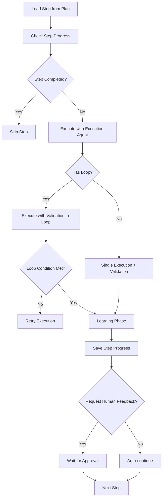

# Workflow Orchestrator System

## 📋 Overview

The Workflow Orchestrator (specifically implemented as the **Human-Controlled Todo Creation Orchestrator**) is a multi-phase execution system that transforms high-level objectives into executable plans with automated execution, validation, and learning capabilities. It manages complex workflows through distinct phases: variable extraction, planning, execution, validation, learning, and post-execution optimization.

**Features**: 🎯 Human-in-loop • 🔄 Learning-based • 📊 Validation-driven • 🤖 Multi-agent • 📝 Markdown-based • 🔀 Conditional Logic • ⚡ Fast Execution • 🔄 Prerequisite Detection

**Key Benefits:**
- **Phase isolation:** Each phase (variable extraction, planning, execution, etc.) runs independently and can be triggered separately
- **Human-in-the-loop control:** Supports human feedback and approval at critical decision points
- **Learning capture:** Automatically captures execution patterns and learnings for reusability
- **Multi-agent orchestration:** Coordinates specialized agents (planning, execution, validation, learning) with independent LLM configurations
- **Flexible execution modes:** Supports fast execution, skip human input, and resume from checkpoint
- **Manager-Based Architecture:** Uses dedicated managers for independent workflow phases, enabling complete decoupling and reusability.

---

## ⚡ Quick Reference

| Phase | Agent | Output | Human Decision | Manager |
|-------|-------|--------|---------------|---------|
| **0** | Variable Extraction | `variables.json` | Use/Extract new/Update | `VariableManager` ✅ |
| **1** | Planning | `plan.json` | Use/Create/Update (max 20 rev) | - |
| **2** | Execute → Validate → Learn | Step results | Approve/Re-execute/Stop | - |
| **2.5** | Anonymize Learnings | Anonymized learnings | Confirm replacements | `AnonymizationManager` ✅ |
| **2.6** | Plan Improvement | Feedback report | Review feedback | `PlanImprovementManager` ✅ |

**Retry Limits**: Execution (5), Plan (20)  
**Progress**: Auto-saved in `runs/{run_folder}/steps_done.json`  
**Loop Support**: Iterative execution until condition met (max iterations configurable)  
**Conditional Support**: Branching logic (If/Else) based on runtime conditions  
**Independence**: ✅ = Independent manager (no orchestrator dependency), ⚠️ = Uses full orchestrator

---

## 📁 Key Files & Locations

| Component | File | Key Types/Functions |
|-----------|------|---------------------|
| **Orchestrator Core** | [`workflow_orchestrator.go`](agent_go/pkg/orchestrator/types/workflow_orchestrator.go) | `WorkflowOrchestrator`, `NewWorkflowOrchestrator()`, `Execute()`, `GetWorkflowConstants()` |
| **Controller** | [`controller.go`](agent_go/pkg/orchestrator/agents/workflow/todo_creation_human/controller.go) | `HumanControlledTodoPlannerOrchestrator`, `CreateTodoList()`, `executeSingleStep()` |
| **Execution Manager** | [`execution_manager.go`](agent_go/pkg/orchestrator/agents/workflow/todo_creation_human/execution_manager.go) | `ExecutionManager`, `CleanupForFreshStart()`, `CleanupForSingleStep()`, `PrepareExecution()` |
| **Execution Types** | [`execution_types.go`](agent_go/pkg/orchestrator/agents/workflow/todo_creation_human/execution_types.go) | `ExecutionMode`, `CleanupScope`, `ExecutionSetup` |
| **Planning Agent** | [`planning_agent.go`](agent_go/pkg/orchestrator/agents/workflow/todo_creation_human/planning_agent.go) | `HumanControlledTodoPlannerPlanningAgent`, `PlanningResponse`, `PlanStep` |
| **Execution Agent** | [`execution_agent.go`](agent_go/pkg/orchestrator/agents/workflow/todo_creation_human/execution_agent.go) | `HumanControlledTodoPlannerExecutionAgent`, `Execute()` |
| **Execution-Only Agent** | [`execution_only_agent.go`](agent_go/pkg/orchestrator/agents/workflow/todo_creation_human/execution_only_agent.go) | `HumanControlledTodoPlannerExecutionOnlyAgent` - Uses pre-discovered learning context |
| **Validation Agent** | [`validation_agent.go`](agent_go/pkg/orchestrator/agents/workflow/todo_creation_human/validation_agent.go) | `HumanControlledTodoPlannerValidationAgent`, `ValidationResponse`, `ExecuteStructured()` |
| **Learning Agent** | [`learning_agent.go`](agent_go/pkg/orchestrator/agents/workflow/todo_creation_human/learning_agent.go) | `HumanControlledTodoPlannerLearningAgent`, `Execute()` |
| **Code Execution Learning** | [`learning_agent_code_execution.go`](agent_go/pkg/orchestrator/agents/workflow/todo_creation_human/learning_agent_code_execution.go) | `HumanControlledTodoPlannerCodeExecutionLearningAgent` - Captures Go code patterns |
| **Learning Reading Agent** | [`learning_reading_agent.go`](agent_go/pkg/orchestrator/agents/workflow/todo_creation_human/learning_reading_agent.go) | `HumanControlledTodoPlannerLearningReadingAgent` - Reads existing learning files |
| **Variable Management** | [`variable_management.go`](agent_go/pkg/orchestrator/agents/workflow/todo_creation_human/variable_management.go) | `VariableManager`, `ExtractVariablesOnly()`, `VariablesManifest` |
| **Anonymization** | [`anonymization_agent.go`](agent_go/pkg/orchestrator/agents/workflow/todo_creation_human/anonymization_agent.go) | `AnonymizationManager`, `AnonymizeLearningsOnly()` |
| **Plan Improvement** | [`plan_improvement_agent.go`](agent_go/pkg/orchestrator/agents/workflow/todo_creation_human/plan_improvement_agent.go) | `PlanImprovementManager`, `PlanImprovementOnly()` |

---

## 🏗️ Architecture

### Manager-Based Architecture

The orchestrator uses **dedicated managers** for independent workflow phases, enabling complete decoupling and reusability:

| Phase | Manager | Status | Description |
|-------|---------|--------|-------------|
| **Variable Extraction** | `VariableManager` | ✅ Independent | Manages variable extraction and validation independently |
| **Anonymization** | `AnonymizationManager` | ✅ Independent | Manages learnings anonymization independently |
| **Plan Improvement** | `PlanImprovementManager` | ✅ Independent | Manages plan improvement analysis independently |
| **Execution Lifecycle** | `ExecutionManager` | ✅ Internal | Manages cleanup, progress init, and folder operations |
| **Planning** | - | ⚠️ Orchestrator | Uses full orchestrator (complex dependencies) |
| **Execution** | - | ⚠️ Orchestrator | Main orchestrator method |

**Key Benefits**:
- **Decoupling**: Managers operate independently without creating full orchestrator
- **Reusability**: Managers can be used directly in `workflow_orchestrator.go`
- **Consistency**: All managers follow the same pattern and use `CreateAndSetupStandardAgentWithConfig`
- **LLM Config**: Proper preservation of `FallbackModels`, `CrossProviderFallback`, and `APIKeys`
- **No Dependencies**: Independent phases don't depend on each other's code

### ExecutionManager Architecture

The `ExecutionManager` centralizes all execution lifecycle decisions (cleanup, progress initialization, folder management) that were previously scattered across the controller.

#### Controller ↔ ExecutionManager Relationship

**Ownership Pattern:**
```go
// Controller CREATES ExecutionManager on-demand
func (hcpo *HumanControlledTodoPlannerOrchestrator) GetExecutionManager() *ExecutionManager {
    return NewExecutionManager(hcpo)
}

// ExecutionManager HOLDS reference to Controller
type ExecutionManager struct {
    orchestrator *HumanControlledTodoPlannerOrchestrator
}

// ExecutionManager CALLS Controller's low-level methods
func (em *ExecutionManager) CleanupForFreshStart(...) error {
    orch := em.orchestrator
    orch.deleteStepProgress(ctx, runFolder)           // Low-level call
    orch.CleanupDirectory(ctx, executionDir, "...")   // Low-level call
    orch.initializeFreshProgress(ctx, totalSteps)     // Low-level call
}
```

**Key Relationships:**
1. **Controller → ExecutionManager**: Controller creates and uses ExecutionManager for cleanup decisions
2. **ExecutionManager → Controller**: ExecutionManager calls back to Controller's low-level operations
3. **No Circular Logic**: ExecutionManager only orchestrates WHAT to clean, Controller methods do the actual work

**Usage Flow:**
```
Controller decides strategy (e.g., "start fresh")
         │
         ▼
em := hcpo.GetExecutionManager()
         │
         ▼
em.CleanupForFreshStart(ctx, runFolder, totalSteps)
         │
         ├──► hcpo.deleteStepProgress()
         ├──► hcpo.CleanupDirectory()
         └──► hcpo.initializeFreshProgress()
```

#### Architecture Diagram

```
┌─────────────────────────────────────────────────────────────────┐
│           HumanControlledTodoPlannerOrchestrator               │
│                      (controller.go)                            │
│                                                                 │
│   GetExecutionManager() ─────────────────────────────────────┐ │
│                                                               │ │
│   ┌─────────────────────────────────────────────────────────┐ │ │
│   │                  ExecutionManager                        │◄┘ │
│   │              (execution_manager.go)                      │   │
│   │                                                          │   │
│   │  High-Level API (Strategy-Based):                        │   │
│   │  • CleanupForFreshStart()      - New execution           │   │
│   │  • CleanupForSingleStep()      - Re-run one step         │   │
│   │  • CleanupForResumeFromStep()  - Resume from step N      │   │
│   │  • CleanupForFastExecute*()    - Fast re-execution       │   │
│   │                                                          │   │
│   │  Batch Execution:                                        │   │
│   │  • PrepareExecution()          - Resolve execution setup │   │
│   │  • PrepareForBatchGroup()      - Setup per group         │   │
│   │  • ApplyCleanup()              - Apply cleanup scope     │   │
│   │  • ApplyExecutionContext()     - Set controller state    │   │
│   └──────────────────────┬───────────────────────────────────┘   │
│                          │                                       │
│                          │ Calls back to                         │
│                          ▼                                       │
│   ┌─────────────────────────────────────────────────────────┐   │
│   │             Low-Level Operations                         │   │
│   │   (controller_progress.go, controller_run_manager.go)    │   │
│   │                                                          │   │
│   │  • deleteStepProgress()         - Remove steps from JSON │   │
│   │  • initializeFreshProgress()    - Create new JSON        │   │
│   │  • deleteStepExecutionFolder()  - Delete step-N folder   │   │
│   │  • CleanupDirectory()           - Delete any directory   │   │
│   │  • cleanupExecutionArtifacts... - Fresh start cleanup    │   │
│   └─────────────────────────────────────────────────────────┘   │
└─────────────────────────────────────────────────────────────────┘
```

#### Why This Pattern?

| Before (Scattered) | After (Centralized) |
|--------------------|---------------------|
| Cleanup logic duplicated across 10+ places | Single source of truth in `ExecutionManager` |
| Inconsistent cleanup between batch/normal | Consistent behavior via shared methods |
| Hard to understand what gets cleaned when | Clear strategy → cleanup mapping |
| Controller 4000+ lines | Controller delegates to specialized manager |

#### Responsibility Split

| Component | Responsibility |
|-----------|----------------|
| **Controller** | Decision logic (which strategy?), flow control, state management |
| **ExecutionManager** | Cleanup orchestration (what to clean, in what order) |
| **Low-level methods** | Actual file/folder operations |

#### Execution Modes & Cleanup Scopes

The `ExecutionManager` maps execution strategies to specific cleanup operations:

| Mode | Deletes Progress | Deletes Folders | Inits Progress |
|------|------------------|-----------------|----------------|
| `CleanupForFreshStart` | ✅ | All `execution/` | ✅ Fresh |
| `CleanupForSingleStep` | Step N+ | `step-N/` only | Update |
| `CleanupForResumeFromStep` | Step N+ | `step-N/` through end | Update |
| `CleanupForFastExecuteProgressOnly` | ✅ | ❌ | ✅ Fresh |
| `CleanupForFastExecuteRange` | Range | Range folders | Update |

#### Key Types

```go
// ExecutionMode defines the type of execution
type ExecutionMode string
const (
    ExecutionModeFresh          ExecutionMode = "fresh"
    ExecutionModeResume         ExecutionMode = "resume"
    ExecutionModeResumeFromStep ExecutionMode = "resume_from_step"
    ExecutionModeSingleStep     ExecutionMode = "single_step"
    ExecutionModeFastExecute    ExecutionMode = "fast_execute"
)

// CleanupScope defines WHAT should be cleaned
type CleanupScope struct {
    DeleteProgress    bool  // Delete steps_done.json
    InitFreshProgress bool  // Create new steps_done.json
    UpdateProgress    bool  // Update existing progress
    CleanAllSteps     bool  // Delete entire execution/ folder
    CleanFromStep     int   // Delete step-{N} through end
    CleanSpecificStep int   // Delete only step-{N}
    NewTotalSteps     int   // Total steps for fresh progress
}

// ExecutionSetup contains fully resolved execution configuration
type ExecutionSetup struct {
    Mode          ExecutionMode
    Context       *ExecutionContext  // Immutable execution flags
    Cleanup       CleanupScope       // What to clean
    StartFromStep int                // 0-based start index
    RunFolder     string             // Target run folder path
    GroupID       string             // For batch: current group ID
}
```

### Component Interaction

```mermaid
graph TB
    API[API Request] --> WO[WorkflowOrchestrator]
    WO --> Router{Route by Phase}
    Router -->|variable-extraction| VM[VariableManager]
    Router -->|planning| PA[Planning Agent]
    Router -->|execution| HCTP[HumanControlledTodoPlannerOrchestrator]
    Router -->|anonymize-learnings| AM[AnonymizationManager]
    Router -->|plan-improvement| PIM[PlanImprovementManager]
    Router -->|plan-tool-optimization| TOM[ToolOptimizationManager]
    
    HCTP --> SS[executeSingleStep]
    SS --> EA[Execution Agent]
    SS --> VA[Validation Agent]
    SS --> LA[Learning Agent]
    
    VM --> VF[variables/variables.json]
    PA --> PF[planning/plan.json]
    LA --> LF[learnings/*.md]
    
    HCTP --> SP[runs/{folder}/steps_done.json]
```

---

## 🤖 Agents Overview

### 1. Variable Extraction Agent
**Purpose**: Extracts variables from objective and converts to templated format.
- **Files**: `variable_extraction_agent.go`, `variable_management.go`
- **Modes**: CREATE (Extract new), UPDATE (Update existing with feedback)
- **Input**: Objective (raw text), Existing variables (UPDATE mode)
- **Output**: `variables.json` with extracted variables, Templated objective with `{{VARIABLE}}` placeholders
- **Tools**: `update_variable`, `update_objective`, `human_feedback`
- **Manager**: `VariableManager` (✅ Independent)

### 2. Planning Agent
**Purpose**: Creates execution plan with steps, dependencies, and configurations.
- **Files**: `planning_agent.go`, `planning_management.go`
- **Modes**: CREATE (Generate new), UPDATE (Modify existing)
- **Input**: Objective (templated), Existing plan, Variable names/values
- **Output**: `plan.json` with structured steps (title, description, success criteria, dependencies, loop/conditional config)
- **Tools**: `update_plan_steps`, `add_plan_steps`, `delete_plan_steps`, `human_feedback`
- **Configuration**: Max 20 revisions, MCP Access for capability awareness

### 3. Execution Agent
**Purpose**: Executes individual plan steps using MCP tools.
- **Files**: `execution_agent.go`
- **Input**: Step details, Context dependencies, Variable values, Workspace path, Learnings path
- **Output**: Execution result, Conversation history, Context output files
- **Features**: Full MCP Tool Access, Loop Support, Retry Logic (Max 5), Code Execution Mode, Learning Discovery
- **Code Execution Mode**: See [Code Execution Mode](code_execution_mode.md) for workspace path handling and CLI argument requirements

**Specialized Variant: Execution-Only Agent**
- **File**: `execution_only_agent.go`
- **Purpose**: Used when learning files are **pre-discovered** by the Learning Reading Agent. Receives learning history as input rather than discovering it during execution. Optimizes performance.

### 4. Validation Agent
**Purpose**: Validates step execution against success criteria and loop conditions.
- **Files**: `validation_agent.go`
- **Input**: Step details, Execution history, Workspace path, Loop condition, Prerequisite information (when enabled)
- **Output**: Structured `ValidationResponse` (Success/Partial/Failed, Reasoning, Feedback, Loop Condition status, Failure Type, Navigation target)
- **Features**: Structured Output, Loop Validation, Feedback Generation, Workspace Inspection, **Prerequisite Failure Detection** (see below)

### 5. Learning Agent (Unified)
**Purpose**: Analyzes both successful and failed executions to capture patterns.
- **Files**: `learning_agent.go`, `learning_agent_code_execution.go`
- **Modes**: Success Learning (What worked), Failure Learning (Root cause + retry guidance)
- **Output**: Learning analysis, Updates to `plan.json`, Learning files in `learnings/`
- **Features**: Pattern Extraction, Plan Enhancement, Detail Levels (`exact`/`general`)
- **Step-Specific Folders**: 
  - Regular steps: `learnings/step-{X}/` (at workspace root)
  - Branch steps: `learnings/step-{parentStep}-{true/false}-{branchIdx}/` (at workspace root)

**Specialized Variant: Code Execution Learning Agent**
- **File**: `learning_agent_code_execution.go`
- **Purpose**: Specialized for **code execution mode**. Captures Go code patterns, imports, and error handling to improve future code generation.

**Specialized Variant: Learning Reading Agent**
- **File**: `learning_reading_agent.go`
- **Purpose**: Pre-reads learning files and code patterns from the `learnings/` directory. Passes discovered learning history to Execution-Only Agent.

### 6. Conditional Agent (ConditionalLLM)
**Purpose**: Evaluates conditional branching decisions.
- **Files**: `conditional_agent.go`, `controller_agent_factory.go`, `controller.go`
- **Input**: Condition question, Last previous step execution output (in-memory), Learning history (separate)
- **Output**: Structured `ConditionalResponse` (Boolean result, Reasoning) - JSON emitted in event `result` field
- **Features**: Context-Aware Event Bridge, Tool-Based Verification, Factory Pattern, Step-Specific Config, Code Execution Mode Support
- **Documentation**: See [Conditional Agent Implementation](conditional_agent_implementation.md) for detailed implementation details

### 7. Anonymization Agent
**Purpose**: Replaces actual values in learnings with variable placeholders.
- **Files**: `anonymization_agent.go`
- **Input**: Workspace path, Variables JSON, Variable names
- **Output**: Anonymized learning files (`.md` and `.py`), Replacements report
- **Features**: Fuzzy Matching, Human Confirmation, Multi-Format support
- **Manager**: `AnonymizationManager` (✅ Independent)

### 8. Plan Improvement Agent
**Purpose**: Analyzes execution results and provides feedback for plan improvement.
- **Files**: `plan_improvement_agent.go`
- **Input**: Workspace path, Plan JSON, Execution results summary
- **Output**: `plan_improvement_feedback.md`, Feedback report
- **Features**: Execution Analysis, Plan Review, Human Feedback
- **Manager**: `PlanImprovementManager` (✅ Independent)

---

## 🔄 Workflow Phases & Lifecycle

The workflow orchestrator operates through 7 distinct phases, each isolated and independently executable:

### 1. Variable Extraction Phase
**Status:** `variable-extraction`  
**Entry Point:** `runVariableExtraction()`
**Flow**: Extract → Verify → Use

Extracts dynamic values from the objective and creates `variables/variables.json` with templated placeholders.
**Decision Points**:
1. **Use Existing**: Keep current `variables.json`
2. **Extract New**: Delete old → Extract fresh
3. **Update Existing**: Modify with feedback

### 2. Planning Phase
**Status:** `planning`  
**Entry Point:** `runPlanningOnly()`
**Flow**: Create plan → Human choice → Approve (max 20 revisions)

Creates structured execution plan and saves to `planning/plan.json`. Supports iterative refinement through human conversation.
**Decision Points**:
1. **Use Existing**: Continue with current `plan.json`
2. **Create New**: Delete old plan + artifacts → Create fresh
3. **Update Existing**: Keep artifacts → Update plan with feedback

### 3. Execution Phase
**Status:** `execution`  
**Entry Point:** `runPlanning()`
**Flow**: Execute → Validate → Learn → Human feedback (per step)

Executes the approved plan step-by-step. Requires both `variables.json` and `plan.json` to exist.

**Execution Modes:**
- **Normal:** Full execution with learning and human feedback
- **Fast Execute:** Skips learning and human feedback
- **Skip Human Input:** Runs learning but auto-approves steps

**Batch Execution (Multiple Variable Groups):**
When multiple variable groups are enabled, the workflow executes sequentially for each group:
- **Folder Structure:** 
  - Single group: `runs/iteration-X/` (flat structure)
  - Multiple groups: `runs/iteration-X/group-Y/` (nested structure)
- **Run Mode Behavior:**
  - **User Selected Folder:** Uses selected folder, extracts base iteration if nested
  - **Create New Run:** Always creates new iteration folder (`iteration-X`)
  - **Use Same Run:** Uses latest existing iteration folder, creates group subfolders within it
- **Progress Tracking:** Each group execution is tracked independently with `steps_done.json` in its respective folder

**Step Execution Flow:**


### 4. Anonymize Learnings Phase
**Status:** `anonymize-learnings`  
**Entry Point:** `runAnonymization()`
**Flow**: Scan learnings → Identify values → Confirm → Replace

Scans `learnings/` folder to find actual values matching known variables and replaces them with `{{VARIABLE_NAME}}` placeholders for reusability.

### 5. Plan Improvement Phase
**Status:** `plan-improvement`  
**Entry Point:** `runPlanImprovement()`
**Flow**: Analyze execution → Review plan → Ask questions → Generate feedback

Analyzes execution results, `plan.json`, learnings folder, and validation reports to provide feedback for improving the plan.

### 6. Plan-Learnings Alignment Phase
**Status:** `plan-learnings-alignment`  
**Entry Point:** `runPlanLearningsAlignment()`

Checks alignment between `plan.json` and learnings folder. Identifies:
- Orphaned learning files (for deleted steps)
- Missing learnings (for new steps)
- Mismatches between plan and learnings

### 7. Plan Tool Optimization Phase
**Status:** `plan-tool-optimization`  
**Entry Point:** `runPlanToolOptimization()`

Analyzes `plan.json` and learnings to optimize tool selections in `step_config.json`. Updates configuration to include only actually used tools.

---

## 📚 File Formats & Workspace Structure

### Workspace Structure
```
workspace/
├── todo_creation_human/
│   ├── variables/
│   │   └── variables.json          # Phase 0: Variable definitions
│   ├── planning/
│   │   ├── plan.json               # Phase 1: Execution plan
│   │   └── step_config.json        # Per-step agent configurations
│   ├── learnings/                   # Learning patterns
│   │   ├── success_patterns.md     # What worked (shared)
│   │   ├── failure_analysis.md     # What failed (shared)
│   │   ├── step-{X}/               # Regular step learnings (step-specific)
│   │   │   ├── *_learning.md       # Step learning files
│   │   │   ├── scripts/            # Python scripts (if code execution mode)
│   │   │   └── code/               # Go code patterns (if code execution mode)
│   │   └── step-{X}-{true/false}-{Y}/  # Branch step learnings (conditional branches)
│   │       ├── *_learning.md       # Branch step learning files
│   │       ├── scripts/            # Python scripts (if code execution mode)
│   │       └── code/               # Go code patterns (if code execution mode)
│   └── runs/                        # Execution runs
│       ├── iteration-same/          # Default run folder
│       │   ├── execution/           # Execution outputs
│       │   ├── validation/          # Validation reports
│       │   └── steps_done.json      # Progress tracking
│       ├── iteration-N/             # Single group or numbered run folders
│       │   ├── execution/
│       │   └── steps_done.json
│       └── iteration-N/             # Multi-group batch execution (nested)
│           ├── group-1/             # First variable group
│           │   ├── execution/
│           │   └── steps_done.json
│           └── group-2/             # Second variable group
│               ├── execution/
│               └── steps_done.json
```

### variables.json
```json
{
  "objective": "Extract {{DATABASE_URL}} from {{CONFIG_PATH}}",
  "variables": [
    {
      "name": "DATABASE_URL",
      "value": "postgres://localhost:5432/db",
      "description": "Database connection URL"
    }
  ]
}
```

### plan.json
```json
{
  "steps": [
    {
      "id": "step-1",
      "title": "Read config file",
      "description": "Read and parse config.json",
      "success_criteria": "File read successfully",
      "context_dependencies": [],
      "context_output": "config_content.md",
      "has_loop": false,
      "has_condition": false,
      "agent_configs": {
        "execution_llm": { "provider": "anthropic", "model_id": "claude-3-5-sonnet-20241022" },
        "learning_detail_level": "exact",
        "disable_validation": false
      }
    },
    {
      "id": "step-2",
      "title": "Wait for service",
      "has_loop": true,
      "loop_condition": "Health check returns 200 OK",
      "max_iterations": 10
    },
    {
      "id": "step-3",
      "title": "Check build status",
      "has_condition": true,
      "condition_question": "Did the build succeed?",
      "if_true_steps": [ ... ],
      "if_false_steps": [ ... ]
    }
  ]
}
```

### steps_done.json
```json
{
  "completed_step_indices": [0, 1],
  "total_steps": 5,
  "last_updated": "2025-01-27T12:00:00Z",
  "branch_steps": {
    "2": {
      "branch_executed": "if_true",
      "completed_steps": ["step-3-if-true-0"]
    }
  }
}
```

---

## ⚙️ Configuration

### Agent LLM Configuration
Each agent can be configured with custom LLM settings.
**Priority**: Step config > Preset default > Orchestrator default

**Preset Defaults** (orchestrator-level):
- `presetExecutionLLM`, `presetValidationLLM`, `presetLearningLLM`, `presetPlanningLLM`, etc.

**Per-Step Overrides** (`step_config.json`):
- `execution_llm`, `validation_llm`, `learning_llm`

### Temporary LLM Override (tempLLM)
**Purpose**: Override execution agent LLM for specific runs without modifying plan config.

**Behavior**:
- **When used**: Only when step has learnings (`learnings/step-{N}/` or `learnings/step-{N}-{true/false}-{Y}/` has files)
- **When skipped**: When step has no learnings (folder empty) → uses original LLM
- **Scope**: Execution agents only (not validation/learning agents)
- **Cascading**: `tempLLM1` (attempt 1) → `tempLLM2` (attempt 2) → step LLM
- **Fallback**: If `fallback_to_original_llm_on_failure=true`, uses original LLM on validation failure

**Configuration** (via frontend toolbar):
- `temp_override_llm`: First override LLM (used on first attempt)
- `temp_override_llm2`: Second override LLM (used if tempLLM1 fails)
- `temp_override_llm_enabled`: Enable/disable toggle (preserves configs when disabled)
- `fallback_to_original_llm_on_failure`: Use original LLM instead of temp override on validation failure

**Files**:
- Frontend: `frontend/src/stores/useWorkflowStore.ts` - `buildExecutionOptions()`
- Backend: `agent_go/pkg/orchestrator/agents/workflow/todo_creation_human/controller_agent_factory.go` - `createExecutionOnlyAgent()`
- Backend: `agent_go/pkg/orchestrator/agents/workflow/todo_creation_human/controller.go` - `SetExecutionOptions()`

### Learning Configuration
- **Detail Levels**: `exact` (actual values), `general` (anonymized), `none`
- **Toggles**: `disable_learning`, `learning_after_loop_iteration`
- **Code Execution Mode**: Forces learning enabled, uses specialized learning agent

### Validation Configuration
- **Toggles**: `disable_validation` (auto-approve)
- **Loop Validation**: Checks both success criteria AND loop condition
- **Prerequisite Failure Detection**: Per-step configuration to detect missing prerequisites and navigate back to prerequisite steps (see [Prerequisite Failure Detection](prerequisite_failure_implementation.md))

---

## 📂 Step-Specific Learning & Execution Folders

**Location**: All step-specific folders are at workspace root, not inside `runs/`.

### Regular Steps
- **Learning folder**: `learnings/step-{X}/` (e.g., `learnings/step-1/`, `learnings/step-3/`)
- **Execution folder**: `execution/step-{X}/` (e.g., `execution/step-1/`, `execution/step-3/`)
- **Step path format**: `step-{X}` where X is the 1-based step number

### Branch Steps (Conditional Steps)
- **Learning folder**: `learnings/step-{parentStep}-{true/false}-{branchIdx}/` 
  - Example: `learnings/step-3-true-0/` (first "if true" branch of step 3)
  - Example: `learnings/step-3-false-1/` (second "if false" branch of step 3)
- **Execution folder**: `execution/step-{parentStep}-{true/false}-{branchIdx}/`
  - Example: `execution/step-3-true-0/`
- **Step path format**: `step-{parentStep}-if-{true/false}-{branchIdx}` (e.g., `step-3-if-true-0`)

### Key Rules
- **Regular steps**: Use numeric step index (1-based) in folder name
- **Branch steps**: Include parent step number, branch type (true/false), and branch index (0-based)
- **All folders**: Located at workspace root, not inside `runs/` directory
- **Learning agents**: Automatically use correct folder based on `stepPath` (regular or branch)
- **Execution agents**: Use `getExecutionFolderPath()` and `getLearningFolderPath()` helpers

### Helper Functions
- **`parseStepPath(stepPath string) StepPathInfo`**: Parses step paths into structured info
- **`getExecutionFolderPath(executionWorkspacePath string, stepPath string) string`**: Returns execution folder path
- **`getLearningFolderPath(baseWorkspacePath string, stepPath string) string`**: Returns learning folder path
- **`getLearningPathIdentifier(stepPath string) string`**: Returns learning folder identifier (e.g., `step-3-true-0`)

---

## 🔍 Troubleshooting

| Issue | Check | Solution |
|-------|-------|----------|
| Step fails | `runs/{run_folder}/validation/step_X_*.md` | Review validation feedback |
| Missing context | `plan.json` dependencies | Update context dependencies |
| Wrong tools | `learnings/*.md` | Learning agents enhance plan with patterns |
| Progress lost | `runs/{run_folder}/steps_done.json` | Auto-saved after each step |
| Loop never exits | `loop_condition` in plan.json | Ensure condition is specific and measurable |
| Config not applied | `step_config.json` | Verify step ID matches plan.json |

---

## 📖 Usage & Common Workflows

```bash
./orchestrator workflow \
  --objective "Build CI/CD pipeline" \
  --workspace "./workspace"
```

### Common Workflows

1.  **Variable Extraction → Planning → Execution**: Run phases sequentially via API or CLI.
2.  **Fast Execute Mode**: Skips learning and human feedback for rapid execution. Useful for testing or batch processing.
3.  **Plan Optimization**: After execution, run `anonymize-learnings` and `plan-tool-optimization` to refine artifacts.

---

## 🧩 Appendix: Controller Refactoring Plan

*Current Status: Proposed Plan for `todo_creation_human` package.*

### Goal
Split the monolithic `controller.go` (4300+ lines) into smaller, focused files to improve maintainability.

### Current File Structure
All files belong to `package todo_creation_human`.

| File | Purpose | Status |
|------|---------|--------|
| **`controller.go`** | Main orchestrator, entry points (`Execute`, `CreateTodoList`) | Core |
| **`controller_types.go`** | Data structures (`StepProgress`, `TodoStep`, `BranchStepProgress`) | Core |
| **`controller_run_manager.go`** | `runs/` folder management, cleanup, file operations | Core |
| **`controller_progress.go`** | Loading, saving, tracking step progress in `steps_done.json` | Core |
| **`controller_batch_execution.go`** | Batch execution for multiple variable groups | Core |
| **`execution_manager.go`** | Centralized cleanup/progress orchestration | ✅ New |
| **`execution_types.go`** | `ExecutionMode`, `CleanupScope`, `ExecutionSetup` types | ✅ New |

### Implementation Strategy
1.  Create new files in `agent_go/pkg/orchestrator/agents/workflow/todo_creation_human/`.
2.  Move code chunk by chunk.
3.  Verify build and tests after each move.
