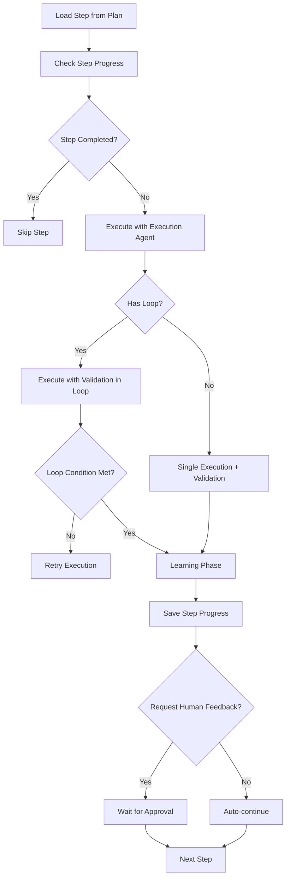

# Workflow Orchestrator System

## 📋 Overview

The Workflow Orchestrator (implemented as the **Human-Controlled Todo Creation Orchestrator**) is a multi-phase execution system that transforms high-level objectives into executable plans with automated execution, validation, and learning capabilities. It manages complex workflows through distinct phases: variable extraction, planning, execution, validation, learning, and post-execution optimization.

**Key Benefits:**
- Phase isolation: Each phase runs independently and can be triggered separately
- Human-in-the-loop control: Supports human feedback and approval at critical decision points
- Learning capture: Automatically captures execution patterns for reusability
- Multi-agent orchestration: Coordinates specialized agents with independent LLM configurations
- Flexible execution modes: Supports fast execution, skip human input, and resume from checkpoint
- Manager-based architecture: Dedicated managers for independent workflow phases enable decoupling and reusability

---

## 📁 Key Files & Locations

| Component | File | Key Types/Functions |
|-----------|------|---------------------|
| **Orchestrator Core** | [`workflow_orchestrator.go`](../agent_go/pkg/orchestrator/types/workflow_orchestrator.go) | `WorkflowOrchestrator`, `NewWorkflowOrchestrator()`, `Execute()`, `GetWorkflowConstants()` |
| **Controller** | [`controller.go`](../agent_go/pkg/orchestrator/agents/workflow/step_based_workflow/controller.go) | `HumanControlledTodoPlannerOrchestrator`, `CreateTodoList()`, `executeSingleStep()` |
| **Execution Manager** | [`execution_manager.go`](../agent_go/pkg/orchestrator/agents/workflow/step_based_workflow/execution_manager.go) | `ExecutionManager`, `CleanupForFreshStart()`, `CleanupForSingleStep()`, `PrepareExecution()` |
| **Execution Types** | [`execution_types.go`](../agent_go/pkg/orchestrator/agents/workflow/step_based_workflow/execution_types.go) | `ExecutionMode`, `CleanupScope`, `ExecutionSetup` |
| **Planning Agent** | [`planning_agent.go`](../agent_go/pkg/orchestrator/agents/workflow/step_based_workflow/planning_agent.go) | `HumanControlledTodoPlannerPlanningAgent`, `PlanningResponse`, `PlanStep` |
| **Execution Agent** | [`execution_agent.go`](../agent_go/pkg/orchestrator/agents/workflow/step_based_workflow/execution_agent.go) | `HumanControlledTodoPlannerExecutionAgent`, `Execute()` |
| **Execution-Only Agent** | [`execution_only_agent.go`](../agent_go/pkg/orchestrator/agents/workflow/step_based_workflow/execution_only_agent.go) | `HumanControlledTodoPlannerExecutionOnlyAgent` |
| **Validation Agent** | [`validation_agent.go`](../agent_go/pkg/orchestrator/agents/workflow/step_based_workflow/validation_agent.go) | `HumanControlledTodoPlannerValidationAgent`, `ValidationResponse`, `ExecuteStructured()` |
| **Learning Agent** | [`learning_agent.go`](../agent_go/pkg/orchestrator/agents/workflow/step_based_workflow/learning_agent.go) | `HumanControlledTodoPlannerLearningAgent`, `Execute()` |
| **Code Execution Learning** | [`learning_agent_code_execution.go`](../agent_go/pkg/orchestrator/agents/workflow/step_based_workflow/learning_agent_code_execution.go) | `HumanControlledTodoPlannerCodeExecutionLearningAgent` |
| **Variable Management** | [`variable_management.go`](../agent_go/pkg/orchestrator/agents/workflow/step_based_workflow/variable_management.go) | `VariableManager`, `ExtractVariablesOnly()`, `VariablesManifest` |
| **Anonymization** | [`anonymization_agent.go`](../agent_go/pkg/orchestrator/agents/workflow/step_based_workflow/anonymization_agent.go) | `AnonymizationManager`, `AnonymizeLearningsOnly()` |
| **Plan Improvement** | [`plan_improvement_agent.go`](../agent_go/pkg/orchestrator/agents/workflow/step_based_workflow/plan_improvement_agent.go) | `PlanImprovementManager`, `PlanImprovementOnly()` |
| **Conditional Agent** | [`conditional_agent.go`](../agent_go/pkg/orchestrator/agents/workflow/step_based_workflow/conditional_agent.go) | `ConditionalLLM`, `ConditionalResponse` |
| **Agent Factory** | [`controller_agent_factory.go`](../agent_go/pkg/orchestrator/agents/workflow/step_based_workflow/controller_agent_factory.go) | `createExecutionOnlyAgent()`, `createConditionalAgent()` |

---

## 🔄 How It Works

### Workflow Phases

The orchestrator operates through 7 distinct phases, each isolated and independently executable:

| Phase | Status | Entry Point | Output | Human Decision |
|-------|--------|-------------|--------|----------------|
| **0. Variable Extraction** | `variable-extraction` | `runVariableExtraction()` | `variables.json` | Use/Extract new/Update |
| **1. Planning** | `planning` | `runPlanningOnly()` | `plan.json` | Use/Create/Update (max 20 rev) |
| **2. Execution** | `execution` | `runPlanning()` | Step results | Approve/Re-execute/Stop |
| **3. Evaluation Designer** | `evaluation-designer` | `runEvaluationDesignerOnly()` | `evaluation_plan.json` | Review evaluation guide |
| **4. Evaluation Execution** | `evaluation-execution` | `runEvaluationExecutionOnly()` | Scores & Reports | - |
| **5. Anonymize Learnings** | `anonymize-learnings` | `runAnonymization()` | Anonymized learnings | Confirm replacements |
| **6. Plan Improvement** | `plan-improvement` | `runPlanImprovement()` | Feedback report | Review feedback |
| **7. Plan-Learnings Alignment** | `plan-learnings-alignment` | `runPlanLearningsAlignment()` | Alignment report | - |
| **8. Plan Tool Optimization** | `plan-tool-optimization` | `runPlanToolOptimization()` | Optimized `step_config.json` | - |

### Execution Flow

1. **Variable Extraction**: Extracts dynamic values from objective, creates `variables/variables.json` with templated placeholders
2. **Planning**: Creates structured execution plan, saves to `planning/plan.json`, supports iterative refinement (max 20 revisions)
3. **Execution**: Executes plan step-by-step (Execute → Validate → Learn → Human feedback per step)
4. **Evaluation Designer**: Creates structured evaluation guides to assess execution results against success criteria
5. **Evaluation Execution**: Runs evaluation steps against execution outputs to generate scores (0-10) and detailed feedback
6. **Anonymize Learnings**: Scans `learnings/` folder, replaces actual values with `{{VARIABLE_NAME}}` placeholders
7. **Plan Improvement**: Analyzes execution results and provides feedback for plan improvement
8. **Plan-Learnings Alignment**: Checks alignment between `plan.json` and learnings folder
9. **Plan Tool Optimization**: Optimizes tool selections in `step_config.json`

### Step Execution Flow



### Execution Modes

| Mode | Learning | Human Feedback | Use Case |
|------|----------|----------------|----------|
| **Normal** | ✅ | ✅ | Full execution with learning and human feedback |
| **Fast Execute** | ❌ | ❌ | Rapid execution, skips learning and feedback |
| **Skip Human Input** | ✅ | ❌ | Runs learning but auto-approves steps |

### Batch Execution

When multiple variable groups are enabled, workflow executes sequentially for each group:

| Structure | Single Group | Multiple Groups |
|-----------|-------------|-----------------|
| **Folder** | `runs/iteration-X/` | `runs/iteration-X/group-Y/` |
| **Progress** | `steps_done.json` in iteration folder | `steps_done.json` per group folder |

---

## 🏗️ Architecture

### Component Interaction

```mermaid
graph TB
    API[API Request] --> WO[WorkflowOrchestrator]
    WO --> Router{Route by Phase}
    Router -->|variable-extraction| VM[VariableManager]
    Router -->|planning| PA[Planning Agent]
    Router -->|execution| HCTP[HumanControlledTodoPlannerOrchestrator]
    Router -->|anonymize-learnings| AM[AnonymizationManager]
    Router -->|plan-improvement| PIM[PlanImprovementManager]
    
    HCTP --> SS[executeSingleStep]
    SS --> EA[Execution Agent]
    SS --> VA[Validation Agent]
    SS --> LA[Learning Agent]
    
    VM --> VF[variables/variables.json]
    PA --> PF[planning/plan.json]
    LA --> LF[learnings/*.md]
    HCTP --> SP[runs/{folder}/steps_done.json]
```

### Manager-Based Architecture

| Phase | Manager | Status | Description |
|-------|---------|--------|-------------|
| **Variable Extraction** | `VariableManager` | ✅ Independent | Manages variable extraction independently |
| **Evaluation Designer** | `EvaluationManager` | ✅ Independent | Manages evaluation planning independently |
| **Anonymization** | `AnonymizationManager` | ✅ Independent | Manages learnings anonymization independently |
| **Plan Improvement** | `PlanImprovementManager` | ✅ Independent | Manages plan improvement analysis independently |
| **Execution Lifecycle** | `ExecutionManager` | ✅ Internal | Manages cleanup, progress init, folder operations |
| **Planning** | - | ⚠️ Orchestrator | Uses full orchestrator (complex dependencies) |
| **Execution** | - | ⚠️ Orchestrator | Main orchestrator method |

**Key Benefits:**
- Decoupling: Managers operate independently without creating full orchestrator
- Reusability: Managers can be used directly in `workflow_orchestrator.go`
- Consistency: All managers follow same pattern using `CreateAndSetupStandardAgentWithConfig`

### ExecutionManager Pattern

**File:** [`execution_manager.go`](../agent_go/pkg/orchestrator/agents/workflow/step_based_workflow/execution_manager.go)

```go
// Controller CREATES ExecutionManager on-demand
func (hcpo *HumanControlledTodoPlannerOrchestrator) GetExecutionManager() *ExecutionManager {
    return NewExecutionManager(hcpo)
}

// ExecutionManager HOLDS reference to Controller
type ExecutionManager struct {
    orchestrator *HumanControlledTodoPlannerOrchestrator
}

// ExecutionManager CALLS Controller's low-level methods
func (em *ExecutionManager) CleanupForFreshStart(...) error {
    orch := em.orchestrator
    orch.deleteStepProgress(ctx, runFolder)
    orch.CleanupDirectory(ctx, executionDir, "...")
    orch.initializeFreshProgress(ctx, totalSteps)
}
```

### Execution Modes & Cleanup Scopes

| Mode | Deletes Progress | Deletes Folders | Inits Progress |
|------|------------------|-----------------|----------------|
| `CleanupForFreshStart` | ✅ | All `execution/` | ✅ Fresh |
| `CleanupForSingleStep` | Step N+ | `step-N/` only | Update |
| `CleanupForResumeFromStep` | Step N+ | `step-N/` through end | Update |
| `CleanupForFastExecuteProgressOnly` | ✅ | ❌ | ✅ Fresh |
| `CleanupForFastExecuteRange` | Range | Range folders | Update |

---

## 🤖 Agents Overview

| Agent | Purpose | Input | Output | Tools | LLM Config |
|-------|---------|-------|--------|-------|------------|
| **Variable Extraction** | Extracts variables from objective | Objective (raw text) | `variables.json`, templated objective | `update_variable`, `update_objective`, `human_feedback` | `phase_llm` |
| **Planning** | Creates execution plan | Objective (templated), existing plan | `plan.json` with structured steps | `update_plan_steps`, `add_plan_steps`, `delete_plan_steps`, `human_feedback` | `phase_llm` |
| **Evaluation Designer** | Creates evaluation plan | Objective, execution results (runs/) | `evaluation_plan.json` | `add_evaluation_step`, `update_evaluation_step`, `delete_evaluation_step`, `human_feedback` | `phase_llm` |
| **Execution** | Executes plan steps | Step details, context, variables | Execution result, conversation history | Full MCP Tool Access | `execution_llm` |
| **Execution-Only** | Executes with pre-discovered learnings | Step details + learning history | Execution result | Full MCP Tool Access | `execution_llm` |
| **Validation** | Validates step execution | Step details, execution history | `ValidationResponse` (Success/Partial/Failed) | Structured Output | `validation_llm` |
| **Learning** | Captures execution patterns | Execution history | Learning files in `learnings/` | Pattern Extraction | `learning_llm` |
| **Code Execution Learning** | Captures Go code patterns | Execution history (code execution mode) | Go code patterns, imports | Code Pattern Extraction | `learning_llm` |
| **Conditional** | Evaluates branching decisions | Condition question, step output | `ConditionalResponse` (Boolean, Reasoning) | Tool-Based Verification | `execution_llm` |
| **Anonymization** | Replaces values with placeholders | Workspace path, variables JSON | Anonymized learning files | Fuzzy Matching | `phase_llm` |
| **Plan Improvement** | Analyzes execution for plan feedback | Workspace path, plan JSON | `plan_improvement_feedback.md` | Execution Analysis | `phase_llm` |
| **Plan Tool Optimization** | Optimizes tool selections | Workspace path, plan JSON | Optimized `step_config.json` | Tool Analysis | `phase_llm` |
| **Learning Consolidation** | Consolidates learning files | Workspace path | Consolidated learnings | File Consolidation | `phase_llm` |
| **Plan Learnings Alignment** | Aligns plan with learnings | Workspace path, plan JSON | Alignment report | Alignment Analysis | `phase_llm` |

---

## 🧩 Code Examples

### Execution Manager Usage

**File:** [`execution_manager.go`](../agent_go/pkg/orchestrator/agents/workflow/step_based_workflow/execution_manager.go)

```go
// Get execution manager from controller
em := hcpo.GetExecutionManager()

// Prepare execution setup
setup, err := em.PrepareExecution(ctx, ExecutionModeFresh, runFolder, totalSteps)
if err != nil {
    return err
}

// Apply cleanup based on setup
if err := em.ApplyCleanup(ctx, setup); err != nil {
    return err
}

// Apply execution context
em.ApplyExecutionContext(setup)
```

### Orchestrator Entry Point

**File:** [`controller.go`](../agent_go/pkg/orchestrator/agents/workflow/step_based_workflow/controller.go)

```go
func (hcpo *HumanControlledTodoPlannerOrchestrator) CreateTodoList(
    ctx context.Context,
    objective string,
    workspacePath string,
    options *ExecutionOptions,
) (*CreateTodoListResponse, error) {
    // Load or create variables
    variables, err := hcpo.loadOrCreateVariables(ctx, workspacePath, objective)
    
    // Load or create plan
    plan, err := hcpo.loadOrCreatePlan(ctx, workspacePath, objective, variables)
    
    // Execute plan
    result, err := hcpo.executePlan(ctx, workspacePath, plan, options)
    
    return &CreateTodoListResponse{
        Plan: plan,
        Result: result,
    }, nil
}
```

### Step Execution

**File:** [`controller.go`](../agent_go/pkg/orchestrator/agents/workflow/step_based_workflow/controller.go)

```go
func (hcpo *HumanControlledTodoPlannerOrchestrator) executeSingleStep(
    ctx context.Context,
    stepIndex int,
    step PlanStep,
    workspacePath string,
    runFolder string,
) error {
    // Execute with execution agent
    executionResult, err := hcpo.executionAgent.Execute(ctx, step, workspacePath)
    
    // Validate execution
    validationResult, err := hcpo.validationAgent.ExecuteStructured(ctx, step, executionResult)
    
    // Learn from execution
    if !options.DisableLearning {
        err := hcpo.learningAgent.Execute(ctx, step, executionResult, validationResult)
    }
    
    // Request human feedback if needed
    if options.RequestHumanFeedback {
        approved, err := hcpo.RequestHumanFeedback(ctx, step.ID, step.Title, "", sessionID, workflowID)
    }
    
    return nil
}
```

---

## 📚 File Formats & Workspace Structure

### Workspace Structure

```
workspace/
├── step_based_workflow/
│   ├── variables/
│   │   └── variables.json          # Phase 0: Variable definitions
│   ├── planning/
│   │   ├── plan.json               # Phase 1: Execution plan
│   │   └── step_config.json        # Per-step agent configurations
│   ├── knowledgebase/               # Persistent shared storage (optional, enabled by default)
│   │   └── *.md, *.json, etc.      # Templates, reference data, global configs
│   ├── learnings/                   # Learning patterns
│   │   ├── success_patterns.md     # What worked (shared)
│   │   ├── failure_analysis.md     # What failed (shared)
│   │   ├── {step_id}/              # Step-specific learnings
│   │   │   ├── *_learning.md
│   │   │   ├── scripts/            # Python scripts (code execution mode)
│   │   │   └── code/               # Go code patterns (code execution mode)
│   │   └── {step_id}-{true/false}-{Y}/  # Branch step learnings
│   └── runs/                        # Execution runs
│       ├── iteration-same/          # Default run folder
│       │   ├── execution/           # Execution outputs
│       │   ├── validation/          # Validation reports
│       │   └── steps_done.json      # Progress tracking
│       └── iteration-N/             # Numbered or nested run folders
│           ├── execution/
│           └── steps_done.json
```

### variables.json

```json
{
  "objective": "Extract {{DATABASE_URL}} from {{CONFIG_PATH}}",
  "variables": [
    {
      "name": "DATABASE_URL",
      "value": "postgres://localhost:5432/db",
      "description": "Database connection URL"
    }
  ]
}
```

### plan.json

```json
{
  "steps": [
    {
      "id": "step-1",
      "title": "Read config file",
      "description": "Read and parse config.json",
      "success_criteria": "File read successfully",
      "context_dependencies": [],
      "context_output": "config_content.md",
      "has_loop": false,
      "has_condition": false,
      "agent_configs": {
        "execution_llm": { "provider": "anthropic", "model_id": "claude-3-5-sonnet-20241022" },
        "learning_detail_level": "exact",
        "disable_validation": false
      }
    }
  ]
}
```

### steps_done.json

```json
{
  "completed_step_indices": [0, 1],
  "total_steps": 5,
  "last_updated": "2025-01-27T12:00:00Z",
  "branch_steps": {
    "2": {
      "branch_executed": "if_true",
      "completed_steps": ["step-3-if-true-0"]
    }
  }
}
```

### Step-Specific Folder Rules

| Step Type | Learning Folder | Execution Folder |
|-----------|----------------|------------------|
| **Regular** | `learnings/{step_id}/` | `execution/step-{X}/` |
| **Branch** | `learnings/{step_id}/` | `execution/step-{parentStep}-{true/false}-{branchIdx}/` |
| **Sub-Agent** | `learnings/{step_id}/` | `execution/step-{X}-sub-agent-{index}/` |

**Key Rules:**
- Learning folders use step IDs (stable identifiers from plan.json)
- Execution folders use step numbers (1-based) for backward compatibility
- All folders located at workspace root, not inside `runs/`

---

## ⚙️ Configuration

### Agent LLM Configuration

**Priority**: Step config > Preset default (no orchestrator default fallback)

| Level | Configuration | Example |
|-------|---------------|---------|
| **Preset** | `presetExecutionLLM`, `presetValidationLLM`, `presetLearningLLM`, `presetPhaseLLM` | Default LLM for all steps |
| **Step** | `step_config.json` → `execution_llm`, `validation_llm`, `learning_llm` | Per-step override |

**Preset LLM Configurations:**
- **`execution_llm`**: Default for execution agents
- **`validation_llm`**: Default for validation agents
- **`learning_llm`**: Default for learning agents
- **`phase_llm`**: Default for all phase agents (planning, anonymization, plan improvement, plan tool optimization, learning consolidation, plan learnings alignment)
  - All phase agents use this unified configuration

### Temporary LLM Override (tempLLM)

**Flow**: `tempLLM1` (attempt 1) → if FAILED → `tempLLM2` (attempt 2) → if FAILED → step LLM → preset LLM (attempt 3+)

| Setting | Behavior |
|---------|----------|
| **When used** | Only when step has learnings (`learnings/step-{N}/` has files) |
| **When skipped** | Step has no learnings (folder empty) → uses original LLM |
| **Scope** | Execution agents only (not validation/learning agents) |
| **Failure criteria** | Only `ExecutionStatus == "FAILED"` triggers next attempt |
| **Fallback** | `fallback_to_original_llm_on_failure` blocks tempLLM1, NOT tempLLM2 |

**Configuration** (via frontend toolbar):
- `temp_override_llm`: First override LLM (attempt 1)
- `temp_override_llm2`: Second override LLM (attempt 2)
- `temp_override_llm_enabled`: Enable/disable toggle
- `fallback_to_original_llm_on_failure`: Skips tempLLM1 after failure

**Files:**
- Frontend: [`useWorkflowStore.ts`](../frontend/src/stores/useWorkflowStore.ts) - `buildExecutionOptions()`
- Backend: [`controller_agent_factory.go`](../agent_go/pkg/orchestrator/agents/workflow/step_based_workflow/controller_agent_factory.go) - `createExecutionOnlyAgent()`

### Learning Configuration

| Setting | Values | Description |
|---------|--------|-------------|
| **Detail Levels** | `exact`, `general`, `none` | `exact` = actual values, `general` = anonymized |
| **Toggles** | `disable_learning`, `lock_learnings`, `learning_after_loop_iteration` | Control learning behavior |
| **lock_learnings** | boolean | Prevents learning agent from running, still uses existing learnings |
| **Code Execution Mode** | boolean | Forces learning enabled, uses specialized learning agent |

### Validation Configuration

| Setting | Description |
|---------|-------------|
| **disable_validation** | LLM validation: `nil`/`true` = disabled by default (auto-approve), `false` = enabled. Pre-validation always runs if schema exists. |
| **Loop Validation** | Checks both success criteria AND loop condition (LLM validation forced on for loop steps) |
| **Prerequisite Failure Detection** | Per-step config to detect missing prerequisites and navigate back |

### Preset-Level Feature Toggles

These settings are configured at the preset level in `PresetLLMConfig`:

| Setting | Type | Default | Description |
|---------|------|---------|-------------|
| **use_knowledgebase** | `boolean` | `true` (enabled) | Enable/disable the `knowledgebase/` folder. When enabled, creates a persistent folder for templates, reference data, and global configs shared across all runs. When disabled, knowledgebase is not created and excluded from agent prompts and folder guards. |

**Knowledgebase Folder Behavior:**
- **Enabled (default)**: `knowledgebase/` folder is created at workspace root, included in agent prompts, and has read/write access in folder guards
- **Disabled**: No folder creation, knowledgebase references removed from all agent prompts, no folder guard paths added
- **Use Cases**: Disable for simple workflows that don't need persistent shared storage, or to reduce agent prompt complexity

**Files:**
- Backend: [`models.go`](../agent_go/pkg/database/models.go) - `PresetLLMConfig.UseKnowledgebase`
- Frontend: [`PresetModal.tsx`](../frontend/src/components/PresetModal.tsx) - Knowledgebase toggle in workflow mode

### Retry Limits

| Component | Limit | Location |
|----------|-------|----------|
| **Execution** | 5 retries | [`controller_execution.go`](../agent_go/pkg/orchestrator/agents/workflow/step_based_workflow/controller_execution.go) |
| **Planning** | 20 revisions | [`planning_agent.go`](../agent_go/pkg/orchestrator/agents/workflow/step_based_workflow/planning_agent.go) |

---

## 🛠️ Common Issues & Solutions

| Issue | Cause | Solution |
|-------|-------|----------|
| Step fails | Validation failed | Check `runs/{run_folder}/validation/step_X_*.md` for feedback |
| Missing context | Context dependencies not met | Update `context_dependencies` in `plan.json` |
| Wrong tools used | Learning patterns not applied | Check `learnings/*.md` for patterns, learning agent enhances plan |
| Progress lost | `steps_done.json` not saved | Progress auto-saved after each step, check file permissions |
| Loop never exits | Loop condition not met | Ensure `loop_condition` in `plan.json` is specific and measurable |
| Config not applied | Step ID mismatch | Verify step ID in `step_config.json` matches `plan.json` |
| tempLLM not used | Step has no learnings | tempLLM only used when `learnings/step-{N}/` has files |
| Execution mode not working | Cleanup scope incorrect | Check `ExecutionManager` cleanup methods match execution mode |

---

## 🔍 For LLMs: Quick Reference

### Phase Quick Reference

| Phase | Agent | Output | Human Decision | Manager |
|-------|-------|--------|---------------|---------|
| **0** | Variable Extraction | `variables.json` | Use/Extract new/Update | `VariableManager` ✅ |
| **1** | Planning | `plan.json` | Use/Create/Update (max 20 rev) | - |
| **2** | Execute → Validate → Learn | Step results | Approve/Re-execute/Stop | - |
| **3** | Anonymize Learnings | Anonymized learnings | Confirm replacements | `AnonymizationManager` ✅ |
| **4** | Plan Improvement | Feedback report | Review feedback | `PlanImprovementManager` ✅ |

### Constraints

✅ **Allowed:**
- Independent phase execution (each phase can run separately)
- Manager-based architecture for independent phases
- Multiple execution modes (normal, fast execute, skip human input)
- Per-step LLM configuration overrides
- Temporary LLM overrides for execution agents
- Loop and conditional logic in plan steps
- Unified `phase_llm` configuration for all phase agents (planning, anonymization, plan improvement, plan tool optimization, learning consolidation, plan learnings alignment)

❌ **Forbidden:**
- Modifying `steps_done.json` manually (use orchestrator methods)
- Bypassing validation without `disable_validation` flag
- Running execution phase without `variables.json` and `plan.json`
- Reusing same step ID in plan (must be unique)

### Common Patterns

**Variable Extraction → Planning → Execution:**
```go
// Phase 0: Extract variables
variables, err := orchestrator.RunVariableExtraction(ctx, objective, workspacePath)

// Phase 1: Create plan
plan, err := orchestrator.RunPlanningOnly(ctx, objective, variables, workspacePath)

// Phase 2: Execute plan
result, err := orchestrator.RunPlanning(ctx, workspacePath, plan, options)
```

**Fast Execute Mode:**
```go
options := &ExecutionOptions{
    FastExecute: true,  // Skips learning and human feedback
}
result, err := orchestrator.RunPlanning(ctx, workspacePath, plan, options)
```

**Resume from Step:**
```go
options := &ExecutionOptions{
    ExecutionMode: ExecutionModeResumeFromStep,
    ResumeFromStep: 3,  // Resume from step 4 (0-based index)
}
result, err := orchestrator.RunPlanning(ctx, workspacePath, plan, options)
```

### Key Types

```go
type ExecutionMode string
const (
    ExecutionModeFresh          ExecutionMode = "fresh"
    ExecutionModeResume         ExecutionMode = "resume"
    ExecutionModeResumeFromStep ExecutionMode = "resume_from_step"
    ExecutionModeSingleStep     ExecutionMode = "single_step"
    ExecutionModeFastExecute    ExecutionMode = "fast_execute"
)

type CleanupScope struct {
    DeleteProgress    bool
    InitFreshProgress bool
    UpdateProgress    bool
    CleanAllSteps     bool
    CleanFromStep     int
    CleanSpecificStep int
    NewTotalSteps     int
}
```

---

## 📖 Related Documentation

- [Human Feedback System](human_feedback_system.md) - Human-in-the-loop feedback mechanism
- [Code Execution Mode](code_execution_mode.md) - Workspace path handling and CLI arguments
- [Conditional Agent Implementation](conditional_agent_implementation.md) - Conditional branching logic
- [Prerequisite Failure Implementation](prerequisite_failure_implementation.md) - Prerequisite detection and navigation
- [Temp LLM Cascading Flow](temp_llm_cascading_flow.md) - Temporary LLM override flow details
