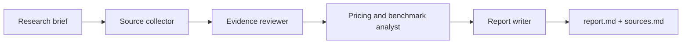
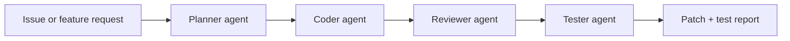
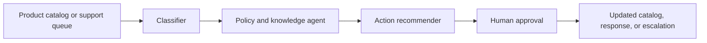

# Runloop Examples

Runloop is most useful when it coordinates real workflows, not toy agents. This page collects flagship workflow blueprints that show what teams can build, plus pointers to the runnable Go examples that live under `agent_go/examples/`.

## Flagship Workflow Blueprints

### 1. Deep Research Agent

Compare tools, vendors, models, or market segments and produce a sourced report.



Example prompt:

```text
Compare Claude Code, Codex, and Gemini CLI for a team building agentic coding workflows.
Include model strengths, tool support, pricing considerations, and operational risks.
```

Expected output:

- `report.md`: executive summary, comparison table, recommendation, risks
- `sources.md`: links, extracted evidence, confidence notes
- Optional scheduled monitor: rerun weekly and diff changes

### 2. AI Software Engineer Workflow

Turn a product change request into a planned, reviewed, and tested code change.



Example prompt:

```text
Add JWT authentication to the API, update middleware tests, and summarize the security assumptions.
```

Expected output:

- Implementation plan
- Workspace patch or PR-ready diff
- Test output and reviewer notes
- Follow-up risks or manual checks

### 3. E-commerce Operations Agent

Automate the repetitive review loops behind catalog, support, and marketplace operations.



Example prompt:

```text
Review this batch of seller catalog updates. Flag low-quality titles, missing attributes, risky claims, and items that need manual approval.
```

Expected output:

- Quality review table
- Recommended edits
- Escalation queue
- Audit trail for reviewers

## Runnable Go Examples

The lower-level SDK examples live in [agent_go/examples](../agent_go/examples/README.md). They show how to run local agents, connect workspace tools, and exercise CLI providers such as Claude Code and Gemini CLI.

## Demo GIF Storyboard

A high-impact README GIF should show the product outcome in 15-20 seconds:

1. Open Runloop.
2. Create or open a workflow.
3. Connect tools such as browser, workspace files, and MCP servers.
4. Run the workflow.
5. Show agents completing steps.
6. End on a generated report, patch, or approval-ready result.

Good demo prompts:

- `Compare Claude Code, Codex, and Gemini CLI for agentic coding workflows.`
- `Review this PR for security, performance, and test gaps.`
- `Triage these customer support tickets and draft responses.`

The strongest demos show a real output artifact, not only a chat transcript.
